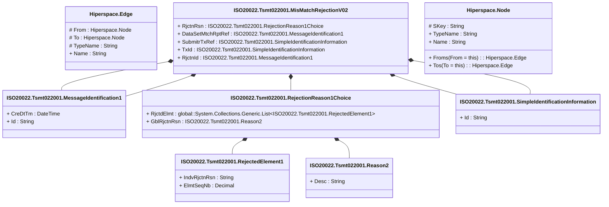

# tsmt.022.001.02

> The tables below contain descriptions of the members of each Element. 
> The first column indicates the type of the member:
> A ‘#’ indicates that the field is a key to the element, and a ‘+’ indicates that the field is a value.
> The ‘*’ column contains a description for the element member.  
> The ‘@’ column contains any properties for the member.
> The ‘=’ column contains calculated values; or in the case of an enum, the serialized value.

---

## View Hiperspace.Edge
edge between nodes

| |Name|Type|*|@|=|
|-|-|-|-|-|-|
|#|From|Hiperspace.Node||||
|#|To|Hiperspace.Node||||
|#|TypeName|String||||
|+|Name|String||||

---

## Type ISO20022.Tsmt022001.Document

| |Name|Type|*|@|=|
|-|-|-|-|-|-|
|+|MisMtchRjctn|ISO20022.Tsmt022001.MisMatchRejectionV02||XmlElement()||
||Validation|Some(String)||XmlIgnore(), JsonIgnore()|validation(validElement(MisMtchRjctn))|

---

## Value ISO20022.Tsmt022001.MessageIdentification1

| |Name|Type|*|@|=|
|-|-|-|-|-|-|
|+|CreDtTm|DateTime||XmlElement()||
|+|Id|String||XmlElement()||
||Validation|Some(String)||XmlIgnore(), JsonIgnore()|""|

---

## Aspect ISO20022.Tsmt022001.MisMatchRejectionV02

| |Name|Type|*|@|=|
|-|-|-|-|-|-|
|+|RjctnRsn|ISO20022.Tsmt022001.RejectionReason1Choice||XmlElement()||
|+|DataSetMtchRptRef|ISO20022.Tsmt022001.MessageIdentification1||XmlElement()||
|+|SubmitrTxRef|ISO20022.Tsmt022001.SimpleIdentificationInformation||XmlElement()||
|+|TxId|ISO20022.Tsmt022001.SimpleIdentificationInformation||XmlElement()||
|+|RjctnId|ISO20022.Tsmt022001.MessageIdentification1||XmlElement()||
||Validation|Some(String)||XmlIgnore(), JsonIgnore()|validation(validElement(RjctnRsn),validElement(DataSetMtchRptRef),validElement(SubmitrTxRef),validElement(TxId),validElement(RjctnId))|

---

## Value ISO20022.Tsmt022001.Reason2

| |Name|Type|*|@|=|
|-|-|-|-|-|-|
|+|Desc|String||XmlElement()||
||Validation|Some(String)||XmlIgnore(), JsonIgnore()|""|

---

## Value ISO20022.Tsmt022001.RejectedElement1

| |Name|Type|*|@|=|
|-|-|-|-|-|-|
|+|IndvRjctnRsn|String||XmlElement()||
|+|ElmtSeqNb|Decimal||XmlElement()||
||Validation|Some(String)||XmlIgnore(), JsonIgnore()|""|

---

## Value ISO20022.Tsmt022001.RejectionReason1Choice

| |Name|Type|*|@|=|
|-|-|-|-|-|-|
|+|RjctdElmt|global::System.Collections.Generic.List<ISO20022.Tsmt022001.RejectedElement1>||XmlElement()||
|+|GblRjctnRsn|ISO20022.Tsmt022001.Reason2||XmlElement()||
||Validation|Some(String)||XmlIgnore(), JsonIgnore()|validation(validRequired("""RjctdElmt""",RjctdElmt),validList("""RjctdElmt""",RjctdElmt),validElement(RjctdElmt),validElement(GblRjctnRsn),validChoice(RjctdElmt,GblRjctnRsn))|

---

## Value ISO20022.Tsmt022001.SimpleIdentificationInformation

| |Name|Type|*|@|=|
|-|-|-|-|-|-|
|+|Id|String||XmlElement()||
||Validation|Some(String)||XmlIgnore(), JsonIgnore()|""|

---

## View Hiperspace.Node
node in a graph view of data

| |Name|Type|*|@|=|
|-|-|-|-|-|-|
|#|SKey|String||||
|+|TypeName|String||||
|+|Name|String||||
||Froms|Hiperspace.Edge|||From = this|
||Tos|Hiperspace.Edge|||To = this|

