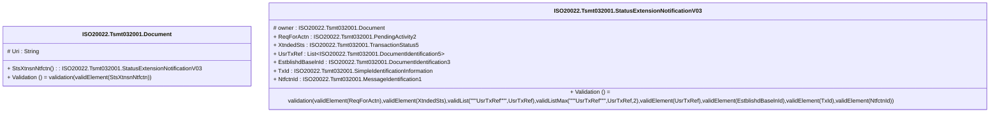

# tsmt.032.001.03-physical

> The tables below contain descriptions of the members of each Element. 
> The first column indicates the type of the member:
> A ‘#’ indicates that the field is a key to the element, and a ‘+’ indicates that the field is a value.
> The ‘*’ column contains a description for the element member.  
> The ‘@’ column contains any properties for the member.
> The ‘=’ column contains calculated values; or in the case of an enum, the serialized value.

---

## EntityImpl ISO20022.Tsmt032001.Document

| |Name|Type|*|@|=|
|-|-|-|-|-|-|
|#|Uri|String||XmlIgnore(), JsonIgnore()||
|+|StsXtnsnNtfctn|ISO20022.Tsmt032001.StatusExtensionNotificationV03||XmlElement()||
||Validation|Some(String)||XmlIgnore(), JsonIgnore()|validation(validElement(StsXtnsnNtfctn))|

---

## AspectImpl ISO20022.Tsmt032001.StatusExtensionNotificationV03

| |Name|Type|*|@|=|
|-|-|-|-|-|-|
|#|owner|ISO20022.Tsmt032001.Document||||
|+|ReqForActn|ISO20022.Tsmt032001.PendingActivity2||XmlElement()||
|+|XtndedSts|ISO20022.Tsmt032001.TransactionStatus5||XmlElement()||
|+|UsrTxRef|List<ISO20022.Tsmt032001.DocumentIdentification5>||XmlElement()||
|+|EstblishdBaselnId|ISO20022.Tsmt032001.DocumentIdentification3||XmlElement()||
|+|TxId|ISO20022.Tsmt032001.SimpleIdentificationInformation||XmlElement()||
|+|NtfctnId|ISO20022.Tsmt032001.MessageIdentification1||XmlElement()||
||Validation|Some(String)||XmlIgnore(), JsonIgnore()|validation(validElement(ReqForActn),validElement(XtndedSts),validList("""UsrTxRef""",UsrTxRef),validListMax("""UsrTxRef""",UsrTxRef,2),validElement(UsrTxRef),validElement(EstblishdBaselnId),validElement(TxId),validElement(NtfctnId))|

