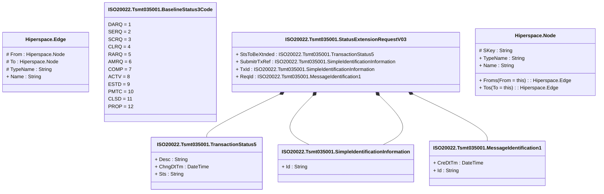

# tsmt.035.001.03

> The tables below contain descriptions of the members of each Element. 
> The first column indicates the type of the member:
> A ‘#’ indicates that the field is a key to the element, and a ‘+’ indicates that the field is a value.
> The ‘*’ column contains a description for the element member.  
> The ‘@’ column contains any properties for the member.
> The ‘=’ column contains calculated values; or in the case of an enum, the serialized value.

---

## View Hiperspace.Edge
edge between nodes

| |Name|Type|*|@|=|
|-|-|-|-|-|-|
|#|From|Hiperspace.Node||||
|#|To|Hiperspace.Node||||
|#|TypeName|String||||
|+|Name|String||||

---

## Enum ISO20022.Tsmt035001.BaselineStatus3Code

| |Name|Type|*|@|=|
|-|-|-|-|-|-|
||DARQ|Int32||XmlEnum("""DARQ""")|1|
||SERQ|Int32||XmlEnum("""SERQ""")|2|
||SCRQ|Int32||XmlEnum("""SCRQ""")|3|
||CLRQ|Int32||XmlEnum("""CLRQ""")|4|
||RARQ|Int32||XmlEnum("""RARQ""")|5|
||AMRQ|Int32||XmlEnum("""AMRQ""")|6|
||COMP|Int32||XmlEnum("""COMP""")|7|
||ACTV|Int32||XmlEnum("""ACTV""")|8|
||ESTD|Int32||XmlEnum("""ESTD""")|9|
||PMTC|Int32||XmlEnum("""PMTC""")|10|
||CLSD|Int32||XmlEnum("""CLSD""")|11|
||PROP|Int32||XmlEnum("""PROP""")|12|

---

## Type ISO20022.Tsmt035001.Document

| |Name|Type|*|@|=|
|-|-|-|-|-|-|
|+|StsXtnsnReq|ISO20022.Tsmt035001.StatusExtensionRequestV03||XmlElement()||
||Validation|Some(String)||XmlIgnore(), JsonIgnore()|validation(validElement(StsXtnsnReq))|

---

## Value ISO20022.Tsmt035001.MessageIdentification1

| |Name|Type|*|@|=|
|-|-|-|-|-|-|
|+|CreDtTm|DateTime||XmlElement()||
|+|Id|String||XmlElement()||
||Validation|Some(String)||XmlIgnore(), JsonIgnore()|""|

---

## Value ISO20022.Tsmt035001.SimpleIdentificationInformation

| |Name|Type|*|@|=|
|-|-|-|-|-|-|
|+|Id|String||XmlElement()||
||Validation|Some(String)||XmlIgnore(), JsonIgnore()|""|

---

## Aspect ISO20022.Tsmt035001.StatusExtensionRequestV03

| |Name|Type|*|@|=|
|-|-|-|-|-|-|
|+|StsToBeXtnded|ISO20022.Tsmt035001.TransactionStatus5||XmlElement()||
|+|SubmitrTxRef|ISO20022.Tsmt035001.SimpleIdentificationInformation||XmlElement()||
|+|TxId|ISO20022.Tsmt035001.SimpleIdentificationInformation||XmlElement()||
|+|ReqId|ISO20022.Tsmt035001.MessageIdentification1||XmlElement()||
||Validation|Some(String)||XmlIgnore(), JsonIgnore()|validation(validElement(StsToBeXtnded),validElement(SubmitrTxRef),validElement(TxId),validElement(ReqId))|

---

## Value ISO20022.Tsmt035001.TransactionStatus5

| |Name|Type|*|@|=|
|-|-|-|-|-|-|
|+|Desc|String||XmlElement()||
|+|ChngDtTm|DateTime||XmlElement()||
|+|Sts|String||XmlElement()||
||Validation|Some(String)||XmlIgnore(), JsonIgnore()|""|

---

## View Hiperspace.Node
node in a graph view of data

| |Name|Type|*|@|=|
|-|-|-|-|-|-|
|#|SKey|String||||
|+|TypeName|String||||
|+|Name|String||||
||Froms|Hiperspace.Edge|||From = this|
||Tos|Hiperspace.Edge|||To = this|

