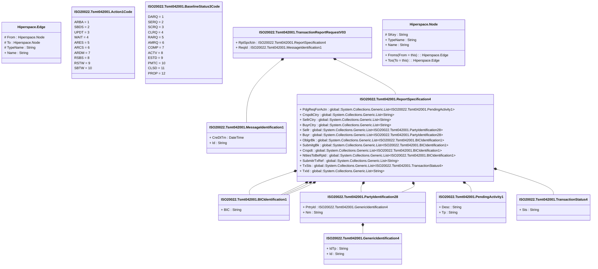

# tsmt.042.001.03

> The tables below contain descriptions of the members of each Element. 
> The first column indicates the type of the member:
> A ‘#’ indicates that the field is a key to the element, and a ‘+’ indicates that the field is a value.
> The ‘*’ column contains a description for the element member.  
> The ‘@’ column contains any properties for the member.
> The ‘=’ column contains calculated values; or in the case of an enum, the serialized value.

---

## View Hiperspace.Edge
edge between nodes

| |Name|Type|*|@|=|
|-|-|-|-|-|-|
|#|From|Hiperspace.Node||||
|#|To|Hiperspace.Node||||
|#|TypeName|String||||
|+|Name|String||||

---

## Enum ISO20022.Tsmt042001.Action1Code

| |Name|Type|*|@|=|
|-|-|-|-|-|-|
||ARBA|Int32||XmlEnum("""ARBA""")|1|
||SBDS|Int32||XmlEnum("""SBDS""")|2|
||UPDT|Int32||XmlEnum("""UPDT""")|3|
||WAIT|Int32||XmlEnum("""WAIT""")|4|
||ARES|Int32||XmlEnum("""ARES""")|5|
||ARCS|Int32||XmlEnum("""ARCS""")|6|
||ARDM|Int32||XmlEnum("""ARDM""")|7|
||RSBS|Int32||XmlEnum("""RSBS""")|8|
||RSTW|Int32||XmlEnum("""RSTW""")|9|
||SBTW|Int32||XmlEnum("""SBTW""")|10|

---

## Value ISO20022.Tsmt042001.BICIdentification1

| |Name|Type|*|@|=|
|-|-|-|-|-|-|
|+|BIC|String||XmlElement()||
||Validation|Some(String)||XmlIgnore(), JsonIgnore()|validation(validPattern("""BIC""",BIC,"""[A-Z]{6,6}[A-Z2-9][A-NP-Z0-9]([A-Z0-9]{3,3}){0,1}"""))|

---

## Enum ISO20022.Tsmt042001.BaselineStatus3Code

| |Name|Type|*|@|=|
|-|-|-|-|-|-|
||DARQ|Int32||XmlEnum("""DARQ""")|1|
||SERQ|Int32||XmlEnum("""SERQ""")|2|
||SCRQ|Int32||XmlEnum("""SCRQ""")|3|
||CLRQ|Int32||XmlEnum("""CLRQ""")|4|
||RARQ|Int32||XmlEnum("""RARQ""")|5|
||AMRQ|Int32||XmlEnum("""AMRQ""")|6|
||COMP|Int32||XmlEnum("""COMP""")|7|
||ACTV|Int32||XmlEnum("""ACTV""")|8|
||ESTD|Int32||XmlEnum("""ESTD""")|9|
||PMTC|Int32||XmlEnum("""PMTC""")|10|
||CLSD|Int32||XmlEnum("""CLSD""")|11|
||PROP|Int32||XmlEnum("""PROP""")|12|

---

## Type ISO20022.Tsmt042001.Document

| |Name|Type|*|@|=|
|-|-|-|-|-|-|
|+|TxRptReq|ISO20022.Tsmt042001.TransactionReportRequestV03||XmlElement()||
||Validation|Some(String)||XmlIgnore(), JsonIgnore()|validation(validElement(TxRptReq))|

---

## Value ISO20022.Tsmt042001.GenericIdentification4

| |Name|Type|*|@|=|
|-|-|-|-|-|-|
|+|IdTp|String||XmlElement()||
|+|Id|String||XmlElement()||
||Validation|Some(String)||XmlIgnore(), JsonIgnore()|""|

---

## Value ISO20022.Tsmt042001.MessageIdentification1

| |Name|Type|*|@|=|
|-|-|-|-|-|-|
|+|CreDtTm|DateTime||XmlElement()||
|+|Id|String||XmlElement()||
||Validation|Some(String)||XmlIgnore(), JsonIgnore()|""|

---

## Value ISO20022.Tsmt042001.PartyIdentification28

| |Name|Type|*|@|=|
|-|-|-|-|-|-|
|+|PrtryId|ISO20022.Tsmt042001.GenericIdentification4||XmlElement()||
|+|Nm|String||XmlElement()||
||Validation|Some(String)||XmlIgnore(), JsonIgnore()|validation(validElement(PrtryId))|

---

## Value ISO20022.Tsmt042001.PendingActivity1

| |Name|Type|*|@|=|
|-|-|-|-|-|-|
|+|Desc|String||XmlElement()||
|+|Tp|String||XmlElement()||
||Validation|Some(String)||XmlIgnore(), JsonIgnore()|""|

---

## Value ISO20022.Tsmt042001.ReportSpecification4

| |Name|Type|*|@|=|
|-|-|-|-|-|-|
|+|PdgReqForActn|global::System.Collections.Generic.List<ISO20022.Tsmt042001.PendingActivity1>||XmlElement()||
|+|CrspdtCtry|global::System.Collections.Generic.List<String>||XmlElement()||
|+|SellrCtry|global::System.Collections.Generic.List<String>||XmlElement()||
|+|BuyrCtry|global::System.Collections.Generic.List<String>||XmlElement()||
|+|Sellr|global::System.Collections.Generic.List<ISO20022.Tsmt042001.PartyIdentification28>||XmlElement()||
|+|Buyr|global::System.Collections.Generic.List<ISO20022.Tsmt042001.PartyIdentification28>||XmlElement()||
|+|OblgrBk|global::System.Collections.Generic.List<ISO20022.Tsmt042001.BICIdentification1>||XmlElement()||
|+|SubmitgBk|global::System.Collections.Generic.List<ISO20022.Tsmt042001.BICIdentification1>||XmlElement()||
|+|Crspdt|global::System.Collections.Generic.List<ISO20022.Tsmt042001.BICIdentification1>||XmlElement()||
|+|NttiesToBeRptd|global::System.Collections.Generic.List<ISO20022.Tsmt042001.BICIdentification1>||XmlElement()||
|+|SubmitrTxRef|global::System.Collections.Generic.List<String>||XmlElement()||
|+|TxSts|global::System.Collections.Generic.List<ISO20022.Tsmt042001.TransactionStatus4>||XmlElement()||
|+|TxId|global::System.Collections.Generic.List<String>||XmlElement()||
||Validation|Some(String)||XmlIgnore(), JsonIgnore()|validation(validList("""PdgReqForActn""",PdgReqForActn),validElement(PdgReqForActn),validPattern("""CrspdtCtry""",CrspdtCtry,"""[A-Z]{2,2}"""),validPattern("""SellrCtry""",SellrCtry,"""[A-Z]{2,2}"""),validPattern("""BuyrCtry""",BuyrCtry,"""[A-Z]{2,2}"""),validList("""Sellr""",Sellr),validElement(Sellr),validList("""Buyr""",Buyr),validElement(Buyr),validList("""OblgrBk""",OblgrBk),validElement(OblgrBk),validList("""SubmitgBk""",SubmitgBk),validElement(SubmitgBk),validList("""Crspdt""",Crspdt),validElement(Crspdt),validList("""NttiesToBeRptd""",NttiesToBeRptd),validElement(NttiesToBeRptd),validList("""TxSts""",TxSts),validElement(TxSts))|

---

## Aspect ISO20022.Tsmt042001.TransactionReportRequestV03

| |Name|Type|*|@|=|
|-|-|-|-|-|-|
|+|RptSpcfctn|ISO20022.Tsmt042001.ReportSpecification4||XmlElement()||
|+|ReqId|ISO20022.Tsmt042001.MessageIdentification1||XmlElement()||
||Validation|Some(String)||XmlIgnore(), JsonIgnore()|validation(validElement(RptSpcfctn),validElement(ReqId))|

---

## Value ISO20022.Tsmt042001.TransactionStatus4

| |Name|Type|*|@|=|
|-|-|-|-|-|-|
|+|Sts|String||XmlElement()||
||Validation|Some(String)||XmlIgnore(), JsonIgnore()|""|

---

## View Hiperspace.Node
node in a graph view of data

| |Name|Type|*|@|=|
|-|-|-|-|-|-|
|#|SKey|String||||
|+|TypeName|String||||
|+|Name|String||||
||Froms|Hiperspace.Edge|||From = this|
||Tos|Hiperspace.Edge|||To = this|

