# tsmt.044.001.02

```mermaid
classDiagram
    class Hiperspace.Edge {
        # From  : Hiperspace.Node
        # To  : Hiperspace.Node
        # TypeName  : String
        + Name  : String
    }
    class ISO20022.Tsmt044001.AccountIdentification4Choice {
        + Othr  : ISO20022.Tsmt044001.GenericAccountIdentification1
        + IBAN  : String
    }
    ISO20022.Tsmt044001.AccountIdentification4Choice *-- ISO20022.Tsmt044001.GenericAccountIdentification1
    class ISO20022.Tsmt044001.AccountSchemeName1Choice {
        + Prtry  : String
        + Cd  : String
    }
    class ISO20022.Tsmt044001.Adjustment6 {
        + Amt  : ISO20022.Tsmt044001.CurrencyAndAmount
        + Drctn  : String
        + Tp  : ISO20022.Tsmt044001.AdjustmentType1Choice
    }
    ISO20022.Tsmt044001.Adjustment6 *-- ISO20022.Tsmt044001.CurrencyAndAmount
    ISO20022.Tsmt044001.Adjustment6 *-- ISO20022.Tsmt044001.AdjustmentType1Choice
    class ISO20022.Tsmt044001.AdjustmentDirection1Code {
        SUBS = 1
        ADDD = 2
    }
    class ISO20022.Tsmt044001.AdjustmentType1Choice {
        + OthrAdjstmntTp  : String
        + Tp  : String
    }
    class ISO20022.Tsmt044001.AdjustmentType2Code {
        SURC = 1
        CREN = 2
        DISC = 3
        REBA = 4
    }
    class ISO20022.Tsmt044001.BICIdentification1 {
        + BIC  : String
    }
    class ISO20022.Tsmt044001.BreakDown1Choice {
        + ByComrclInvc  : ISO20022.Tsmt044001.ReportLine6
        + ByPurchsOrdr  : ISO20022.Tsmt044001.ReportLine5
    }
    ISO20022.Tsmt044001.BreakDown1Choice *-- ISO20022.Tsmt044001.ReportLine6
    ISO20022.Tsmt044001.BreakDown1Choice *-- ISO20022.Tsmt044001.ReportLine5
    class ISO20022.Tsmt044001.CashAccount24 {
        + Nm  : String
        + Ccy  : String
        + Tp  : ISO20022.Tsmt044001.CashAccountType2Choice
        + Id  : ISO20022.Tsmt044001.AccountIdentification4Choice
    }
    ISO20022.Tsmt044001.CashAccount24 *-- ISO20022.Tsmt044001.CashAccountType2Choice
    ISO20022.Tsmt044001.CashAccount24 *-- ISO20022.Tsmt044001.AccountIdentification4Choice
    class ISO20022.Tsmt044001.CashAccountType2Choice {
        + Prtry  : String
        + Cd  : String
    }
    class ISO20022.Tsmt044001.CurrencyAndAmount {
        + Value  : Decimal
        + Ccy  : String
    }
    class ISO20022.Tsmt044001.DocumentIdentification7 {
        + DtOfIsse  : DateTime
        + Id  : String
    }
    class ISO20022.Tsmt044001.FinancialInstitutionIdentification4Choice {
        + NmAndAdr  : ISO20022.Tsmt044001.NameAndAddress6
        + BIC  : String
    }
    ISO20022.Tsmt044001.FinancialInstitutionIdentification4Choice *-- ISO20022.Tsmt044001.NameAndAddress6
    class ISO20022.Tsmt044001.GenericAccountIdentification1 {
        + Issr  : String
        + SchmeNm  : ISO20022.Tsmt044001.AccountSchemeName1Choice
        + Id  : String
    }
    ISO20022.Tsmt044001.GenericAccountIdentification1 *-- ISO20022.Tsmt044001.AccountSchemeName1Choice
    class ISO20022.Tsmt044001.IntentToPay2 {
        + SttlmTerms  : ISO20022.Tsmt044001.SettlementTerms3
        + XpctdPmtDt  : DateTime
        + Brkdwn  : ISO20022.Tsmt044001.BreakDown1Choice
    }
    ISO20022.Tsmt044001.IntentToPay2 *-- ISO20022.Tsmt044001.SettlementTerms3
    ISO20022.Tsmt044001.IntentToPay2 *-- ISO20022.Tsmt044001.BreakDown1Choice
    class ISO20022.Tsmt044001.IntentToPayNotificationV02 {
        + InttToPay  : ISO20022.Tsmt044001.IntentToPay2
        + SellrBk  : ISO20022.Tsmt044001.BICIdentification1
        + BuyrBk  : ISO20022.Tsmt044001.BICIdentification1
        + SubmitrTxRef  : ISO20022.Tsmt044001.SimpleIdentificationInformation
        + TxId  : ISO20022.Tsmt044001.SimpleIdentificationInformation
        + NtfctnId  : ISO20022.Tsmt044001.MessageIdentification1
    }
    ISO20022.Tsmt044001.IntentToPayNotificationV02 *-- ISO20022.Tsmt044001.IntentToPay2
    ISO20022.Tsmt044001.IntentToPayNotificationV02 *-- ISO20022.Tsmt044001.BICIdentification1
    ISO20022.Tsmt044001.IntentToPayNotificationV02 *-- ISO20022.Tsmt044001.BICIdentification1
    ISO20022.Tsmt044001.IntentToPayNotificationV02 *-- ISO20022.Tsmt044001.SimpleIdentificationInformation
    ISO20022.Tsmt044001.IntentToPayNotificationV02 *-- ISO20022.Tsmt044001.SimpleIdentificationInformation
    ISO20022.Tsmt044001.IntentToPayNotificationV02 *-- ISO20022.Tsmt044001.MessageIdentification1
    class ISO20022.Tsmt044001.InvoiceIdentification1 {
        + IsseDt  : DateTime
        + InvcNb  : String
    }
    class ISO20022.Tsmt044001.MessageIdentification1 {
        + CreDtTm  : DateTime
        + Id  : String
    }
    class ISO20022.Tsmt044001.NameAndAddress6 {
        + Adr  : ISO20022.Tsmt044001.PostalAddress2
        + Nm  : String
    }
    ISO20022.Tsmt044001.NameAndAddress6 *-- ISO20022.Tsmt044001.PostalAddress2
    class ISO20022.Tsmt044001.PostalAddress2 {
        + Ctry  : String
        + CtrySubDvsn  : String
        + TwnNm  : String
        + PstCdId  : String
        + StrtNm  : String
    }
    class ISO20022.Tsmt044001.ReportLine5 {
        + NetAmt  : ISO20022.Tsmt044001.CurrencyAndAmount
        + Adjstmnt  : global::System.Collections.Generic.List~ISO20022.Tsmt044001.Adjustment6~
        + PurchsOrdrRef  : ISO20022.Tsmt044001.DocumentIdentification7
    }
    ISO20022.Tsmt044001.ReportLine5 *-- ISO20022.Tsmt044001.CurrencyAndAmount
    ISO20022.Tsmt044001.ReportLine5 *-- ISO20022.Tsmt044001.Adjustment6
    ISO20022.Tsmt044001.ReportLine5 *-- ISO20022.Tsmt044001.DocumentIdentification7
    class ISO20022.Tsmt044001.ReportLine6 {
        + BrkdwnByPurchsOrdr  : global::System.Collections.Generic.List~ISO20022.Tsmt044001.ReportLine7~
        + NetAmt  : ISO20022.Tsmt044001.CurrencyAndAmount
        + Adjstmnt  : global::System.Collections.Generic.List~ISO20022.Tsmt044001.Adjustment6~
        + ComrclDocRef  : ISO20022.Tsmt044001.InvoiceIdentification1
    }
    ISO20022.Tsmt044001.ReportLine6 *-- ISO20022.Tsmt044001.ReportLine7
    ISO20022.Tsmt044001.ReportLine6 *-- ISO20022.Tsmt044001.CurrencyAndAmount
    ISO20022.Tsmt044001.ReportLine6 *-- ISO20022.Tsmt044001.Adjustment6
    ISO20022.Tsmt044001.ReportLine6 *-- ISO20022.Tsmt044001.InvoiceIdentification1
    class ISO20022.Tsmt044001.ReportLine7 {
        + NetAmt  : ISO20022.Tsmt044001.CurrencyAndAmount
        + Adjstmnt  : global::System.Collections.Generic.List~ISO20022.Tsmt044001.Adjustment6~
        + PurchsOrdrRef  : ISO20022.Tsmt044001.DocumentIdentification7
        + TxId  : String
    }
    ISO20022.Tsmt044001.ReportLine7 *-- ISO20022.Tsmt044001.CurrencyAndAmount
    ISO20022.Tsmt044001.ReportLine7 *-- ISO20022.Tsmt044001.Adjustment6
    ISO20022.Tsmt044001.ReportLine7 *-- ISO20022.Tsmt044001.DocumentIdentification7
    class ISO20022.Tsmt044001.SettlementTerms3 {
        + CdtrAcct  : ISO20022.Tsmt044001.CashAccount24
        + CdtrAgt  : ISO20022.Tsmt044001.FinancialInstitutionIdentification4Choice
    }
    ISO20022.Tsmt044001.SettlementTerms3 *-- ISO20022.Tsmt044001.CashAccount24
    ISO20022.Tsmt044001.SettlementTerms3 *-- ISO20022.Tsmt044001.FinancialInstitutionIdentification4Choice
    class ISO20022.Tsmt044001.SimpleIdentificationInformation {
        + Id  : String
    }
    class Hiperspace.Node {
        # SKey  : String
        + TypeName  : String
        + Name  : String
        + Froms (From = this) : Hiperspace.Edge
        + Tos (To = this) : Hiperspace.Edge
    }
```

> The tables below contain descriptions of the members of each Element. 
> The first column indicates the type of the member:
> A ‘#’ indicates that the field is a key to the element, and a ‘+’ indicates that the field is a value.
> The ‘*’ column contains a description for the element member.  
> The ‘@’ column contains any properties for the member.
> The ‘=’ column contains calculated values; or in the case of an enum, the serialized value.

---

## View Hiperspace.Edge
edge between nodes

| |Name|Type|*|@|=|
|-|-|-|-|-|-|
|#|From|Hiperspace.Node||||
|#|To|Hiperspace.Node||||
|#|TypeName|String||||
|+|Name|String||||

---

## Value ISO20022.Tsmt044001.AccountIdentification4Choice

| |Name|Type|*|@|=|
|-|-|-|-|-|-|
|+|Othr|ISO20022.Tsmt044001.GenericAccountIdentification1||XmlElement()||
|+|IBAN|String||XmlElement()||
||Validation|Some(String)||XmlIgnore(), JsonIgnore()|validation(validElement(Othr),validPattern("""IBAN""",IBAN,"""[A-Z]{2,2}[0-9]{2,2}[a-zA-Z0-9]{1,30}"""),validChoice(Othr,IBAN))|

---

## Value ISO20022.Tsmt044001.AccountSchemeName1Choice

| |Name|Type|*|@|=|
|-|-|-|-|-|-|
|+|Prtry|String||XmlElement()||
|+|Cd|String||XmlElement()||
||Validation|Some(String)||XmlIgnore(), JsonIgnore()|validation(validChoice(Prtry,Cd))|

---

## Value ISO20022.Tsmt044001.Adjustment6

| |Name|Type|*|@|=|
|-|-|-|-|-|-|
|+|Amt|ISO20022.Tsmt044001.CurrencyAndAmount||XmlElement()||
|+|Drctn|String||XmlElement()||
|+|Tp|ISO20022.Tsmt044001.AdjustmentType1Choice||XmlElement()||
||Validation|Some(String)||XmlIgnore(), JsonIgnore()|validation(validElement(Amt),validElement(Tp))|

---

## Enum ISO20022.Tsmt044001.AdjustmentDirection1Code

| |Name|Type|*|@|=|
|-|-|-|-|-|-|
||SUBS|Int32||XmlEnum("""SUBS""")|1|
||ADDD|Int32||XmlEnum("""ADDD""")|2|

---

## Value ISO20022.Tsmt044001.AdjustmentType1Choice

| |Name|Type|*|@|=|
|-|-|-|-|-|-|
|+|OthrAdjstmntTp|String||XmlElement()||
|+|Tp|String||XmlElement()||
||Validation|Some(String)||XmlIgnore(), JsonIgnore()|validation(validChoice(OthrAdjstmntTp,Tp))|

---

## Enum ISO20022.Tsmt044001.AdjustmentType2Code

| |Name|Type|*|@|=|
|-|-|-|-|-|-|
||SURC|Int32||XmlEnum("""SURC""")|1|
||CREN|Int32||XmlEnum("""CREN""")|2|
||DISC|Int32||XmlEnum("""DISC""")|3|
||REBA|Int32||XmlEnum("""REBA""")|4|

---

## Value ISO20022.Tsmt044001.BICIdentification1

| |Name|Type|*|@|=|
|-|-|-|-|-|-|
|+|BIC|String||XmlElement()||
||Validation|Some(String)||XmlIgnore(), JsonIgnore()|validation(validPattern("""BIC""",BIC,"""[A-Z]{6,6}[A-Z2-9][A-NP-Z0-9]([A-Z0-9]{3,3}){0,1}"""))|

---

## Value ISO20022.Tsmt044001.BreakDown1Choice

| |Name|Type|*|@|=|
|-|-|-|-|-|-|
|+|ByComrclInvc|ISO20022.Tsmt044001.ReportLine6||XmlElement()||
|+|ByPurchsOrdr|ISO20022.Tsmt044001.ReportLine5||XmlElement()||
||Validation|Some(String)||XmlIgnore(), JsonIgnore()|validation(validElement(ByComrclInvc),validElement(ByPurchsOrdr),validChoice(ByComrclInvc,ByPurchsOrdr))|

---

## Value ISO20022.Tsmt044001.CashAccount24

| |Name|Type|*|@|=|
|-|-|-|-|-|-|
|+|Nm|String||XmlElement()||
|+|Ccy|String||XmlElement()||
|+|Tp|ISO20022.Tsmt044001.CashAccountType2Choice||XmlElement()||
|+|Id|ISO20022.Tsmt044001.AccountIdentification4Choice||XmlElement()||
||Validation|Some(String)||XmlIgnore(), JsonIgnore()|validation(validPattern("""Ccy""",Ccy,"""[A-Z]{3,3}"""),validElement(Tp),validElement(Id))|

---

## Value ISO20022.Tsmt044001.CashAccountType2Choice

| |Name|Type|*|@|=|
|-|-|-|-|-|-|
|+|Prtry|String||XmlElement()||
|+|Cd|String||XmlElement()||
||Validation|Some(String)||XmlIgnore(), JsonIgnore()|validation(validChoice(Prtry,Cd))|

---

## Value ISO20022.Tsmt044001.CurrencyAndAmount

| |Name|Type|*|@|=|
|-|-|-|-|-|-|
|+|Value|Decimal||XmlElement()||
|+|Ccy|String||XmlAttribute()||
||Validation|Some(String)||XmlIgnore(), JsonIgnore()|validation(validRequired("""Value""",Value),validRequired("""Ccy""",Ccy),validPattern("""Ccy""",Ccy,"""[A-Z]{3,3}"""))|

---

## Type ISO20022.Tsmt044001.Document

| |Name|Type|*|@|=|
|-|-|-|-|-|-|
|+|InttToPayNtfctn|ISO20022.Tsmt044001.IntentToPayNotificationV02||XmlElement()||
||Validation|Some(String)||XmlIgnore(), JsonIgnore()|validation(validElement(InttToPayNtfctn))|

---

## Value ISO20022.Tsmt044001.DocumentIdentification7

| |Name|Type|*|@|=|
|-|-|-|-|-|-|
|+|DtOfIsse|DateTime||XmlElement()||
|+|Id|String||XmlElement()||
||Validation|Some(String)||XmlIgnore(), JsonIgnore()|""|

---

## Value ISO20022.Tsmt044001.FinancialInstitutionIdentification4Choice

| |Name|Type|*|@|=|
|-|-|-|-|-|-|
|+|NmAndAdr|ISO20022.Tsmt044001.NameAndAddress6||XmlElement()||
|+|BIC|String||XmlElement()||
||Validation|Some(String)||XmlIgnore(), JsonIgnore()|validation(validElement(NmAndAdr),validPattern("""BIC""",BIC,"""[A-Z]{6,6}[A-Z2-9][A-NP-Z0-9]([A-Z0-9]{3,3}){0,1}"""),validChoice(NmAndAdr,BIC))|

---

## Value ISO20022.Tsmt044001.GenericAccountIdentification1

| |Name|Type|*|@|=|
|-|-|-|-|-|-|
|+|Issr|String||XmlElement()||
|+|SchmeNm|ISO20022.Tsmt044001.AccountSchemeName1Choice||XmlElement()||
|+|Id|String||XmlElement()||
||Validation|Some(String)||XmlIgnore(), JsonIgnore()|validation(validElement(SchmeNm))|

---

## Value ISO20022.Tsmt044001.IntentToPay2

| |Name|Type|*|@|=|
|-|-|-|-|-|-|
|+|SttlmTerms|ISO20022.Tsmt044001.SettlementTerms3||XmlElement()||
|+|XpctdPmtDt|DateTime||XmlElement()||
|+|Brkdwn|ISO20022.Tsmt044001.BreakDown1Choice||XmlElement()||
||Validation|Some(String)||XmlIgnore(), JsonIgnore()|validation(validElement(SttlmTerms),validElement(Brkdwn))|

---

## Aspect ISO20022.Tsmt044001.IntentToPayNotificationV02

| |Name|Type|*|@|=|
|-|-|-|-|-|-|
|+|InttToPay|ISO20022.Tsmt044001.IntentToPay2||XmlElement()||
|+|SellrBk|ISO20022.Tsmt044001.BICIdentification1||XmlElement()||
|+|BuyrBk|ISO20022.Tsmt044001.BICIdentification1||XmlElement()||
|+|SubmitrTxRef|ISO20022.Tsmt044001.SimpleIdentificationInformation||XmlElement()||
|+|TxId|ISO20022.Tsmt044001.SimpleIdentificationInformation||XmlElement()||
|+|NtfctnId|ISO20022.Tsmt044001.MessageIdentification1||XmlElement()||
||Validation|Some(String)||XmlIgnore(), JsonIgnore()|validation(validElement(InttToPay),validElement(SellrBk),validElement(BuyrBk),validElement(SubmitrTxRef),validElement(TxId),validElement(NtfctnId))|

---

## Value ISO20022.Tsmt044001.InvoiceIdentification1

| |Name|Type|*|@|=|
|-|-|-|-|-|-|
|+|IsseDt|DateTime||XmlElement()||
|+|InvcNb|String||XmlElement()||
||Validation|Some(String)||XmlIgnore(), JsonIgnore()|""|

---

## Value ISO20022.Tsmt044001.MessageIdentification1

| |Name|Type|*|@|=|
|-|-|-|-|-|-|
|+|CreDtTm|DateTime||XmlElement()||
|+|Id|String||XmlElement()||
||Validation|Some(String)||XmlIgnore(), JsonIgnore()|""|

---

## Value ISO20022.Tsmt044001.NameAndAddress6

| |Name|Type|*|@|=|
|-|-|-|-|-|-|
|+|Adr|ISO20022.Tsmt044001.PostalAddress2||XmlElement()||
|+|Nm|String||XmlElement()||
||Validation|Some(String)||XmlIgnore(), JsonIgnore()|validation(validElement(Adr))|

---

## Value ISO20022.Tsmt044001.PostalAddress2

| |Name|Type|*|@|=|
|-|-|-|-|-|-|
|+|Ctry|String||XmlElement()||
|+|CtrySubDvsn|String||XmlElement()||
|+|TwnNm|String||XmlElement()||
|+|PstCdId|String||XmlElement()||
|+|StrtNm|String||XmlElement()||
||Validation|Some(String)||XmlIgnore(), JsonIgnore()|validation(validPattern("""Ctry""",Ctry,"""[A-Z]{2,2}"""))|

---

## Value ISO20022.Tsmt044001.ReportLine5

| |Name|Type|*|@|=|
|-|-|-|-|-|-|
|+|NetAmt|ISO20022.Tsmt044001.CurrencyAndAmount||XmlElement()||
|+|Adjstmnt|global::System.Collections.Generic.List<ISO20022.Tsmt044001.Adjustment6>||XmlElement()||
|+|PurchsOrdrRef|ISO20022.Tsmt044001.DocumentIdentification7||XmlElement()||
||Validation|Some(String)||XmlIgnore(), JsonIgnore()|validation(validElement(NetAmt),validList("""Adjstmnt""",Adjstmnt),validElement(Adjstmnt),validElement(PurchsOrdrRef))|

---

## Value ISO20022.Tsmt044001.ReportLine6

| |Name|Type|*|@|=|
|-|-|-|-|-|-|
|+|BrkdwnByPurchsOrdr|global::System.Collections.Generic.List<ISO20022.Tsmt044001.ReportLine7>||XmlElement()||
|+|NetAmt|ISO20022.Tsmt044001.CurrencyAndAmount||XmlElement()||
|+|Adjstmnt|global::System.Collections.Generic.List<ISO20022.Tsmt044001.Adjustment6>||XmlElement()||
|+|ComrclDocRef|ISO20022.Tsmt044001.InvoiceIdentification1||XmlElement()||
||Validation|Some(String)||XmlIgnore(), JsonIgnore()|validation(validRequired("""BrkdwnByPurchsOrdr""",BrkdwnByPurchsOrdr),validList("""BrkdwnByPurchsOrdr""",BrkdwnByPurchsOrdr),validElement(BrkdwnByPurchsOrdr),validElement(NetAmt),validList("""Adjstmnt""",Adjstmnt),validElement(Adjstmnt),validElement(ComrclDocRef))|

---

## Value ISO20022.Tsmt044001.ReportLine7

| |Name|Type|*|@|=|
|-|-|-|-|-|-|
|+|NetAmt|ISO20022.Tsmt044001.CurrencyAndAmount||XmlElement()||
|+|Adjstmnt|global::System.Collections.Generic.List<ISO20022.Tsmt044001.Adjustment6>||XmlElement()||
|+|PurchsOrdrRef|ISO20022.Tsmt044001.DocumentIdentification7||XmlElement()||
|+|TxId|String||XmlElement()||
||Validation|Some(String)||XmlIgnore(), JsonIgnore()|validation(validElement(NetAmt),validList("""Adjstmnt""",Adjstmnt),validElement(Adjstmnt),validElement(PurchsOrdrRef))|

---

## Value ISO20022.Tsmt044001.SettlementTerms3

| |Name|Type|*|@|=|
|-|-|-|-|-|-|
|+|CdtrAcct|ISO20022.Tsmt044001.CashAccount24||XmlElement()||
|+|CdtrAgt|ISO20022.Tsmt044001.FinancialInstitutionIdentification4Choice||XmlElement()||
||Validation|Some(String)||XmlIgnore(), JsonIgnore()|validation(validElement(CdtrAcct),validElement(CdtrAgt))|

---

## Value ISO20022.Tsmt044001.SimpleIdentificationInformation

| |Name|Type|*|@|=|
|-|-|-|-|-|-|
|+|Id|String||XmlElement()||
||Validation|Some(String)||XmlIgnore(), JsonIgnore()|""|

---

## View Hiperspace.Node
node in a graph view of data

| |Name|Type|*|@|=|
|-|-|-|-|-|-|
|#|SKey|String||||
|+|TypeName|String||||
|+|Name|String||||
||Froms|Hiperspace.Edge|||From = this|
||Tos|Hiperspace.Edge|||To = this|

