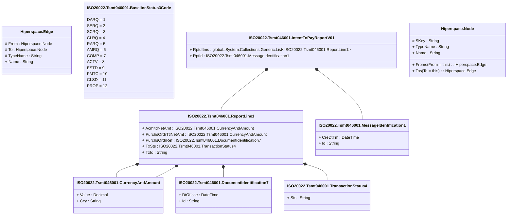

# tsmt.046.001.01

> The tables below contain descriptions of the members of each Element. 
> The first column indicates the type of the member:
> A ‘#’ indicates that the field is a key to the element, and a ‘+’ indicates that the field is a value.
> The ‘*’ column contains a description for the element member.  
> The ‘@’ column contains any properties for the member.
> The ‘=’ column contains calculated values; or in the case of an enum, the serialized value.

---

## View Hiperspace.Edge
edge between nodes

| |Name|Type|*|@|=|
|-|-|-|-|-|-|
|#|From|Hiperspace.Node||||
|#|To|Hiperspace.Node||||
|#|TypeName|String||||
|+|Name|String||||

---

## Enum ISO20022.Tsmt046001.BaselineStatus3Code

| |Name|Type|*|@|=|
|-|-|-|-|-|-|
||DARQ|Int32||XmlEnum("""DARQ""")|1|
||SERQ|Int32||XmlEnum("""SERQ""")|2|
||SCRQ|Int32||XmlEnum("""SCRQ""")|3|
||CLRQ|Int32||XmlEnum("""CLRQ""")|4|
||RARQ|Int32||XmlEnum("""RARQ""")|5|
||AMRQ|Int32||XmlEnum("""AMRQ""")|6|
||COMP|Int32||XmlEnum("""COMP""")|7|
||ACTV|Int32||XmlEnum("""ACTV""")|8|
||ESTD|Int32||XmlEnum("""ESTD""")|9|
||PMTC|Int32||XmlEnum("""PMTC""")|10|
||CLSD|Int32||XmlEnum("""CLSD""")|11|
||PROP|Int32||XmlEnum("""PROP""")|12|

---

## Value ISO20022.Tsmt046001.CurrencyAndAmount

| |Name|Type|*|@|=|
|-|-|-|-|-|-|
|+|Value|Decimal||XmlElement()||
|+|Ccy|String||XmlAttribute()||
||Validation|Some(String)||XmlIgnore(), JsonIgnore()|validation(validRequired("""Value""",Value),validRequired("""Ccy""",Ccy),validPattern("""Ccy""",Ccy,"""[A-Z]{3,3}"""))|

---

## Type ISO20022.Tsmt046001.Document

| |Name|Type|*|@|=|
|-|-|-|-|-|-|
|+|InttToPayRpt|ISO20022.Tsmt046001.IntentToPayReportV01||XmlElement()||
||Validation|Some(String)||XmlIgnore(), JsonIgnore()|validation(validElement(InttToPayRpt))|

---

## Value ISO20022.Tsmt046001.DocumentIdentification7

| |Name|Type|*|@|=|
|-|-|-|-|-|-|
|+|DtOfIsse|DateTime||XmlElement()||
|+|Id|String||XmlElement()||
||Validation|Some(String)||XmlIgnore(), JsonIgnore()|""|

---

## Aspect ISO20022.Tsmt046001.IntentToPayReportV01

| |Name|Type|*|@|=|
|-|-|-|-|-|-|
|+|RptdItms|global::System.Collections.Generic.List<ISO20022.Tsmt046001.ReportLine1>||XmlElement()||
|+|RptId|ISO20022.Tsmt046001.MessageIdentification1||XmlElement()||
||Validation|Some(String)||XmlIgnore(), JsonIgnore()|validation(validList("""RptdItms""",RptdItms),validElement(RptdItms),validElement(RptId))|

---

## Value ISO20022.Tsmt046001.MessageIdentification1

| |Name|Type|*|@|=|
|-|-|-|-|-|-|
|+|CreDtTm|DateTime||XmlElement()||
|+|Id|String||XmlElement()||
||Validation|Some(String)||XmlIgnore(), JsonIgnore()|""|

---

## Value ISO20022.Tsmt046001.ReportLine1

| |Name|Type|*|@|=|
|-|-|-|-|-|-|
|+|AcmltdNetAmt|ISO20022.Tsmt046001.CurrencyAndAmount||XmlElement()||
|+|PurchsOrdrTtlNetAmt|ISO20022.Tsmt046001.CurrencyAndAmount||XmlElement()||
|+|PurchsOrdrRef|ISO20022.Tsmt046001.DocumentIdentification7||XmlElement()||
|+|TxSts|ISO20022.Tsmt046001.TransactionStatus4||XmlElement()||
|+|TxId|String||XmlElement()||
||Validation|Some(String)||XmlIgnore(), JsonIgnore()|validation(validElement(AcmltdNetAmt),validElement(PurchsOrdrTtlNetAmt),validElement(PurchsOrdrRef),validElement(TxSts))|

---

## Value ISO20022.Tsmt046001.TransactionStatus4

| |Name|Type|*|@|=|
|-|-|-|-|-|-|
|+|Sts|String||XmlElement()||
||Validation|Some(String)||XmlIgnore(), JsonIgnore()|""|

---

## View Hiperspace.Node
node in a graph view of data

| |Name|Type|*|@|=|
|-|-|-|-|-|-|
|#|SKey|String||||
|+|TypeName|String||||
|+|Name|String||||
||Froms|Hiperspace.Edge|||From = this|
||Tos|Hiperspace.Edge|||To = this|

