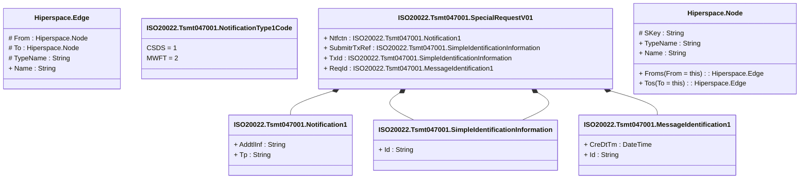

# tsmt.047.001.01

> The tables below contain descriptions of the members of each Element. 
> The first column indicates the type of the member:
> A ‘#’ indicates that the field is a key to the element, and a ‘+’ indicates that the field is a value.
> The ‘*’ column contains a description for the element member.  
> The ‘@’ column contains any properties for the member.
> The ‘=’ column contains calculated values; or in the case of an enum, the serialized value.

---

## View Hiperspace.Edge
edge between nodes

| |Name|Type|*|@|=|
|-|-|-|-|-|-|
|#|From|Hiperspace.Node||||
|#|To|Hiperspace.Node||||
|#|TypeName|String||||
|+|Name|String||||

---

## Type ISO20022.Tsmt047001.Document

| |Name|Type|*|@|=|
|-|-|-|-|-|-|
|+|SpclReq|ISO20022.Tsmt047001.SpecialRequestV01||XmlElement()||
||Validation|Some(String)||XmlIgnore(), JsonIgnore()|validation(validElement(SpclReq))|

---

## Value ISO20022.Tsmt047001.MessageIdentification1

| |Name|Type|*|@|=|
|-|-|-|-|-|-|
|+|CreDtTm|DateTime||XmlElement()||
|+|Id|String||XmlElement()||
||Validation|Some(String)||XmlIgnore(), JsonIgnore()|""|

---

## Value ISO20022.Tsmt047001.Notification1

| |Name|Type|*|@|=|
|-|-|-|-|-|-|
|+|AddtlInf|String||XmlElement()||
|+|Tp|String||XmlElement()||
||Validation|Some(String)||XmlIgnore(), JsonIgnore()|""|

---

## Enum ISO20022.Tsmt047001.NotificationType1Code

| |Name|Type|*|@|=|
|-|-|-|-|-|-|
||CSDS|Int32||XmlEnum("""CSDS""")|1|
||MWFT|Int32||XmlEnum("""MWFT""")|2|

---

## Value ISO20022.Tsmt047001.SimpleIdentificationInformation

| |Name|Type|*|@|=|
|-|-|-|-|-|-|
|+|Id|String||XmlElement()||
||Validation|Some(String)||XmlIgnore(), JsonIgnore()|""|

---

## Aspect ISO20022.Tsmt047001.SpecialRequestV01

| |Name|Type|*|@|=|
|-|-|-|-|-|-|
|+|Ntfctn|ISO20022.Tsmt047001.Notification1||XmlElement()||
|+|SubmitrTxRef|ISO20022.Tsmt047001.SimpleIdentificationInformation||XmlElement()||
|+|TxId|ISO20022.Tsmt047001.SimpleIdentificationInformation||XmlElement()||
|+|ReqId|ISO20022.Tsmt047001.MessageIdentification1||XmlElement()||
||Validation|Some(String)||XmlIgnore(), JsonIgnore()|validation(validElement(Ntfctn),validElement(SubmitrTxRef),validElement(TxId),validElement(ReqId))|

---

## View Hiperspace.Node
node in a graph view of data

| |Name|Type|*|@|=|
|-|-|-|-|-|-|
|#|SKey|String||||
|+|TypeName|String||||
|+|Name|String||||
||Froms|Hiperspace.Edge|||From = this|
||Tos|Hiperspace.Edge|||To = this|

