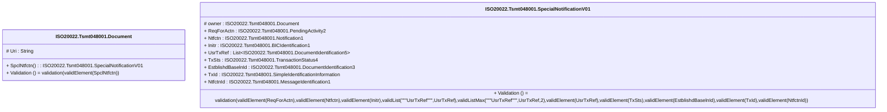

# tsmt.048.001.01-physical

> The tables below contain descriptions of the members of each Element. 
> The first column indicates the type of the member:
> A ‘#’ indicates that the field is a key to the element, and a ‘+’ indicates that the field is a value.
> The ‘*’ column contains a description for the element member.  
> The ‘@’ column contains any properties for the member.
> The ‘=’ column contains calculated values; or in the case of an enum, the serialized value.

---

## EntityImpl ISO20022.Tsmt048001.Document

| |Name|Type|*|@|=|
|-|-|-|-|-|-|
|#|Uri|String||XmlIgnore(), JsonIgnore()||
|+|SpclNtfctn|ISO20022.Tsmt048001.SpecialNotificationV01||XmlElement()||
||Validation|Some(String)||XmlIgnore(), JsonIgnore()|validation(validElement(SpclNtfctn))|

---

## AspectImpl ISO20022.Tsmt048001.SpecialNotificationV01

| |Name|Type|*|@|=|
|-|-|-|-|-|-|
|#|owner|ISO20022.Tsmt048001.Document||||
|+|ReqForActn|ISO20022.Tsmt048001.PendingActivity2||XmlElement()||
|+|Ntfctn|ISO20022.Tsmt048001.Notification1||XmlElement()||
|+|Initr|ISO20022.Tsmt048001.BICIdentification1||XmlElement()||
|+|UsrTxRef|List<ISO20022.Tsmt048001.DocumentIdentification5>||XmlElement()||
|+|TxSts|ISO20022.Tsmt048001.TransactionStatus4||XmlElement()||
|+|EstblishdBaselnId|ISO20022.Tsmt048001.DocumentIdentification3||XmlElement()||
|+|TxId|ISO20022.Tsmt048001.SimpleIdentificationInformation||XmlElement()||
|+|NtfctnId|ISO20022.Tsmt048001.MessageIdentification1||XmlElement()||
||Validation|Some(String)||XmlIgnore(), JsonIgnore()|validation(validElement(ReqForActn),validElement(Ntfctn),validElement(Initr),validList("""UsrTxRef""",UsrTxRef),validListMax("""UsrTxRef""",UsrTxRef,2),validElement(UsrTxRef),validElement(TxSts),validElement(EstblishdBaselnId),validElement(TxId),validElement(NtfctnId))|

