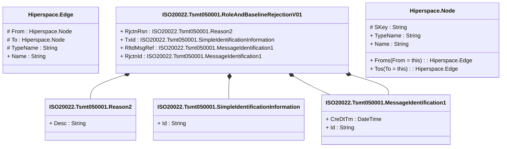

# tsmt.050.001.01

> The tables below contain descriptions of the members of each Element. 
> The first column indicates the type of the member:
> A ‘#’ indicates that the field is a key to the element, and a ‘+’ indicates that the field is a value.
> The ‘*’ column contains a description for the element member.  
> The ‘@’ column contains any properties for the member.
> The ‘=’ column contains calculated values; or in the case of an enum, the serialized value.

---

## View Hiperspace.Edge
edge between nodes

| |Name|Type|*|@|=|
|-|-|-|-|-|-|
|#|From|Hiperspace.Node||||
|#|To|Hiperspace.Node||||
|#|TypeName|String||||
|+|Name|String||||

---

## Type ISO20022.Tsmt050001.Document

| |Name|Type|*|@|=|
|-|-|-|-|-|-|
|+|RoleAndBaselnRjctn|ISO20022.Tsmt050001.RoleAndBaselineRejectionV01||XmlElement()||
||Validation|Some(String)||XmlIgnore(), JsonIgnore()|validation(validElement(RoleAndBaselnRjctn))|

---

## Value ISO20022.Tsmt050001.MessageIdentification1

| |Name|Type|*|@|=|
|-|-|-|-|-|-|
|+|CreDtTm|DateTime||XmlElement()||
|+|Id|String||XmlElement()||
||Validation|Some(String)||XmlIgnore(), JsonIgnore()|""|

---

## Value ISO20022.Tsmt050001.Reason2

| |Name|Type|*|@|=|
|-|-|-|-|-|-|
|+|Desc|String||XmlElement()||
||Validation|Some(String)||XmlIgnore(), JsonIgnore()|""|

---

## Aspect ISO20022.Tsmt050001.RoleAndBaselineRejectionV01

| |Name|Type|*|@|=|
|-|-|-|-|-|-|
|+|RjctnRsn|ISO20022.Tsmt050001.Reason2||XmlElement()||
|+|TxId|ISO20022.Tsmt050001.SimpleIdentificationInformation||XmlElement()||
|+|RltdMsgRef|ISO20022.Tsmt050001.MessageIdentification1||XmlElement()||
|+|RjctnId|ISO20022.Tsmt050001.MessageIdentification1||XmlElement()||
||Validation|Some(String)||XmlIgnore(), JsonIgnore()|validation(validElement(RjctnRsn),validElement(TxId),validElement(RltdMsgRef),validElement(RjctnId))|

---

## Value ISO20022.Tsmt050001.SimpleIdentificationInformation

| |Name|Type|*|@|=|
|-|-|-|-|-|-|
|+|Id|String||XmlElement()||
||Validation|Some(String)||XmlIgnore(), JsonIgnore()|""|

---

## View Hiperspace.Node
node in a graph view of data

| |Name|Type|*|@|=|
|-|-|-|-|-|-|
|#|SKey|String||||
|+|TypeName|String||||
|+|Name|String||||
||Froms|Hiperspace.Edge|||From = this|
||Tos|Hiperspace.Edge|||To = this|

