# tsrv.007.001.01

```mermaid
classDiagram
    class Hiperspace.Edge {
        # From  : Hiperspace.Node
        # To  : Hiperspace.Node
        # TypeName  : String
        + Name  : String
    }
    class ISO20022.Tsrv007001.ActiveCurrencyAndAmount {
        + Value  : Decimal
        + Ccy  : String
    }
    class ISO20022.Tsrv007001.AddressType2Code {
        DLVY = 1
        MLTO = 2
        BIZZ = 3
        HOME = 4
        PBOX = 5
        ADDR = 6
    }
    class ISO20022.Tsrv007001.Amendment1 {
        + AddtlInf  : global::System.Collections.Generic.List~String~
        + NclsdFile  : global::System.Collections.Generic.List~ISO20022.Tsrv007001.Document9~
        + DlvryChanl  : ISO20022.Tsrv007001.CommunicationChannel1
        + BnfcryCnsntReqInd  : String
        + LclUdrtkg  : ISO20022.Tsrv007001.Undertaking11
        + NewUdrtkgTermsAndConds  : global::System.Collections.Generic.List~ISO20022.Tsrv007001.Narrative1~
        + NewBnfcry  : ISO20022.Tsrv007001.PartyIdentification43
        + NewXpryDtls  : ISO20022.Tsrv007001.ExpiryDetails1
        + UdrtkgAmtAdjstmnt  : ISO20022.Tsrv007001.UndertakingAmount2
        + TermntnDtls  : ISO20022.Tsrv007001.UndertakingTermination3
        + ScndAdvsgPty  : ISO20022.Tsrv007001.PartyIdentification43
        + AdvsgPty  : ISO20022.Tsrv007001.PartyIdentification43
        + UdrtkgId  : ISO20022.Tsrv007001.Undertaking7
        + DtOfIssnc  : DateTime
        + SeqNb  : String
    }
    ISO20022.Tsrv007001.Amendment1 *-- ISO20022.Tsrv007001.Document9
    ISO20022.Tsrv007001.Amendment1 *-- ISO20022.Tsrv007001.CommunicationChannel1
    ISO20022.Tsrv007001.Amendment1 *-- ISO20022.Tsrv007001.Undertaking11
    ISO20022.Tsrv007001.Amendment1 *-- ISO20022.Tsrv007001.Narrative1
    ISO20022.Tsrv007001.Amendment1 *-- ISO20022.Tsrv007001.PartyIdentification43
    ISO20022.Tsrv007001.Amendment1 *-- ISO20022.Tsrv007001.ExpiryDetails1
    ISO20022.Tsrv007001.Amendment1 *-- ISO20022.Tsrv007001.UndertakingAmount2
    ISO20022.Tsrv007001.Amendment1 *-- ISO20022.Tsrv007001.UndertakingTermination3
    ISO20022.Tsrv007001.Amendment1 *-- ISO20022.Tsrv007001.PartyIdentification43
    ISO20022.Tsrv007001.Amendment1 *-- ISO20022.Tsrv007001.PartyIdentification43
    ISO20022.Tsrv007001.Amendment1 *-- ISO20022.Tsrv007001.Undertaking7
    class ISO20022.Tsrv007001.Amendment6 {
        + AddtlInf  : global::System.Collections.Generic.List~String~
        + ApplcntRefNb  : String
        + UdrtkgAmdmntMsg  : ISO20022.Tsrv007001.UndertakingAmendmentMessage1
    }
    ISO20022.Tsrv007001.Amendment6 *-- ISO20022.Tsrv007001.UndertakingAmendmentMessage1
    class ISO20022.Tsrv007001.Amount1Choice {
        + DcrAmt  : ISO20022.Tsrv007001.ActiveCurrencyAndAmount
        + IncrAmt  : ISO20022.Tsrv007001.ActiveCurrencyAndAmount
    }
    ISO20022.Tsrv007001.Amount1Choice *-- ISO20022.Tsrv007001.ActiveCurrencyAndAmount
    ISO20022.Tsrv007001.Amount1Choice *-- ISO20022.Tsrv007001.ActiveCurrencyAndAmount
    class ISO20022.Tsrv007001.AutoExtend1Choice {
        + Dt  : DateTime
        + Yrs  : Decimal
        + Mnths  : Decimal
        + Days  : Decimal
    }
    class ISO20022.Tsrv007001.AutoExtension1 {
        + NonXtnsnNtfctn  : global::System.Collections.Generic.List~ISO20022.Tsrv007001.NonExtension1~
        + FnlXpryDt  : DateTime
        + Prd  : ISO20022.Tsrv007001.AutoExtend1Choice
    }
    ISO20022.Tsrv007001.AutoExtension1 *-- ISO20022.Tsrv007001.NonExtension1
    ISO20022.Tsrv007001.AutoExtension1 *-- ISO20022.Tsrv007001.AutoExtend1Choice
    class ISO20022.Tsrv007001.CommunicationChannel1 {
        + DlvrToAdr  : ISO20022.Tsrv007001.PostalAddress6
        + DlvrToNm  : String
        + DlvrToPtyTp  : ISO20022.Tsrv007001.PartyType1Choice
        + Mtd  : String
    }
    ISO20022.Tsrv007001.CommunicationChannel1 *-- ISO20022.Tsrv007001.PostalAddress6
    ISO20022.Tsrv007001.CommunicationChannel1 *-- ISO20022.Tsrv007001.PartyType1Choice
    class ISO20022.Tsrv007001.CommunicationMethod1Choice {
        + Prtry  : ISO20022.Tsrv007001.GenericIdentification1
        + Cd  : String
    }
    ISO20022.Tsrv007001.CommunicationMethod1Choice *-- ISO20022.Tsrv007001.GenericIdentification1
    class ISO20022.Tsrv007001.ContactDetails2 {
        + Othr  : String
        + EmailAdr  : String
        + FaxNb  : String
        + MobNb  : String
        + PhneNb  : String
        + Nm  : String
        + NmPrfx  : String
    }
    class ISO20022.Tsrv007001.DateAndDateTimeChoice {
        + DtTm  : DateTime
        + Dt  : DateTime
    }
    class ISO20022.Tsrv007001.DateAndPlaceOfBirth {
        + CtryOfBirth  : String
        + CityOfBirth  : String
        + PrvcOfBirth  : String
        + BirthDt  : DateTime
    }
    class ISO20022.Tsrv007001.Document9 {
        + DgtlSgntr  : ISO20022.Tsrv007001.PartyAndSignature2
        + Nclsr  : String
        + Frmt  : ISO20022.Tsrv007001.DocumentFormat1Choice
        + Id  : String
        + Tp  : ISO20022.Tsrv007001.UndertakingDocumentType1Choice
    }
    ISO20022.Tsrv007001.Document9 *-- ISO20022.Tsrv007001.PartyAndSignature2
    ISO20022.Tsrv007001.Document9 *-- ISO20022.Tsrv007001.DocumentFormat1Choice
    ISO20022.Tsrv007001.Document9 *-- ISO20022.Tsrv007001.UndertakingDocumentType1Choice
    class ISO20022.Tsrv007001.DocumentFormat1Choice {
        + Prtry  : ISO20022.Tsrv007001.GenericIdentification1
        + Cd  : String
    }
    ISO20022.Tsrv007001.DocumentFormat1Choice *-- ISO20022.Tsrv007001.GenericIdentification1
    class ISO20022.Tsrv007001.ExpiryDetails1 {
        + AddtlXpryInf  : global::System.Collections.Generic.List~String~
        + XpryTerms  : ISO20022.Tsrv007001.ExpiryTerms1
    }
    ISO20022.Tsrv007001.ExpiryDetails1 *-- ISO20022.Tsrv007001.ExpiryTerms1
    class ISO20022.Tsrv007001.ExpiryTerms1 {
        + OpnEnddInd  : String
        + Cond  : String
        + AutoXtnsn  : ISO20022.Tsrv007001.AutoExtension1
        + DtTm  : ISO20022.Tsrv007001.DateAndDateTimeChoice
    }
    ISO20022.Tsrv007001.ExpiryTerms1 *-- ISO20022.Tsrv007001.AutoExtension1
    ISO20022.Tsrv007001.ExpiryTerms1 *-- ISO20022.Tsrv007001.DateAndDateTimeChoice
    class ISO20022.Tsrv007001.GenericIdentification1 {
        + Issr  : String
        + SchmeNm  : String
        + Id  : String
    }
    class ISO20022.Tsrv007001.GenericOrganisationIdentification1 {
        + Issr  : String
        + SchmeNm  : ISO20022.Tsrv007001.OrganisationIdentificationSchemeName1Choice
        + Id  : String
    }
    ISO20022.Tsrv007001.GenericOrganisationIdentification1 *-- ISO20022.Tsrv007001.OrganisationIdentificationSchemeName1Choice
    class ISO20022.Tsrv007001.GenericPersonIdentification1 {
        + Issr  : String
        + SchmeNm  : ISO20022.Tsrv007001.PersonIdentificationSchemeName1Choice
        + Id  : String
    }
    ISO20022.Tsrv007001.GenericPersonIdentification1 *-- ISO20022.Tsrv007001.PersonIdentificationSchemeName1Choice
    class ISO20022.Tsrv007001.NamePrefix1Code {
        MADM = 1
        MISS = 2
        MIST = 3
        DOCT = 4
    }
    class ISO20022.Tsrv007001.Narrative1 {
        + Txt  : global::System.Collections.Generic.List~String~
        + Tp  : ISO20022.Tsrv007001.NarrativeType1Choice
    }
    ISO20022.Tsrv007001.Narrative1 *-- ISO20022.Tsrv007001.NarrativeType1Choice
    class ISO20022.Tsrv007001.NarrativeType1Choice {
        + Prtry  : ISO20022.Tsrv007001.GenericIdentification1
        + Cd  : String
    }
    ISO20022.Tsrv007001.NarrativeType1Choice *-- ISO20022.Tsrv007001.GenericIdentification1
    class ISO20022.Tsrv007001.NonExtension1 {
        + NtfctnRcptAdr  : ISO20022.Tsrv007001.PostalAddress6
        + NtfctnRcptNm  : String
        + NtfctnRcptTp  : ISO20022.Tsrv007001.PartyType1Choice
        + NtfctnMtd  : ISO20022.Tsrv007001.CommunicationMethod1Choice
        + NtfctnPrd  : Decimal
    }
    ISO20022.Tsrv007001.NonExtension1 *-- ISO20022.Tsrv007001.PostalAddress6
    ISO20022.Tsrv007001.NonExtension1 *-- ISO20022.Tsrv007001.PartyType1Choice
    ISO20022.Tsrv007001.NonExtension1 *-- ISO20022.Tsrv007001.CommunicationMethod1Choice
    class ISO20022.Tsrv007001.OrganisationIdentification8 {
        + Othr  : global::System.Collections.Generic.List~ISO20022.Tsrv007001.GenericOrganisationIdentification1~
        + AnyBIC  : String
    }
    ISO20022.Tsrv007001.OrganisationIdentification8 *-- ISO20022.Tsrv007001.GenericOrganisationIdentification1
    class ISO20022.Tsrv007001.OrganisationIdentificationSchemeName1Choice {
        + Prtry  : String
        + Cd  : String
    }
    class ISO20022.Tsrv007001.Party11Choice {
        + PrvtId  : ISO20022.Tsrv007001.PersonIdentification5
        + OrgId  : ISO20022.Tsrv007001.OrganisationIdentification8
    }
    ISO20022.Tsrv007001.Party11Choice *-- ISO20022.Tsrv007001.PersonIdentification5
    ISO20022.Tsrv007001.Party11Choice *-- ISO20022.Tsrv007001.OrganisationIdentification8
    class ISO20022.Tsrv007001.PartyAndSignature2 {
        + Sgntr  : ISO20022.Tsrv007001.ProprietaryData3
        + Pty  : ISO20022.Tsrv007001.PartyIdentification43
    }
    ISO20022.Tsrv007001.PartyAndSignature2 *-- ISO20022.Tsrv007001.ProprietaryData3
    ISO20022.Tsrv007001.PartyAndSignature2 *-- ISO20022.Tsrv007001.PartyIdentification43
    class ISO20022.Tsrv007001.PartyIdentification43 {
        + CtctDtls  : ISO20022.Tsrv007001.ContactDetails2
        + CtryOfRes  : String
        + Id  : ISO20022.Tsrv007001.Party11Choice
        + PstlAdr  : ISO20022.Tsrv007001.PostalAddress6
        + Nm  : String
    }
    ISO20022.Tsrv007001.PartyIdentification43 *-- ISO20022.Tsrv007001.ContactDetails2
    ISO20022.Tsrv007001.PartyIdentification43 *-- ISO20022.Tsrv007001.Party11Choice
    ISO20022.Tsrv007001.PartyIdentification43 *-- ISO20022.Tsrv007001.PostalAddress6
    class ISO20022.Tsrv007001.PartyType1Choice {
        + Prtry  : ISO20022.Tsrv007001.GenericIdentification1
        + Cd  : String
    }
    ISO20022.Tsrv007001.PartyType1Choice *-- ISO20022.Tsrv007001.GenericIdentification1
    class ISO20022.Tsrv007001.PersonIdentification5 {
        + Othr  : global::System.Collections.Generic.List~ISO20022.Tsrv007001.GenericPersonIdentification1~
        + DtAndPlcOfBirth  : ISO20022.Tsrv007001.DateAndPlaceOfBirth
    }
    ISO20022.Tsrv007001.PersonIdentification5 *-- ISO20022.Tsrv007001.GenericPersonIdentification1
    ISO20022.Tsrv007001.PersonIdentification5 *-- ISO20022.Tsrv007001.DateAndPlaceOfBirth
    class ISO20022.Tsrv007001.PersonIdentificationSchemeName1Choice {
        + Prtry  : String
        + Cd  : String
    }
    class ISO20022.Tsrv007001.PostalAddress6 {
        + AdrLine  : global::System.Collections.Generic.List~String~
        + Ctry  : String
        + CtrySubDvsn  : String
        + TwnNm  : String
        + PstCd  : String
        + BldgNb  : String
        + StrtNm  : String
        + SubDept  : String
        + Dept  : String
        + AdrTp  : String
    }
    class ISO20022.Tsrv007001.ProprietaryData3 {
    }
    class ISO20022.Tsrv007001.TerminationReason1Choice {
        + Prtry  : ISO20022.Tsrv007001.GenericIdentification1
        + Cd  : String
    }
    ISO20022.Tsrv007001.TerminationReason1Choice *-- ISO20022.Tsrv007001.GenericIdentification1
    class ISO20022.Tsrv007001.TerminationReason1Code {
        WOEX = 1
        BUFI = 2
        NOAC = 3
        REFU = 4
    }
    class ISO20022.Tsrv007001.Undertaking11 {
        + DlvryChanl  : ISO20022.Tsrv007001.CommunicationChannel1
        + NewUdrtkgTermsAndConds  : ISO20022.Tsrv007001.Narrative1
        + NewBnfcry  : ISO20022.Tsrv007001.PartyIdentification43
        + NewXpryDtls  : ISO20022.Tsrv007001.ExpiryDetails1
        + NewUdrtkgAmt  : ISO20022.Tsrv007001.UndertakingAmount2
    }
    ISO20022.Tsrv007001.Undertaking11 *-- ISO20022.Tsrv007001.CommunicationChannel1
    ISO20022.Tsrv007001.Undertaking11 *-- ISO20022.Tsrv007001.Narrative1
    ISO20022.Tsrv007001.Undertaking11 *-- ISO20022.Tsrv007001.PartyIdentification43
    ISO20022.Tsrv007001.Undertaking11 *-- ISO20022.Tsrv007001.ExpiryDetails1
    ISO20022.Tsrv007001.Undertaking11 *-- ISO20022.Tsrv007001.UndertakingAmount2
    class ISO20022.Tsrv007001.Undertaking7 {
        + Issr  : ISO20022.Tsrv007001.PartyIdentification43
        + Id  : String
    }
    ISO20022.Tsrv007001.Undertaking7 *-- ISO20022.Tsrv007001.PartyIdentification43
    class ISO20022.Tsrv007001.UndertakingAmendmentMessage1 {
        + DgtlSgntr  : ISO20022.Tsrv007001.PartyAndSignature2
        + UdrtkgAmdmntDtls  : ISO20022.Tsrv007001.Amendment1
    }
    ISO20022.Tsrv007001.UndertakingAmendmentMessage1 *-- ISO20022.Tsrv007001.PartyAndSignature2
    ISO20022.Tsrv007001.UndertakingAmendmentMessage1 *-- ISO20022.Tsrv007001.Amendment1
    class ISO20022.Tsrv007001.UndertakingAmendmentNotificationV01 {
        + DgtlSgntr  : ISO20022.Tsrv007001.PartyAndSignature2
        + UdrtkgAmdmntNtfctnDtls  : ISO20022.Tsrv007001.Amendment6
    }
    ISO20022.Tsrv007001.UndertakingAmendmentNotificationV01 *-- ISO20022.Tsrv007001.PartyAndSignature2
    ISO20022.Tsrv007001.UndertakingAmendmentNotificationV01 *-- ISO20022.Tsrv007001.Amendment6
    class ISO20022.Tsrv007001.UndertakingAmount2 {
        + AddtlInf  : global::System.Collections.Generic.List~String~
        + AmtChc  : ISO20022.Tsrv007001.Amount1Choice
    }
    ISO20022.Tsrv007001.UndertakingAmount2 *-- ISO20022.Tsrv007001.Amount1Choice
    class ISO20022.Tsrv007001.UndertakingDocumentType1Choice {
        + Prtry  : ISO20022.Tsrv007001.GenericIdentification1
        + Cd  : String
    }
    ISO20022.Tsrv007001.UndertakingDocumentType1Choice *-- ISO20022.Tsrv007001.GenericIdentification1
    class ISO20022.Tsrv007001.UndertakingTermination3 {
        + AddtlInf  : global::System.Collections.Generic.List~String~
        + Rsn  : ISO20022.Tsrv007001.TerminationReason1Choice
        + FctvDt  : DateTime
    }
    ISO20022.Tsrv007001.UndertakingTermination3 *-- ISO20022.Tsrv007001.TerminationReason1Choice
    class Hiperspace.Node {
        # SKey  : String
        + TypeName  : String
        + Name  : String
        + Froms (From = this) : Hiperspace.Edge
        + Tos (To = this) : Hiperspace.Edge
    }
```

> The tables below contain descriptions of the members of each Element. 
> The first column indicates the type of the member:
> A ‘#’ indicates that the field is a key to the element, and a ‘+’ indicates that the field is a value.
> The ‘*’ column contains a description for the element member.  
> The ‘@’ column contains any properties for the member.
> The ‘=’ column contains calculated values; or in the case of an enum, the serialized value.

---

## View Hiperspace.Edge
edge between nodes

| |Name|Type|*|@|=|
|-|-|-|-|-|-|
|#|From|Hiperspace.Node||||
|#|To|Hiperspace.Node||||
|#|TypeName|String||||
|+|Name|String||||

---

## Value ISO20022.Tsrv007001.ActiveCurrencyAndAmount

| |Name|Type|*|@|=|
|-|-|-|-|-|-|
|+|Value|Decimal||XmlElement()||
|+|Ccy|String||XmlAttribute()||
||Validation|Some(String)||XmlIgnore(), JsonIgnore()|validation(validRequired("""Value""",Value),validRequired("""Ccy""",Ccy),validPattern("""Ccy""",Ccy,"""[A-Z]{3,3}"""))|

---

## Enum ISO20022.Tsrv007001.AddressType2Code

| |Name|Type|*|@|=|
|-|-|-|-|-|-|
||DLVY|Int32||XmlEnum("""DLVY""")|1|
||MLTO|Int32||XmlEnum("""MLTO""")|2|
||BIZZ|Int32||XmlEnum("""BIZZ""")|3|
||HOME|Int32||XmlEnum("""HOME""")|4|
||PBOX|Int32||XmlEnum("""PBOX""")|5|
||ADDR|Int32||XmlEnum("""ADDR""")|6|

---

## Value ISO20022.Tsrv007001.Amendment1

| |Name|Type|*|@|=|
|-|-|-|-|-|-|
|+|AddtlInf|global::System.Collections.Generic.List<String>||XmlElement()||
|+|NclsdFile|global::System.Collections.Generic.List<ISO20022.Tsrv007001.Document9>||XmlElement()||
|+|DlvryChanl|ISO20022.Tsrv007001.CommunicationChannel1||XmlElement()||
|+|BnfcryCnsntReqInd|String||XmlElement()||
|+|LclUdrtkg|ISO20022.Tsrv007001.Undertaking11||XmlElement()||
|+|NewUdrtkgTermsAndConds|global::System.Collections.Generic.List<ISO20022.Tsrv007001.Narrative1>||XmlElement()||
|+|NewBnfcry|ISO20022.Tsrv007001.PartyIdentification43||XmlElement()||
|+|NewXpryDtls|ISO20022.Tsrv007001.ExpiryDetails1||XmlElement()||
|+|UdrtkgAmtAdjstmnt|ISO20022.Tsrv007001.UndertakingAmount2||XmlElement()||
|+|TermntnDtls|ISO20022.Tsrv007001.UndertakingTermination3||XmlElement()||
|+|ScndAdvsgPty|ISO20022.Tsrv007001.PartyIdentification43||XmlElement()||
|+|AdvsgPty|ISO20022.Tsrv007001.PartyIdentification43||XmlElement()||
|+|UdrtkgId|ISO20022.Tsrv007001.Undertaking7||XmlElement()||
|+|DtOfIssnc|DateTime||XmlElement()||
|+|SeqNb|String||XmlElement()||
||Validation|Some(String)||XmlIgnore(), JsonIgnore()|validation(validListMax("""AddtlInf""",AddtlInf,5),validList("""NclsdFile""",NclsdFile),validElement(NclsdFile),validElement(DlvryChanl),validElement(LclUdrtkg),validList("""NewUdrtkgTermsAndConds""",NewUdrtkgTermsAndConds),validElement(NewUdrtkgTermsAndConds),validElement(NewBnfcry),validElement(NewXpryDtls),validElement(UdrtkgAmtAdjstmnt),validElement(TermntnDtls),validElement(ScndAdvsgPty),validElement(AdvsgPty),validElement(UdrtkgId),validPattern("""SeqNb""",SeqNb,"""[a-zA-Z0-9]{1,4}"""))|

---

## Value ISO20022.Tsrv007001.Amendment6

| |Name|Type|*|@|=|
|-|-|-|-|-|-|
|+|AddtlInf|global::System.Collections.Generic.List<String>||XmlElement()||
|+|ApplcntRefNb|String||XmlElement()||
|+|UdrtkgAmdmntMsg|ISO20022.Tsrv007001.UndertakingAmendmentMessage1||XmlElement()||
||Validation|Some(String)||XmlIgnore(), JsonIgnore()|validation(validListMax("""AddtlInf""",AddtlInf,5),validElement(UdrtkgAmdmntMsg))|

---

## Value ISO20022.Tsrv007001.Amount1Choice

| |Name|Type|*|@|=|
|-|-|-|-|-|-|
|+|DcrAmt|ISO20022.Tsrv007001.ActiveCurrencyAndAmount||XmlElement()||
|+|IncrAmt|ISO20022.Tsrv007001.ActiveCurrencyAndAmount||XmlElement()||
||Validation|Some(String)||XmlIgnore(), JsonIgnore()|validation(validElement(DcrAmt),validElement(IncrAmt),validChoice(DcrAmt,IncrAmt))|

---

## Value ISO20022.Tsrv007001.AutoExtend1Choice

| |Name|Type|*|@|=|
|-|-|-|-|-|-|
|+|Dt|DateTime||XmlElement()||
|+|Yrs|Decimal||XmlElement()||
|+|Mnths|Decimal||XmlElement()||
|+|Days|Decimal||XmlElement()||
||Validation|Some(String)||XmlIgnore(), JsonIgnore()|validation(validChoice(Dt,Yrs,Mnths,Days))|

---

## Value ISO20022.Tsrv007001.AutoExtension1

| |Name|Type|*|@|=|
|-|-|-|-|-|-|
|+|NonXtnsnNtfctn|global::System.Collections.Generic.List<ISO20022.Tsrv007001.NonExtension1>||XmlElement()||
|+|FnlXpryDt|DateTime||XmlElement()||
|+|Prd|ISO20022.Tsrv007001.AutoExtend1Choice||XmlElement()||
||Validation|Some(String)||XmlIgnore(), JsonIgnore()|validation(validList("""NonXtnsnNtfctn""",NonXtnsnNtfctn),validElement(NonXtnsnNtfctn),validElement(Prd))|

---

## Value ISO20022.Tsrv007001.CommunicationChannel1

| |Name|Type|*|@|=|
|-|-|-|-|-|-|
|+|DlvrToAdr|ISO20022.Tsrv007001.PostalAddress6||XmlElement()||
|+|DlvrToNm|String||XmlElement()||
|+|DlvrToPtyTp|ISO20022.Tsrv007001.PartyType1Choice||XmlElement()||
|+|Mtd|String||XmlElement()||
||Validation|Some(String)||XmlIgnore(), JsonIgnore()|validation(validElement(DlvrToAdr),validElement(DlvrToPtyTp))|

---

## Value ISO20022.Tsrv007001.CommunicationMethod1Choice

| |Name|Type|*|@|=|
|-|-|-|-|-|-|
|+|Prtry|ISO20022.Tsrv007001.GenericIdentification1||XmlElement()||
|+|Cd|String||XmlElement()||
||Validation|Some(String)||XmlIgnore(), JsonIgnore()|validation(validElement(Prtry),validChoice(Prtry,Cd))|

---

## Value ISO20022.Tsrv007001.ContactDetails2

| |Name|Type|*|@|=|
|-|-|-|-|-|-|
|+|Othr|String||XmlElement()||
|+|EmailAdr|String||XmlElement()||
|+|FaxNb|String||XmlElement()||
|+|MobNb|String||XmlElement()||
|+|PhneNb|String||XmlElement()||
|+|Nm|String||XmlElement()||
|+|NmPrfx|String||XmlElement()||
||Validation|Some(String)||XmlIgnore(), JsonIgnore()|validation(validPattern("""FaxNb""",FaxNb,"""\+[0-9]{1,3}-[0-9()+\-]{1,30}"""),validPattern("""MobNb""",MobNb,"""\+[0-9]{1,3}-[0-9()+\-]{1,30}"""),validPattern("""PhneNb""",PhneNb,"""\+[0-9]{1,3}-[0-9()+\-]{1,30}"""))|

---

## Value ISO20022.Tsrv007001.DateAndDateTimeChoice

| |Name|Type|*|@|=|
|-|-|-|-|-|-|
|+|DtTm|DateTime||XmlElement()||
|+|Dt|DateTime||XmlElement()||
||Validation|Some(String)||XmlIgnore(), JsonIgnore()|validation(validChoice(DtTm,Dt))|

---

## Value ISO20022.Tsrv007001.DateAndPlaceOfBirth

| |Name|Type|*|@|=|
|-|-|-|-|-|-|
|+|CtryOfBirth|String||XmlElement()||
|+|CityOfBirth|String||XmlElement()||
|+|PrvcOfBirth|String||XmlElement()||
|+|BirthDt|DateTime||XmlElement()||
||Validation|Some(String)||XmlIgnore(), JsonIgnore()|validation(validPattern("""CtryOfBirth""",CtryOfBirth,"""[A-Z]{2,2}"""))|

---

## Type ISO20022.Tsrv007001.Document

| |Name|Type|*|@|=|
|-|-|-|-|-|-|
|+|UdrtkgAmdmntNtfctn|ISO20022.Tsrv007001.UndertakingAmendmentNotificationV01||XmlElement()||
||Validation|Some(String)||XmlIgnore(), JsonIgnore()|validation(validElement(UdrtkgAmdmntNtfctn))|

---

## Value ISO20022.Tsrv007001.Document9

| |Name|Type|*|@|=|
|-|-|-|-|-|-|
|+|DgtlSgntr|ISO20022.Tsrv007001.PartyAndSignature2||XmlElement()||
|+|Nclsr|String||XmlElement()||
|+|Frmt|ISO20022.Tsrv007001.DocumentFormat1Choice||XmlElement()||
|+|Id|String||XmlElement()||
|+|Tp|ISO20022.Tsrv007001.UndertakingDocumentType1Choice||XmlElement()||
||Validation|Some(String)||XmlIgnore(), JsonIgnore()|validation(validElement(DgtlSgntr),validElement(Frmt),validElement(Tp))|

---

## Value ISO20022.Tsrv007001.DocumentFormat1Choice

| |Name|Type|*|@|=|
|-|-|-|-|-|-|
|+|Prtry|ISO20022.Tsrv007001.GenericIdentification1||XmlElement()||
|+|Cd|String||XmlElement()||
||Validation|Some(String)||XmlIgnore(), JsonIgnore()|validation(validElement(Prtry),validChoice(Prtry,Cd))|

---

## Value ISO20022.Tsrv007001.ExpiryDetails1

| |Name|Type|*|@|=|
|-|-|-|-|-|-|
|+|AddtlXpryInf|global::System.Collections.Generic.List<String>||XmlElement()||
|+|XpryTerms|ISO20022.Tsrv007001.ExpiryTerms1||XmlElement()||
||Validation|Some(String)||XmlIgnore(), JsonIgnore()|validation(validListMax("""AddtlXpryInf""",AddtlXpryInf,5),validElement(XpryTerms))|

---

## Value ISO20022.Tsrv007001.ExpiryTerms1

| |Name|Type|*|@|=|
|-|-|-|-|-|-|
|+|OpnEnddInd|String||XmlElement()||
|+|Cond|String||XmlElement()||
|+|AutoXtnsn|ISO20022.Tsrv007001.AutoExtension1||XmlElement()||
|+|DtTm|ISO20022.Tsrv007001.DateAndDateTimeChoice||XmlElement()||
||Validation|Some(String)||XmlIgnore(), JsonIgnore()|validation(validElement(AutoXtnsn),validElement(DtTm))|

---

## Value ISO20022.Tsrv007001.GenericIdentification1

| |Name|Type|*|@|=|
|-|-|-|-|-|-|
|+|Issr|String||XmlElement()||
|+|SchmeNm|String||XmlElement()||
|+|Id|String||XmlElement()||
||Validation|Some(String)||XmlIgnore(), JsonIgnore()|""|

---

## Value ISO20022.Tsrv007001.GenericOrganisationIdentification1

| |Name|Type|*|@|=|
|-|-|-|-|-|-|
|+|Issr|String||XmlElement()||
|+|SchmeNm|ISO20022.Tsrv007001.OrganisationIdentificationSchemeName1Choice||XmlElement()||
|+|Id|String||XmlElement()||
||Validation|Some(String)||XmlIgnore(), JsonIgnore()|validation(validElement(SchmeNm))|

---

## Value ISO20022.Tsrv007001.GenericPersonIdentification1

| |Name|Type|*|@|=|
|-|-|-|-|-|-|
|+|Issr|String||XmlElement()||
|+|SchmeNm|ISO20022.Tsrv007001.PersonIdentificationSchemeName1Choice||XmlElement()||
|+|Id|String||XmlElement()||
||Validation|Some(String)||XmlIgnore(), JsonIgnore()|validation(validElement(SchmeNm))|

---

## Enum ISO20022.Tsrv007001.NamePrefix1Code

| |Name|Type|*|@|=|
|-|-|-|-|-|-|
||MADM|Int32||XmlEnum("""MADM""")|1|
||MISS|Int32||XmlEnum("""MISS""")|2|
||MIST|Int32||XmlEnum("""MIST""")|3|
||DOCT|Int32||XmlEnum("""DOCT""")|4|

---

## Value ISO20022.Tsrv007001.Narrative1

| |Name|Type|*|@|=|
|-|-|-|-|-|-|
|+|Txt|global::System.Collections.Generic.List<String>||XmlElement()||
|+|Tp|ISO20022.Tsrv007001.NarrativeType1Choice||XmlElement()||
||Validation|Some(String)||XmlIgnore(), JsonIgnore()|validation(validRequired("""Txt""",Txt),validListMax("""Txt""",Txt,5),validElement(Tp))|

---

## Value ISO20022.Tsrv007001.NarrativeType1Choice

| |Name|Type|*|@|=|
|-|-|-|-|-|-|
|+|Prtry|ISO20022.Tsrv007001.GenericIdentification1||XmlElement()||
|+|Cd|String||XmlElement()||
||Validation|Some(String)||XmlIgnore(), JsonIgnore()|validation(validElement(Prtry),validChoice(Prtry,Cd))|

---

## Value ISO20022.Tsrv007001.NonExtension1

| |Name|Type|*|@|=|
|-|-|-|-|-|-|
|+|NtfctnRcptAdr|ISO20022.Tsrv007001.PostalAddress6||XmlElement()||
|+|NtfctnRcptNm|String||XmlElement()||
|+|NtfctnRcptTp|ISO20022.Tsrv007001.PartyType1Choice||XmlElement()||
|+|NtfctnMtd|ISO20022.Tsrv007001.CommunicationMethod1Choice||XmlElement()||
|+|NtfctnPrd|Decimal||XmlElement()||
||Validation|Some(String)||XmlIgnore(), JsonIgnore()|validation(validElement(NtfctnRcptAdr),validElement(NtfctnRcptTp),validElement(NtfctnMtd))|

---

## Value ISO20022.Tsrv007001.OrganisationIdentification8

| |Name|Type|*|@|=|
|-|-|-|-|-|-|
|+|Othr|global::System.Collections.Generic.List<ISO20022.Tsrv007001.GenericOrganisationIdentification1>||XmlElement()||
|+|AnyBIC|String||XmlElement()||
||Validation|Some(String)||XmlIgnore(), JsonIgnore()|validation(validList("""Othr""",Othr),validElement(Othr),validPattern("""AnyBIC""",AnyBIC,"""[A-Z]{6,6}[A-Z2-9][A-NP-Z0-9]([A-Z0-9]{3,3}){0,1}"""))|

---

## Value ISO20022.Tsrv007001.OrganisationIdentificationSchemeName1Choice

| |Name|Type|*|@|=|
|-|-|-|-|-|-|
|+|Prtry|String||XmlElement()||
|+|Cd|String||XmlElement()||
||Validation|Some(String)||XmlIgnore(), JsonIgnore()|validation(validChoice(Prtry,Cd))|

---

## Value ISO20022.Tsrv007001.Party11Choice

| |Name|Type|*|@|=|
|-|-|-|-|-|-|
|+|PrvtId|ISO20022.Tsrv007001.PersonIdentification5||XmlElement()||
|+|OrgId|ISO20022.Tsrv007001.OrganisationIdentification8||XmlElement()||
||Validation|Some(String)||XmlIgnore(), JsonIgnore()|validation(validElement(PrvtId),validElement(OrgId),validChoice(PrvtId,OrgId))|

---

## Value ISO20022.Tsrv007001.PartyAndSignature2

| |Name|Type|*|@|=|
|-|-|-|-|-|-|
|+|Sgntr|ISO20022.Tsrv007001.ProprietaryData3||XmlElement()||
|+|Pty|ISO20022.Tsrv007001.PartyIdentification43||XmlElement()||
||Validation|Some(String)||XmlIgnore(), JsonIgnore()|validation(validElement(Sgntr),validElement(Pty))|

---

## Value ISO20022.Tsrv007001.PartyIdentification43

| |Name|Type|*|@|=|
|-|-|-|-|-|-|
|+|CtctDtls|ISO20022.Tsrv007001.ContactDetails2||XmlElement()||
|+|CtryOfRes|String||XmlElement()||
|+|Id|ISO20022.Tsrv007001.Party11Choice||XmlElement()||
|+|PstlAdr|ISO20022.Tsrv007001.PostalAddress6||XmlElement()||
|+|Nm|String||XmlElement()||
||Validation|Some(String)||XmlIgnore(), JsonIgnore()|validation(validElement(CtctDtls),validPattern("""CtryOfRes""",CtryOfRes,"""[A-Z]{2,2}"""),validElement(Id),validElement(PstlAdr))|

---

## Value ISO20022.Tsrv007001.PartyType1Choice

| |Name|Type|*|@|=|
|-|-|-|-|-|-|
|+|Prtry|ISO20022.Tsrv007001.GenericIdentification1||XmlElement()||
|+|Cd|String||XmlElement()||
||Validation|Some(String)||XmlIgnore(), JsonIgnore()|validation(validElement(Prtry),validChoice(Prtry,Cd))|

---

## Value ISO20022.Tsrv007001.PersonIdentification5

| |Name|Type|*|@|=|
|-|-|-|-|-|-|
|+|Othr|global::System.Collections.Generic.List<ISO20022.Tsrv007001.GenericPersonIdentification1>||XmlElement()||
|+|DtAndPlcOfBirth|ISO20022.Tsrv007001.DateAndPlaceOfBirth||XmlElement()||
||Validation|Some(String)||XmlIgnore(), JsonIgnore()|validation(validList("""Othr""",Othr),validElement(Othr),validElement(DtAndPlcOfBirth))|

---

## Value ISO20022.Tsrv007001.PersonIdentificationSchemeName1Choice

| |Name|Type|*|@|=|
|-|-|-|-|-|-|
|+|Prtry|String||XmlElement()||
|+|Cd|String||XmlElement()||
||Validation|Some(String)||XmlIgnore(), JsonIgnore()|validation(validChoice(Prtry,Cd))|

---

## Value ISO20022.Tsrv007001.PostalAddress6

| |Name|Type|*|@|=|
|-|-|-|-|-|-|
|+|AdrLine|global::System.Collections.Generic.List<String>||XmlElement()||
|+|Ctry|String||XmlElement()||
|+|CtrySubDvsn|String||XmlElement()||
|+|TwnNm|String||XmlElement()||
|+|PstCd|String||XmlElement()||
|+|BldgNb|String||XmlElement()||
|+|StrtNm|String||XmlElement()||
|+|SubDept|String||XmlElement()||
|+|Dept|String||XmlElement()||
|+|AdrTp|String||XmlElement()||
||Validation|Some(String)||XmlIgnore(), JsonIgnore()|validation(validListMax("""AdrLine""",AdrLine,7),validPattern("""Ctry""",Ctry,"""[A-Z]{2,2}"""))|

---

## Value ISO20022.Tsrv007001.ProprietaryData3

| |Name|Type|*|@|=|
|-|-|-|-|-|-|
||Validation|Some(String)||XmlIgnore(), JsonIgnore()|""|

---

## Value ISO20022.Tsrv007001.TerminationReason1Choice

| |Name|Type|*|@|=|
|-|-|-|-|-|-|
|+|Prtry|ISO20022.Tsrv007001.GenericIdentification1||XmlElement()||
|+|Cd|String||XmlElement()||
||Validation|Some(String)||XmlIgnore(), JsonIgnore()|validation(validElement(Prtry),validChoice(Prtry,Cd))|

---

## Enum ISO20022.Tsrv007001.TerminationReason1Code

| |Name|Type|*|@|=|
|-|-|-|-|-|-|
||WOEX|Int32||XmlEnum("""WOEX""")|1|
||BUFI|Int32||XmlEnum("""BUFI""")|2|
||NOAC|Int32||XmlEnum("""NOAC""")|3|
||REFU|Int32||XmlEnum("""REFU""")|4|

---

## Value ISO20022.Tsrv007001.Undertaking11

| |Name|Type|*|@|=|
|-|-|-|-|-|-|
|+|DlvryChanl|ISO20022.Tsrv007001.CommunicationChannel1||XmlElement()||
|+|NewUdrtkgTermsAndConds|ISO20022.Tsrv007001.Narrative1||XmlElement()||
|+|NewBnfcry|ISO20022.Tsrv007001.PartyIdentification43||XmlElement()||
|+|NewXpryDtls|ISO20022.Tsrv007001.ExpiryDetails1||XmlElement()||
|+|NewUdrtkgAmt|ISO20022.Tsrv007001.UndertakingAmount2||XmlElement()||
||Validation|Some(String)||XmlIgnore(), JsonIgnore()|validation(validElement(DlvryChanl),validElement(NewUdrtkgTermsAndConds),validElement(NewBnfcry),validElement(NewXpryDtls),validElement(NewUdrtkgAmt))|

---

## Value ISO20022.Tsrv007001.Undertaking7

| |Name|Type|*|@|=|
|-|-|-|-|-|-|
|+|Issr|ISO20022.Tsrv007001.PartyIdentification43||XmlElement()||
|+|Id|String||XmlElement()||
||Validation|Some(String)||XmlIgnore(), JsonIgnore()|validation(validElement(Issr))|

---

## Value ISO20022.Tsrv007001.UndertakingAmendmentMessage1

| |Name|Type|*|@|=|
|-|-|-|-|-|-|
|+|DgtlSgntr|ISO20022.Tsrv007001.PartyAndSignature2||XmlElement()||
|+|UdrtkgAmdmntDtls|ISO20022.Tsrv007001.Amendment1||XmlElement()||
||Validation|Some(String)||XmlIgnore(), JsonIgnore()|validation(validElement(DgtlSgntr),validElement(UdrtkgAmdmntDtls))|

---

## Aspect ISO20022.Tsrv007001.UndertakingAmendmentNotificationV01

| |Name|Type|*|@|=|
|-|-|-|-|-|-|
|+|DgtlSgntr|ISO20022.Tsrv007001.PartyAndSignature2||XmlElement()||
|+|UdrtkgAmdmntNtfctnDtls|ISO20022.Tsrv007001.Amendment6||XmlElement()||
||Validation|Some(String)||XmlIgnore(), JsonIgnore()|validation(validElement(DgtlSgntr),validElement(UdrtkgAmdmntNtfctnDtls))|

---

## Value ISO20022.Tsrv007001.UndertakingAmount2

| |Name|Type|*|@|=|
|-|-|-|-|-|-|
|+|AddtlInf|global::System.Collections.Generic.List<String>||XmlElement()||
|+|AmtChc|ISO20022.Tsrv007001.Amount1Choice||XmlElement()||
||Validation|Some(String)||XmlIgnore(), JsonIgnore()|validation(validListMax("""AddtlInf""",AddtlInf,5),validElement(AmtChc))|

---

## Value ISO20022.Tsrv007001.UndertakingDocumentType1Choice

| |Name|Type|*|@|=|
|-|-|-|-|-|-|
|+|Prtry|ISO20022.Tsrv007001.GenericIdentification1||XmlElement()||
|+|Cd|String||XmlElement()||
||Validation|Some(String)||XmlIgnore(), JsonIgnore()|validation(validElement(Prtry),validChoice(Prtry,Cd))|

---

## Value ISO20022.Tsrv007001.UndertakingTermination3

| |Name|Type|*|@|=|
|-|-|-|-|-|-|
|+|AddtlInf|global::System.Collections.Generic.List<String>||XmlElement()||
|+|Rsn|ISO20022.Tsrv007001.TerminationReason1Choice||XmlElement()||
|+|FctvDt|DateTime||XmlElement()||
||Validation|Some(String)||XmlIgnore(), JsonIgnore()|validation(validListMax("""AddtlInf""",AddtlInf,5),validElement(Rsn))|

---

## View Hiperspace.Node
node in a graph view of data

| |Name|Type|*|@|=|
|-|-|-|-|-|-|
|#|SKey|String||||
|+|TypeName|String||||
|+|Name|String||||
||Froms|Hiperspace.Edge|||From = this|
||Tos|Hiperspace.Edge|||To = this|

