# tsrv.013.001.01

```mermaid
classDiagram
    class Hiperspace.Edge {
        # From  : Hiperspace.Node
        # To  : Hiperspace.Node
        # TypeName  : String
        + Name  : String
    }
    class ISO20022.Tsrv013001.AccountIdentification4Choice {
        + Othr  : ISO20022.Tsrv013001.GenericAccountIdentification1
        + IBAN  : String
    }
    ISO20022.Tsrv013001.AccountIdentification4Choice *-- ISO20022.Tsrv013001.GenericAccountIdentification1
    class ISO20022.Tsrv013001.AccountSchemeName1Choice {
        + Prtry  : String
        + Cd  : String
    }
    class ISO20022.Tsrv013001.ActiveCurrencyAndAmount {
        + Value  : Decimal
        + Ccy  : String
    }
    class ISO20022.Tsrv013001.AddressType2Code {
        DLVY = 1
        MLTO = 2
        BIZZ = 3
        HOME = 4
        PBOX = 5
        ADDR = 6
    }
    class ISO20022.Tsrv013001.BranchAndFinancialInstitutionIdentification5 {
        + BrnchId  : ISO20022.Tsrv013001.BranchData2
        + FinInstnId  : ISO20022.Tsrv013001.FinancialInstitutionIdentification8
    }
    ISO20022.Tsrv013001.BranchAndFinancialInstitutionIdentification5 *-- ISO20022.Tsrv013001.BranchData2
    ISO20022.Tsrv013001.BranchAndFinancialInstitutionIdentification5 *-- ISO20022.Tsrv013001.FinancialInstitutionIdentification8
    class ISO20022.Tsrv013001.BranchData2 {
        + PstlAdr  : ISO20022.Tsrv013001.PostalAddress6
        + Nm  : String
        + Id  : String
    }
    ISO20022.Tsrv013001.BranchData2 *-- ISO20022.Tsrv013001.PostalAddress6
    class ISO20022.Tsrv013001.CashAccount27 {
        + Svcr  : ISO20022.Tsrv013001.BranchAndFinancialInstitutionIdentification5
        + Ownr  : ISO20022.Tsrv013001.PartyIdentification41
        + Nm  : String
        + Ccy  : String
        + Tp  : ISO20022.Tsrv013001.CashAccountType2
        + Id  : ISO20022.Tsrv013001.AccountIdentification4Choice
    }
    ISO20022.Tsrv013001.CashAccount27 *-- ISO20022.Tsrv013001.BranchAndFinancialInstitutionIdentification5
    ISO20022.Tsrv013001.CashAccount27 *-- ISO20022.Tsrv013001.PartyIdentification41
    ISO20022.Tsrv013001.CashAccount27 *-- ISO20022.Tsrv013001.CashAccountType2
    ISO20022.Tsrv013001.CashAccount27 *-- ISO20022.Tsrv013001.AccountIdentification4Choice
    class ISO20022.Tsrv013001.CashAccountType2 {
        + Prtry  : String
        + Cd  : String
    }
    class ISO20022.Tsrv013001.CashAccountType4Code {
        ODFT = 1
        SLRY = 2
        LOAN = 3
        MOMA = 4
        NREX = 5
        MGLD = 6
        ONDP = 7
        SVGS = 8
        CACC = 9
        SACC = 10
        TRAS = 11
        CISH = 12
        TAXE = 13
        COMM = 14
        CHAR = 15
        CASH = 16
    }
    class ISO20022.Tsrv013001.ClearingSystemIdentification2Choice {
        + Prtry  : String
        + Cd  : String
    }
    class ISO20022.Tsrv013001.ClearingSystemMemberIdentification2 {
        + MmbId  : String
        + ClrSysId  : ISO20022.Tsrv013001.ClearingSystemIdentification2Choice
    }
    ISO20022.Tsrv013001.ClearingSystemMemberIdentification2 *-- ISO20022.Tsrv013001.ClearingSystemIdentification2Choice
    class ISO20022.Tsrv013001.ContactDetails2 {
        + Othr  : String
        + EmailAdr  : String
        + FaxNb  : String
        + MobNb  : String
        + PhneNb  : String
        + Nm  : String
        + NmPrfx  : String
    }
    class ISO20022.Tsrv013001.DateAndPlaceOfBirth {
        + CtryOfBirth  : String
        + CityOfBirth  : String
        + PrvcOfBirth  : String
        + BirthDt  : DateTime
    }
    class ISO20022.Tsrv013001.Demand1 {
        + AddtlInf  : global::System.Collections.Generic.List~String~
        + DmndDcmnttn  : ISO20022.Tsrv013001.DemandDocumentation1
        + ReqdXpryDt  : DateTime
        + PresntnDtls  : ISO20022.Tsrv013001.Presentation2
        + SttlmAcct  : global::System.Collections.Generic.List~ISO20022.Tsrv013001.CashAccount27~
        + CnfrmrRefNb  : String
        + ScndAdvsgPtyRefNb  : String
        + AdvsgPtyRefNb  : String
        + DmndAmt  : ISO20022.Tsrv013001.UndertakingAmount3
        + UdrtkgId  : ISO20022.Tsrv013001.Undertaking6
        + Tp  : String
        + Id  : String
    }
    ISO20022.Tsrv013001.Demand1 *-- ISO20022.Tsrv013001.DemandDocumentation1
    ISO20022.Tsrv013001.Demand1 *-- ISO20022.Tsrv013001.Presentation2
    ISO20022.Tsrv013001.Demand1 *-- ISO20022.Tsrv013001.CashAccount27
    ISO20022.Tsrv013001.Demand1 *-- ISO20022.Tsrv013001.UndertakingAmount3
    ISO20022.Tsrv013001.Demand1 *-- ISO20022.Tsrv013001.Undertaking6
    class ISO20022.Tsrv013001.DemandDocumentation1 {
        + DmndNrrtv  : String
        + NclsdFile  : global::System.Collections.Generic.List~ISO20022.Tsrv013001.Document9~
        + CmpltnInf  : String
        + CmpltInd  : String
    }
    ISO20022.Tsrv013001.DemandDocumentation1 *-- ISO20022.Tsrv013001.Document9
    class ISO20022.Tsrv013001.DemandType1Code {
        PAEX = 1
        PAYM = 2
    }
    class ISO20022.Tsrv013001.Document9 {
        + DgtlSgntr  : ISO20022.Tsrv013001.PartyAndSignature2
        + Nclsr  : String
        + Frmt  : ISO20022.Tsrv013001.DocumentFormat1Choice
        + Id  : String
        + Tp  : ISO20022.Tsrv013001.UndertakingDocumentType1Choice
    }
    ISO20022.Tsrv013001.Document9 *-- ISO20022.Tsrv013001.PartyAndSignature2
    ISO20022.Tsrv013001.Document9 *-- ISO20022.Tsrv013001.DocumentFormat1Choice
    ISO20022.Tsrv013001.Document9 *-- ISO20022.Tsrv013001.UndertakingDocumentType1Choice
    class ISO20022.Tsrv013001.DocumentFormat1Choice {
        + Prtry  : ISO20022.Tsrv013001.GenericIdentification1
        + Cd  : String
    }
    ISO20022.Tsrv013001.DocumentFormat1Choice *-- ISO20022.Tsrv013001.GenericIdentification1
    class ISO20022.Tsrv013001.FinancialIdentificationSchemeName1Choice {
        + Prtry  : String
        + Cd  : String
    }
    class ISO20022.Tsrv013001.FinancialInstitutionIdentification8 {
        + Othr  : ISO20022.Tsrv013001.GenericFinancialIdentification1
        + PstlAdr  : ISO20022.Tsrv013001.PostalAddress6
        + Nm  : String
        + ClrSysMmbId  : ISO20022.Tsrv013001.ClearingSystemMemberIdentification2
        + BICFI  : String
    }
    ISO20022.Tsrv013001.FinancialInstitutionIdentification8 *-- ISO20022.Tsrv013001.GenericFinancialIdentification1
    ISO20022.Tsrv013001.FinancialInstitutionIdentification8 *-- ISO20022.Tsrv013001.PostalAddress6
    ISO20022.Tsrv013001.FinancialInstitutionIdentification8 *-- ISO20022.Tsrv013001.ClearingSystemMemberIdentification2
    class ISO20022.Tsrv013001.GenericAccountIdentification1 {
        + Issr  : String
        + SchmeNm  : ISO20022.Tsrv013001.AccountSchemeName1Choice
        + Id  : String
    }
    ISO20022.Tsrv013001.GenericAccountIdentification1 *-- ISO20022.Tsrv013001.AccountSchemeName1Choice
    class ISO20022.Tsrv013001.GenericFinancialIdentification1 {
        + Issr  : String
        + SchmeNm  : ISO20022.Tsrv013001.FinancialIdentificationSchemeName1Choice
        + Id  : String
    }
    ISO20022.Tsrv013001.GenericFinancialIdentification1 *-- ISO20022.Tsrv013001.FinancialIdentificationSchemeName1Choice
    class ISO20022.Tsrv013001.GenericIdentification1 {
        + Issr  : String
        + SchmeNm  : String
        + Id  : String
    }
    class ISO20022.Tsrv013001.GenericOrganisationIdentification1 {
        + Issr  : String
        + SchmeNm  : ISO20022.Tsrv013001.OrganisationIdentificationSchemeName1Choice
        + Id  : String
    }
    ISO20022.Tsrv013001.GenericOrganisationIdentification1 *-- ISO20022.Tsrv013001.OrganisationIdentificationSchemeName1Choice
    class ISO20022.Tsrv013001.GenericPersonIdentification1 {
        + Issr  : String
        + SchmeNm  : ISO20022.Tsrv013001.PersonIdentificationSchemeName1Choice
        + Id  : String
    }
    ISO20022.Tsrv013001.GenericPersonIdentification1 *-- ISO20022.Tsrv013001.PersonIdentificationSchemeName1Choice
    class ISO20022.Tsrv013001.NamePrefix1Code {
        MADM = 1
        MISS = 2
        MIST = 3
        DOCT = 4
    }
    class ISO20022.Tsrv013001.OrganisationIdentification6 {
        + Othr  : global::System.Collections.Generic.List~ISO20022.Tsrv013001.GenericOrganisationIdentification1~
        + BIC  : String
    }
    ISO20022.Tsrv013001.OrganisationIdentification6 *-- ISO20022.Tsrv013001.GenericOrganisationIdentification1
    class ISO20022.Tsrv013001.OrganisationIdentification8 {
        + Othr  : global::System.Collections.Generic.List~ISO20022.Tsrv013001.GenericOrganisationIdentification1~
        + AnyBIC  : String
    }
    ISO20022.Tsrv013001.OrganisationIdentification8 *-- ISO20022.Tsrv013001.GenericOrganisationIdentification1
    class ISO20022.Tsrv013001.OrganisationIdentificationSchemeName1Choice {
        + Prtry  : String
        + Cd  : String
    }
    class ISO20022.Tsrv013001.Party11Choice {
        + PrvtId  : ISO20022.Tsrv013001.PersonIdentification5
        + OrgId  : ISO20022.Tsrv013001.OrganisationIdentification8
    }
    ISO20022.Tsrv013001.Party11Choice *-- ISO20022.Tsrv013001.PersonIdentification5
    ISO20022.Tsrv013001.Party11Choice *-- ISO20022.Tsrv013001.OrganisationIdentification8
    class ISO20022.Tsrv013001.Party8Choice {
        + PrvtId  : ISO20022.Tsrv013001.PersonIdentification5
        + OrgId  : ISO20022.Tsrv013001.OrganisationIdentification6
    }
    ISO20022.Tsrv013001.Party8Choice *-- ISO20022.Tsrv013001.PersonIdentification5
    ISO20022.Tsrv013001.Party8Choice *-- ISO20022.Tsrv013001.OrganisationIdentification6
    class ISO20022.Tsrv013001.PartyAndSignature2 {
        + Sgntr  : ISO20022.Tsrv013001.ProprietaryData3
        + Pty  : ISO20022.Tsrv013001.PartyIdentification43
    }
    ISO20022.Tsrv013001.PartyAndSignature2 *-- ISO20022.Tsrv013001.ProprietaryData3
    ISO20022.Tsrv013001.PartyAndSignature2 *-- ISO20022.Tsrv013001.PartyIdentification43
    class ISO20022.Tsrv013001.PartyIdentification41 {
        + CtctDtls  : ISO20022.Tsrv013001.ContactDetails2
        + CtryOfRes  : String
        + Id  : ISO20022.Tsrv013001.Party8Choice
        + PstlAdr  : ISO20022.Tsrv013001.PostalAddress6
        + Nm  : String
    }
    ISO20022.Tsrv013001.PartyIdentification41 *-- ISO20022.Tsrv013001.ContactDetails2
    ISO20022.Tsrv013001.PartyIdentification41 *-- ISO20022.Tsrv013001.Party8Choice
    ISO20022.Tsrv013001.PartyIdentification41 *-- ISO20022.Tsrv013001.PostalAddress6
    class ISO20022.Tsrv013001.PartyIdentification43 {
        + CtctDtls  : ISO20022.Tsrv013001.ContactDetails2
        + CtryOfRes  : String
        + Id  : ISO20022.Tsrv013001.Party11Choice
        + PstlAdr  : ISO20022.Tsrv013001.PostalAddress6
        + Nm  : String
    }
    ISO20022.Tsrv013001.PartyIdentification43 *-- ISO20022.Tsrv013001.ContactDetails2
    ISO20022.Tsrv013001.PartyIdentification43 *-- ISO20022.Tsrv013001.Party11Choice
    ISO20022.Tsrv013001.PartyIdentification43 *-- ISO20022.Tsrv013001.PostalAddress6
    class ISO20022.Tsrv013001.PersonIdentification5 {
        + Othr  : global::System.Collections.Generic.List~ISO20022.Tsrv013001.GenericPersonIdentification1~
        + DtAndPlcOfBirth  : ISO20022.Tsrv013001.DateAndPlaceOfBirth
    }
    ISO20022.Tsrv013001.PersonIdentification5 *-- ISO20022.Tsrv013001.GenericPersonIdentification1
    ISO20022.Tsrv013001.PersonIdentification5 *-- ISO20022.Tsrv013001.DateAndPlaceOfBirth
    class ISO20022.Tsrv013001.PersonIdentificationSchemeName1Choice {
        + Prtry  : String
        + Cd  : String
    }
    class ISO20022.Tsrv013001.PostalAddress6 {
        + AdrLine  : global::System.Collections.Generic.List~String~
        + Ctry  : String
        + CtrySubDvsn  : String
        + TwnNm  : String
        + PstCd  : String
        + BldgNb  : String
        + StrtNm  : String
        + SubDept  : String
        + Dept  : String
        + AdrTp  : String
    }
    class ISO20022.Tsrv013001.Presentation2 {
        + BnfcryPresntnDt  : DateTime
        + Presntr  : ISO20022.Tsrv013001.PartyIdentification43
    }
    ISO20022.Tsrv013001.Presentation2 *-- ISO20022.Tsrv013001.PartyIdentification43
    class ISO20022.Tsrv013001.ProprietaryData3 {
    }
    class ISO20022.Tsrv013001.Undertaking6 {
        + BnfcryRefNb  : String
        + Issr  : ISO20022.Tsrv013001.PartyIdentification43
        + Id  : String
    }
    ISO20022.Tsrv013001.Undertaking6 *-- ISO20022.Tsrv013001.PartyIdentification43
    class ISO20022.Tsrv013001.UndertakingAmount3 {
        + AddtlInf  : global::System.Collections.Generic.List~String~
        + Amt  : ISO20022.Tsrv013001.ActiveCurrencyAndAmount
    }
    ISO20022.Tsrv013001.UndertakingAmount3 *-- ISO20022.Tsrv013001.ActiveCurrencyAndAmount
    class ISO20022.Tsrv013001.UndertakingDemandV01 {
        + DgtlSgntr  : ISO20022.Tsrv013001.PartyAndSignature2
        + BkToBkInf  : global::System.Collections.Generic.List~String~
        + UdrtkgDmndDtls  : ISO20022.Tsrv013001.Demand1
    }
    ISO20022.Tsrv013001.UndertakingDemandV01 *-- ISO20022.Tsrv013001.PartyAndSignature2
    ISO20022.Tsrv013001.UndertakingDemandV01 *-- ISO20022.Tsrv013001.Demand1
    class ISO20022.Tsrv013001.UndertakingDocumentType1Choice {
        + Prtry  : ISO20022.Tsrv013001.GenericIdentification1
        + Cd  : String
    }
    ISO20022.Tsrv013001.UndertakingDocumentType1Choice *-- ISO20022.Tsrv013001.GenericIdentification1
    class Hiperspace.Node {
        # SKey  : String
        + TypeName  : String
        + Name  : String
        + Froms (From = this) : Hiperspace.Edge
        + Tos (To = this) : Hiperspace.Edge
    }
```

> The tables below contain descriptions of the members of each Element. 
> The first column indicates the type of the member:
> A ‘#’ indicates that the field is a key to the element, and a ‘+’ indicates that the field is a value.
> The ‘*’ column contains a description for the element member.  
> The ‘@’ column contains any properties for the member.
> The ‘=’ column contains calculated values; or in the case of an enum, the serialized value.

---

## View Hiperspace.Edge
edge between nodes

| |Name|Type|*|@|=|
|-|-|-|-|-|-|
|#|From|Hiperspace.Node||||
|#|To|Hiperspace.Node||||
|#|TypeName|String||||
|+|Name|String||||

---

## Value ISO20022.Tsrv013001.AccountIdentification4Choice

| |Name|Type|*|@|=|
|-|-|-|-|-|-|
|+|Othr|ISO20022.Tsrv013001.GenericAccountIdentification1||XmlElement()||
|+|IBAN|String||XmlElement()||
||Validation|Some(String)||XmlIgnore(), JsonIgnore()|validation(validElement(Othr),validPattern("""IBAN""",IBAN,"""[A-Z]{2,2}[0-9]{2,2}[a-zA-Z0-9]{1,30}"""),validChoice(Othr,IBAN))|

---

## Value ISO20022.Tsrv013001.AccountSchemeName1Choice

| |Name|Type|*|@|=|
|-|-|-|-|-|-|
|+|Prtry|String||XmlElement()||
|+|Cd|String||XmlElement()||
||Validation|Some(String)||XmlIgnore(), JsonIgnore()|validation(validChoice(Prtry,Cd))|

---

## Value ISO20022.Tsrv013001.ActiveCurrencyAndAmount

| |Name|Type|*|@|=|
|-|-|-|-|-|-|
|+|Value|Decimal||XmlElement()||
|+|Ccy|String||XmlAttribute()||
||Validation|Some(String)||XmlIgnore(), JsonIgnore()|validation(validRequired("""Value""",Value),validRequired("""Ccy""",Ccy),validPattern("""Ccy""",Ccy,"""[A-Z]{3,3}"""))|

---

## Enum ISO20022.Tsrv013001.AddressType2Code

| |Name|Type|*|@|=|
|-|-|-|-|-|-|
||DLVY|Int32||XmlEnum("""DLVY""")|1|
||MLTO|Int32||XmlEnum("""MLTO""")|2|
||BIZZ|Int32||XmlEnum("""BIZZ""")|3|
||HOME|Int32||XmlEnum("""HOME""")|4|
||PBOX|Int32||XmlEnum("""PBOX""")|5|
||ADDR|Int32||XmlEnum("""ADDR""")|6|

---

## Value ISO20022.Tsrv013001.BranchAndFinancialInstitutionIdentification5

| |Name|Type|*|@|=|
|-|-|-|-|-|-|
|+|BrnchId|ISO20022.Tsrv013001.BranchData2||XmlElement()||
|+|FinInstnId|ISO20022.Tsrv013001.FinancialInstitutionIdentification8||XmlElement()||
||Validation|Some(String)||XmlIgnore(), JsonIgnore()|validation(validElement(BrnchId),validElement(FinInstnId))|

---

## Value ISO20022.Tsrv013001.BranchData2

| |Name|Type|*|@|=|
|-|-|-|-|-|-|
|+|PstlAdr|ISO20022.Tsrv013001.PostalAddress6||XmlElement()||
|+|Nm|String||XmlElement()||
|+|Id|String||XmlElement()||
||Validation|Some(String)||XmlIgnore(), JsonIgnore()|validation(validElement(PstlAdr))|

---

## Value ISO20022.Tsrv013001.CashAccount27

| |Name|Type|*|@|=|
|-|-|-|-|-|-|
|+|Svcr|ISO20022.Tsrv013001.BranchAndFinancialInstitutionIdentification5||XmlElement()||
|+|Ownr|ISO20022.Tsrv013001.PartyIdentification41||XmlElement()||
|+|Nm|String||XmlElement()||
|+|Ccy|String||XmlElement()||
|+|Tp|ISO20022.Tsrv013001.CashAccountType2||XmlElement()||
|+|Id|ISO20022.Tsrv013001.AccountIdentification4Choice||XmlElement()||
||Validation|Some(String)||XmlIgnore(), JsonIgnore()|validation(validElement(Svcr),validElement(Ownr),validPattern("""Ccy""",Ccy,"""[A-Z]{3,3}"""),validElement(Tp),validElement(Id))|

---

## Value ISO20022.Tsrv013001.CashAccountType2

| |Name|Type|*|@|=|
|-|-|-|-|-|-|
|+|Prtry|String||XmlElement()||
|+|Cd|String||XmlElement()||
||Validation|Some(String)||XmlIgnore(), JsonIgnore()|validation(validChoice(Prtry,Cd))|

---

## Enum ISO20022.Tsrv013001.CashAccountType4Code

| |Name|Type|*|@|=|
|-|-|-|-|-|-|
||ODFT|Int32||XmlEnum("""ODFT""")|1|
||SLRY|Int32||XmlEnum("""SLRY""")|2|
||LOAN|Int32||XmlEnum("""LOAN""")|3|
||MOMA|Int32||XmlEnum("""MOMA""")|4|
||NREX|Int32||XmlEnum("""NREX""")|5|
||MGLD|Int32||XmlEnum("""MGLD""")|6|
||ONDP|Int32||XmlEnum("""ONDP""")|7|
||SVGS|Int32||XmlEnum("""SVGS""")|8|
||CACC|Int32||XmlEnum("""CACC""")|9|
||SACC|Int32||XmlEnum("""SACC""")|10|
||TRAS|Int32||XmlEnum("""TRAS""")|11|
||CISH|Int32||XmlEnum("""CISH""")|12|
||TAXE|Int32||XmlEnum("""TAXE""")|13|
||COMM|Int32||XmlEnum("""COMM""")|14|
||CHAR|Int32||XmlEnum("""CHAR""")|15|
||CASH|Int32||XmlEnum("""CASH""")|16|

---

## Value ISO20022.Tsrv013001.ClearingSystemIdentification2Choice

| |Name|Type|*|@|=|
|-|-|-|-|-|-|
|+|Prtry|String||XmlElement()||
|+|Cd|String||XmlElement()||
||Validation|Some(String)||XmlIgnore(), JsonIgnore()|validation(validChoice(Prtry,Cd))|

---

## Value ISO20022.Tsrv013001.ClearingSystemMemberIdentification2

| |Name|Type|*|@|=|
|-|-|-|-|-|-|
|+|MmbId|String||XmlElement()||
|+|ClrSysId|ISO20022.Tsrv013001.ClearingSystemIdentification2Choice||XmlElement()||
||Validation|Some(String)||XmlIgnore(), JsonIgnore()|validation(validElement(ClrSysId))|

---

## Value ISO20022.Tsrv013001.ContactDetails2

| |Name|Type|*|@|=|
|-|-|-|-|-|-|
|+|Othr|String||XmlElement()||
|+|EmailAdr|String||XmlElement()||
|+|FaxNb|String||XmlElement()||
|+|MobNb|String||XmlElement()||
|+|PhneNb|String||XmlElement()||
|+|Nm|String||XmlElement()||
|+|NmPrfx|String||XmlElement()||
||Validation|Some(String)||XmlIgnore(), JsonIgnore()|validation(validPattern("""FaxNb""",FaxNb,"""\+[0-9]{1,3}-[0-9()+\-]{1,30}"""),validPattern("""MobNb""",MobNb,"""\+[0-9]{1,3}-[0-9()+\-]{1,30}"""),validPattern("""PhneNb""",PhneNb,"""\+[0-9]{1,3}-[0-9()+\-]{1,30}"""))|

---

## Value ISO20022.Tsrv013001.DateAndPlaceOfBirth

| |Name|Type|*|@|=|
|-|-|-|-|-|-|
|+|CtryOfBirth|String||XmlElement()||
|+|CityOfBirth|String||XmlElement()||
|+|PrvcOfBirth|String||XmlElement()||
|+|BirthDt|DateTime||XmlElement()||
||Validation|Some(String)||XmlIgnore(), JsonIgnore()|validation(validPattern("""CtryOfBirth""",CtryOfBirth,"""[A-Z]{2,2}"""))|

---

## Value ISO20022.Tsrv013001.Demand1

| |Name|Type|*|@|=|
|-|-|-|-|-|-|
|+|AddtlInf|global::System.Collections.Generic.List<String>||XmlElement()||
|+|DmndDcmnttn|ISO20022.Tsrv013001.DemandDocumentation1||XmlElement()||
|+|ReqdXpryDt|DateTime||XmlElement()||
|+|PresntnDtls|ISO20022.Tsrv013001.Presentation2||XmlElement()||
|+|SttlmAcct|global::System.Collections.Generic.List<ISO20022.Tsrv013001.CashAccount27>||XmlElement()||
|+|CnfrmrRefNb|String||XmlElement()||
|+|ScndAdvsgPtyRefNb|String||XmlElement()||
|+|AdvsgPtyRefNb|String||XmlElement()||
|+|DmndAmt|ISO20022.Tsrv013001.UndertakingAmount3||XmlElement()||
|+|UdrtkgId|ISO20022.Tsrv013001.Undertaking6||XmlElement()||
|+|Tp|String||XmlElement()||
|+|Id|String||XmlElement()||
||Validation|Some(String)||XmlIgnore(), JsonIgnore()|validation(validListMax("""AddtlInf""",AddtlInf,5),validElement(DmndDcmnttn),validElement(PresntnDtls),validList("""SttlmAcct""",SttlmAcct),validElement(SttlmAcct),validElement(DmndAmt),validElement(UdrtkgId))|

---

## Value ISO20022.Tsrv013001.DemandDocumentation1

| |Name|Type|*|@|=|
|-|-|-|-|-|-|
|+|DmndNrrtv|String||XmlElement()||
|+|NclsdFile|global::System.Collections.Generic.List<ISO20022.Tsrv013001.Document9>||XmlElement()||
|+|CmpltnInf|String||XmlElement()||
|+|CmpltInd|String||XmlElement()||
||Validation|Some(String)||XmlIgnore(), JsonIgnore()|validation(validList("""NclsdFile""",NclsdFile),validElement(NclsdFile))|

---

## Enum ISO20022.Tsrv013001.DemandType1Code

| |Name|Type|*|@|=|
|-|-|-|-|-|-|
||PAEX|Int32||XmlEnum("""PAEX""")|1|
||PAYM|Int32||XmlEnum("""PAYM""")|2|

---

## Type ISO20022.Tsrv013001.Document

| |Name|Type|*|@|=|
|-|-|-|-|-|-|
|+|UdrtkgDmnd|ISO20022.Tsrv013001.UndertakingDemandV01||XmlElement()||
||Validation|Some(String)||XmlIgnore(), JsonIgnore()|validation(validElement(UdrtkgDmnd))|

---

## Value ISO20022.Tsrv013001.Document9

| |Name|Type|*|@|=|
|-|-|-|-|-|-|
|+|DgtlSgntr|ISO20022.Tsrv013001.PartyAndSignature2||XmlElement()||
|+|Nclsr|String||XmlElement()||
|+|Frmt|ISO20022.Tsrv013001.DocumentFormat1Choice||XmlElement()||
|+|Id|String||XmlElement()||
|+|Tp|ISO20022.Tsrv013001.UndertakingDocumentType1Choice||XmlElement()||
||Validation|Some(String)||XmlIgnore(), JsonIgnore()|validation(validElement(DgtlSgntr),validElement(Frmt),validElement(Tp))|

---

## Value ISO20022.Tsrv013001.DocumentFormat1Choice

| |Name|Type|*|@|=|
|-|-|-|-|-|-|
|+|Prtry|ISO20022.Tsrv013001.GenericIdentification1||XmlElement()||
|+|Cd|String||XmlElement()||
||Validation|Some(String)||XmlIgnore(), JsonIgnore()|validation(validElement(Prtry),validChoice(Prtry,Cd))|

---

## Value ISO20022.Tsrv013001.FinancialIdentificationSchemeName1Choice

| |Name|Type|*|@|=|
|-|-|-|-|-|-|
|+|Prtry|String||XmlElement()||
|+|Cd|String||XmlElement()||
||Validation|Some(String)||XmlIgnore(), JsonIgnore()|validation(validChoice(Prtry,Cd))|

---

## Value ISO20022.Tsrv013001.FinancialInstitutionIdentification8

| |Name|Type|*|@|=|
|-|-|-|-|-|-|
|+|Othr|ISO20022.Tsrv013001.GenericFinancialIdentification1||XmlElement()||
|+|PstlAdr|ISO20022.Tsrv013001.PostalAddress6||XmlElement()||
|+|Nm|String||XmlElement()||
|+|ClrSysMmbId|ISO20022.Tsrv013001.ClearingSystemMemberIdentification2||XmlElement()||
|+|BICFI|String||XmlElement()||
||Validation|Some(String)||XmlIgnore(), JsonIgnore()|validation(validElement(Othr),validElement(PstlAdr),validElement(ClrSysMmbId),validPattern("""BICFI""",BICFI,"""[A-Z]{6,6}[A-Z2-9][A-NP-Z0-9]([A-Z0-9]{3,3}){0,1}"""))|

---

## Value ISO20022.Tsrv013001.GenericAccountIdentification1

| |Name|Type|*|@|=|
|-|-|-|-|-|-|
|+|Issr|String||XmlElement()||
|+|SchmeNm|ISO20022.Tsrv013001.AccountSchemeName1Choice||XmlElement()||
|+|Id|String||XmlElement()||
||Validation|Some(String)||XmlIgnore(), JsonIgnore()|validation(validElement(SchmeNm))|

---

## Value ISO20022.Tsrv013001.GenericFinancialIdentification1

| |Name|Type|*|@|=|
|-|-|-|-|-|-|
|+|Issr|String||XmlElement()||
|+|SchmeNm|ISO20022.Tsrv013001.FinancialIdentificationSchemeName1Choice||XmlElement()||
|+|Id|String||XmlElement()||
||Validation|Some(String)||XmlIgnore(), JsonIgnore()|validation(validElement(SchmeNm))|

---

## Value ISO20022.Tsrv013001.GenericIdentification1

| |Name|Type|*|@|=|
|-|-|-|-|-|-|
|+|Issr|String||XmlElement()||
|+|SchmeNm|String||XmlElement()||
|+|Id|String||XmlElement()||
||Validation|Some(String)||XmlIgnore(), JsonIgnore()|""|

---

## Value ISO20022.Tsrv013001.GenericOrganisationIdentification1

| |Name|Type|*|@|=|
|-|-|-|-|-|-|
|+|Issr|String||XmlElement()||
|+|SchmeNm|ISO20022.Tsrv013001.OrganisationIdentificationSchemeName1Choice||XmlElement()||
|+|Id|String||XmlElement()||
||Validation|Some(String)||XmlIgnore(), JsonIgnore()|validation(validElement(SchmeNm))|

---

## Value ISO20022.Tsrv013001.GenericPersonIdentification1

| |Name|Type|*|@|=|
|-|-|-|-|-|-|
|+|Issr|String||XmlElement()||
|+|SchmeNm|ISO20022.Tsrv013001.PersonIdentificationSchemeName1Choice||XmlElement()||
|+|Id|String||XmlElement()||
||Validation|Some(String)||XmlIgnore(), JsonIgnore()|validation(validElement(SchmeNm))|

---

## Enum ISO20022.Tsrv013001.NamePrefix1Code

| |Name|Type|*|@|=|
|-|-|-|-|-|-|
||MADM|Int32||XmlEnum("""MADM""")|1|
||MISS|Int32||XmlEnum("""MISS""")|2|
||MIST|Int32||XmlEnum("""MIST""")|3|
||DOCT|Int32||XmlEnum("""DOCT""")|4|

---

## Value ISO20022.Tsrv013001.OrganisationIdentification6

| |Name|Type|*|@|=|
|-|-|-|-|-|-|
|+|Othr|global::System.Collections.Generic.List<ISO20022.Tsrv013001.GenericOrganisationIdentification1>||XmlElement()||
|+|BIC|String||XmlElement()||
||Validation|Some(String)||XmlIgnore(), JsonIgnore()|validation(validList("""Othr""",Othr),validElement(Othr),validPattern("""BIC""",BIC,"""[A-Z]{6,6}[A-Z2-9][A-NP-Z0-9]([A-Z0-9]{3,3}){0,1}"""))|

---

## Value ISO20022.Tsrv013001.OrganisationIdentification8

| |Name|Type|*|@|=|
|-|-|-|-|-|-|
|+|Othr|global::System.Collections.Generic.List<ISO20022.Tsrv013001.GenericOrganisationIdentification1>||XmlElement()||
|+|AnyBIC|String||XmlElement()||
||Validation|Some(String)||XmlIgnore(), JsonIgnore()|validation(validList("""Othr""",Othr),validElement(Othr),validPattern("""AnyBIC""",AnyBIC,"""[A-Z]{6,6}[A-Z2-9][A-NP-Z0-9]([A-Z0-9]{3,3}){0,1}"""))|

---

## Value ISO20022.Tsrv013001.OrganisationIdentificationSchemeName1Choice

| |Name|Type|*|@|=|
|-|-|-|-|-|-|
|+|Prtry|String||XmlElement()||
|+|Cd|String||XmlElement()||
||Validation|Some(String)||XmlIgnore(), JsonIgnore()|validation(validChoice(Prtry,Cd))|

---

## Value ISO20022.Tsrv013001.Party11Choice

| |Name|Type|*|@|=|
|-|-|-|-|-|-|
|+|PrvtId|ISO20022.Tsrv013001.PersonIdentification5||XmlElement()||
|+|OrgId|ISO20022.Tsrv013001.OrganisationIdentification8||XmlElement()||
||Validation|Some(String)||XmlIgnore(), JsonIgnore()|validation(validElement(PrvtId),validElement(OrgId),validChoice(PrvtId,OrgId))|

---

## Value ISO20022.Tsrv013001.Party8Choice

| |Name|Type|*|@|=|
|-|-|-|-|-|-|
|+|PrvtId|ISO20022.Tsrv013001.PersonIdentification5||XmlElement()||
|+|OrgId|ISO20022.Tsrv013001.OrganisationIdentification6||XmlElement()||
||Validation|Some(String)||XmlIgnore(), JsonIgnore()|validation(validElement(PrvtId),validElement(OrgId),validChoice(PrvtId,OrgId))|

---

## Value ISO20022.Tsrv013001.PartyAndSignature2

| |Name|Type|*|@|=|
|-|-|-|-|-|-|
|+|Sgntr|ISO20022.Tsrv013001.ProprietaryData3||XmlElement()||
|+|Pty|ISO20022.Tsrv013001.PartyIdentification43||XmlElement()||
||Validation|Some(String)||XmlIgnore(), JsonIgnore()|validation(validElement(Sgntr),validElement(Pty))|

---

## Value ISO20022.Tsrv013001.PartyIdentification41

| |Name|Type|*|@|=|
|-|-|-|-|-|-|
|+|CtctDtls|ISO20022.Tsrv013001.ContactDetails2||XmlElement()||
|+|CtryOfRes|String||XmlElement()||
|+|Id|ISO20022.Tsrv013001.Party8Choice||XmlElement()||
|+|PstlAdr|ISO20022.Tsrv013001.PostalAddress6||XmlElement()||
|+|Nm|String||XmlElement()||
||Validation|Some(String)||XmlIgnore(), JsonIgnore()|validation(validElement(CtctDtls),validPattern("""CtryOfRes""",CtryOfRes,"""[A-Z]{2,2}"""),validElement(Id),validElement(PstlAdr))|

---

## Value ISO20022.Tsrv013001.PartyIdentification43

| |Name|Type|*|@|=|
|-|-|-|-|-|-|
|+|CtctDtls|ISO20022.Tsrv013001.ContactDetails2||XmlElement()||
|+|CtryOfRes|String||XmlElement()||
|+|Id|ISO20022.Tsrv013001.Party11Choice||XmlElement()||
|+|PstlAdr|ISO20022.Tsrv013001.PostalAddress6||XmlElement()||
|+|Nm|String||XmlElement()||
||Validation|Some(String)||XmlIgnore(), JsonIgnore()|validation(validElement(CtctDtls),validPattern("""CtryOfRes""",CtryOfRes,"""[A-Z]{2,2}"""),validElement(Id),validElement(PstlAdr))|

---

## Value ISO20022.Tsrv013001.PersonIdentification5

| |Name|Type|*|@|=|
|-|-|-|-|-|-|
|+|Othr|global::System.Collections.Generic.List<ISO20022.Tsrv013001.GenericPersonIdentification1>||XmlElement()||
|+|DtAndPlcOfBirth|ISO20022.Tsrv013001.DateAndPlaceOfBirth||XmlElement()||
||Validation|Some(String)||XmlIgnore(), JsonIgnore()|validation(validList("""Othr""",Othr),validElement(Othr),validElement(DtAndPlcOfBirth))|

---

## Value ISO20022.Tsrv013001.PersonIdentificationSchemeName1Choice

| |Name|Type|*|@|=|
|-|-|-|-|-|-|
|+|Prtry|String||XmlElement()||
|+|Cd|String||XmlElement()||
||Validation|Some(String)||XmlIgnore(), JsonIgnore()|validation(validChoice(Prtry,Cd))|

---

## Value ISO20022.Tsrv013001.PostalAddress6

| |Name|Type|*|@|=|
|-|-|-|-|-|-|
|+|AdrLine|global::System.Collections.Generic.List<String>||XmlElement()||
|+|Ctry|String||XmlElement()||
|+|CtrySubDvsn|String||XmlElement()||
|+|TwnNm|String||XmlElement()||
|+|PstCd|String||XmlElement()||
|+|BldgNb|String||XmlElement()||
|+|StrtNm|String||XmlElement()||
|+|SubDept|String||XmlElement()||
|+|Dept|String||XmlElement()||
|+|AdrTp|String||XmlElement()||
||Validation|Some(String)||XmlIgnore(), JsonIgnore()|validation(validListMax("""AdrLine""",AdrLine,7),validPattern("""Ctry""",Ctry,"""[A-Z]{2,2}"""))|

---

## Value ISO20022.Tsrv013001.Presentation2

| |Name|Type|*|@|=|
|-|-|-|-|-|-|
|+|BnfcryPresntnDt|DateTime||XmlElement()||
|+|Presntr|ISO20022.Tsrv013001.PartyIdentification43||XmlElement()||
||Validation|Some(String)||XmlIgnore(), JsonIgnore()|validation(validElement(Presntr))|

---

## Value ISO20022.Tsrv013001.ProprietaryData3

| |Name|Type|*|@|=|
|-|-|-|-|-|-|
||Validation|Some(String)||XmlIgnore(), JsonIgnore()|""|

---

## Value ISO20022.Tsrv013001.Undertaking6

| |Name|Type|*|@|=|
|-|-|-|-|-|-|
|+|BnfcryRefNb|String||XmlElement()||
|+|Issr|ISO20022.Tsrv013001.PartyIdentification43||XmlElement()||
|+|Id|String||XmlElement()||
||Validation|Some(String)||XmlIgnore(), JsonIgnore()|validation(validElement(Issr))|

---

## Value ISO20022.Tsrv013001.UndertakingAmount3

| |Name|Type|*|@|=|
|-|-|-|-|-|-|
|+|AddtlInf|global::System.Collections.Generic.List<String>||XmlElement()||
|+|Amt|ISO20022.Tsrv013001.ActiveCurrencyAndAmount||XmlElement()||
||Validation|Some(String)||XmlIgnore(), JsonIgnore()|validation(validListMax("""AddtlInf""",AddtlInf,5),validElement(Amt))|

---

## Aspect ISO20022.Tsrv013001.UndertakingDemandV01

| |Name|Type|*|@|=|
|-|-|-|-|-|-|
|+|DgtlSgntr|ISO20022.Tsrv013001.PartyAndSignature2||XmlElement()||
|+|BkToBkInf|global::System.Collections.Generic.List<String>||XmlElement()||
|+|UdrtkgDmndDtls|ISO20022.Tsrv013001.Demand1||XmlElement()||
||Validation|Some(String)||XmlIgnore(), JsonIgnore()|validation(validElement(DgtlSgntr),validListMax("""BkToBkInf""",BkToBkInf,5),validElement(UdrtkgDmndDtls))|

---

## Value ISO20022.Tsrv013001.UndertakingDocumentType1Choice

| |Name|Type|*|@|=|
|-|-|-|-|-|-|
|+|Prtry|ISO20022.Tsrv013001.GenericIdentification1||XmlElement()||
|+|Cd|String||XmlElement()||
||Validation|Some(String)||XmlIgnore(), JsonIgnore()|validation(validElement(Prtry),validChoice(Prtry,Cd))|

---

## View Hiperspace.Node
node in a graph view of data

| |Name|Type|*|@|=|
|-|-|-|-|-|-|
|#|SKey|String||||
|+|TypeName|String||||
|+|Name|String||||
||Froms|Hiperspace.Edge|||From = this|
||Tos|Hiperspace.Edge|||To = this|

