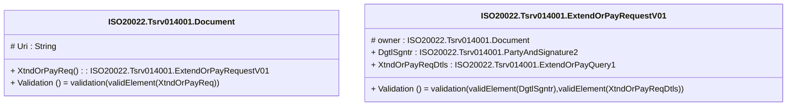

# tsrv.014.001.01-physical

> The tables below contain descriptions of the members of each Element. 
> The first column indicates the type of the member:
> A ‘#’ indicates that the field is a key to the element, and a ‘+’ indicates that the field is a value.
> The ‘*’ column contains a description for the element member.  
> The ‘@’ column contains any properties for the member.
> The ‘=’ column contains calculated values; or in the case of an enum, the serialized value.

---

## EntityImpl ISO20022.Tsrv014001.Document

| |Name|Type|*|@|=|
|-|-|-|-|-|-|
|#|Uri|String||XmlIgnore(), JsonIgnore()||
|+|XtndOrPayReq|ISO20022.Tsrv014001.ExtendOrPayRequestV01||XmlElement()||
||Validation|Some(String)||XmlIgnore(), JsonIgnore()|validation(validElement(XtndOrPayReq))|

---

## AspectImpl ISO20022.Tsrv014001.ExtendOrPayRequestV01

| |Name|Type|*|@|=|
|-|-|-|-|-|-|
|#|owner|ISO20022.Tsrv014001.Document||||
|+|DgtlSgntr|ISO20022.Tsrv014001.PartyAndSignature2||XmlElement()||
|+|XtndOrPayReqDtls|ISO20022.Tsrv014001.ExtendOrPayQuery1||XmlElement()||
||Validation|Some(String)||XmlIgnore(), JsonIgnore()|validation(validElement(DgtlSgntr),validElement(XtndOrPayReqDtls))|

