# tsrv.018.001.01

```mermaid
classDiagram
    class Hiperspace.Edge {
        # From  : Hiperspace.Node
        # To  : Hiperspace.Node
        # TypeName  : String
        + Name  : String
    }
    class ISO20022.Tsrv018001.AddressType2Code {
        DLVY = 1
        MLTO = 2
        BIZZ = 3
        HOME = 4
        PBOX = 5
        ADDR = 6
    }
    class ISO20022.Tsrv018001.BranchAndFinancialInstitutionIdentification5 {
        + BrnchId  : ISO20022.Tsrv018001.BranchData2
        + FinInstnId  : ISO20022.Tsrv018001.FinancialInstitutionIdentification8
    }
    ISO20022.Tsrv018001.BranchAndFinancialInstitutionIdentification5 *-- ISO20022.Tsrv018001.BranchData2
    ISO20022.Tsrv018001.BranchAndFinancialInstitutionIdentification5 *-- ISO20022.Tsrv018001.FinancialInstitutionIdentification8
    class ISO20022.Tsrv018001.BranchData2 {
        + PstlAdr  : ISO20022.Tsrv018001.PostalAddress6
        + Nm  : String
        + Id  : String
    }
    ISO20022.Tsrv018001.BranchData2 *-- ISO20022.Tsrv018001.PostalAddress6
    class ISO20022.Tsrv018001.ClearingSystemIdentification2Choice {
        + Prtry  : String
        + Cd  : String
    }
    class ISO20022.Tsrv018001.ClearingSystemMemberIdentification2 {
        + MmbId  : String
        + ClrSysId  : ISO20022.Tsrv018001.ClearingSystemIdentification2Choice
    }
    ISO20022.Tsrv018001.ClearingSystemMemberIdentification2 *-- ISO20022.Tsrv018001.ClearingSystemIdentification2Choice
    class ISO20022.Tsrv018001.ContactDetails2 {
        + Othr  : String
        + EmailAdr  : String
        + FaxNb  : String
        + MobNb  : String
        + PhneNb  : String
        + Nm  : String
        + NmPrfx  : String
    }
    class ISO20022.Tsrv018001.CopyDuplicate1Code {
        DUPL = 1
        COPY = 2
        CODU = 3
    }
    class ISO20022.Tsrv018001.DateAndPlaceOfBirth {
        + CtryOfBirth  : String
        + CityOfBirth  : String
        + PrvcOfBirth  : String
        + BirthDt  : DateTime
    }
    class ISO20022.Tsrv018001.FinancialIdentificationSchemeName1Choice {
        + Prtry  : String
        + Cd  : String
    }
    class ISO20022.Tsrv018001.FinancialInstitutionIdentification8 {
        + Othr  : ISO20022.Tsrv018001.GenericFinancialIdentification1
        + PstlAdr  : ISO20022.Tsrv018001.PostalAddress6
        + Nm  : String
        + ClrSysMmbId  : ISO20022.Tsrv018001.ClearingSystemMemberIdentification2
        + BICFI  : String
    }
    ISO20022.Tsrv018001.FinancialInstitutionIdentification8 *-- ISO20022.Tsrv018001.GenericFinancialIdentification1
    ISO20022.Tsrv018001.FinancialInstitutionIdentification8 *-- ISO20022.Tsrv018001.PostalAddress6
    ISO20022.Tsrv018001.FinancialInstitutionIdentification8 *-- ISO20022.Tsrv018001.ClearingSystemMemberIdentification2
    class ISO20022.Tsrv018001.GenericFinancialIdentification1 {
        + Issr  : String
        + SchmeNm  : ISO20022.Tsrv018001.FinancialIdentificationSchemeName1Choice
        + Id  : String
    }
    ISO20022.Tsrv018001.GenericFinancialIdentification1 *-- ISO20022.Tsrv018001.FinancialIdentificationSchemeName1Choice
    class ISO20022.Tsrv018001.GenericOrganisationIdentification1 {
        + Issr  : String
        + SchmeNm  : ISO20022.Tsrv018001.OrganisationIdentificationSchemeName1Choice
        + Id  : String
    }
    ISO20022.Tsrv018001.GenericOrganisationIdentification1 *-- ISO20022.Tsrv018001.OrganisationIdentificationSchemeName1Choice
    class ISO20022.Tsrv018001.GenericPersonIdentification1 {
        + Issr  : String
        + SchmeNm  : ISO20022.Tsrv018001.PersonIdentificationSchemeName1Choice
        + Id  : String
    }
    ISO20022.Tsrv018001.GenericPersonIdentification1 *-- ISO20022.Tsrv018001.PersonIdentificationSchemeName1Choice
    class ISO20022.Tsrv018001.NamePrefix1Code {
        MADM = 1
        MISS = 2
        MIST = 3
        DOCT = 4
    }
    class ISO20022.Tsrv018001.OrganisationIdentification4 {
        + Othr  : global::System.Collections.Generic.List~ISO20022.Tsrv018001.GenericOrganisationIdentification1~
        + BICOrBEI  : String
    }
    ISO20022.Tsrv018001.OrganisationIdentification4 *-- ISO20022.Tsrv018001.GenericOrganisationIdentification1
    class ISO20022.Tsrv018001.OrganisationIdentification7 {
        + Othr  : global::System.Collections.Generic.List~ISO20022.Tsrv018001.GenericOrganisationIdentification1~
        + AnyBIC  : String
    }
    ISO20022.Tsrv018001.OrganisationIdentification7 *-- ISO20022.Tsrv018001.GenericOrganisationIdentification1
    class ISO20022.Tsrv018001.OrganisationIdentification8 {
        + Othr  : global::System.Collections.Generic.List~ISO20022.Tsrv018001.GenericOrganisationIdentification1~
        + AnyBIC  : String
    }
    ISO20022.Tsrv018001.OrganisationIdentification8 *-- ISO20022.Tsrv018001.GenericOrganisationIdentification1
    class ISO20022.Tsrv018001.OrganisationIdentificationSchemeName1Choice {
        + Prtry  : String
        + Cd  : String
    }
    class ISO20022.Tsrv018001.OriginalMessage1 {
        + CpyDplct  : String
        + CreDt  : DateTime
        + BizMsgIdr  : String
        + To  : ISO20022.Tsrv018001.Party9Choice
        + Fr  : ISO20022.Tsrv018001.Party9Choice
        + MsgDefIdr  : String
    }
    ISO20022.Tsrv018001.OriginalMessage1 *-- ISO20022.Tsrv018001.Party9Choice
    ISO20022.Tsrv018001.OriginalMessage1 *-- ISO20022.Tsrv018001.Party9Choice
    class ISO20022.Tsrv018001.Party10Choice {
        + PrvtId  : ISO20022.Tsrv018001.PersonIdentification5
        + OrgId  : ISO20022.Tsrv018001.OrganisationIdentification7
    }
    ISO20022.Tsrv018001.Party10Choice *-- ISO20022.Tsrv018001.PersonIdentification5
    ISO20022.Tsrv018001.Party10Choice *-- ISO20022.Tsrv018001.OrganisationIdentification7
    class ISO20022.Tsrv018001.Party11Choice {
        + PrvtId  : ISO20022.Tsrv018001.PersonIdentification5
        + OrgId  : ISO20022.Tsrv018001.OrganisationIdentification8
    }
    ISO20022.Tsrv018001.Party11Choice *-- ISO20022.Tsrv018001.PersonIdentification5
    ISO20022.Tsrv018001.Party11Choice *-- ISO20022.Tsrv018001.OrganisationIdentification8
    class ISO20022.Tsrv018001.Party6Choice {
        + PrvtId  : ISO20022.Tsrv018001.PersonIdentification5
        + OrgId  : ISO20022.Tsrv018001.OrganisationIdentification4
    }
    ISO20022.Tsrv018001.Party6Choice *-- ISO20022.Tsrv018001.PersonIdentification5
    ISO20022.Tsrv018001.Party6Choice *-- ISO20022.Tsrv018001.OrganisationIdentification4
    class ISO20022.Tsrv018001.Party9Choice {
        + FIId  : ISO20022.Tsrv018001.BranchAndFinancialInstitutionIdentification5
        + OrgId  : ISO20022.Tsrv018001.PartyIdentification42
    }
    ISO20022.Tsrv018001.Party9Choice *-- ISO20022.Tsrv018001.BranchAndFinancialInstitutionIdentification5
    ISO20022.Tsrv018001.Party9Choice *-- ISO20022.Tsrv018001.PartyIdentification42
    class ISO20022.Tsrv018001.PartyAndSignature2 {
        + Sgntr  : ISO20022.Tsrv018001.ProprietaryData3
        + Pty  : ISO20022.Tsrv018001.PartyIdentification43
    }
    ISO20022.Tsrv018001.PartyAndSignature2 *-- ISO20022.Tsrv018001.ProprietaryData3
    ISO20022.Tsrv018001.PartyAndSignature2 *-- ISO20022.Tsrv018001.PartyIdentification43
    class ISO20022.Tsrv018001.PartyIdentification32 {
        + CtctDtls  : ISO20022.Tsrv018001.ContactDetails2
        + CtryOfRes  : String
        + Id  : ISO20022.Tsrv018001.Party6Choice
        + PstlAdr  : ISO20022.Tsrv018001.PostalAddress6
        + Nm  : String
    }
    ISO20022.Tsrv018001.PartyIdentification32 *-- ISO20022.Tsrv018001.ContactDetails2
    ISO20022.Tsrv018001.PartyIdentification32 *-- ISO20022.Tsrv018001.Party6Choice
    ISO20022.Tsrv018001.PartyIdentification32 *-- ISO20022.Tsrv018001.PostalAddress6
    class ISO20022.Tsrv018001.PartyIdentification42 {
        + CtctDtls  : ISO20022.Tsrv018001.ContactDetails2
        + CtryOfRes  : String
        + Id  : ISO20022.Tsrv018001.Party10Choice
        + PstlAdr  : ISO20022.Tsrv018001.PostalAddress6
        + Nm  : String
    }
    ISO20022.Tsrv018001.PartyIdentification42 *-- ISO20022.Tsrv018001.ContactDetails2
    ISO20022.Tsrv018001.PartyIdentification42 *-- ISO20022.Tsrv018001.Party10Choice
    ISO20022.Tsrv018001.PartyIdentification42 *-- ISO20022.Tsrv018001.PostalAddress6
    class ISO20022.Tsrv018001.PartyIdentification43 {
        + CtctDtls  : ISO20022.Tsrv018001.ContactDetails2
        + CtryOfRes  : String
        + Id  : ISO20022.Tsrv018001.Party11Choice
        + PstlAdr  : ISO20022.Tsrv018001.PostalAddress6
        + Nm  : String
    }
    ISO20022.Tsrv018001.PartyIdentification43 *-- ISO20022.Tsrv018001.ContactDetails2
    ISO20022.Tsrv018001.PartyIdentification43 *-- ISO20022.Tsrv018001.Party11Choice
    ISO20022.Tsrv018001.PartyIdentification43 *-- ISO20022.Tsrv018001.PostalAddress6
    class ISO20022.Tsrv018001.PersonIdentification5 {
        + Othr  : global::System.Collections.Generic.List~ISO20022.Tsrv018001.GenericPersonIdentification1~
        + DtAndPlcOfBirth  : ISO20022.Tsrv018001.DateAndPlaceOfBirth
    }
    ISO20022.Tsrv018001.PersonIdentification5 *-- ISO20022.Tsrv018001.GenericPersonIdentification1
    ISO20022.Tsrv018001.PersonIdentification5 *-- ISO20022.Tsrv018001.DateAndPlaceOfBirth
    class ISO20022.Tsrv018001.PersonIdentificationSchemeName1Choice {
        + Prtry  : String
        + Cd  : String
    }
    class ISO20022.Tsrv018001.PostalAddress6 {
        + AdrLine  : global::System.Collections.Generic.List~String~
        + Ctry  : String
        + CtrySubDvsn  : String
        + TwnNm  : String
        + PstCd  : String
        + BldgNb  : String
        + StrtNm  : String
        + SubDept  : String
        + Dept  : String
        + AdrTp  : String
    }
    class ISO20022.Tsrv018001.ProprietaryData3 {
    }
    class ISO20022.Tsrv018001.StatusReason6Choice {
        + Prtry  : String
        + Cd  : String
    }
    class ISO20022.Tsrv018001.StatusReasonInformation8 {
        + AddtlInf  : global::System.Collections.Generic.List~String~
        + Rsn  : ISO20022.Tsrv018001.StatusReason6Choice
        + Orgtr  : ISO20022.Tsrv018001.PartyIdentification32
    }
    ISO20022.Tsrv018001.StatusReasonInformation8 *-- ISO20022.Tsrv018001.StatusReason6Choice
    ISO20022.Tsrv018001.StatusReasonInformation8 *-- ISO20022.Tsrv018001.PartyIdentification32
    class ISO20022.Tsrv018001.TradeStatusReport1 {
        + AddtlInf  : String
        + StsRsn  : global::System.Collections.Generic.List~ISO20022.Tsrv018001.StatusReasonInformation8~
        + Sts  : String
        + OrgnlMsgDtls  : ISO20022.Tsrv018001.OriginalMessage1
    }
    ISO20022.Tsrv018001.TradeStatusReport1 *-- ISO20022.Tsrv018001.StatusReasonInformation8
    ISO20022.Tsrv018001.TradeStatusReport1 *-- ISO20022.Tsrv018001.OriginalMessage1
    class ISO20022.Tsrv018001.TradeStatusReportV01 {
        + DgtlSgntr  : ISO20022.Tsrv018001.PartyAndSignature2
        + TradStsAdvcDtls  : ISO20022.Tsrv018001.TradeStatusReport1
    }
    ISO20022.Tsrv018001.TradeStatusReportV01 *-- ISO20022.Tsrv018001.PartyAndSignature2
    ISO20022.Tsrv018001.TradeStatusReportV01 *-- ISO20022.Tsrv018001.TradeStatusReport1
    class ISO20022.Tsrv018001.UndertakingStatus1Code {
        REJT = 1
        RCVD = 2
        PEND = 3
        ACTC = 4
    }
    class Hiperspace.Node {
        # SKey  : String
        + TypeName  : String
        + Name  : String
        + Froms (From = this) : Hiperspace.Edge
        + Tos (To = this) : Hiperspace.Edge
    }
```

> The tables below contain descriptions of the members of each Element. 
> The first column indicates the type of the member:
> A ‘#’ indicates that the field is a key to the element, and a ‘+’ indicates that the field is a value.
> The ‘*’ column contains a description for the element member.  
> The ‘@’ column contains any properties for the member.
> The ‘=’ column contains calculated values; or in the case of an enum, the serialized value.

---

## View Hiperspace.Edge
edge between nodes

| |Name|Type|*|@|=|
|-|-|-|-|-|-|
|#|From|Hiperspace.Node||||
|#|To|Hiperspace.Node||||
|#|TypeName|String||||
|+|Name|String||||

---

## Enum ISO20022.Tsrv018001.AddressType2Code

| |Name|Type|*|@|=|
|-|-|-|-|-|-|
||DLVY|Int32||XmlEnum("""DLVY""")|1|
||MLTO|Int32||XmlEnum("""MLTO""")|2|
||BIZZ|Int32||XmlEnum("""BIZZ""")|3|
||HOME|Int32||XmlEnum("""HOME""")|4|
||PBOX|Int32||XmlEnum("""PBOX""")|5|
||ADDR|Int32||XmlEnum("""ADDR""")|6|

---

## Value ISO20022.Tsrv018001.BranchAndFinancialInstitutionIdentification5

| |Name|Type|*|@|=|
|-|-|-|-|-|-|
|+|BrnchId|ISO20022.Tsrv018001.BranchData2||XmlElement()||
|+|FinInstnId|ISO20022.Tsrv018001.FinancialInstitutionIdentification8||XmlElement()||
||Validation|Some(String)||XmlIgnore(), JsonIgnore()|validation(validElement(BrnchId),validElement(FinInstnId))|

---

## Value ISO20022.Tsrv018001.BranchData2

| |Name|Type|*|@|=|
|-|-|-|-|-|-|
|+|PstlAdr|ISO20022.Tsrv018001.PostalAddress6||XmlElement()||
|+|Nm|String||XmlElement()||
|+|Id|String||XmlElement()||
||Validation|Some(String)||XmlIgnore(), JsonIgnore()|validation(validElement(PstlAdr))|

---

## Value ISO20022.Tsrv018001.ClearingSystemIdentification2Choice

| |Name|Type|*|@|=|
|-|-|-|-|-|-|
|+|Prtry|String||XmlElement()||
|+|Cd|String||XmlElement()||
||Validation|Some(String)||XmlIgnore(), JsonIgnore()|validation(validChoice(Prtry,Cd))|

---

## Value ISO20022.Tsrv018001.ClearingSystemMemberIdentification2

| |Name|Type|*|@|=|
|-|-|-|-|-|-|
|+|MmbId|String||XmlElement()||
|+|ClrSysId|ISO20022.Tsrv018001.ClearingSystemIdentification2Choice||XmlElement()||
||Validation|Some(String)||XmlIgnore(), JsonIgnore()|validation(validElement(ClrSysId))|

---

## Value ISO20022.Tsrv018001.ContactDetails2

| |Name|Type|*|@|=|
|-|-|-|-|-|-|
|+|Othr|String||XmlElement()||
|+|EmailAdr|String||XmlElement()||
|+|FaxNb|String||XmlElement()||
|+|MobNb|String||XmlElement()||
|+|PhneNb|String||XmlElement()||
|+|Nm|String||XmlElement()||
|+|NmPrfx|String||XmlElement()||
||Validation|Some(String)||XmlIgnore(), JsonIgnore()|validation(validPattern("""FaxNb""",FaxNb,"""\+[0-9]{1,3}-[0-9()+\-]{1,30}"""),validPattern("""MobNb""",MobNb,"""\+[0-9]{1,3}-[0-9()+\-]{1,30}"""),validPattern("""PhneNb""",PhneNb,"""\+[0-9]{1,3}-[0-9()+\-]{1,30}"""))|

---

## Enum ISO20022.Tsrv018001.CopyDuplicate1Code

| |Name|Type|*|@|=|
|-|-|-|-|-|-|
||DUPL|Int32||XmlEnum("""DUPL""")|1|
||COPY|Int32||XmlEnum("""COPY""")|2|
||CODU|Int32||XmlEnum("""CODU""")|3|

---

## Value ISO20022.Tsrv018001.DateAndPlaceOfBirth

| |Name|Type|*|@|=|
|-|-|-|-|-|-|
|+|CtryOfBirth|String||XmlElement()||
|+|CityOfBirth|String||XmlElement()||
|+|PrvcOfBirth|String||XmlElement()||
|+|BirthDt|DateTime||XmlElement()||
||Validation|Some(String)||XmlIgnore(), JsonIgnore()|validation(validPattern("""CtryOfBirth""",CtryOfBirth,"""[A-Z]{2,2}"""))|

---

## Type ISO20022.Tsrv018001.Document

| |Name|Type|*|@|=|
|-|-|-|-|-|-|
|+|TradStsRpt|ISO20022.Tsrv018001.TradeStatusReportV01||XmlElement()||
||Validation|Some(String)||XmlIgnore(), JsonIgnore()|validation(validElement(TradStsRpt))|

---

## Value ISO20022.Tsrv018001.FinancialIdentificationSchemeName1Choice

| |Name|Type|*|@|=|
|-|-|-|-|-|-|
|+|Prtry|String||XmlElement()||
|+|Cd|String||XmlElement()||
||Validation|Some(String)||XmlIgnore(), JsonIgnore()|validation(validChoice(Prtry,Cd))|

---

## Value ISO20022.Tsrv018001.FinancialInstitutionIdentification8

| |Name|Type|*|@|=|
|-|-|-|-|-|-|
|+|Othr|ISO20022.Tsrv018001.GenericFinancialIdentification1||XmlElement()||
|+|PstlAdr|ISO20022.Tsrv018001.PostalAddress6||XmlElement()||
|+|Nm|String||XmlElement()||
|+|ClrSysMmbId|ISO20022.Tsrv018001.ClearingSystemMemberIdentification2||XmlElement()||
|+|BICFI|String||XmlElement()||
||Validation|Some(String)||XmlIgnore(), JsonIgnore()|validation(validElement(Othr),validElement(PstlAdr),validElement(ClrSysMmbId),validPattern("""BICFI""",BICFI,"""[A-Z]{6,6}[A-Z2-9][A-NP-Z0-9]([A-Z0-9]{3,3}){0,1}"""))|

---

## Value ISO20022.Tsrv018001.GenericFinancialIdentification1

| |Name|Type|*|@|=|
|-|-|-|-|-|-|
|+|Issr|String||XmlElement()||
|+|SchmeNm|ISO20022.Tsrv018001.FinancialIdentificationSchemeName1Choice||XmlElement()||
|+|Id|String||XmlElement()||
||Validation|Some(String)||XmlIgnore(), JsonIgnore()|validation(validElement(SchmeNm))|

---

## Value ISO20022.Tsrv018001.GenericOrganisationIdentification1

| |Name|Type|*|@|=|
|-|-|-|-|-|-|
|+|Issr|String||XmlElement()||
|+|SchmeNm|ISO20022.Tsrv018001.OrganisationIdentificationSchemeName1Choice||XmlElement()||
|+|Id|String||XmlElement()||
||Validation|Some(String)||XmlIgnore(), JsonIgnore()|validation(validElement(SchmeNm))|

---

## Value ISO20022.Tsrv018001.GenericPersonIdentification1

| |Name|Type|*|@|=|
|-|-|-|-|-|-|
|+|Issr|String||XmlElement()||
|+|SchmeNm|ISO20022.Tsrv018001.PersonIdentificationSchemeName1Choice||XmlElement()||
|+|Id|String||XmlElement()||
||Validation|Some(String)||XmlIgnore(), JsonIgnore()|validation(validElement(SchmeNm))|

---

## Enum ISO20022.Tsrv018001.NamePrefix1Code

| |Name|Type|*|@|=|
|-|-|-|-|-|-|
||MADM|Int32||XmlEnum("""MADM""")|1|
||MISS|Int32||XmlEnum("""MISS""")|2|
||MIST|Int32||XmlEnum("""MIST""")|3|
||DOCT|Int32||XmlEnum("""DOCT""")|4|

---

## Value ISO20022.Tsrv018001.OrganisationIdentification4

| |Name|Type|*|@|=|
|-|-|-|-|-|-|
|+|Othr|global::System.Collections.Generic.List<ISO20022.Tsrv018001.GenericOrganisationIdentification1>||XmlElement()||
|+|BICOrBEI|String||XmlElement()||
||Validation|Some(String)||XmlIgnore(), JsonIgnore()|validation(validList("""Othr""",Othr),validElement(Othr),validPattern("""BICOrBEI""",BICOrBEI,"""[A-Z]{6,6}[A-Z2-9][A-NP-Z0-9]([A-Z0-9]{3,3}){0,1}"""))|

---

## Value ISO20022.Tsrv018001.OrganisationIdentification7

| |Name|Type|*|@|=|
|-|-|-|-|-|-|
|+|Othr|global::System.Collections.Generic.List<ISO20022.Tsrv018001.GenericOrganisationIdentification1>||XmlElement()||
|+|AnyBIC|String||XmlElement()||
||Validation|Some(String)||XmlIgnore(), JsonIgnore()|validation(validList("""Othr""",Othr),validElement(Othr),validPattern("""AnyBIC""",AnyBIC,"""[A-Z]{6,6}[A-Z2-9][A-NP-Z0-9]([A-Z0-9]{3,3}){0,1}"""))|

---

## Value ISO20022.Tsrv018001.OrganisationIdentification8

| |Name|Type|*|@|=|
|-|-|-|-|-|-|
|+|Othr|global::System.Collections.Generic.List<ISO20022.Tsrv018001.GenericOrganisationIdentification1>||XmlElement()||
|+|AnyBIC|String||XmlElement()||
||Validation|Some(String)||XmlIgnore(), JsonIgnore()|validation(validList("""Othr""",Othr),validElement(Othr),validPattern("""AnyBIC""",AnyBIC,"""[A-Z]{6,6}[A-Z2-9][A-NP-Z0-9]([A-Z0-9]{3,3}){0,1}"""))|

---

## Value ISO20022.Tsrv018001.OrganisationIdentificationSchemeName1Choice

| |Name|Type|*|@|=|
|-|-|-|-|-|-|
|+|Prtry|String||XmlElement()||
|+|Cd|String||XmlElement()||
||Validation|Some(String)||XmlIgnore(), JsonIgnore()|validation(validChoice(Prtry,Cd))|

---

## Value ISO20022.Tsrv018001.OriginalMessage1

| |Name|Type|*|@|=|
|-|-|-|-|-|-|
|+|CpyDplct|String||XmlElement()||
|+|CreDt|DateTime||XmlElement()||
|+|BizMsgIdr|String||XmlElement()||
|+|To|ISO20022.Tsrv018001.Party9Choice||XmlElement()||
|+|Fr|ISO20022.Tsrv018001.Party9Choice||XmlElement()||
|+|MsgDefIdr|String||XmlElement()||
||Validation|Some(String)||XmlIgnore(), JsonIgnore()|validation(validPattern("""CreDt""",CreDt,""".*Z"""),validElement(To),validElement(Fr))|

---

## Value ISO20022.Tsrv018001.Party10Choice

| |Name|Type|*|@|=|
|-|-|-|-|-|-|
|+|PrvtId|ISO20022.Tsrv018001.PersonIdentification5||XmlElement()||
|+|OrgId|ISO20022.Tsrv018001.OrganisationIdentification7||XmlElement()||
||Validation|Some(String)||XmlIgnore(), JsonIgnore()|validation(validElement(PrvtId),validElement(OrgId),validChoice(PrvtId,OrgId))|

---

## Value ISO20022.Tsrv018001.Party11Choice

| |Name|Type|*|@|=|
|-|-|-|-|-|-|
|+|PrvtId|ISO20022.Tsrv018001.PersonIdentification5||XmlElement()||
|+|OrgId|ISO20022.Tsrv018001.OrganisationIdentification8||XmlElement()||
||Validation|Some(String)||XmlIgnore(), JsonIgnore()|validation(validElement(PrvtId),validElement(OrgId),validChoice(PrvtId,OrgId))|

---

## Value ISO20022.Tsrv018001.Party6Choice

| |Name|Type|*|@|=|
|-|-|-|-|-|-|
|+|PrvtId|ISO20022.Tsrv018001.PersonIdentification5||XmlElement()||
|+|OrgId|ISO20022.Tsrv018001.OrganisationIdentification4||XmlElement()||
||Validation|Some(String)||XmlIgnore(), JsonIgnore()|validation(validElement(PrvtId),validElement(OrgId),validChoice(PrvtId,OrgId))|

---

## Value ISO20022.Tsrv018001.Party9Choice

| |Name|Type|*|@|=|
|-|-|-|-|-|-|
|+|FIId|ISO20022.Tsrv018001.BranchAndFinancialInstitutionIdentification5||XmlElement()||
|+|OrgId|ISO20022.Tsrv018001.PartyIdentification42||XmlElement()||
||Validation|Some(String)||XmlIgnore(), JsonIgnore()|validation(validElement(FIId),validElement(OrgId),validChoice(FIId,OrgId))|

---

## Value ISO20022.Tsrv018001.PartyAndSignature2

| |Name|Type|*|@|=|
|-|-|-|-|-|-|
|+|Sgntr|ISO20022.Tsrv018001.ProprietaryData3||XmlElement()||
|+|Pty|ISO20022.Tsrv018001.PartyIdentification43||XmlElement()||
||Validation|Some(String)||XmlIgnore(), JsonIgnore()|validation(validElement(Sgntr),validElement(Pty))|

---

## Value ISO20022.Tsrv018001.PartyIdentification32

| |Name|Type|*|@|=|
|-|-|-|-|-|-|
|+|CtctDtls|ISO20022.Tsrv018001.ContactDetails2||XmlElement()||
|+|CtryOfRes|String||XmlElement()||
|+|Id|ISO20022.Tsrv018001.Party6Choice||XmlElement()||
|+|PstlAdr|ISO20022.Tsrv018001.PostalAddress6||XmlElement()||
|+|Nm|String||XmlElement()||
||Validation|Some(String)||XmlIgnore(), JsonIgnore()|validation(validElement(CtctDtls),validPattern("""CtryOfRes""",CtryOfRes,"""[A-Z]{2,2}"""),validElement(Id),validElement(PstlAdr))|

---

## Value ISO20022.Tsrv018001.PartyIdentification42

| |Name|Type|*|@|=|
|-|-|-|-|-|-|
|+|CtctDtls|ISO20022.Tsrv018001.ContactDetails2||XmlElement()||
|+|CtryOfRes|String||XmlElement()||
|+|Id|ISO20022.Tsrv018001.Party10Choice||XmlElement()||
|+|PstlAdr|ISO20022.Tsrv018001.PostalAddress6||XmlElement()||
|+|Nm|String||XmlElement()||
||Validation|Some(String)||XmlIgnore(), JsonIgnore()|validation(validElement(CtctDtls),validPattern("""CtryOfRes""",CtryOfRes,"""[A-Z]{2,2}"""),validElement(Id),validElement(PstlAdr))|

---

## Value ISO20022.Tsrv018001.PartyIdentification43

| |Name|Type|*|@|=|
|-|-|-|-|-|-|
|+|CtctDtls|ISO20022.Tsrv018001.ContactDetails2||XmlElement()||
|+|CtryOfRes|String||XmlElement()||
|+|Id|ISO20022.Tsrv018001.Party11Choice||XmlElement()||
|+|PstlAdr|ISO20022.Tsrv018001.PostalAddress6||XmlElement()||
|+|Nm|String||XmlElement()||
||Validation|Some(String)||XmlIgnore(), JsonIgnore()|validation(validElement(CtctDtls),validPattern("""CtryOfRes""",CtryOfRes,"""[A-Z]{2,2}"""),validElement(Id),validElement(PstlAdr))|

---

## Value ISO20022.Tsrv018001.PersonIdentification5

| |Name|Type|*|@|=|
|-|-|-|-|-|-|
|+|Othr|global::System.Collections.Generic.List<ISO20022.Tsrv018001.GenericPersonIdentification1>||XmlElement()||
|+|DtAndPlcOfBirth|ISO20022.Tsrv018001.DateAndPlaceOfBirth||XmlElement()||
||Validation|Some(String)||XmlIgnore(), JsonIgnore()|validation(validList("""Othr""",Othr),validElement(Othr),validElement(DtAndPlcOfBirth))|

---

## Value ISO20022.Tsrv018001.PersonIdentificationSchemeName1Choice

| |Name|Type|*|@|=|
|-|-|-|-|-|-|
|+|Prtry|String||XmlElement()||
|+|Cd|String||XmlElement()||
||Validation|Some(String)||XmlIgnore(), JsonIgnore()|validation(validChoice(Prtry,Cd))|

---

## Value ISO20022.Tsrv018001.PostalAddress6

| |Name|Type|*|@|=|
|-|-|-|-|-|-|
|+|AdrLine|global::System.Collections.Generic.List<String>||XmlElement()||
|+|Ctry|String||XmlElement()||
|+|CtrySubDvsn|String||XmlElement()||
|+|TwnNm|String||XmlElement()||
|+|PstCd|String||XmlElement()||
|+|BldgNb|String||XmlElement()||
|+|StrtNm|String||XmlElement()||
|+|SubDept|String||XmlElement()||
|+|Dept|String||XmlElement()||
|+|AdrTp|String||XmlElement()||
||Validation|Some(String)||XmlIgnore(), JsonIgnore()|validation(validListMax("""AdrLine""",AdrLine,7),validPattern("""Ctry""",Ctry,"""[A-Z]{2,2}"""))|

---

## Value ISO20022.Tsrv018001.ProprietaryData3

| |Name|Type|*|@|=|
|-|-|-|-|-|-|
||Validation|Some(String)||XmlIgnore(), JsonIgnore()|""|

---

## Value ISO20022.Tsrv018001.StatusReason6Choice

| |Name|Type|*|@|=|
|-|-|-|-|-|-|
|+|Prtry|String||XmlElement()||
|+|Cd|String||XmlElement()||
||Validation|Some(String)||XmlIgnore(), JsonIgnore()|validation(validChoice(Prtry,Cd))|

---

## Value ISO20022.Tsrv018001.StatusReasonInformation8

| |Name|Type|*|@|=|
|-|-|-|-|-|-|
|+|AddtlInf|global::System.Collections.Generic.List<String>||XmlElement()||
|+|Rsn|ISO20022.Tsrv018001.StatusReason6Choice||XmlElement()||
|+|Orgtr|ISO20022.Tsrv018001.PartyIdentification32||XmlElement()||
||Validation|Some(String)||XmlIgnore(), JsonIgnore()|validation(validElement(Rsn),validElement(Orgtr))|

---

## Value ISO20022.Tsrv018001.TradeStatusReport1

| |Name|Type|*|@|=|
|-|-|-|-|-|-|
|+|AddtlInf|String||XmlElement()||
|+|StsRsn|global::System.Collections.Generic.List<ISO20022.Tsrv018001.StatusReasonInformation8>||XmlElement()||
|+|Sts|String||XmlElement()||
|+|OrgnlMsgDtls|ISO20022.Tsrv018001.OriginalMessage1||XmlElement()||
||Validation|Some(String)||XmlIgnore(), JsonIgnore()|validation(validList("""StsRsn""",StsRsn),validElement(StsRsn),validElement(OrgnlMsgDtls))|

---

## Aspect ISO20022.Tsrv018001.TradeStatusReportV01

| |Name|Type|*|@|=|
|-|-|-|-|-|-|
|+|DgtlSgntr|ISO20022.Tsrv018001.PartyAndSignature2||XmlElement()||
|+|TradStsAdvcDtls|ISO20022.Tsrv018001.TradeStatusReport1||XmlElement()||
||Validation|Some(String)||XmlIgnore(), JsonIgnore()|validation(validElement(DgtlSgntr),validElement(TradStsAdvcDtls))|

---

## Enum ISO20022.Tsrv018001.UndertakingStatus1Code

| |Name|Type|*|@|=|
|-|-|-|-|-|-|
||REJT|Int32||XmlEnum("""REJT""")|1|
||RCVD|Int32||XmlEnum("""RCVD""")|2|
||PEND|Int32||XmlEnum("""PEND""")|3|
||ACTC|Int32||XmlEnum("""ACTC""")|4|

---

## View Hiperspace.Node
node in a graph view of data

| |Name|Type|*|@|=|
|-|-|-|-|-|-|
|#|SKey|String||||
|+|TypeName|String||||
|+|Name|String||||
||Froms|Hiperspace.Edge|||From = this|
||Tos|Hiperspace.Edge|||To = this|

