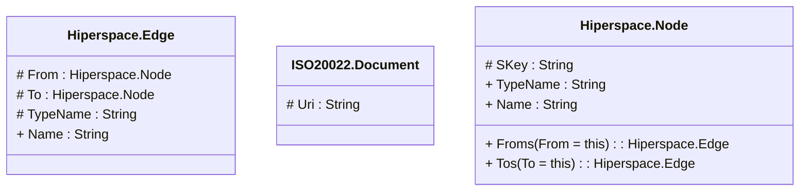

# Hiperspace.ISO20022

> The tables below contain descriptions of the members of each Element. 
> The first column indicates the type of the member:
> A ‘#’ indicates that the field is a key to the element, and a ‘+’ indicates that the field is a value.
> The ‘*’ column contains a description for the element member.  
> The ‘@’ column contains any properties for the member.
> The ‘=’ column contains calculated values; or in the case of an enum, the serialized value.

---

## View Hiperspace.Edge
edge between nodes

| |Name|Type|*|@|=|
|-|-|-|-|-|-|
|#|From|Hiperspace.Node||||
|#|To|Hiperspace.Node||||
|#|TypeName|String||||
|+|Name|String||||

---

## Entity ISO20022.Document

| |Name|Type|*|@|=|
|-|-|-|-|-|-|
|#|Uri|String||XmlIgnore(), JsonIgnore()||
|+|AcctOpngInstr|ISO20022.Acmt001001.AccountOpeningInstructionV08||XmlElement()||
|+|AcctDtlsConf|ISO20022.Acmt002001.AccountDetailsConfirmationV08||XmlElement()||
|+|AcctModInstr|ISO20022.Acmt003001.AccountModificationInstructionV08||XmlElement()||
|+|ReqForAcctMgmtStsRpt|ISO20022.Acmt005001.RequestForAccountManagementStatusReportV06||XmlElement()||
|+|AcctMgmtStsRpt|ISO20022.Acmt006001.AccountManagementStatusReportV07||XmlElement()||
|+|AcctOpngReq|ISO20022.Acmt007001.AccountOpeningRequestV05||XmlElement()||
|+|AcctOpngAmdmntReq|ISO20022.Acmt008001.AccountOpeningAmendmentRequestV05||XmlElement()||
|+|AcctOpngAddtlInfReq|ISO20022.Acmt009001.AccountOpeningAdditionalInformationRequestV04||XmlElement()||
|+|AcctReqAck|ISO20022.Acmt010001.AccountRequestAcknowledgementV04||XmlElement()||
|+|AcctReqRjctn|ISO20022.Acmt011001.AccountRequestRejectionV04||XmlElement()||
|+|AcctAddtlInfReq|ISO20022.Acmt012001.AccountAdditionalInformationRequestV04||XmlElement()||
|+|AcctRptReq|ISO20022.Acmt013001.AccountReportRequestV04||XmlElement()||
|+|AcctRpt|ISO20022.Acmt014001.AccountReportV05||XmlElement()||
|+|AcctExcldMndtMntncReq|ISO20022.Acmt015001.AccountExcludedMandateMaintenanceRequestV04||XmlElement()||
|+|AcctExcldMndtMntncAmdmntReq|ISO20022.Acmt016001.AccountExcludedMandateMaintenanceAmendmentRequestV04||XmlElement()||
|+|AcctMndtMntncReq|ISO20022.Acmt017001.AccountMandateMaintenanceRequestV04||XmlElement()||
|+|AcctMndtMntncAmdmntReq|ISO20022.Acmt018001.AccountMandateMaintenanceAmendmentRequestV04||XmlElement()||
|+|AcctClsgReq|ISO20022.Acmt019001.AccountClosingRequestV04||XmlElement()||
|+|AcctClsgAmdmntReq|ISO20022.Acmt020001.AccountClosingAmendmentRequestV04||XmlElement()||
|+|AcctClsgAddtlInfReq|ISO20022.Acmt021001.AccountClosingAdditionalInformationRequestV04||XmlElement()||
|+|IdModAdvc|ISO20022.Acmt022001.IdentificationModificationAdviceV04||XmlElement()||
|+|IdVrfctnReq|ISO20022.Acmt023001.IdentificationVerificationRequestV04||XmlElement()||
|+|IdVrfctnRpt|ISO20022.Acmt024001.IdentificationVerificationReportV04||XmlElement()||
|+|AcctSwtchInfReq|ISO20022.Acmt027001.AccountSwitchInformationRequestV05||XmlElement()||
|+|AcctSwtchInfRspn|ISO20022.Acmt028001.AccountSwitchInformationResponseV05||XmlElement()||
|+|AcctSwtchCclExstgPmt|ISO20022.Acmt029001.AccountSwitchCancelExistingPaymentV05||XmlElement()||
|+|AcctSwtchReqRdrctn|ISO20022.Acmt030001.AccountSwitchRequestRedirectionV04||XmlElement()||
|+|AcctSwtchReqBalTrf|ISO20022.Acmt031001.AccountSwitchRequestBalanceTransferV05||XmlElement()||
|+|AcctSwtchBalTrfAck|ISO20022.Acmt032001.AccountSwitchBalanceTransferAcknowledgementV05||XmlElement()||
|+|AcctSwtchNtfyAcctSwtchCmplt|ISO20022.Acmt033001.AccountSwitchNotifyAccountSwitchCompleteV02||XmlElement()||
|+|AcctSwtchReqPmt|ISO20022.Acmt034001.AccountSwitchRequestPaymentV05||XmlElement()||
|+|AcctSwtchPmtRspn|ISO20022.Acmt035001.AccountSwitchPaymentResponseV02||XmlElement()||
|+|AcctSwtchTermntnSwtch|ISO20022.Acmt036001.AccountSwitchTerminationSwitchV01||XmlElement()||
|+|AcctSwtchTechRjctn|ISO20022.Acmt037001.AccountSwitchTechnicalRejectionV02||XmlElement()||
|+|SysEvtNtfctn|ISO20022.Admi004001.SystemEventNotificationV02||XmlElement()||
|+|RptQryReq|ISO20022.Admi005001.ReportQueryRequestV02||XmlElement()||
|+|RsndReq|ISO20022.Admi006001.ResendRequestV01||XmlElement()||
|+|RctAck|ISO20022.Admi007001.ReceiptAcknowledgementV01||XmlElement()||
|+|NtfctnOfCrspdc|ISO20022.Admi024001.NotificationOfCorrespondenceV01||XmlElement()||
|+|InfReqOpng|ISO20022.Auth001001.InformationRequestOpeningV02||XmlElement()||
|+|InfReqRspn|ISO20022.Auth002001.InformationRequestResponseV02||XmlElement()||
|+|InfReqStsChngNtfctn|ISO20022.Auth003001.InformationRequestStatusChangeNotificationV01||XmlElement()||
|+|MnyMktScrdMktSttstclRpt|ISO20022.Auth012001.MoneyMarketSecuredMarketStatisticalReportV02||XmlElement()||
|+|MnyMktUscrdMktSttstclRpt|ISO20022.Auth013001.MoneyMarketUnsecuredMarketStatisticalReportV02||XmlElement()||
|+|MnyMktFXSwpsSttstclRpt|ISO20022.Auth014001.MoneyMarketForeignExchangeSwapsStatisticalReportV02||XmlElement()||
|+|MnyMktOvrnghtIndxSwpsSttstclRpt|ISO20022.Auth015001.MoneyMarketOvernightIndexSwapsStatisticalReportV02||XmlElement()||
|+|FinInstrmRptgTxRpt|ISO20022.Auth016001.FinancialInstrumentReportingTransactionReportV03||XmlElement()||
|+|FinInstrmRptgRefDataRpt|ISO20022.Auth017001.FinancialInstrumentReportingReferenceDataReportV02||XmlElement()||
|+|CtrctRegnReq|ISO20022.Auth018001.ContractRegistrationRequestV04||XmlElement()||
|+|CtrctRegnConf|ISO20022.Auth019001.ContractRegistrationConfirmationV04||XmlElement()||
|+|CtrctRegnClsrReq|ISO20022.Auth020001.ContractRegistrationClosureRequestV04||XmlElement()||
|+|CtrctRegnAmdmntReq|ISO20022.Auth021001.ContractRegistrationAmendmentRequestV04||XmlElement()||
|+|CtrctRegnStmt|ISO20022.Auth022001.ContractRegistrationStatementV04||XmlElement()||
|+|CtrctRegnStmtReq|ISO20022.Auth023001.ContractRegistrationStatementRequestV04||XmlElement()||
|+|PmtRgltryInfNtfctn|ISO20022.Auth024001.PaymentRegulatoryInformationNotificationV04||XmlElement()||
|+|CcyCtrlSpprtgDocDlvry|ISO20022.Auth025001.CurrencyControlSupportingDocumentDeliveryV04||XmlElement()||
|+|CcyCtrlReqOrLttr|ISO20022.Auth026001.CurrencyControlRequestOrLetterV04||XmlElement()||
|+|CcyCtrlStsAdvc|ISO20022.Auth027001.CurrencyControlStatusAdviceV04||XmlElement()||
|+|MnyMktSttstclRptStsAdvc|ISO20022.Auth028001.MoneyMarketStatisticalReportStatusAdviceV01||XmlElement()||
|+|DerivsTradRptQry|ISO20022.Auth029001.DerivativesTradeReportQueryV05||XmlElement()||
|+|DerivsTradRpt|ISO20022.Auth030001.DerivativesTradeReportV04||XmlElement()||
|+|FinInstrmRptgStsAdvc|ISO20022.Auth031001.FinancialInstrumentReportingStatusAdviceV01||XmlElement()||
|+|FinInstrmRptgEqtyTrnsprncyDataRpt|ISO20022.Auth032001.FinancialInstrumentReportingEquityTransparencyDataReportV01||XmlElement()||
|+|FinInstrmRptgNonEqtyTrnsprncyDataRpt|ISO20022.Auth033001.FinancialInstrumentReportingNonEquityTransparencyDataReportV03||XmlElement()||
|+|InvcTaxRpt|ISO20022.Auth034001.InvoiceTaxReportV01||XmlElement()||
|+|FinInstrmRptgTradgVolCapDataRpt|ISO20022.Auth035001.FinancialInstrumentReportingTradingVolumeCapDataReportV01||XmlElement()||
|+|FinInstrmRptgRefDataDltaRpt|ISO20022.Auth036001.FinancialInstrumentReportingReferenceDataDeltaReportV03||XmlElement()||
|+|InvcTaxRptStsAdvc|ISO20022.Auth038001.InvoiceTaxReportStatusAdviceV01||XmlElement()||
|+|FinInstrmRptgNonWorkgDayRpt|ISO20022.Auth039001.FinancialInstrumentReportingNonWorkingDayReportV01||XmlElement()||
|+|FinInstrmRptgEqtyTradgActvtyRpt|ISO20022.Auth040001.FinancialInstrumentReportingEquityTradingActivityReportV01||XmlElement()||
|+|FinInstrmRptgNonEqtyTradgActvtyRpt|ISO20022.Auth041001.FinancialInstrumentReportingNonEquityTradingActivityReportV01||XmlElement()||
|+|FinInstrmRptgInvldRefDataRpt|ISO20022.Auth042001.FinancialInstrumentReportingInvalidReferenceDataReportV02||XmlElement()||
|+|FinInstrmRptgRefDataIndxRpt|ISO20022.Auth043001.FinancialInstrumentReportingReferenceDataIndexReportV01||XmlElement()||
|+|FinInstrmRptgEqtyTradgActvtyRslt|ISO20022.Auth044001.FinancialInstrumentReportingEquityTradingActivityResultV02||XmlElement()||
|+|FinInstrmRptgNonEqtyTradgActvtyRslt|ISO20022.Auth045001.FinancialInstrumentReportingNonEquityTradingActivityResultV03||XmlElement()||
|+|FinInstrmRptgCtryCdRpt|ISO20022.Auth047001.FinancialInstrumentReportingCountryCodeReportV01||XmlElement()||
|+|FinInstrmRptgCcyCdRpt|ISO20022.Auth048001.FinancialInstrumentReportingCurrencyCodeReportV01||XmlElement()||
|+|FinInstrmRptgMktIdCdRpt|ISO20022.Auth049001.FinancialInstrumentReportingMarketIdentificationCodeReportV02||XmlElement()||
|+|FinInstrmRptgInstrmClssfctnRpt|ISO20022.Auth050001.FinancialInstrumentReportingInstrumentClassificationReportV01||XmlElement()||
|+|SctiesFincgRptgTxRpt|ISO20022.Auth052001.SecuritiesFinancingReportingTransactionReportV02||XmlElement()||
|+|FinInstrmRptgTradgVolCapRsltRpt|ISO20022.Auth053001.FinancialInstrumentReportingTradingVolumeCapResultReportV01||XmlElement()||
|+|CCPClrMmbRpt|ISO20022.Auth054001.CCPClearingMemberReportV01||XmlElement()||
|+|CCPMmbRqrmntsRpt|ISO20022.Auth055001.CCPMemberRequirementsReportV01||XmlElement()||
|+|CCPMmbOblgtnsRpt|ISO20022.Auth056001.CCPMemberObligationsReportV01||XmlElement()||
|+|CCPPrtflStrssTstgDefRpt|ISO20022.Auth057001.CCPPortfolioStressTestingDefinitionReportV02||XmlElement()||
|+|CCPPrtflStrssTstgRsltRpt|ISO20022.Auth058001.CCPPortfolioStressTestingResultReportV01||XmlElement()||
|+|CCPIncmStmtAndCptlAdqcyRpt|ISO20022.Auth059001.CCPIncomeStatementAndCapitalAdequacyReportV02||XmlElement()||
|+|CCPDalyCshFlowsRpt|ISO20022.Auth060001.CCPDailyCashFlowsReportV02||XmlElement()||
|+|CCPInvstmtsRpt|ISO20022.Auth061001.CCPInvestmentsReportV02||XmlElement()||
|+|CCPLqdtyStrssTstgDefRpt|ISO20022.Auth062001.CCPLiquidityStressTestingDefinitionReportV01||XmlElement()||
|+|CCPLqdtyStrssTstgRsltRpt|ISO20022.Auth063001.CCPLiquidityStressTestingResultReportV01||XmlElement()||
|+|CCPAvlblFinRsrcsRpt|ISO20022.Auth064001.CCPAvailableFinancialResourcesReportV02||XmlElement()||
|+|CCPBckTstgDefRpt|ISO20022.Auth065001.CCPBackTestingDefinitionReportV01||XmlElement()||
|+|CCPBckTstgRsltRpt|ISO20022.Auth066001.CCPBackTestingResultReportV01||XmlElement()||
|+|CCPCollRpt|ISO20022.Auth067001.CCPCollateralReportV01||XmlElement()||
|+|CCPAcctPosRpt|ISO20022.Auth068001.CCPAccountPositionReportV01||XmlElement()||
|+|CCPClrdPdctRpt|ISO20022.Auth069001.CCPClearedProductReportV02||XmlElement()||
|+|SctiesFincgRptgTxMrgnDataRpt|ISO20022.Auth070001.SecuritiesFinancingReportingTransactionMarginDataReportV02||XmlElement()||
|+|SctiesFincgRptgTxReusdCollDataRpt|ISO20022.Auth071001.SecuritiesFinancingReportingTransactionReusedCollateralDataReportV02||XmlElement()||
|+|SttlmIntlrRpt|ISO20022.Auth072001.SettlementInternaliserReportV01||XmlElement()||
|+|FinSprvsdPtyIdntyRpt|ISO20022.Auth076001.FinancialSupervisedPartyIdentityReportV01||XmlElement()||
|+|FinBchmkRpt|ISO20022.Auth077001.FinancialBenchmarkReportV01||XmlElement()||
|+|SctiesFincgRptgPairgReq|ISO20022.Auth078001.SecuritiesFinancingReportingPairingRequestV02||XmlElement()||
|+|SctiesFincgRptgTxStatRpt|ISO20022.Auth079001.SecuritiesFinancingReportingTransactionStateReportV02||XmlElement()||
|+|SctiesFincgRptgRcncltnStsAdvc|ISO20022.Auth080001.SecuritiesFinancingReportingReconciliationStatusAdviceV02||XmlElement()||
|+|SctiesFincgRptgMssngCollReq|ISO20022.Auth083001.SecuritiesFinancingReportingMissingCollateralRequestV02||XmlElement()||
|+|SctiesFincgRptgTxStsAdvc|ISO20022.Auth084001.SecuritiesFinancingReportingTransactionStatusAdviceV02||XmlElement()||
|+|SctiesFincgRptgMrgnDataTxStatRpt|ISO20022.Auth085001.SecuritiesFinancingReportingMarginDataTransactionStateReportV02||XmlElement()||
|+|SctiesFincgRptgReusdCollDataTxStatRpt|ISO20022.Auth086001.SecuritiesFinancingReportingReusedCollateralDataTransactionStateReportV02||XmlElement()||
|+|DerivsTradPosSetRpt|ISO20022.Auth090001.DerivativesTradePositionSetReportV02||XmlElement()||
|+|DerivsTradRcncltnSttstclRpt|ISO20022.Auth091001.DerivativesTradeReconciliationStatisticalReportV03||XmlElement()||
|+|DerivsTradRjctnSttstclRpt|ISO20022.Auth092001.DerivativesTradeRejectionStatisticalReportV04||XmlElement()||
|+|SctiesFincgRptgTxQry|ISO20022.Auth094001.SecuritiesFinancingReportingTransactionQueryV02||XmlElement()||
|+|SttlmFlsMnthlyRpt|ISO20022.Auth100001.SettlementFailsMonthlyReportV01||XmlElement()||
|+|SttlmFlsAnlRpt|ISO20022.Auth101001.SettlementFailsAnnualReportV01||XmlElement()||
|+|FinInstrmRptgCxlRpt|ISO20022.Auth102001.FinancialInstrumentReportingCancellationReportV01||XmlElement()||
|+|SctiesFincgRptgPosSetRpt|ISO20022.Auth105001.SecuritiesFinancingReportingPositionSetReportV01||XmlElement()||
|+|DerivsTradWrnngsRpt|ISO20022.Auth106001.DerivativesTradeWarningsReportV01||XmlElement()||
|+|DerivsTradStatRpt|ISO20022.Auth107001.DerivativesTradeStateReportV02||XmlElement()||
|+|DerivsTradMrgnDataRpt|ISO20022.Auth108001.DerivativesTradeMarginDataReportV02||XmlElement()||
|+|DerivsTradMrgnDataTxStatRpt|ISO20022.Auth109001.DerivativesTradeMarginDataTransactionStateReportV02||XmlElement()||
|+|CCPIntrprbltyRpt|ISO20022.Auth112001.CCPInteroperabilityReportV01||XmlElement()||
|+|OrdrBookRpt|ISO20022.Auth113001.OrderBookReportV01||XmlElement()||
|+|RgltryMetadataRpt|ISO20022.Auth114001.RegulatoryMetadataReportV01||XmlElement()||
|+|AccptrAuthstnReq|ISO20022.Caaa001001.AcceptorAuthorisationRequestV14||XmlElement()||
|+|AccptrAuthstnRspn|ISO20022.Caaa002001.AcceptorAuthorisationResponseV14||XmlElement()||
|+|AccptrCmpltnAdvc|ISO20022.Caaa003001.AcceptorCompletionAdviceV14||XmlElement()||
|+|AccptrCmpltnAdvcRspn|ISO20022.Caaa004001.AcceptorCompletionAdviceResponseV13||XmlElement()||
|+|AccptrCxlReq|ISO20022.Caaa005001.AcceptorCancellationRequestV14||XmlElement()||
|+|AccptrCxlRspn|ISO20022.Caaa006001.AcceptorCancellationResponseV13||XmlElement()||
|+|AccptrCxlAdvc|ISO20022.Caaa007001.AcceptorCancellationAdviceV14||XmlElement()||
|+|AccptrCxlAdvcRspn|ISO20022.Caaa008001.AcceptorCancellationAdviceResponseV13||XmlElement()||
|+|AccptrRcncltnReq|ISO20022.Caaa009001.AcceptorReconciliationRequestV13||XmlElement()||
|+|AccptrRcncltnRspn|ISO20022.Caaa010001.AcceptorReconciliationResponseV12||XmlElement()||
|+|AccptrBtchTrf|ISO20022.Caaa011001.AcceptorBatchTransferV14||XmlElement()||
|+|AccptrBtchTrfRspn|ISO20022.Caaa012001.AcceptorBatchTransferResponseV13||XmlElement()||
|+|AccptrDgnstcReq|ISO20022.Caaa013001.AcceptorDiagnosticRequestV13||XmlElement()||
|+|AccptrDgnstcRspn|ISO20022.Caaa014001.AcceptorDiagnosticResponseV12||XmlElement()||
|+|AccptrRjctn|ISO20022.Caaa015001.AcceptorRejectionV06||XmlElement()||
|+|AccptrCcyConvsReq|ISO20022.Caaa016001.AcceptorCurrencyConversionRequestV12||XmlElement()||
|+|AccptrCcyConvsRspn|ISO20022.Caaa017001.AcceptorCurrencyConversionResponseV12||XmlElement()||
|+|AccptrCcyConvsAdvc|ISO20022.Caaa018001.AcceptorCurrencyConversionAdviceV09||XmlElement()||
|+|AccptrCcyConvsAdvcRspn|ISO20022.Caaa019001.AcceptorCurrencyConversionAdviceResponseV08||XmlElement()||
|+|TxAdvc|ISO20022.Caaa020001.TransactionAdviceV06||XmlElement()||
|+|TxAdvcRspn|ISO20022.Caaa021001.TransactionAdviceResponseV06||XmlElement()||
|+|AccptrNonFinReq|ISO20022.Caaa022001.AcceptorNonFinancialRequestV05||XmlElement()||
|+|AccptrNonFinRspn|ISO20022.Caaa023001.AcceptorNonFinancialResponseV05||XmlElement()||
|+|AccptrTxLgRptReq|ISO20022.Caaa024001.AcceptorTransactionLogReportRequestV05||XmlElement()||
|+|AccptrTxLgRptRspn|ISO20022.Caaa025001.AcceptorTransactionLogReportResponseV05||XmlElement()||
|+|AccptrToAcqrrBtchFileXchg|ISO20022.Caaa026001.AcceptorToAcquirerBatchFileExchangeV02||XmlElement()||
|+|AcqrrToAccptrBtchFileXchg|ISO20022.Caaa027001.AcquirerToAcceptorBatchFileExchangeV02||XmlElement()||
|+|BtchMgmtInitn|ISO20022.Caad001001.BatchManagementInitiationV03||XmlElement()||
|+|BtchMgmtRspn|ISO20022.Caad002001.BatchManagementResponseV03||XmlElement()||
|+|BtchTrfInitn|ISO20022.Caad003001.BatchTransferInitiationV03||XmlElement()||
|+|BtchTrfRspn|ISO20022.Caad004001.BatchTransferResponseV03||XmlElement()||
|+|RcncltnInitn|ISO20022.Caad005001.ReconciliationInitiationV04||XmlElement()||
|+|RcncltnRspn|ISO20022.Caad006001.ReconciliationResponseV04||XmlElement()||
|+|Err|ISO20022.Caad007001.ErrorV04||XmlElement()||
|+|AdmstvInitn|ISO20022.Caad008001.AdministrativeInitiationV02||XmlElement()||
|+|AdmstvRspn|ISO20022.Caad009001.AdministrativeResponseV02||XmlElement()||
|+|CstmRpt|ISO20022.Caad010001.CustomReportV02||XmlElement()||
|+|ATMDvcRpt|ISO20022.Caam001001.ATMDeviceReportV04||XmlElement()||
|+|ATMDvcCtrl|ISO20022.Caam002001.ATMDeviceControlV04||XmlElement()||
|+|ATMKeyDwnldReq|ISO20022.Caam003001.ATMKeyDownloadRequestV04||XmlElement()||
|+|ATMKeyDwnldRspn|ISO20022.Caam004001.ATMKeyDownloadResponseV04||XmlElement()||
|+|ATMDgnstcReq|ISO20022.Caam005001.ATMDiagnosticRequestV03||XmlElement()||
|+|ATMDgnstcRspn|ISO20022.Caam006001.ATMDiagnosticResponseV02||XmlElement()||
|+|HstToATMReq|ISO20022.Caam007001.HostToATMRequestV01||XmlElement()||
|+|HstToATMAck|ISO20022.Caam008001.HostToATMAcknowledgementV01||XmlElement()||
|+|ATMRcncltnAdvc|ISO20022.Caam009001.ATMReconciliationAdviceV03||XmlElement()||
|+|ATMRcncltnAck|ISO20022.Caam010001.ATMReconciliationAcknowledgementV03||XmlElement()||
|+|ATMXcptnAdvc|ISO20022.Caam011001.ATMExceptionAdviceV02||XmlElement()||
|+|ATMXcptnAck|ISO20022.Caam012001.ATMExceptionAcknowledgementV02||XmlElement()||
|+|ATMCfgtnRpt|ISO20022.Caam013001.ATMConfigurationReportV01||XmlElement()||
|+|ATMCfgtnCtrl|ISO20022.Caam014001.ATMConfigurationControlV01||XmlElement()||
|+|ATMRcncltnReq|ISO20022.Caam015001.ATMReconciliationRequestV01||XmlElement()||
|+|ATMRcncltnRspn|ISO20022.Caam016001.ATMReconciliationResponseV01||XmlElement()||
|+|FeeColltnInitn|ISO20022.Cafc001001.FeeCollectionInitiationV03||XmlElement()||
|+|FeeColltnRspn|ISO20022.Cafc002001.FeeCollectionResponseV03||XmlElement()||
|+|FileActnInitn|ISO20022.Cafm001001.FileActionInitiationV03||XmlElement()||
|+|FileActnRspn|ISO20022.Cafm002001.FileActionResponseV03||XmlElement()||
|+|FrdRptgInitn|ISO20022.Cafr001001.FraudReportingInitiationV03||XmlElement()||
|+|FrdRptgRspn|ISO20022.Cafr002001.FraudReportingResponseV03||XmlElement()||
|+|FrdDspstnInitn|ISO20022.Cafr003001.FraudDispositionInitiationV03||XmlElement()||
|+|FrdDspstnRspn|ISO20022.Cafr004001.FraudDispositionResponseV03||XmlElement()||
|+|AuthstnInitn|ISO20022.Cain001001.AuthorisationInitiationV04||XmlElement()||
|+|AuthstnRspn|ISO20022.Cain002001.AuthorisationResponseV04||XmlElement()||
|+|FinInitn|ISO20022.Cain003001.FinancialInitiationV04||XmlElement()||
|+|FinRspn|ISO20022.Cain004001.FinancialResponseV04||XmlElement()||
|+|RvslInitn|ISO20022.Cain005001.ReversalInitiationV04||XmlElement()||
|+|RvslRspn|ISO20022.Cain006001.ReversalResponseV04||XmlElement()||
|+|RtrvlFlfmtInitn|ISO20022.Cain014001.RetrievalFulfilmentInitiationV03||XmlElement()||
|+|RtrvlFlfmtRspn|ISO20022.Cain015001.RetrievalFulfilmentResponseV03||XmlElement()||
|+|NqryInitn|ISO20022.Cain016001.InquiryInitiationV03||XmlElement()||
|+|NqryRspn|ISO20022.Cain017001.InquiryResponseV03||XmlElement()||
|+|VrfctnInitn|ISO20022.Cain018001.VerificationInitiationV03||XmlElement()||
|+|VrfctnRspn|ISO20022.Cain019001.VerificationResponseV03||XmlElement()||
|+|Amdmnt|ISO20022.Cain020001.AmendmentV03||XmlElement()||
|+|RtrvlInitn|ISO20022.Cain021001.RetrievalInitiationV03||XmlElement()||
|+|RtrvlRspn|ISO20022.Cain022001.RetrievalResponseV03||XmlElement()||
|+|CardMgmtInitn|ISO20022.Cain023001.CardManagementInitiationV03||XmlElement()||
|+|CardMgmtRspn|ISO20022.Cain024001.CardManagementResponseV03||XmlElement()||
|+|AdddmInitn|ISO20022.Cain025001.AddendumInitiationV03||XmlElement()||
|+|AdddmRspn|ISO20022.Cain026001.AddendumResponseV03||XmlElement()||
|+|ChrgBckInitn|ISO20022.Cain027001.ChargeBackInitiationV03||XmlElement()||
|+|ChrgBckRspn|ISO20022.Cain028001.ChargeBackResponseV03||XmlElement()||
|+|GetAcct|ISO20022.Camt003001.GetAccountV08||XmlElement()||
|+|RtrAcct|ISO20022.Camt004001.ReturnAccountV10||XmlElement()||
|+|GetTx|ISO20022.Camt005001.GetTransactionV11||XmlElement()||
|+|RtrTx|ISO20022.Camt006001.ReturnTransactionV11||XmlElement()||
|+|ModfyTx|ISO20022.Camt007001.ModifyTransactionV10||XmlElement()||
|+|CclTx|ISO20022.Camt008001.CancelTransactionV11||XmlElement()||
|+|GetLmt|ISO20022.Camt009001.GetLimitV08||XmlElement()||
|+|RtrLmt|ISO20022.Camt010001.ReturnLimitV09||XmlElement()||
|+|ModfyLmt|ISO20022.Camt011001.ModifyLimitV08||XmlElement()||
|+|DelLmt|ISO20022.Camt012001.DeleteLimitV08||XmlElement()||
|+|GetMmb|ISO20022.Camt013001.GetMemberV04||XmlElement()||
|+|RtrMmb|ISO20022.Camt014001.ReturnMemberV05||XmlElement()||
|+|ModfyMmb|ISO20022.Camt015001.ModifyMemberV04||XmlElement()||
|+|GetCcyXchgRate|ISO20022.Camt016001.GetCurrencyExchangeRateV04||XmlElement()||
|+|RtrCcyXchgRate|ISO20022.Camt017001.ReturnCurrencyExchangeRateV05||XmlElement()||
|+|GetBizDayInf|ISO20022.Camt018001.GetBusinessDayInformationV05||XmlElement()||
|+|RtrBizDayInf|ISO20022.Camt019001.ReturnBusinessDayInformationV07||XmlElement()||
|+|GetGnlBizInf|ISO20022.Camt020001.GetGeneralBusinessInformationV04||XmlElement()||
|+|RtrGnlBizInf|ISO20022.Camt021001.ReturnGeneralBusinessInformationV06||XmlElement()||
|+|BckpPmt|ISO20022.Camt023001.BackupPaymentV07||XmlElement()||
|+|ModfyStgOrdr|ISO20022.Camt024001.ModifyStandingOrderV08||XmlElement()||
|+|Rct|ISO20022.Camt025001.ReceiptV09||XmlElement()||
|+|UblToApply|ISO20022.Camt026001.UnableToApplyV10||XmlElement()||
|+|ClmNonRct|ISO20022.Camt027001.ClaimNonReceiptV10||XmlElement()||
|+|AddtlPmtInf|ISO20022.Camt028001.AdditionalPaymentInformationV12||XmlElement()||
|+|RsltnOfInvstgtn|ISO20022.Camt029001.ResolutionOfInvestigationV13||XmlElement()||
|+|NtfctnOfCaseAssgnmt|ISO20022.Camt030001.NotificationOfCaseAssignmentV06||XmlElement()||
|+|RjctInvstgtn|ISO20022.Camt031001.RejectInvestigationV07||XmlElement()||
|+|CclCaseAssgnmt|ISO20022.Camt032001.CancelCaseAssignmentV05||XmlElement()||
|+|ReqForDplct|ISO20022.Camt033001.RequestForDuplicateV07||XmlElement()||
|+|Dplct|ISO20022.Camt034001.DuplicateV07||XmlElement()||
|+|PrtryFrmtInvstgtn|ISO20022.Camt035001.ProprietaryFormatInvestigationV06||XmlElement()||
|+|DbtAuthstnRspn|ISO20022.Camt036001.DebitAuthorisationResponseV06||XmlElement()||
|+|DbtAuthstnReq|ISO20022.Camt037001.DebitAuthorisationRequestV10||XmlElement()||
|+|CaseStsRptReq|ISO20022.Camt038001.CaseStatusReportRequestV05||XmlElement()||
|+|CaseStsRpt|ISO20022.Camt039001.CaseStatusReportV06||XmlElement()||
|+|FndEstmtdCshFcstRpt|ISO20022.Camt040001.FundEstimatedCashForecastReportV04||XmlElement()||
|+|FndConfdCshFcstRpt|ISO20022.Camt041001.FundConfirmedCashForecastReportV04||XmlElement()||
|+|FndDtldEstmtdCshFcstRpt|ISO20022.Camt042001.FundDetailedEstimatedCashForecastReportV04||XmlElement()||
|+|FndDtldConfdCshFcstRpt|ISO20022.Camt043001.FundDetailedConfirmedCashForecastReportV04||XmlElement()||
|+|FndConfdCshFcstRptCxl|ISO20022.Camt044001.FundConfirmedCashForecastReportCancellationV03||XmlElement()||
|+|FndDtldConfdCshFcstRptCxl|ISO20022.Camt045001.FundDetailedConfirmedCashForecastReportCancellationV03||XmlElement()||
|+|GetRsvatn|ISO20022.Camt046001.GetReservationV08||XmlElement()||
|+|RtrRsvatn|ISO20022.Camt047001.ReturnReservationV08||XmlElement()||
|+|ModfyRsvatn|ISO20022.Camt048001.ModifyReservationV07||XmlElement()||
|+|DelRsvatn|ISO20022.Camt049001.DeleteReservationV07||XmlElement()||
|+|LqdtyCdtTrf|ISO20022.Camt050001.LiquidityCreditTransferV07||XmlElement()||
|+|LqdtyDbtTrf|ISO20022.Camt051001.LiquidityDebitTransferV07||XmlElement()||
|+|BkToCstmrAcctRpt|ISO20022.Camt052001.BankToCustomerAccountReportV13||XmlElement()||
|+|BkToCstmrStmt|ISO20022.Camt053001.BankToCustomerStatementV13||XmlElement()||
|+|BkToCstmrDbtCdtNtfctn|ISO20022.Camt054001.BankToCustomerDebitCreditNotificationV13||XmlElement()||
|+|CstmrPmtCxlReq|ISO20022.Camt055001.CustomerPaymentCancellationRequestV12||XmlElement()||
|+|FIToFIPmtCxlReq|ISO20022.Camt056001.FIToFIPaymentCancellationRequestV11||XmlElement()||
|+|NtfctnToRcv|ISO20022.Camt057001.NotificationToReceiveV08||XmlElement()||
|+|NtfctnToRcvCxlAdvc|ISO20022.Camt058001.NotificationToReceiveCancellationAdviceV09||XmlElement()||
|+|NtfctnToRcvStsRpt|ISO20022.Camt059001.NotificationToReceiveStatusReportV08||XmlElement()||
|+|AcctRptgReq|ISO20022.Camt060001.AccountReportingRequestV07||XmlElement()||
|+|PayInCall|ISO20022.Camt061001.PayInCallV02||XmlElement()||
|+|PayInSchdl|ISO20022.Camt062001.PayInScheduleV03||XmlElement()||
|+|PayInEvtAck|ISO20022.Camt063001.PayInEventAcknowledgementV02||XmlElement()||
|+|LmtUtlstnJrnlQry|ISO20022.Camt064001.LimitUtilisationJournalQueryV01||XmlElement()||
|+|LmtUtlstnJrnlRpt|ISO20022.Camt065001.LimitUtilisationJournalReportV01||XmlElement()||
|+|IntraBalMvmntInstr|ISO20022.Camt066001.IntraBalanceMovementInstructionV02||XmlElement()||
|+|IntraBalMvmntStsAdvc|ISO20022.Camt067001.IntraBalanceMovementStatusAdviceV02||XmlElement()||
|+|IntraBalMvmntConf|ISO20022.Camt068001.IntraBalanceMovementConfirmationV02||XmlElement()||
|+|GetStgOrdr|ISO20022.Camt069001.GetStandingOrderV05||XmlElement()||
|+|RtrStgOrdr|ISO20022.Camt070001.ReturnStandingOrderV06||XmlElement()||
|+|DelStgOrdr|ISO20022.Camt071001.DeleteStandingOrderV05||XmlElement()||
|+|IntraBalMvmntModReq|ISO20022.Camt072001.IntraBalanceMovementModificationRequestV02||XmlElement()||
|+|IntraBalMvmntModReqStsAdvc|ISO20022.Camt073001.IntraBalanceMovementModificationRequestStatusAdviceV02||XmlElement()||
|+|IntraBalMvmntCxlReq|ISO20022.Camt074001.IntraBalanceMovementCancellationRequestV02||XmlElement()||
|+|IntraBalMvmntCxlReqStsAdvc|ISO20022.Camt075001.IntraBalanceMovementCancellationRequestStatusAdviceV02||XmlElement()||
|+|IntraBalMvmntQry|ISO20022.Camt078001.IntraBalanceMovementQueryV02||XmlElement()||
|+|IntraBalMvmntQryRspn|ISO20022.Camt079001.IntraBalanceMovementQueryResponseV02||XmlElement()||
|+|IntraBalMvmntModQry|ISO20022.Camt080001.IntraBalanceMovementModificationQueryV02||XmlElement()||
|+|IntraBalMvmntModRpt|ISO20022.Camt081001.IntraBalanceMovementModificationReportV02||XmlElement()||
|+|IntraBalMvmntCxlQry|ISO20022.Camt082001.IntraBalanceMovementCancellationQueryV02||XmlElement()||
|+|IntraBalMvmntCxlRpt|ISO20022.Camt083001.IntraBalanceMovementCancellationReportV02||XmlElement()||
|+|IntraBalMvmntPstngRpt|ISO20022.Camt084001.IntraBalanceMovementPostingReportV02||XmlElement()||
|+|IntraBalMvmntPdgRpt|ISO20022.Camt085001.IntraBalanceMovementPendingReportV02||XmlElement()||
|+|BkSvcsBllgStmt|ISO20022.Camt086001.BankServicesBillingStatementV05||XmlElement()||
|+|ReqToModfyPmt|ISO20022.Camt087001.RequestToModifyPaymentV09||XmlElement()||
|+|NetRpt|ISO20022.Camt088001.NetReportV03||XmlElement()||
|+|CretLmt|ISO20022.Camt101001.CreateLimitV02||XmlElement()||
|+|CretStgOrdr|ISO20022.Camt102001.CreateStandingOrderV03||XmlElement()||
|+|CretRsvatn|ISO20022.Camt103001.CreateReservationV03||XmlElement()||
|+|CretMmb|ISO20022.Camt104001.CreateMemberV01||XmlElement()||
|+|ChrgsPmtNtfctn|ISO20022.Camt105001.ChargesPaymentNotificationV03||XmlElement()||
|+|ChrgsPmtReq|ISO20022.Camt106001.ChargesPaymentRequestV03||XmlElement()||
|+|ChqPresntmntNtfctn|ISO20022.Camt107001.ChequePresentmentNotificationV02||XmlElement()||
|+|ChqCxlOrStopReq|ISO20022.Camt108001.ChequeCancellationOrStopRequestV02||XmlElement()||
|+|ChqCxlOrStopRpt|ISO20022.Camt109001.ChequeCancellationOrStopReportV02||XmlElement()||
|+|InvstgtnReq|ISO20022.Camt110001.InvestigationRequestV01||XmlElement()||
|+|InvstgtnRspn|ISO20022.Camt111001.InvestigationResponseV02||XmlElement()||
|+|NtwkMgmtInitn|ISO20022.Canm001001.NetworkManagementInitiationV04||XmlElement()||
|+|NtwkMgmtRspn|ISO20022.Canm002001.NetworkManagementResponseV04||XmlElement()||
|+|KeyXchgInitn|ISO20022.Canm003001.KeyExchangeInitiationV04||XmlElement()||
|+|KeyXchgRspn|ISO20022.Canm004001.KeyExchangeResponseV04||XmlElement()||
|+|SaleToPOISvcReq|ISO20022.Casp001001.SaleToPOIServiceRequestV07||XmlElement()||
|+|SaleToPOISvcRspn|ISO20022.Casp002001.SaleToPOIServiceResponseV07||XmlElement()||
|+|SaleToPOIRcncltnReq|ISO20022.Casp003001.SaleToPOIReconciliationRequestV07||XmlElement()||
|+|SaleToPOIRcncltnRspn|ISO20022.Casp004001.SaleToPOIReconciliationResponseV07||XmlElement()||
|+|SaleToPOISsnMgmtReq|ISO20022.Casp005001.SaleToPOISessionManagementRequestV07||XmlElement()||
|+|SaleToPOISsnMgmtRspn|ISO20022.Casp006001.SaleToPOISessionManagementResponseV07||XmlElement()||
|+|SaleToPOIAdmstvReq|ISO20022.Casp007001.SaleToPOIAdministrativeRequestV07||XmlElement()||
|+|SaleToPOIAdmstvRspn|ISO20022.Casp008001.SaleToPOIAdministrativeResponseV07||XmlElement()||
|+|SaleToPOIRptReq|ISO20022.Casp009001.SaleToPOIReportRequestV07||XmlElement()||
|+|SaleToPOIRptRspn|ISO20022.Casp010001.SaleToPOIReportResponseV07||XmlElement()||
|+|SaleToPOIAbrt|ISO20022.Casp011001.SaleToPOIAbortV07||XmlElement()||
|+|SaleToPOIEvtNtfctn|ISO20022.Casp012001.SaleToPOIEventNotificationV07||XmlElement()||
|+|SaleToPOIMsgRjctn|ISO20022.Casp013001.SaleToPOIMessageRejectionV02||XmlElement()||
|+|SaleToPOIMsgStsReq|ISO20022.Casp014001.SaleToPOIMessageStatusRequestV07||XmlElement()||
|+|SaleToPOIMsgStsRspn|ISO20022.Casp015001.SaleToPOIMessageStatusResponseV07||XmlElement()||
|+|SaleToPOIDvcReq|ISO20022.Casp016001.SaleToPOIDeviceRequestV07||XmlElement()||
|+|SaleToPOIDvcRspn|ISO20022.Casp017001.SaleToPOIDeviceResponseV07||XmlElement()||
|+|SttlmRptgInitn|ISO20022.Casr001001.SettlementReportingInitiationV03||XmlElement()||
|+|SttlmRptgRspn|ISO20022.Casr002001.SettlementReportingResponseV03||XmlElement()||
|+|StsRpt|ISO20022.Catm001001.StatusReportV14||XmlElement()||
|+|MgmtPlanRplcmnt|ISO20022.Catm002001.ManagementPlanReplacementV13||XmlElement()||
|+|AccptrCfgtnUpd|ISO20022.Catm003001.AcceptorConfigurationUpdateV14||XmlElement()||
|+|TermnlMgmtRjctn|ISO20022.Catm004001.TerminalManagementRejectionV05||XmlElement()||
|+|MntncDlgtnReq|ISO20022.Catm005001.MaintenanceDelegationRequestV11||XmlElement()||
|+|MntncDlgtnRspn|ISO20022.Catm006001.MaintenanceDelegationResponseV08||XmlElement()||
|+|CertMgmtReq|ISO20022.Catm007001.CertificateManagementRequestV07||XmlElement()||
|+|CertMgmtRspn|ISO20022.Catm008001.CertificateManagementResponseV07||XmlElement()||
|+|ATMWdrwlReq|ISO20022.Catp001001.ATMWithdrawalRequestV03||XmlElement()||
|+|ATMWdrwlRspn|ISO20022.Catp002001.ATMWithdrawalResponseV03||XmlElement()||
|+|ATMWdrwlCmpltnAdvc|ISO20022.Catp003001.ATMWithdrawalCompletionAdviceV03||XmlElement()||
|+|ATMWdrwlCmpltnAck|ISO20022.Catp004001.ATMWithdrawalCompletionAcknowledgementV03||XmlElement()||
|+|ATMRjct|ISO20022.Catp005001.ATMRejectV02||XmlElement()||
|+|ATMNqryReq|ISO20022.Catp006001.ATMInquiryRequestV03||XmlElement()||
|+|ATMNqryRspn|ISO20022.Catp007001.ATMInquiryResponseV03||XmlElement()||
|+|ATMCmpltnAdvc|ISO20022.Catp008001.ATMCompletionAdviceV03||XmlElement()||
|+|ATMCmpltnAck|ISO20022.Catp009001.ATMCompletionAcknowledgementV03||XmlElement()||
|+|ATMPINMgmtReq|ISO20022.Catp010001.ATMPINManagementRequestV03||XmlElement()||
|+|ATMPINMgmtRspn|ISO20022.Catp011001.ATMPINManagementResponseV03||XmlElement()||
|+|ATMDpstReq|ISO20022.Catp012001.ATMDepositRequestV02||XmlElement()||
|+|ATMDpstRspn|ISO20022.Catp013001.ATMDepositResponseV02||XmlElement()||
|+|ATMDpstCmpltnAdvc|ISO20022.Catp014001.ATMDepositCompletionAdviceV02||XmlElement()||
|+|ATMDpstCmpltnAck|ISO20022.Catp015001.ATMDepositCompletionAcknowledgementV02||XmlElement()||
|+|ATMTrfReq|ISO20022.Catp016001.ATMTransferRequestV02||XmlElement()||
|+|ATMTrfRspn|ISO20022.Catp017001.ATMTransferResponseV02||XmlElement()||
|+|CollValQry|ISO20022.Colr001001.CollateralValueQueryV02||XmlElement()||
|+|CollValRpt|ISO20022.Colr002001.CollateralValueReportV02||XmlElement()||
|+|MrgnCallReq|ISO20022.Colr003001.MarginCallRequestV05||XmlElement()||
|+|MrgnCallRspn|ISO20022.Colr004001.MarginCallResponseV05||XmlElement()||
|+|CollMgmtCxlReq|ISO20022.Colr005001.CollateralManagementCancellationRequestV06||XmlElement()||
|+|CollMgmtCxlSts|ISO20022.Colr006001.CollateralManagementCancellationStatusV05||XmlElement()||
|+|CollPrpsl|ISO20022.Colr007001.CollateralProposalV06||XmlElement()||
|+|CollPrpslRspn|ISO20022.Colr008001.CollateralProposalResponseV06||XmlElement()||
|+|MrgnCallDsptNtfctn|ISO20022.Colr009001.MarginCallDisputeNotificationV05||XmlElement()||
|+|CollSbstitnReq|ISO20022.Colr010001.CollateralSubstitutionRequestV05||XmlElement()||
|+|CollSbstitnRspn|ISO20022.Colr011001.CollateralSubstitutionResponseV05||XmlElement()||
|+|CollSbstitnConf|ISO20022.Colr012001.CollateralSubstitutionConfirmationV05||XmlElement()||
|+|IntrstPmtReq|ISO20022.Colr013001.InterestPaymentRequestV05||XmlElement()||
|+|IntrstPmtRspn|ISO20022.Colr014001.InterestPaymentResponseV05||XmlElement()||
|+|IntrstPmtStmt|ISO20022.Colr015001.InterestPaymentStatementV05||XmlElement()||
|+|CollAndXpsrRpt|ISO20022.Colr016001.CollateralAndExposureReportV05||XmlElement()||
|+|TrptyCollTxInstr|ISO20022.Colr019001.TripartyCollateralTransactionInstructionV01||XmlElement()||
|+|TrptyCollTxInstrPrcgStsAdvc|ISO20022.Colr020001.TripartyCollateralTransactionInstructionProcessingStatusAdviceV01||XmlElement()||
|+|TrptyCollAllgmtNtfctn|ISO20022.Colr021001.TripartyCollateralAllegementNotificationV01||XmlElement()||
|+|TrptyCollAndXpsrRpt|ISO20022.Colr022001.TripartyCollateralAndExposureReportV01||XmlElement()||
|+|TrptyCollStsAdvc|ISO20022.Colr023001.TripartyCollateralStatusAdviceV01||XmlElement()||
|+|TrptyCollAllgmtNtfctnCxlAdvc|ISO20022.Colr024001.TripartyCollateralAllegementNotificationCancellationAdviceV01||XmlElement()||
|+|FXTradStsNtfctn|ISO20022.Fxtr008001.ForeignExchangeTradeStatusNotificationV08||XmlElement()||
|+|FXTradWdrwlNtfctn|ISO20022.Fxtr013001.ForeignExchangeTradeWithdrawalNotificationV03||XmlElement()||
|+|FXTradInstr|ISO20022.Fxtr014001.ForeignExchangeTradeInstructionV06||XmlElement()||
|+|FXTradInstrAmdmnt|ISO20022.Fxtr015001.ForeignExchangeTradeInstructionAmendmentV06||XmlElement()||
|+|FXTradInstrCxl|ISO20022.Fxtr016001.ForeignExchangeTradeInstructionCancellationV06||XmlElement()||
|+|FXTradStsAndDtlsNtfctn|ISO20022.Fxtr017001.ForeignExchangeTradeStatusAndDetailsNotificationV06||XmlElement()||
|+|FXTradBlkStsNtfctn|ISO20022.Fxtr030001.ForeignExchangeTradeBulkStatusNotificationV06||XmlElement()||
|+|FXTradCaptrRpt|ISO20022.Fxtr031001.ForeignExchangeTradeCaptureReportV02||XmlElement()||
|+|FXTradCaptrRptReq|ISO20022.Fxtr032001.ForeignExchangeTradeCaptureReportRequestV02||XmlElement()||
|+|FXTradCaptrRptAck|ISO20022.Fxtr033001.ForeignExchangeTradeCaptureReportAcknowledgementV02||XmlElement()||
|+|FXTradConfReq|ISO20022.Fxtr034001.ForeignExchangeTradeConfirmationRequestV02||XmlElement()||
|+|FXTradConfReqAmdmntReq|ISO20022.Fxtr035001.ForeignExchangeTradeConfirmationRequestAmendmentRequestV02||XmlElement()||
|+|FXTradConfReqCxlReq|ISO20022.Fxtr036001.ForeignExchangeTradeConfirmationRequestCancellationRequestV02||XmlElement()||
|+|FXTradConfStsAdvc|ISO20022.Fxtr037001.ForeignExchangeTradeConfirmationStatusAdviceV02||XmlElement()||
|+|FXTradConfStsAdvcAck|ISO20022.Fxtr038001.ForeignExchangeTradeConfirmationStatusAdviceAcknowledgementV02||XmlElement()||
|+|FIToFIPmtStsRpt|ISO20022.Pacs002001.FIToFIPaymentStatusReportV15||XmlElement()||
|+|FIToFICstmrDrctDbt|ISO20022.Pacs003001.FIToFICustomerDirectDebitV11||XmlElement()||
|+|PmtRtr|ISO20022.Pacs004001.PaymentReturnV14||XmlElement()||
|+|FIToFIPmtRvsl|ISO20022.Pacs007001.FIToFIPaymentReversalV13||XmlElement()||
|+|FIToFICstmrCdtTrf|ISO20022.Pacs008001.FIToFICustomerCreditTransferV13||XmlElement()||
|+|FICdtTrf|ISO20022.Pacs009001.FinancialInstitutionCreditTransferV12||XmlElement()||
|+|FIDrctDbt|ISO20022.Pacs010001.FinancialInstitutionDirectDebitV06||XmlElement()||
|+|FIToFIPmtStsReq|ISO20022.Pacs028001.FIToFIPaymentStatusRequestV06||XmlElement()||
|+|MulSttlmReq|ISO20022.Pacs029001.MultilateralSettlementRequestV02||XmlElement()||
|+|CstmrCdtTrfInitn|ISO20022.Pain001001.CustomerCreditTransferInitiationV12||XmlElement()||
|+|CstmrPmtStsRpt|ISO20022.Pain002001.CustomerPaymentStatusReportV14||XmlElement()||
|+|CstmrPmtRvsl|ISO20022.Pain007001.CustomerPaymentReversalV12||XmlElement()||
|+|CstmrDrctDbtInitn|ISO20022.Pain008001.CustomerDirectDebitInitiationV11||XmlElement()||
|+|MndtInitnReq|ISO20022.Pain009001.MandateInitiationRequestV08||XmlElement()||
|+|MndtAmdmntReq|ISO20022.Pain010001.MandateAmendmentRequestV08||XmlElement()||
|+|MndtCxlReq|ISO20022.Pain011001.MandateCancellationRequestV08||XmlElement()||
|+|MndtAccptncRpt|ISO20022.Pain012001.MandateAcceptanceReportV08||XmlElement()||
|+|CdtrPmtActvtnReq|ISO20022.Pain013001.CreditorPaymentActivationRequestV11||XmlElement()||
|+|CdtrPmtActvtnReqStsRpt|ISO20022.Pain014001.CreditorPaymentActivationRequestStatusReportV11||XmlElement()||
|+|MndtCpyReq|ISO20022.Pain017001.MandateCopyRequestV04||XmlElement()||
|+|MndtSspnsnReq|ISO20022.Pain018001.MandateSuspensionRequestV04||XmlElement()||
|+|PricRpt|ISO20022.Reda001001.PriceReportV04||XmlElement()||
|+|PricRptCxl|ISO20022.Reda002001.PriceReportCancellationV04||XmlElement()||
|+|FndRefDataRpt|ISO20022.Reda004001.FundReferenceDataReportV07||XmlElement()||
|+|InvstmtFndRptReq|ISO20022.Reda005001.InvestmentFundReportRequestV03||XmlElement()||
|+|SctyCreReq|ISO20022.Reda006001.SecurityCreationRequestV01||XmlElement()||
|+|SctyMntncReq|ISO20022.Reda007001.SecurityMaintenanceRequestV01||XmlElement()||
|+|SctyCreStsAdvc|ISO20022.Reda008001.SecurityCreationStatusAdviceV01||XmlElement()||
|+|SctyActvtyAdvc|ISO20022.Reda009001.SecurityActivityAdviceV01||XmlElement()||
|+|SctyQry|ISO20022.Reda010001.SecurityQueryV01||XmlElement()||
|+|SctyRpt|ISO20022.Reda012001.SecurityReportV01||XmlElement()||
|+|SctyDeltnReq|ISO20022.Reda013001.SecurityDeletionRequestV01||XmlElement()||
|+|PtyCreReq|ISO20022.Reda014001.PartyCreationRequestV02||XmlElement()||
|+|PtyQry|ISO20022.Reda015001.PartyQueryV01||XmlElement()||
|+|PtyStsAdvc|ISO20022.Reda016001.PartyStatusAdviceV01||XmlElement()||
|+|PtyRpt|ISO20022.Reda017001.PartyReportV02||XmlElement()||
|+|SctiesAcctCreReq|ISO20022.Reda018001.SecuritiesAccountCreationRequestV01||XmlElement()||
|+|SctiesAcctQry|ISO20022.Reda019001.SecuritiesAccountQueryV01||XmlElement()||
|+|SctiesAcctStsAdvc|ISO20022.Reda020001.SecuritiesAccountStatusAdviceV01||XmlElement()||
|+|SctiesAcctRpt|ISO20022.Reda021001.SecuritiesAccountReportV01||XmlElement()||
|+|PtyModReq|ISO20022.Reda022001.PartyModificationRequestV02||XmlElement()||
|+|SctiesAcctModReq|ISO20022.Reda023001.SecuritiesAccountModificationRequestV01||XmlElement()||
|+|CollValCreReq|ISO20022.Reda024001.CollateralValueCreationRequestV01||XmlElement()||
|+|ElgblSctiesCreReq|ISO20022.Reda025001.EligibleSecuritiesCreationRequestV01||XmlElement()||
|+|ElgblCntrptCSDCreReq|ISO20022.Reda026001.EligibleCounterpartCSDCreationRequestV01||XmlElement()||
|+|ClsLkCreReq|ISO20022.Reda027001.CloseLinkCreationRequestV01||XmlElement()||
|+|CollDataStsAdvc|ISO20022.Reda028001.CollateralDataStatusAdviceV01||XmlElement()||
|+|SctyMntncStsAdvc|ISO20022.Reda029001.SecurityMaintenanceStatusAdviceV01||XmlElement()||
|+|SctyDeltnStsAdvc|ISO20022.Reda030001.SecurityDeletionStatusAdviceV01||XmlElement()||
|+|PtyDeltnReq|ISO20022.Reda031001.PartyDeletionRequestV01||XmlElement()||
|+|SctiesAcctDeltnReq|ISO20022.Reda032001.SecuritiesAccountDeletionRequestV01||XmlElement()||
|+|SctiesAudtTrlQry|ISO20022.Reda033001.SecuritiesAuditTrailQueryV01||XmlElement()||
|+|SctiesAudtTrlRpt|ISO20022.Reda034001.SecuritiesAuditTrailReportV01||XmlElement()||
|+|SctiesAcctActvtyAdvc|ISO20022.Reda035001.SecuritiesAccountActivityAdviceV01||XmlElement()||
|+|SctiesAcctAudtTrlQry|ISO20022.Reda036001.SecuritiesAccountAuditTrailQueryV01||XmlElement()||
|+|SctiesAcctAudtTrlRpt|ISO20022.Reda037001.SecuritiesAccountAuditTrailReportV01||XmlElement()||
|+|PtyActvtyAdvc|ISO20022.Reda041001.PartyActivityAdviceV02||XmlElement()||
|+|PtyAudtTrlQry|ISO20022.Reda042001.PartyAuditTrailQueryV01||XmlElement()||
|+|PtyAudtTrlRpt|ISO20022.Reda043001.PartyAuditTrailReportV02||XmlElement()||
|+|ElgblCntrptCSDStsAdvc|ISO20022.Reda044001.EligibleCounterpartCSDStatusAdviceV01||XmlElement()||
|+|SctyCSDLkCreReq|ISO20022.Reda045001.SecurityCSDLinkCreationRequestV01||XmlElement()||
|+|SctyCSDLkMntncReq|ISO20022.Reda046001.SecurityCSDLinkMaintenanceRequestV01||XmlElement()||
|+|SctyCSDLkStsAdvc|ISO20022.Reda047001.SecurityCSDLinkStatusAdviceV01||XmlElement()||
|+|AcctLkCreReq|ISO20022.Reda049001.AccountLinkCreationRequestV01||XmlElement()||
|+|AcctLkMntncReq|ISO20022.Reda050001.AccountLinkMaintenanceRequestV01||XmlElement()||
|+|AcctLkStsAdvc|ISO20022.Reda051001.AccountLinkStatusAdviceV01||XmlElement()||
|+|StgSttlmInstr|ISO20022.Reda056001.StandingSettlementInstructionV01||XmlElement()||
|+|StgSttlmInstrDeltn|ISO20022.Reda057001.StandingSettlementInstructionDeletionV01||XmlElement()||
|+|StgSttlmInstrStsAdvc|ISO20022.Reda058001.StandingSettlementInstructionStatusAdviceV01||XmlElement()||
|+|StgSttlmInstrCxl|ISO20022.Reda059001.StandingSettlementInstructionCancellationV01||XmlElement()||
|+|NetgCutOffRefDataUpdReq|ISO20022.Reda060001.NettingCutOffReferenceDataUpdateRequestV02||XmlElement()||
|+|NetgCutOffRefDataRpt|ISO20022.Reda061001.NettingCutOffReferenceDataReportV02||XmlElement()||
|+|CalQry|ISO20022.Reda064001.CalendarQueryV02||XmlElement()||
|+|CalRpt|ISO20022.Reda065001.CalendarReportV02||XmlElement()||
|+|ReqToPayCdtrEnrlmntReq|ISO20022.Reda066001.RequestToPayCreditorEnrolmentRequestV02||XmlElement()||
|+|ReqToPayCdtrEnrlmntAmdmntReq|ISO20022.Reda067001.RequestToPayCreditorEnrolmentAmendmentRequestV02||XmlElement()||
|+|ReqToPayCdtrEnrlmntCxlReq|ISO20022.Reda068001.RequestToPayCreditorEnrolmentCancellationRequestV02||XmlElement()||
|+|ReqToPayCdtrEnrlmntStsRpt|ISO20022.Reda069001.RequestToPayCreditorEnrolmentStatusReportV02||XmlElement()||
|+|ReqToPayDbtrActvtnReq|ISO20022.Reda070001.RequestToPayDebtorActivationRequestV02||XmlElement()||
|+|ReqToPayDbtrActvtnAmdmntReq|ISO20022.Reda071001.RequestToPayDebtorActivationAmendmentRequestV02||XmlElement()||
|+|ReqToPayDbtrActvtnCxlReq|ISO20022.Reda072001.RequestToPayDebtorActivationCancellationRequestV02||XmlElement()||
|+|ReqToPayDbtrActvtnStsRpt|ISO20022.Reda073001.RequestToPayDebtorActivationStatusReportV02||XmlElement()||
|+|TrptyCollUnltrlRmvlReq|ISO20022.Reda074001.TripartyCollateralUnilateralRemovalRequestV01||XmlElement()||
|+|ElgblSctiesDeltnReq|ISO20022.Reda075001.EligibleSecuritiesDeletionRequestV01||XmlElement()||
|+|ClsLkDeltnReq|ISO20022.Reda077001.CloseLinkDeletionRequestV01||XmlElement()||
|+|RmtAdvc|ISO20022.Remt001001.RemittanceAdviceV06||XmlElement()||
|+|RmtLctnAdvc|ISO20022.Remt002001.RemittanceLocationAdviceV03||XmlElement()||
|+|TradLegNtfctn|ISO20022.Secl001001.TradeLegNotificationV04||XmlElement()||
|+|TradLegNtfctnCxl|ISO20022.Secl002001.TradeLegNotificationCancellationV04||XmlElement()||
|+|TradLegStmt|ISO20022.Secl003001.TradeLegStatementV04||XmlElement()||
|+|NetPos|ISO20022.Secl004001.NetPositionV04||XmlElement()||
|+|MrgnRpt|ISO20022.Secl005001.MarginReportV02||XmlElement()||
|+|DfltFndCntrbtnRpt|ISO20022.Secl006001.DefaultFundContributionReportV02||XmlElement()||
|+|BuyInNtfctn|ISO20022.Secl007001.BuyInNotificationV03||XmlElement()||
|+|BuyInRspn|ISO20022.Secl008001.BuyInResponseV03||XmlElement()||
|+|BuyInConf|ISO20022.Secl009001.BuyInConfirmationV03||XmlElement()||
|+|SttlmOblgtnRpt|ISO20022.Secl010001.SettlementObligationReportV04||XmlElement()||
|+|MtgNtfctn|ISO20022.Seev001001.MeetingNotificationV12||XmlElement()||
|+|MtgCxl|ISO20022.Seev002001.MeetingCancellationV10||XmlElement()||
|+|MtgEntitlmntNtfctn|ISO20022.Seev003001.MeetingEntitlementNotificationV10||XmlElement()||
|+|MtgInstr|ISO20022.Seev004001.MeetingInstructionV10||XmlElement()||
|+|MtgInstrCxlReq|ISO20022.Seev005001.MeetingInstructionCancellationRequestV10||XmlElement()||
|+|MtgInstrSts|ISO20022.Seev006001.MeetingInstructionStatusV11||XmlElement()||
|+|MtgVoteExctnConf|ISO20022.Seev007001.MeetingVoteExecutionConfirmationV11||XmlElement()||
|+|MtgRsltDssmntn|ISO20022.Seev008001.MeetingResultDisseminationV10||XmlElement()||
|+|AgtCANtfctnAdvc|ISO20022.Seev009001.AgentCANotificationAdviceV02||XmlElement()||
|+|AgtCANtfctnCxlReq|ISO20022.Seev010001.AgentCANotificationCancellationRequestV01||XmlElement()||
|+|AgtCANtfctnStsAdvc|ISO20022.Seev011001.AgentCANotificationStatusAdviceV03||XmlElement()||
|+|AgtCAElctnAdvc|ISO20022.Seev012001.AgentCAElectionAdviceV01||XmlElement()||
|+|AgtCAElctnAmdmntReq|ISO20022.Seev013001.AgentCAElectionAmendmentRequestV01||XmlElement()||
|+|AgtCAElctnCxlReq|ISO20022.Seev014001.AgentCAElectionCancellationRequestV01||XmlElement()||
|+|AgtCAElctnStsAdvc|ISO20022.Seev015001.AgentCAElectionStatusAdviceV01||XmlElement()||
|+|AgtCADstrbtnBrkdwnAdvc|ISO20022.Seev016001.AgentCADistributionBreakdownAdviceV01||XmlElement()||
|+|AgtCAGblDstrbtnAuthstnReq|ISO20022.Seev017001.AgentCAGlobalDistributionAuthorisationRequestV01||XmlElement()||
|+|AgtCAGblDstrbtnStsAdvc|ISO20022.Seev018001.AgentCAGlobalDistributionStatusAdviceV01||XmlElement()||
|+|AgtCAMvmntInstr|ISO20022.Seev019001.AgentCAMovementInstructionV01||XmlElement()||
|+|AgtCAMvmntCxlReq|ISO20022.Seev020001.AgentCAMovementCancellationRequestV01||XmlElement()||
|+|AgtCAMvmntConf|ISO20022.Seev021001.AgentCAMovementConfirmationV01||XmlElement()||
|+|AgtCAMvmntStsAdvc|ISO20022.Seev022001.AgentCAMovementStatusAdviceV01||XmlElement()||
|+|AgtCAInfAdvc|ISO20022.Seev023001.AgentCAInformationAdviceV01||XmlElement()||
|+|AgtCAInfStsAdvc|ISO20022.Seev024001.AgentCAInformationStatusAdviceV01||XmlElement()||
|+|AgtCAStgInstrReq|ISO20022.Seev025001.AgentCAStandingInstructionRequestV01||XmlElement()||
|+|AgtCAStgInstrCxlReq|ISO20022.Seev026001.AgentCAStandingInstructionCancellationRequestV01||XmlElement()||
|+|AgtCAStgInstrStsAdvc|ISO20022.Seev027001.AgentCAStandingInstructionStatusAdviceV01||XmlElement()||
|+|AgtCADeactvtnInstr|ISO20022.Seev028001.AgentCADeactivationInstructionV01||XmlElement()||
|+|AgtCADeactvtnCxlReq|ISO20022.Seev029001.AgentCADeactivationCancellationRequestV01||XmlElement()||
|+|AgtCADeactvtnStsAdvc|ISO20022.Seev030001.AgentCADeactivationStatusAdviceV01||XmlElement()||
|+|CorpActnNtfctn|ISO20022.Seev031002.CorporateActionNotification002V15||XmlElement()||
|+|CorpActnEvtPrcgStsAdvc|ISO20022.Seev032002.CorporateActionEventProcessingStatusAdvice002V09||XmlElement()||
|+|CorpActnInstr|ISO20022.Seev033002.CorporateActionInstruction002V13||XmlElement()||
|+|CorpActnInstrStsAdvc|ISO20022.Seev034002.CorporateActionInstructionStatusAdvice002V15||XmlElement()||
|+|CorpActnMvmntPrlimryAdvc|ISO20022.Seev035002.CorporateActionMovementPreliminaryAdvice002V16||XmlElement()||
|+|CorpActnMvmntConf|ISO20022.Seev036002.CorporateActionMovementConfirmation002V16||XmlElement()||
|+|CorpActnMvmntRvslAdvc|ISO20022.Seev037002.CorporateActionMovementReversalAdvice002V16||XmlElement()||
|+|CorpActnNrrtv|ISO20022.Seev038002.CorporateActionNarrative002V09||XmlElement()||
|+|CorpActnCxlAdvc|ISO20022.Seev039002.CorporateActionCancellationAdvice002V13||XmlElement()||
|+|CorpActnInstrCxlReq|ISO20022.Seev040002.CorporateActionInstructionCancellationRequest002V13||XmlElement()||
|+|CorpActnInstrCxlReqStsAdvc|ISO20022.Seev041002.CorporateActionInstructionCancellationRequestStatusAdvice002V14||XmlElement()||
|+|CorpActnInstrStmtRpt|ISO20022.Seev042002.CorporateActionInstructionStatementReport002V13||XmlElement()||
|+|CorpActnMvmntPrlimryAdvcCxlAdvc|ISO20022.Seev044002.CorporateActionMovementPreliminaryAdviceCancellationAdvice002V13||XmlElement()||
|+|ShrhldrsIdDsclsrReq|ISO20022.Seev045001.ShareholdersIdentificationDisclosureRequestV04||XmlElement()||
|+|ShrhldrsIdDsclsrReqCxlAdvc|ISO20022.Seev046001.ShareholdersIdentificationDisclosureRequestCancellationAdviceV01||XmlElement()||
|+|ShrhldrsIdDsclsrRspn|ISO20022.Seev047001.ShareholdersIdentificationDisclosureResponseV03||XmlElement()||
|+|ShrhldrIdDsclsrRspnCxlAdvc|ISO20022.Seev048001.ShareholderIdentificationDisclosureResponseCancellationAdviceV01||XmlElement()||
|+|ShrhldrIdDsclsrRspnStsAdvc|ISO20022.Seev049001.ShareholderIdentificationDisclosureResponseStatusAdviceV01||XmlElement()||
|+|MktClmCre|ISO20022.Seev050001.MarketClaimCreationV03||XmlElement()||
|+|MktClmCxlReq|ISO20022.Seev051001.MarketClaimCancellationRequestV02||XmlElement()||
|+|MktClmStsAdvc|ISO20022.Seev052001.MarketClaimStatusAdviceV03||XmlElement()||
|+|MktClmCxlReqStsAdvc|ISO20022.Seev053001.MarketClaimCancellationRequestStatusAdviceV03||XmlElement()||
|+|SctiesMsgRjctn|ISO20022.Semt001001.SecuritiesMessageRejectionV04||XmlElement()||
|+|SctiesBalCtdyRpt|ISO20022.Semt002002.SecuritiesBalanceCustodyReport002V11||XmlElement()||
|+|SctiesBalAcctgRpt|ISO20022.Semt003002.SecuritiesBalanceAccountingReport002V11||XmlElement()||
|+|CtdyStmtOfHldgsCxlV02|ISO20022.Semt004001.CustodyStatementOfHoldingsCancellationV02||XmlElement()||
|+|AcctgStmtOfHldgsCxlV02|ISO20022.Semt005001.AccountingStatementOfHoldingsCancellationV02||XmlElement()||
|+|StmtOfInvstmtFndTxs|ISO20022.Semt006001.StatementOfInvestmentFundTransactionsV03||XmlElement()||
|+|StmtOfInvstmtFndTxsCxl|ISO20022.Semt007001.StatementOfInvestmentFundTransactionsCancellationV03||XmlElement()||
|+|IntraPosMvmntInstr|ISO20022.Semt013002.IntraPositionMovementInstruction002V06||XmlElement()||
|+|IntraPosMvmntStsAdvc|ISO20022.Semt014002.IntraPositionMovementStatusAdvice002V07||XmlElement()||
|+|IntraPosMvmntConf|ISO20022.Semt015002.IntraPositionMovementConfirmation002V09||XmlElement()||
|+|IntraPosMvmntPstngRpt|ISO20022.Semt016002.IntraPositionMovementPostingReport002V09||XmlElement()||
|+|SctiesTxPstngRpt|ISO20022.Semt017002.SecuritiesTransactionPostingReport002V12||XmlElement()||
|+|SctiesTxPdgRpt|ISO20022.Semt018002.SecuritiesTransactionPendingReport002V13||XmlElement()||
|+|SctiesSttlmTxAllgmtRpt|ISO20022.Semt019002.SecuritiesSettlementTransactionAllegementReport002V10||XmlElement()||
|+|SctiesMsgCxlAdvc|ISO20022.Semt020002.SecuritiesMessageCancellationAdvice002V07||XmlElement()||
|+|SctiesStmtQry|ISO20022.Semt021002.SecuritiesStatementQuery002V08||XmlElement()||
|+|SctiesSttlmTxAudtTrlRpt|ISO20022.Semt022002.SecuritiesSettlementTransactionAuditTrailReport002V05||XmlElement()||
|+|SctiesEndOfPrcRpt|ISO20022.Semt023001.SecuritiesEndOfProcessReportV02||XmlElement()||
|+|TtlPrtflValtnRpt|ISO20022.Semt024001.TotalPortfolioValuationReportV01||XmlElement()||
|+|SctiesBalTrnsprncyRpt|ISO20022.Semt041001.SecuritiesBalanceTransparencyReportV02||XmlElement()||
|+|SctiesBalTrnsprncyRptStsAdvc|ISO20022.Semt042001.SecuritiesBalanceTransparencyReportStatusAdviceV01||XmlElement()||
|+|TrfOutInstr|ISO20022.Sese001001.TransferOutInstructionV09||XmlElement()||
|+|TrfOutCxlReq|ISO20022.Sese002001.TransferOutCancellationRequestV09||XmlElement()||
|+|TrfOutConf|ISO20022.Sese003001.TransferOutConfirmationV09||XmlElement()||
|+|RvslOfTrfOutConf|ISO20022.Sese004001.ReversalOfTransferOutConfirmationV09||XmlElement()||
|+|TrfInInstr|ISO20022.Sese005001.TransferInInstructionV09||XmlElement()||
|+|TrfInCxlReq|ISO20022.Sese006001.TransferInCancellationRequestV09||XmlElement()||
|+|TrfInConf|ISO20022.Sese007001.TransferInConfirmationV09||XmlElement()||
|+|RvslOfTrfInConf|ISO20022.Sese008001.ReversalOfTransferInConfirmationV09||XmlElement()||
|+|ReqForTrfStsRpt|ISO20022.Sese009001.RequestForTransferStatusReportV08||XmlElement()||
|+|TrfCxlStsRpt|ISO20022.Sese010001.TransferCancellationStatusReportV07||XmlElement()||
|+|TrfInstrStsRpt|ISO20022.Sese011001.TransferInstructionStatusReportV09||XmlElement()||
|+|PrtflTrfInstr|ISO20022.Sese012001.PortfolioTransferInstructionV11||XmlElement()||
|+|PrtflTrfConf|ISO20022.Sese013001.PortfolioTransferConfirmationV11||XmlElement()||
|+|PrtflTrfCxlReq|ISO20022.Sese014001.PortfolioTransferCancellationRequestV09||XmlElement()||
|+|AcctHldgInf|ISO20022.Sese018001.AccountHoldingInformationV09||XmlElement()||
|+|AcctHldgInfReq|ISO20022.Sese019001.AccountHoldingInformationRequestV08||XmlElement()||
|+|SctiesTxCxlReq|ISO20022.Sese020002.SecuritiesTransactionCancellationRequest002V07||XmlElement()||
|+|SctiesTxStsQry|ISO20022.Sese021002.SecuritiesTransactionStatusQuery002V06||XmlElement()||
|+|SctiesStsOrStmtQryStsAdvc|ISO20022.Sese022002.SecuritiesStatusOrStatementQueryStatusAdvice002V06||XmlElement()||
|+|SctiesSttlmTxInstr|ISO20022.Sese023002.SecuritiesSettlementTransactionInstruction002V11||XmlElement()||
|+|SctiesSttlmTxStsAdvc|ISO20022.Sese024002.SecuritiesSettlementTransactionStatusAdvice002V12||XmlElement()||
|+|SctiesSttlmTxConf|ISO20022.Sese025002.SecuritiesSettlementTransactionConfirmation002V11||XmlElement()||
|+|SctiesSttlmTxRvslAdvc|ISO20022.Sese026002.SecuritiesSettlementTransactionReversalAdvice002V10||XmlElement()||
|+|SctiesTxCxlReqStsAdvc|ISO20022.Sese027002.SecuritiesTransactionCancellationRequestStatusAdvice002V07||XmlElement()||
|+|SctiesSttlmTxAllgmtNtfctn|ISO20022.Sese028002.SecuritiesSettlementTransactionAllegementNotification002V10||XmlElement()||
|+|SctiesSttlmAllgmtRmvlAdvc|ISO20022.Sese029002.SecuritiesSettlementAllegementRemovalAdvice002V06||XmlElement()||
|+|SctiesSttlmCondsModReq|ISO20022.Sese030002.SecuritiesSettlementConditionsModificationRequest002V09||XmlElement()||
|+|SctiesSttlmCondModStsAdvc|ISO20022.Sese031002.SecuritiesSettlementConditionModificationStatusAdvice002V09||XmlElement()||
|+|SctiesSttlmTxGnrtnNtfctn|ISO20022.Sese032002.SecuritiesSettlementTransactionGenerationNotification002V11||XmlElement()||
|+|SctiesFincgInstr|ISO20022.Sese033002.SecuritiesFinancingInstruction002V11||XmlElement()||
|+|SctiesFincgStsAdvc|ISO20022.Sese034002.SecuritiesFinancingStatusAdvice002V09||XmlElement()||
|+|SctiesFincgConf|ISO20022.Sese035002.SecuritiesFinancingConfirmation002V11||XmlElement()||
|+|SctiesFincgModInstr|ISO20022.Sese036002.SecuritiesFinancingModificationInstruction002V08||XmlElement()||
|+|PrtflTrfNtfctn|ISO20022.Sese037002.PortfolioTransferNotification002V07||XmlElement()||
|+|SctiesSttlmTxModReq|ISO20022.Sese038002.SecuritiesSettlementTransactionModificationRequest002V09||XmlElement()||
|+|SctiesSttlmTxModReqStsAdvc|ISO20022.Sese039002.SecuritiesSettlementTransactionModificationRequestStatusAdvice002V06||XmlElement()||
|+|SctiesSttlmTxCtrPtyRspn|ISO20022.Sese040002.SecuritiesSettlementTransactionCounterpartyResponse002V04||XmlElement()||
|+|BuyInRgltryAdvc|ISO20022.Sese041001.BuyInRegulatoryAdviceV02||XmlElement()||
|+|BuyInRgltryAdvcRspn|ISO20022.Sese042001.BuyInRegulatoryAdviceResponseV02||XmlElement()||
|+|PrtflTrfCmpltn|ISO20022.Sese043001.PortfolioTransferCompletionV01||XmlElement()||
|+|RedBlkOrdr|ISO20022.Setr001001.RedemptionBulkOrderV04||XmlElement()||
|+|RedBlkOrdrCxlReq|ISO20022.Setr002001.RedemptionBulkOrderCancellationRequestV04||XmlElement()||
|+|RedBlkOrdrConf|ISO20022.Setr003001.RedemptionBulkOrderConfirmationV04||XmlElement()||
|+|RedOrdr|ISO20022.Setr004001.RedemptionOrderV04||XmlElement()||
|+|RedOrdrCxlReq|ISO20022.Setr005001.RedemptionOrderCancellationRequestV04||XmlElement()||
|+|RedOrdrConf|ISO20022.Setr006001.RedemptionOrderConfirmationV05||XmlElement()||
|+|SbcptBlkOrdr|ISO20022.Setr007001.SubscriptionBulkOrderV04||XmlElement()||
|+|SbcptBlkOrdrCxlReq|ISO20022.Setr008001.SubscriptionBulkOrderCancellationRequestV04||XmlElement()||
|+|SbcptBlkOrdrConf|ISO20022.Setr009001.SubscriptionBulkOrderConfirmationV04||XmlElement()||
|+|SbcptOrdr|ISO20022.Setr010001.SubscriptionOrderV04||XmlElement()||
|+|SbcptOrdrCxlReq|ISO20022.Setr011001.SubscriptionOrderCancellationRequestV04||XmlElement()||
|+|SbcptOrdrConf|ISO20022.Setr012001.SubscriptionOrderConfirmationV05||XmlElement()||
|+|SwtchOrdr|ISO20022.Setr013001.SwitchOrderV04||XmlElement()||
|+|SwtchOrdrCxlReq|ISO20022.Setr014001.SwitchOrderCancellationRequestV04||XmlElement()||
|+|SwtchOrdrConf|ISO20022.Setr015001.SwitchOrderConfirmationV04||XmlElement()||
|+|OrdrInstrStsRpt|ISO20022.Setr016001.OrderInstructionStatusReportV04||XmlElement()||
|+|OrdrCxlStsRpt|ISO20022.Setr017001.OrderCancellationStatusReportV04||XmlElement()||
|+|ReqForOrdrStsRpt|ISO20022.Setr018001.RequestForOrderStatusReportV04||XmlElement()||
|+|SctiesTradConf|ISO20022.Setr027001.SecuritiesTradeConfirmationV05||XmlElement()||
|+|SctiesTradConfCxl|ISO20022.Setr029001.SecuritiesTradeConfirmationCancellationV02||XmlElement()||
|+|SctiesTradConfRspn|ISO20022.Setr030001.SecuritiesTradeConfirmationResponseV03||XmlElement()||
|+|SctiesTradConfStsAdvc|ISO20022.Setr044001.SecuritiesTradeConfirmationStatusAdviceV04||XmlElement()||
|+|SbcptOrdrConfCxlInstr|ISO20022.Setr047001.SubscriptionOrderConfirmationCancellationInstructionV02||XmlElement()||
|+|SbcptBlkOrdrConfCxlInstr|ISO20022.Setr049001.SubscriptionBulkOrderConfirmationCancellationInstructionV02||XmlElement()||
|+|RedOrdrConfCxlInstr|ISO20022.Setr051001.RedemptionOrderConfirmationCancellationInstructionV02||XmlElement()||
|+|RedBlkOrdrConfCxlInstr|ISO20022.Setr053001.RedemptionBulkOrderConfirmationCancellationInstructionV02||XmlElement()||
|+|SwtchOrdrConfCxlInstr|ISO20022.Setr055001.SwitchOrderConfirmationCancellationInstructionV02||XmlElement()||
|+|OrdrConfStsRpt|ISO20022.Setr057001.OrderConfirmationStatusReportV02||XmlElement()||
|+|ReqForOrdrConfStsRpt|ISO20022.Setr058001.RequestForOrderConfirmationStatusReportV02||XmlElement()||
|+|PmtStsTrckrUpd|ISO20022.Trck001001.PaymentStatusTrackerUpdateV04||XmlElement()||
|+|PmtStsTrckrRpt|ISO20022.Trck002001.PaymentStatusTrackerReportV03||XmlElement()||
|+|PmtStsCstmrTrckrRpt|ISO20022.Trck004001.PaymentStatusCustomerTrackerReportV03||XmlElement()||
|+|InvcFincgReq|ISO20022.Tsin001001.InvoiceFinancingRequestV01||XmlElement()||
|+|InvcFincgReqSts|ISO20022.Tsin002001.InvoiceFinancingRequestStatusV01||XmlElement()||
|+|InvcFincgCxlReq|ISO20022.Tsin003001.InvoiceFinancingCancellationRequestV01||XmlElement()||
|+|UdrtkgAppl|ISO20022.Tsin005001.UndertakingApplicationV01||XmlElement()||
|+|InvcAssgnmtReq|ISO20022.Tsin006001.InvoiceAssignmentRequestV01||XmlElement()||
|+|InvcAssgnmtSts|ISO20022.Tsin007001.InvoiceAssignmentStatusV01||XmlElement()||
|+|InvcAssgnmtNtfctn|ISO20022.Tsin008001.InvoiceAssignmentNotificationV01||XmlElement()||
|+|PtyRegnAndGrntReq|ISO20022.Tsin009001.PartyRegistrationAndGuaranteeRequestV01||XmlElement()||
|+|PtyRegnAndGrntSts|ISO20022.Tsin010001.PartyRegistrationAndGuaranteeStatusV01||XmlElement()||
|+|PtyRegnAndGrntNtfctn|ISO20022.Tsin011001.PartyRegistrationAndGuaranteeNotificationV01||XmlElement()||
|+|PtyRegnAndGrntAck|ISO20022.Tsin012001.PartyRegistrationAndGuaranteeAcknowledgementV01||XmlElement()||
|+|InvcAssgnmtAck|ISO20022.Tsin013001.InvoiceAssignmentAcknowledgementV01||XmlElement()||
|+|Ack|ISO20022.Tsmt001001.AcknowledgementV03||XmlElement()||
|+|ActvtyRpt|ISO20022.Tsmt002001.ActivityReportV04||XmlElement()||
|+|ActvtyReqRpt|ISO20022.Tsmt003001.ActivityReportRequestV03||XmlElement()||
|+|ActvtyRptSetUpReq|ISO20022.Tsmt004001.ActivityReportSetUpRequestV02||XmlElement()||
|+|AmdmntAccptnc|ISO20022.Tsmt005001.AmendmentAcceptanceV02||XmlElement()||
|+|AmdmntAccptncNtfctn|ISO20022.Tsmt006001.AmendmentAcceptanceNotificationV03||XmlElement()||
|+|AmdmntRjctn|ISO20022.Tsmt007001.AmendmentRejectionV02||XmlElement()||
|+|AmdmntRjctnNtfctn|ISO20022.Tsmt008001.AmendmentRejectionNotificationV03||XmlElement()||
|+|BaselnAmdmntReq|ISO20022.Tsmt009001.BaselineAmendmentRequestV05||XmlElement()||
|+|BaselnMtchRpt|ISO20022.Tsmt010001.BaselineMatchReportV03||XmlElement()||
|+|BaselnRpt|ISO20022.Tsmt011001.BaselineReportV04||XmlElement()||
|+|BaselnReSubmissn|ISO20022.Tsmt012001.BaselineReSubmissionV05||XmlElement()||
|+|DataSetMtchRpt|ISO20022.Tsmt013001.DataSetMatchReportV03||XmlElement()||
|+|DataSetSubmissn|ISO20022.Tsmt014001.DataSetSubmissionV05||XmlElement()||
|+|DltaRpt|ISO20022.Tsmt015001.DeltaReportV03||XmlElement()||
|+|ErrRpt|ISO20022.Tsmt016001.ErrorReportV03||XmlElement()||
|+|FwdDataSetSubmissnRpt|ISO20022.Tsmt017001.ForwardDataSetSubmissionReportV05||XmlElement()||
|+|FullPushThrghRpt|ISO20022.Tsmt018001.FullPushThroughReportV05||XmlElement()||
|+|InitlBaselnSubmissn|ISO20022.Tsmt019001.InitialBaselineSubmissionV05||XmlElement()||
|+|MisMtchAccptnc|ISO20022.Tsmt020001.MisMatchAcceptanceV02||XmlElement()||
|+|MisMtchAccptncNtfctn|ISO20022.Tsmt021001.MisMatchAcceptanceNotificationV03||XmlElement()||
|+|MisMtchRjctn|ISO20022.Tsmt022001.MisMatchRejectionV02||XmlElement()||
|+|MisMtchRjctnNtfctn|ISO20022.Tsmt023001.MisMatchRejectionNotificationV03||XmlElement()||
|+|ActnRmndr|ISO20022.Tsmt024001.ActionReminderV03||XmlElement()||
|+|StsChngNtfctn|ISO20022.Tsmt025001.StatusChangeNotificationV03||XmlElement()||
|+|StsChngReq|ISO20022.Tsmt026001.StatusChangeRequestV02||XmlElement()||
|+|StsChngReqAccptnc|ISO20022.Tsmt027001.StatusChangeRequestAcceptanceV02||XmlElement()||
|+|StsChngReqNtfctn|ISO20022.Tsmt028001.StatusChangeRequestNotificationV03||XmlElement()||
|+|StsChngReqRjctn|ISO20022.Tsmt029001.StatusChangeRequestRejectionV02||XmlElement()||
|+|StsChngReqRjctnNtfctn|ISO20022.Tsmt030001.StatusChangeRequestRejectionNotificationV03||XmlElement()||
|+|StsXtnsnReqAccptnc|ISO20022.Tsmt031001.StatusExtensionRequestAcceptanceV03||XmlElement()||
|+|StsXtnsnNtfctn|ISO20022.Tsmt032001.StatusExtensionNotificationV03||XmlElement()||
|+|StsXtnsnReqRjctn|ISO20022.Tsmt033001.StatusExtensionRequestRejectionV03||XmlElement()||
|+|StsXtnsnRjctnNtfctn|ISO20022.Tsmt034001.StatusExtensionRejectionNotificationV03||XmlElement()||
|+|StsXtnsnReq|ISO20022.Tsmt035001.StatusExtensionRequestV03||XmlElement()||
|+|StsXtnsnReqNtfctn|ISO20022.Tsmt036001.StatusExtensionRequestNotificationV03||XmlElement()||
|+|StsRptReq|ISO20022.Tsmt038001.StatusReportRequestV03||XmlElement()||
|+|TmOutNtfctn|ISO20022.Tsmt040001.TimeOutNotificationV03||XmlElement()||
|+|TxRpt|ISO20022.Tsmt041001.TransactionReportV03||XmlElement()||
|+|TxRptReq|ISO20022.Tsmt042001.TransactionReportRequestV03||XmlElement()||
|+|InttToPayNtfctn|ISO20022.Tsmt044001.IntentToPayNotificationV02||XmlElement()||
|+|FwdInttToPayNtfctn|ISO20022.Tsmt045001.ForwardIntentToPayNotificationV02||XmlElement()||
|+|InttToPayRpt|ISO20022.Tsmt046001.IntentToPayReportV01||XmlElement()||
|+|SpclReq|ISO20022.Tsmt047001.SpecialRequestV01||XmlElement()||
|+|SpclNtfctn|ISO20022.Tsmt048001.SpecialNotificationV01||XmlElement()||
|+|RoleAndBaselnAccptnc|ISO20022.Tsmt049001.RoleAndBaselineAcceptanceV01||XmlElement()||
|+|RoleAndBaselnRjctn|ISO20022.Tsmt050001.RoleAndBaselineRejectionV01||XmlElement()||
|+|RoleAndBaselnAccptncNtfctn|ISO20022.Tsmt051001.RoleAndBaselineAcceptanceNotificationV01||XmlElement()||
|+|RoleAndBaselnRjctnNtfctn|ISO20022.Tsmt052001.RoleAndBaselineRejectionNotificationV01||XmlElement()||
|+|InvcPmtRcncltnAdvc|ISO20022.Tsmt053001.InvoicePaymentReconciliationAdviceV01||XmlElement()||
|+|InvcPmtRcncltnSts|ISO20022.Tsmt054001.InvoicePaymentReconciliationStatusV01||XmlElement()||
|+|PtyEvtAdvc|ISO20022.Tsmt055001.PartyEventAdviceV01||XmlElement()||
|+|UdrtkgIssnc|ISO20022.Tsrv001001.UndertakingIssuanceV01||XmlElement()||
|+|UdrtkgIssncAdvc|ISO20022.Tsrv002001.UndertakingIssuanceAdviceV01||XmlElement()||
|+|UdrtkgIssncNtfctn|ISO20022.Tsrv003001.UndertakingIssuanceNotificationV01||XmlElement()||
|+|UdrtkgAmdmntReq|ISO20022.Tsrv004001.UndertakingAmendmentRequestV01||XmlElement()||
|+|UdrtkgAmdmnt|ISO20022.Tsrv005001.UndertakingAmendmentV01||XmlElement()||
|+|UdrtkgAmdmntAdvc|ISO20022.Tsrv006001.UndertakingAmendmentAdviceV01||XmlElement()||
|+|UdrtkgAmdmntNtfctn|ISO20022.Tsrv007001.UndertakingAmendmentNotificationV01||XmlElement()||
|+|UdrtkgAmdmntRspn|ISO20022.Tsrv008001.UndertakingAmendmentResponseV01||XmlElement()||
|+|UdrtkgAmdmntRspnNtfctn|ISO20022.Tsrv009001.UndertakingAmendmentResponseNotificationV01||XmlElement()||
|+|UdrtkgNonXtnsnReq|ISO20022.Tsrv010001.UndertakingNonExtensionRequestV01||XmlElement()||
|+|UdrtkgNonXtnsnNtfctn|ISO20022.Tsrv011001.UndertakingNonExtensionNotificationV01||XmlElement()||
|+|UdrtkgTermntnNtfctn|ISO20022.Tsrv012001.UndertakingTerminationNotificationV01||XmlElement()||
|+|UdrtkgDmnd|ISO20022.Tsrv013001.UndertakingDemandV01||XmlElement()||
|+|XtndOrPayReq|ISO20022.Tsrv014001.ExtendOrPayRequestV01||XmlElement()||
|+|XtndOrPayRspn|ISO20022.Tsrv015001.ExtendOrPayResponseV01||XmlElement()||
|+|DmndRfslNtfctn|ISO20022.Tsrv016001.DemandRefusalNotificationV01||XmlElement()||
|+|DmndWdrwlNtfctn|ISO20022.Tsrv017001.DemandWithdrawalNotificationV01||XmlElement()||
|+|TradStsRpt|ISO20022.Tsrv018001.TradeStatusReportV01||XmlElement()||
|+|UdrtkgStsRpt|ISO20022.Tsrv019001.UndertakingStatusReportV01||XmlElement()||
||Validation|Some(String)||XmlIgnore(), JsonIgnore()|validation(validElement(AcctOpngInstr),validElement(AcctDtlsConf),validElement(AcctModInstr),validElement(ReqForAcctMgmtStsRpt),validElement(AcctMgmtStsRpt),validElement(AcctOpngReq),validElement(AcctOpngAmdmntReq),validElement(AcctOpngAddtlInfReq),validElement(AcctReqAck),validElement(AcctReqRjctn),validElement(AcctAddtlInfReq),validElement(AcctRptReq),validElement(AcctRpt),validElement(AcctExcldMndtMntncReq),validElement(AcctExcldMndtMntncAmdmntReq),validElement(AcctMndtMntncReq),validElement(AcctMndtMntncAmdmntReq),validElement(AcctClsgReq),validElement(AcctClsgAmdmntReq),validElement(AcctClsgAddtlInfReq),validElement(IdModAdvc),validElement(IdVrfctnReq),validElement(IdVrfctnRpt),validElement(AcctSwtchInfReq),validElement(AcctSwtchInfRspn),validElement(AcctSwtchCclExstgPmt),validElement(AcctSwtchReqRdrctn),validElement(AcctSwtchReqBalTrf),validElement(AcctSwtchBalTrfAck),validElement(AcctSwtchNtfyAcctSwtchCmplt),validElement(AcctSwtchReqPmt),validElement(AcctSwtchPmtRspn),validElement(AcctSwtchTermntnSwtch),validElement(AcctSwtchTechRjctn),validElement(SysEvtNtfctn),validElement(RptQryReq),validElement(RsndReq),validElement(RctAck),validElement(NtfctnOfCrspdc),validElement(InfReqOpng),validElement(InfReqRspn),validElement(InfReqStsChngNtfctn),validElement(MnyMktScrdMktSttstclRpt),validElement(MnyMktUscrdMktSttstclRpt),validElement(MnyMktFXSwpsSttstclRpt),validElement(MnyMktOvrnghtIndxSwpsSttstclRpt),validElement(FinInstrmRptgTxRpt),validElement(FinInstrmRptgRefDataRpt),validElement(CtrctRegnReq),validElement(CtrctRegnConf),validElement(CtrctRegnClsrReq),validElement(CtrctRegnAmdmntReq),validElement(CtrctRegnStmt),validElement(CtrctRegnStmtReq),validElement(PmtRgltryInfNtfctn),validElement(CcyCtrlSpprtgDocDlvry),validElement(CcyCtrlReqOrLttr),validElement(CcyCtrlStsAdvc),validElement(MnyMktSttstclRptStsAdvc),validElement(DerivsTradRptQry),validElement(DerivsTradRpt),validElement(FinInstrmRptgStsAdvc),validElement(FinInstrmRptgEqtyTrnsprncyDataRpt),validElement(FinInstrmRptgNonEqtyTrnsprncyDataRpt),validElement(InvcTaxRpt),validElement(FinInstrmRptgTradgVolCapDataRpt),validElement(FinInstrmRptgRefDataDltaRpt),validElement(InvcTaxRptStsAdvc),validElement(FinInstrmRptgNonWorkgDayRpt),validElement(FinInstrmRptgEqtyTradgActvtyRpt),validElement(FinInstrmRptgNonEqtyTradgActvtyRpt),validElement(FinInstrmRptgInvldRefDataRpt),validElement(FinInstrmRptgRefDataIndxRpt),validElement(FinInstrmRptgEqtyTradgActvtyRslt),validElement(FinInstrmRptgNonEqtyTradgActvtyRslt),validElement(FinInstrmRptgCtryCdRpt),validElement(FinInstrmRptgCcyCdRpt),validElement(FinInstrmRptgMktIdCdRpt),validElement(FinInstrmRptgInstrmClssfctnRpt),validElement(SctiesFincgRptgTxRpt),validElement(FinInstrmRptgTradgVolCapRsltRpt),validElement(CCPClrMmbRpt),validElement(CCPMmbRqrmntsRpt),validElement(CCPMmbOblgtnsRpt),validElement(CCPPrtflStrssTstgDefRpt),validElement(CCPPrtflStrssTstgRsltRpt),validElement(CCPIncmStmtAndCptlAdqcyRpt),validElement(CCPDalyCshFlowsRpt),validElement(CCPInvstmtsRpt),validElement(CCPLqdtyStrssTstgDefRpt),validElement(CCPLqdtyStrssTstgRsltRpt),validElement(CCPAvlblFinRsrcsRpt),validElement(CCPBckTstgDefRpt),validElement(CCPBckTstgRsltRpt),validElement(CCPCollRpt),validElement(CCPAcctPosRpt),validElement(CCPClrdPdctRpt),validElement(SctiesFincgRptgTxMrgnDataRpt),validElement(SctiesFincgRptgTxReusdCollDataRpt),validElement(SttlmIntlrRpt),validElement(FinSprvsdPtyIdntyRpt),validElement(FinBchmkRpt),validElement(SctiesFincgRptgPairgReq),validElement(SctiesFincgRptgTxStatRpt),validElement(SctiesFincgRptgRcncltnStsAdvc),validElement(SctiesFincgRptgMssngCollReq),validElement(SctiesFincgRptgTxStsAdvc),validElement(SctiesFincgRptgMrgnDataTxStatRpt),validElement(SctiesFincgRptgReusdCollDataTxStatRpt),validElement(DerivsTradPosSetRpt),validElement(DerivsTradRcncltnSttstclRpt),validElement(DerivsTradRjctnSttstclRpt),validElement(SctiesFincgRptgTxQry),validElement(SttlmFlsMnthlyRpt),validElement(SttlmFlsAnlRpt),validElement(FinInstrmRptgCxlRpt),validElement(SctiesFincgRptgPosSetRpt),validElement(DerivsTradWrnngsRpt),validElement(DerivsTradStatRpt),validElement(DerivsTradMrgnDataRpt),validElement(DerivsTradMrgnDataTxStatRpt),validElement(CCPIntrprbltyRpt),validElement(OrdrBookRpt),validElement(RgltryMetadataRpt),validElement(AccptrAuthstnReq),validElement(AccptrAuthstnRspn),validElement(AccptrCmpltnAdvc),validElement(AccptrCmpltnAdvcRspn),validElement(AccptrCxlReq),validElement(AccptrCxlRspn),validElement(AccptrCxlAdvc),validElement(AccptrCxlAdvcRspn),validElement(AccptrRcncltnReq),validElement(AccptrRcncltnRspn),validElement(AccptrBtchTrf),validElement(AccptrBtchTrfRspn),validElement(AccptrDgnstcReq),validElement(AccptrDgnstcRspn),validElement(AccptrRjctn),validElement(AccptrCcyConvsReq),validElement(AccptrCcyConvsRspn),validElement(AccptrCcyConvsAdvc),validElement(AccptrCcyConvsAdvcRspn),validElement(TxAdvc),validElement(TxAdvcRspn),validElement(AccptrNonFinReq),validElement(AccptrNonFinRspn),validElement(AccptrTxLgRptReq),validElement(AccptrTxLgRptRspn),validElement(AccptrToAcqrrBtchFileXchg),validElement(AcqrrToAccptrBtchFileXchg),validElement(BtchMgmtInitn),validElement(BtchMgmtRspn),validElement(BtchTrfInitn),validElement(BtchTrfRspn),validElement(RcncltnInitn),validElement(RcncltnRspn),validElement(Err),validElement(AdmstvInitn),validElement(AdmstvRspn),validElement(CstmRpt),validElement(ATMDvcRpt),validElement(ATMDvcCtrl),validElement(ATMKeyDwnldReq),validElement(ATMKeyDwnldRspn),validElement(ATMDgnstcReq),validElement(ATMDgnstcRspn),validElement(HstToATMReq),validElement(HstToATMAck),validElement(ATMRcncltnAdvc),validElement(ATMRcncltnAck),validElement(ATMXcptnAdvc),validElement(ATMXcptnAck),validElement(ATMCfgtnRpt),validElement(ATMCfgtnCtrl),validElement(ATMRcncltnReq),validElement(ATMRcncltnRspn),validElement(FeeColltnInitn),validElement(FeeColltnRspn),validElement(FileActnInitn),validElement(FileActnRspn),validElement(FrdRptgInitn),validElement(FrdRptgRspn),validElement(FrdDspstnInitn),validElement(FrdDspstnRspn),validElement(AuthstnInitn),validElement(AuthstnRspn),validElement(FinInitn),validElement(FinRspn),validElement(RvslInitn),validElement(RvslRspn),validElement(RtrvlFlfmtInitn),validElement(RtrvlFlfmtRspn),validElement(NqryInitn),validElement(NqryRspn),validElement(VrfctnInitn),validElement(VrfctnRspn),validElement(Amdmnt),validElement(RtrvlInitn),validElement(RtrvlRspn),validElement(CardMgmtInitn),validElement(CardMgmtRspn),validElement(AdddmInitn),validElement(AdddmRspn),validElement(ChrgBckInitn),validElement(ChrgBckRspn),validElement(GetAcct),validElement(RtrAcct),validElement(GetTx),validElement(RtrTx),validElement(ModfyTx),validElement(CclTx),validElement(GetLmt),validElement(RtrLmt),validElement(ModfyLmt),validElement(DelLmt),validElement(GetMmb),validElement(RtrMmb),validElement(ModfyMmb),validElement(GetCcyXchgRate),validElement(RtrCcyXchgRate),validElement(GetBizDayInf),validElement(RtrBizDayInf),validElement(GetGnlBizInf),validElement(RtrGnlBizInf),validElement(BckpPmt),validElement(ModfyStgOrdr),validElement(Rct),validElement(UblToApply),validElement(ClmNonRct),validElement(AddtlPmtInf),validElement(RsltnOfInvstgtn),validElement(NtfctnOfCaseAssgnmt),validElement(RjctInvstgtn),validElement(CclCaseAssgnmt),validElement(ReqForDplct),validElement(Dplct),validElement(PrtryFrmtInvstgtn),validElement(DbtAuthstnRspn),validElement(DbtAuthstnReq),validElement(CaseStsRptReq),validElement(CaseStsRpt),validElement(FndEstmtdCshFcstRpt),validElement(FndConfdCshFcstRpt),validElement(FndDtldEstmtdCshFcstRpt),validElement(FndDtldConfdCshFcstRpt),validElement(FndConfdCshFcstRptCxl),validElement(FndDtldConfdCshFcstRptCxl),validElement(GetRsvatn),validElement(RtrRsvatn),validElement(ModfyRsvatn),validElement(DelRsvatn),validElement(LqdtyCdtTrf),validElement(LqdtyDbtTrf),validElement(BkToCstmrAcctRpt),validElement(BkToCstmrStmt),validElement(BkToCstmrDbtCdtNtfctn),validElement(CstmrPmtCxlReq),validElement(FIToFIPmtCxlReq),validElement(NtfctnToRcv),validElement(NtfctnToRcvCxlAdvc),validElement(NtfctnToRcvStsRpt),validElement(AcctRptgReq),validElement(PayInCall),validElement(PayInSchdl),validElement(PayInEvtAck),validElement(LmtUtlstnJrnlQry),validElement(LmtUtlstnJrnlRpt),validElement(IntraBalMvmntInstr),validElement(IntraBalMvmntStsAdvc),validElement(IntraBalMvmntConf),validElement(GetStgOrdr),validElement(RtrStgOrdr),validElement(DelStgOrdr),validElement(IntraBalMvmntModReq),validElement(IntraBalMvmntModReqStsAdvc),validElement(IntraBalMvmntCxlReq),validElement(IntraBalMvmntCxlReqStsAdvc),validElement(IntraBalMvmntQry),validElement(IntraBalMvmntQryRspn),validElement(IntraBalMvmntModQry),validElement(IntraBalMvmntModRpt),validElement(IntraBalMvmntCxlQry),validElement(IntraBalMvmntCxlRpt),validElement(IntraBalMvmntPstngRpt),validElement(IntraBalMvmntPdgRpt),validElement(BkSvcsBllgStmt),validElement(ReqToModfyPmt),validElement(NetRpt),validElement(CretLmt),validElement(CretStgOrdr),validElement(CretRsvatn),validElement(CretMmb),validElement(ChrgsPmtNtfctn),validElement(ChrgsPmtReq),validElement(ChqPresntmntNtfctn),validElement(ChqCxlOrStopReq),validElement(ChqCxlOrStopRpt),validElement(InvstgtnReq),validElement(InvstgtnRspn),validElement(NtwkMgmtInitn),validElement(NtwkMgmtRspn),validElement(KeyXchgInitn),validElement(KeyXchgRspn),validElement(SaleToPOISvcReq),validElement(SaleToPOISvcRspn),validElement(SaleToPOIRcncltnReq),validElement(SaleToPOIRcncltnRspn),validElement(SaleToPOISsnMgmtReq),validElement(SaleToPOISsnMgmtRspn),validElement(SaleToPOIAdmstvReq),validElement(SaleToPOIAdmstvRspn),validElement(SaleToPOIRptReq),validElement(SaleToPOIRptRspn),validElement(SaleToPOIAbrt),validElement(SaleToPOIEvtNtfctn),validElement(SaleToPOIMsgRjctn),validElement(SaleToPOIMsgStsReq),validElement(SaleToPOIMsgStsRspn),validElement(SaleToPOIDvcReq),validElement(SaleToPOIDvcRspn),validElement(SttlmRptgInitn),validElement(SttlmRptgRspn),validElement(StsRpt),validElement(MgmtPlanRplcmnt),validElement(AccptrCfgtnUpd),validElement(TermnlMgmtRjctn),validElement(MntncDlgtnReq),validElement(MntncDlgtnRspn),validElement(CertMgmtReq),validElement(CertMgmtRspn),validElement(ATMWdrwlReq),validElement(ATMWdrwlRspn),validElement(ATMWdrwlCmpltnAdvc),validElement(ATMWdrwlCmpltnAck),validElement(ATMRjct),validElement(ATMNqryReq),validElement(ATMNqryRspn),validElement(ATMCmpltnAdvc),validElement(ATMCmpltnAck),validElement(ATMPINMgmtReq),validElement(ATMPINMgmtRspn),validElement(ATMDpstReq),validElement(ATMDpstRspn),validElement(ATMDpstCmpltnAdvc),validElement(ATMDpstCmpltnAck),validElement(ATMTrfReq),validElement(ATMTrfRspn),validElement(CollValQry),validElement(CollValRpt),validElement(MrgnCallReq),validElement(MrgnCallRspn),validElement(CollMgmtCxlReq),validElement(CollMgmtCxlSts),validElement(CollPrpsl),validElement(CollPrpslRspn),validElement(MrgnCallDsptNtfctn),validElement(CollSbstitnReq),validElement(CollSbstitnRspn),validElement(CollSbstitnConf),validElement(IntrstPmtReq),validElement(IntrstPmtRspn),validElement(IntrstPmtStmt),validElement(CollAndXpsrRpt),validElement(TrptyCollTxInstr),validElement(TrptyCollTxInstrPrcgStsAdvc),validElement(TrptyCollAllgmtNtfctn),validElement(TrptyCollAndXpsrRpt),validElement(TrptyCollStsAdvc),validElement(TrptyCollAllgmtNtfctnCxlAdvc),validElement(FXTradStsNtfctn),validElement(FXTradWdrwlNtfctn),validElement(FXTradInstr),validElement(FXTradInstrAmdmnt),validElement(FXTradInstrCxl),validElement(FXTradStsAndDtlsNtfctn),validElement(FXTradBlkStsNtfctn),validElement(FXTradCaptrRpt),validElement(FXTradCaptrRptReq),validElement(FXTradCaptrRptAck),validElement(FXTradConfReq),validElement(FXTradConfReqAmdmntReq),validElement(FXTradConfReqCxlReq),validElement(FXTradConfStsAdvc),validElement(FXTradConfStsAdvcAck),validElement(FIToFIPmtStsRpt),validElement(FIToFICstmrDrctDbt),validElement(PmtRtr),validElement(FIToFIPmtRvsl),validElement(FIToFICstmrCdtTrf),validElement(FICdtTrf),validElement(FIDrctDbt),validElement(FIToFIPmtStsReq),validElement(MulSttlmReq),validElement(CstmrCdtTrfInitn),validElement(CstmrPmtStsRpt),validElement(CstmrPmtRvsl),validElement(CstmrDrctDbtInitn),validElement(MndtInitnReq),validElement(MndtAmdmntReq),validElement(MndtCxlReq),validElement(MndtAccptncRpt),validElement(CdtrPmtActvtnReq),validElement(CdtrPmtActvtnReqStsRpt),validElement(MndtCpyReq),validElement(MndtSspnsnReq),validElement(PricRpt),validElement(PricRptCxl),validElement(FndRefDataRpt),validElement(InvstmtFndRptReq),validElement(SctyCreReq),validElement(SctyMntncReq),validElement(SctyCreStsAdvc),validElement(SctyActvtyAdvc),validElement(SctyQry),validElement(SctyRpt),validElement(SctyDeltnReq),validElement(PtyCreReq),validElement(PtyQry),validElement(PtyStsAdvc),validElement(PtyRpt),validElement(SctiesAcctCreReq),validElement(SctiesAcctQry),validElement(SctiesAcctStsAdvc),validElement(SctiesAcctRpt),validElement(PtyModReq),validElement(SctiesAcctModReq),validElement(CollValCreReq),validElement(ElgblSctiesCreReq),validElement(ElgblCntrptCSDCreReq),validElement(ClsLkCreReq),validElement(CollDataStsAdvc),validElement(SctyMntncStsAdvc),validElement(SctyDeltnStsAdvc),validElement(PtyDeltnReq),validElement(SctiesAcctDeltnReq),validElement(SctiesAudtTrlQry),validElement(SctiesAudtTrlRpt),validElement(SctiesAcctActvtyAdvc),validElement(SctiesAcctAudtTrlQry),validElement(SctiesAcctAudtTrlRpt),validElement(PtyActvtyAdvc),validElement(PtyAudtTrlQry),validElement(PtyAudtTrlRpt),validElement(ElgblCntrptCSDStsAdvc),validElement(SctyCSDLkCreReq),validElement(SctyCSDLkMntncReq),validElement(SctyCSDLkStsAdvc),validElement(AcctLkCreReq),validElement(AcctLkMntncReq),validElement(AcctLkStsAdvc),validElement(StgSttlmInstr),validElement(StgSttlmInstrDeltn),validElement(StgSttlmInstrStsAdvc),validElement(StgSttlmInstrCxl),validElement(NetgCutOffRefDataUpdReq),validElement(NetgCutOffRefDataRpt),validElement(CalQry),validElement(CalRpt),validElement(ReqToPayCdtrEnrlmntReq),validElement(ReqToPayCdtrEnrlmntAmdmntReq),validElement(ReqToPayCdtrEnrlmntCxlReq),validElement(ReqToPayCdtrEnrlmntStsRpt),validElement(ReqToPayDbtrActvtnReq),validElement(ReqToPayDbtrActvtnAmdmntReq),validElement(ReqToPayDbtrActvtnCxlReq),validElement(ReqToPayDbtrActvtnStsRpt),validElement(TrptyCollUnltrlRmvlReq),validElement(ElgblSctiesDeltnReq),validElement(ClsLkDeltnReq),validElement(RmtAdvc),validElement(RmtLctnAdvc),validElement(TradLegNtfctn),validElement(TradLegNtfctnCxl),validElement(TradLegStmt),validElement(NetPos),validElement(MrgnRpt),validElement(DfltFndCntrbtnRpt),validElement(BuyInNtfctn),validElement(BuyInRspn),validElement(BuyInConf),validElement(SttlmOblgtnRpt),validElement(MtgNtfctn),validElement(MtgCxl),validElement(MtgEntitlmntNtfctn),validElement(MtgInstr),validElement(MtgInstrCxlReq),validElement(MtgInstrSts),validElement(MtgVoteExctnConf),validElement(MtgRsltDssmntn),validElement(AgtCANtfctnAdvc),validElement(AgtCANtfctnCxlReq),validElement(AgtCANtfctnStsAdvc),validElement(AgtCAElctnAdvc),validElement(AgtCAElctnAmdmntReq),validElement(AgtCAElctnCxlReq),validElement(AgtCAElctnStsAdvc),validElement(AgtCADstrbtnBrkdwnAdvc),validElement(AgtCAGblDstrbtnAuthstnReq),validElement(AgtCAGblDstrbtnStsAdvc),validElement(AgtCAMvmntInstr),validElement(AgtCAMvmntCxlReq),validElement(AgtCAMvmntConf),validElement(AgtCAMvmntStsAdvc),validElement(AgtCAInfAdvc),validElement(AgtCAInfStsAdvc),validElement(AgtCAStgInstrReq),validElement(AgtCAStgInstrCxlReq),validElement(AgtCAStgInstrStsAdvc),validElement(AgtCADeactvtnInstr),validElement(AgtCADeactvtnCxlReq),validElement(AgtCADeactvtnStsAdvc),validElement(CorpActnNtfctn),validElement(CorpActnEvtPrcgStsAdvc),validElement(CorpActnInstr),validElement(CorpActnInstrStsAdvc),validElement(CorpActnMvmntPrlimryAdvc),validElement(CorpActnMvmntConf),validElement(CorpActnMvmntRvslAdvc),validElement(CorpActnNrrtv),validElement(CorpActnCxlAdvc),validElement(CorpActnInstrCxlReq),validElement(CorpActnInstrCxlReqStsAdvc),validElement(CorpActnInstrStmtRpt),validElement(CorpActnMvmntPrlimryAdvcCxlAdvc),validElement(ShrhldrsIdDsclsrReq),validElement(ShrhldrsIdDsclsrReqCxlAdvc),validElement(ShrhldrsIdDsclsrRspn),validElement(ShrhldrIdDsclsrRspnCxlAdvc),validElement(ShrhldrIdDsclsrRspnStsAdvc),validElement(MktClmCre),validElement(MktClmCxlReq),validElement(MktClmStsAdvc),validElement(MktClmCxlReqStsAdvc),validElement(SctiesMsgRjctn),validElement(SctiesBalCtdyRpt),validElement(SctiesBalAcctgRpt),validElement(CtdyStmtOfHldgsCxlV02),validElement(AcctgStmtOfHldgsCxlV02),validElement(StmtOfInvstmtFndTxs),validElement(StmtOfInvstmtFndTxsCxl),validElement(IntraPosMvmntInstr),validElement(IntraPosMvmntStsAdvc),validElement(IntraPosMvmntConf),validElement(IntraPosMvmntPstngRpt),validElement(SctiesTxPstngRpt),validElement(SctiesTxPdgRpt),validElement(SctiesSttlmTxAllgmtRpt),validElement(SctiesMsgCxlAdvc),validElement(SctiesStmtQry),validElement(SctiesSttlmTxAudtTrlRpt),validElement(SctiesEndOfPrcRpt),validElement(TtlPrtflValtnRpt),validElement(SctiesBalTrnsprncyRpt),validElement(SctiesBalTrnsprncyRptStsAdvc),validElement(TrfOutInstr),validElement(TrfOutCxlReq),validElement(TrfOutConf),validElement(RvslOfTrfOutConf),validElement(TrfInInstr),validElement(TrfInCxlReq),validElement(TrfInConf),validElement(RvslOfTrfInConf),validElement(ReqForTrfStsRpt),validElement(TrfCxlStsRpt),validElement(TrfInstrStsRpt),validElement(PrtflTrfInstr),validElement(PrtflTrfConf),validElement(PrtflTrfCxlReq),validElement(AcctHldgInf),validElement(AcctHldgInfReq),validElement(SctiesTxCxlReq),validElement(SctiesTxStsQry),validElement(SctiesStsOrStmtQryStsAdvc),validElement(SctiesSttlmTxInstr),validElement(SctiesSttlmTxStsAdvc),validElement(SctiesSttlmTxConf),validElement(SctiesSttlmTxRvslAdvc),validElement(SctiesTxCxlReqStsAdvc),validElement(SctiesSttlmTxAllgmtNtfctn),validElement(SctiesSttlmAllgmtRmvlAdvc),validElement(SctiesSttlmCondsModReq),validElement(SctiesSttlmCondModStsAdvc),validElement(SctiesSttlmTxGnrtnNtfctn),validElement(SctiesFincgInstr),validElement(SctiesFincgStsAdvc),validElement(SctiesFincgConf),validElement(SctiesFincgModInstr),validElement(PrtflTrfNtfctn),validElement(SctiesSttlmTxModReq),validElement(SctiesSttlmTxModReqStsAdvc),validElement(SctiesSttlmTxCtrPtyRspn),validElement(BuyInRgltryAdvc),validElement(BuyInRgltryAdvcRspn),validElement(PrtflTrfCmpltn),validElement(RedBlkOrdr),validElement(RedBlkOrdrCxlReq),validElement(RedBlkOrdrConf),validElement(RedOrdr),validElement(RedOrdrCxlReq),validElement(RedOrdrConf),validElement(SbcptBlkOrdr),validElement(SbcptBlkOrdrCxlReq),validElement(SbcptBlkOrdrConf),validElement(SbcptOrdr),validElement(SbcptOrdrCxlReq),validElement(SbcptOrdrConf),validElement(SwtchOrdr),validElement(SwtchOrdrCxlReq),validElement(SwtchOrdrConf),validElement(OrdrInstrStsRpt),validElement(OrdrCxlStsRpt),validElement(ReqForOrdrStsRpt),validElement(SctiesTradConf),validElement(SctiesTradConfCxl),validElement(SctiesTradConfRspn),validElement(SctiesTradConfStsAdvc),validElement(SbcptOrdrConfCxlInstr),validElement(SbcptBlkOrdrConfCxlInstr),validElement(RedOrdrConfCxlInstr),validElement(RedBlkOrdrConfCxlInstr),validElement(SwtchOrdrConfCxlInstr),validElement(OrdrConfStsRpt),validElement(ReqForOrdrConfStsRpt),validElement(PmtStsTrckrUpd),validElement(PmtStsTrckrRpt),validElement(PmtStsCstmrTrckrRpt),validElement(InvcFincgReq),validElement(InvcFincgReqSts),validElement(InvcFincgCxlReq),validElement(UdrtkgAppl),validElement(InvcAssgnmtReq),validElement(InvcAssgnmtSts),validElement(InvcAssgnmtNtfctn),validElement(PtyRegnAndGrntReq),validElement(PtyRegnAndGrntSts),validElement(PtyRegnAndGrntNtfctn),validElement(PtyRegnAndGrntAck),validElement(InvcAssgnmtAck),validElement(Ack),validElement(ActvtyRpt),validElement(ActvtyReqRpt),validElement(ActvtyRptSetUpReq),validElement(AmdmntAccptnc),validElement(AmdmntAccptncNtfctn),validElement(AmdmntRjctn),validElement(AmdmntRjctnNtfctn),validElement(BaselnAmdmntReq),validElement(BaselnMtchRpt),validElement(BaselnRpt),validElement(BaselnReSubmissn),validElement(DataSetMtchRpt),validElement(DataSetSubmissn),validElement(DltaRpt),validElement(ErrRpt),validElement(FwdDataSetSubmissnRpt),validElement(FullPushThrghRpt),validElement(InitlBaselnSubmissn),validElement(MisMtchAccptnc),validElement(MisMtchAccptncNtfctn),validElement(MisMtchRjctn),validElement(MisMtchRjctnNtfctn),validElement(ActnRmndr),validElement(StsChngNtfctn),validElement(StsChngReq),validElement(StsChngReqAccptnc),validElement(StsChngReqNtfctn),validElement(StsChngReqRjctn),validElement(StsChngReqRjctnNtfctn),validElement(StsXtnsnReqAccptnc),validElement(StsXtnsnNtfctn),validElement(StsXtnsnReqRjctn),validElement(StsXtnsnRjctnNtfctn),validElement(StsXtnsnReq),validElement(StsXtnsnReqNtfctn),validElement(StsRptReq),validElement(TmOutNtfctn),validElement(TxRpt),validElement(TxRptReq),validElement(InttToPayNtfctn),validElement(FwdInttToPayNtfctn),validElement(InttToPayRpt),validElement(SpclReq),validElement(SpclNtfctn),validElement(RoleAndBaselnAccptnc),validElement(RoleAndBaselnRjctn),validElement(RoleAndBaselnAccptncNtfctn),validElement(RoleAndBaselnRjctnNtfctn),validElement(InvcPmtRcncltnAdvc),validElement(InvcPmtRcncltnSts),validElement(PtyEvtAdvc),validElement(UdrtkgIssnc),validElement(UdrtkgIssncAdvc),validElement(UdrtkgIssncNtfctn),validElement(UdrtkgAmdmntReq),validElement(UdrtkgAmdmnt),validElement(UdrtkgAmdmntAdvc),validElement(UdrtkgAmdmntNtfctn),validElement(UdrtkgAmdmntRspn),validElement(UdrtkgAmdmntRspnNtfctn),validElement(UdrtkgNonXtnsnReq),validElement(UdrtkgNonXtnsnNtfctn),validElement(UdrtkgTermntnNtfctn),validElement(UdrtkgDmnd),validElement(XtndOrPayReq),validElement(XtndOrPayRspn),validElement(DmndRfslNtfctn),validElement(DmndWdrwlNtfctn),validElement(TradStsRpt),validElement(UdrtkgStsRpt))|

---

## View Hiperspace.Node
node in a graph view of data

| |Name|Type|*|@|=|
|-|-|-|-|-|-|
|#|SKey|String||||
|+|TypeName|String||||
|+|Name|String||||
||Froms|Hiperspace.Edge|||From = this|
||Tos|Hiperspace.Edge|||To = this|

