# readme

```mermaid
classDiagram
    class Note {
        + Text  : String
    }
    class Ref~T~ {
        + Value  : T
    }
    class Access.RBAC.PermissionType {
        Create = 1
        Delete = 2
        Update = 3
        CreateDelete = 4
        CreateUpdate = 5
        DeleteUpdate = 6
        All = 7
    }
    class Access.RBAC.Realm {
        # Name  : String
        + Valid  = ((((Name == null) || (Author == null)) || (CanCreate == false)) ? false : true)
        + Exists (Name = Name) : Access.RBAC.Realm
        + TypeName () = "RBAC-Realm"
        + CanCreate () = (((empty(Exists) == true) && (authorised(Author,Access.RBAC.PermissionType.Create,TypeName) == true)) ? true : false)
        + ErrorMsg () = ((((empty(Exists) == false) ? "Realm Exists, " : "") + ((Author == null) ? "Invalid Author, " : "")) + ((CanCreate == false) ? "not authorised " : ""))
        + Note () : Note
    }
    Access.RBAC.Realm --|> Access.RBAC.Permissioned
    Access.RBAC.Realm o-- Note
    class Access.RBAC.Permission {
        # Item  : Access.RBAC.Resource
        # Right  : Access.RBAC.PermissionType
        + Approval  : Set~Ref~
        + Required  = Item?.Approvers
        + Approved  = approved(Approval,Required)
        + Valid  = (((((owner == null) || (Item == null)) || (CanUpdate == false)) || (CanDelete == false)) ? false : true)
        + TypeName () = "RBAC-Permission"
        + Subject () = Item?.Subject
        + Authorised () = authorised(Author,Right,Subject)
        + CanUpdate () = authorised(Author,Access.RBAC.PermissionType.Update,TypeName)
        + CanDelete () = (((Deleted == false) || (authorised(Author,Access.RBAC.PermissionType.Delete,TypeName) == true)) ? true : false)
        + ErrorMsg () = (((((owner == null) ? "Inalid owner, " : "") + ((Item == null) ? "Invalid item, " : "")) + ((CanUpdate == false) ? "Can not update, " : "")) + ((CanDelete == false) ? "Can not delete, " : ""))
    }
    Access.RBAC.Permission --|> Access.RBAC.Permissioned
    Access.RBAC.Permission --> Access.RBAC.Resource
    Access.RBAC.Permission --> Access.RBAC.PermissionType
    class Access.RBAC.Group {
        # Id  : Guid
        + Parent  : Access.RBAC.Group
        + Root  = ((Parent == null) ? true : false)
        + Valid  = (((((Id == null) || (ValidBase == false)) || (CanUpdate == false)) || (CanDelete == false)) ? false : true)
        + SubGroups (Parent = this) : Access.RBAC.Group
        + Members (Group = this) : Access.RBAC.User
        + Exists (Realm = Realm, Name = Name) : Access.RBAC.Group
        + TypeName () = "RBAC-Group"
        + CanUpdate () = authorised(Author,Access.RBAC.PermissionType.Update,TypeName)
        + CanDelete () = (((Deleted == true) && (authorised(Author,Access.RBAC.PermissionType.Delete,TypeName) == false)) ? false : true)
        + CanCreate () = (((empty(Exists) == true) && (authorised(Author,Access.RBAC.PermissionType.Create,TypeName) == true)) ? true : false)
        + ErrorMsg () = (((((Id == null) ? "Invalid Id, " : "") + ((ValidBase == false) ? ErrorBase : "")) + ((CanUpdate == false) ? "Can not update, " : "")) + ((CanDelete == false) ? "Can not delete, " : ""))
    }
    Access.RBAC.Group --|> Access.RBAC.Principal
    class Access.RBAC.User {
        # Id  : Guid
        + PublicKey  : String
        + Group  : Access.RBAC.Group
        + Valid  = ((((((Id == null) || (PublicKey == null)) || (ValidBase == false)) || (CanUpdate == false)) || (CanDelete == false)) ? false : true)
        + Exists (Realm = Realm, Name = Name) : Access.RBAC.User
        + TypeName () = "RBAC-User"
        + CanUpdate () = authorised(Author,Access.RBAC.PermissionType.Update,TypeName)
        + CanDelete () = (((Deleted == false) || (authorised(Author,Access.RBAC.PermissionType.Delete,TypeName) == true)) ? true : false)
        + CanCreate () = (((empty(Exists) == true) && (authorised(Author,Access.RBAC.PermissionType.Create,TypeName) == true)) ? true : false)
        + ErrorMsg () = ((((((Id == null) ? "Invalid Id, " : "") + ((PublicKey == null) ? "Missing PublicKey, " : "")) + ((ValidBase == false) ? ErrorBase : "")) + ((CanUpdate == false) ? "Can not update, " : "")) + ((CanDelete == false) ? "Can not delete, " : ""))
    }
    Access.RBAC.User --|> Access.RBAC.Principal
    Access.RBAC.User --> Access.RBAC.Group
    class Access.RBAC.Role {
        # Code  : String
        + Valid  = (((((Code == null) || (ValidBase == false)) || (CanUpdate == false)) || (CanDelete == false)) ? false : true)
        + Exists (Realm = Realm, Name = Name) : Access.RBAC.User
        + TypeName () = "RBAC-Role"
        + CanUpdate () = authorised(Author,Access.RBAC.PermissionType.Update,TypeName)
        + CanDelete () = (((Deleted == true) && (authorised(Author,Access.RBAC.PermissionType.Delete,TypeName) == false)) ? true : false)
        + CanCreate () = (((empty(Exists) == true) && (authorised(Author,Access.RBAC.PermissionType.Create,TypeName) == true)) ? true : false)
        + ErrorMsg () = (((((Code == null) ? "Invalid Code, " : "") + ((ValidBase == false) ? ErrorBase : "")) + ((CanUpdate == false) ? "Can not update, " : "")) + ((CanDelete == false) ? "Can not delete, " : ""))
    }
    Access.RBAC.Role --|> Access.RBAC.Principal
    class Access.RBAC.RoleMember {
        # Role  : Access.RBAC.Role
        + Valid  = (((((owner == null) || (Role == null)) || (CanUpdate == false)) || (CanDelete == false)) ? false : true)
        + TypeName () = "RBAC-Role-Member"
        + CanUpdate () = authorised(Author,Access.RBAC.PermissionType.Update,TypeName)
        + CanDelete () = (((Deleted == false) || (authorised(Author,Access.RBAC.PermissionType.Delete,TypeName) == true)) ? true : false)
        + ErrorMsg () = (((((owner == null) ? "Invalid owner, " : "") + ((Role == null) ? "Invalid Role, " : "")) + ((CanUpdate == false) ? "Can not update, " : "")) + ((CanDelete == false) ? "Can not delete, " : ""))
    }
    Access.RBAC.RoleMember --|> Access.RBAC.Permissioned
    Access.RBAC.RoleMember --> Access.RBAC.Role
    class Access.RBAC.Resource {
        # Subject  : String
        + Approvers  : Set~Ref~
        + Valid  = ((((((Subject == null) || (Approvers == null)) || (ValidAuthor == false)) || (CanUpdate == false)) || (CanDelete == false)) ? false : true)
        + CanUpdate () = authorised(Author,Access.RBAC.PermissionType.Update,Subject)
        + CanDelete () = (((Deleted == false) || (authorised(Author,Access.RBAC.PermissionType.Delete,Subject) == true)) ? true : false)
        + ErrorMsg () = ((((((Subject == null) ? "Invalid Subject, " : "") + ((Approvers == null) ? "Invalid Approvers, " : "")) + ((ValidAuthor == false) ? "Invalid Author, " : "")) + ((CanUpdate == false) ? "Can not update, " : "")) + ((CanDelete == false) ? "Can not delete, " : ""))
    }
    Access.RBAC.Resource --|> Access.RBAC.Permissioned
```

---

## Aspect Note
 Optional note 

||Name|Type|*|@|=|
|-|-|-|-|-|-|
|+|Text|String||||

---

## Value Ref<T>

||Name|Type|*|@|=|
|-|-|-|-|-|-|
|+|Value|T||||

---

## Type Access.RBAC.Permissioned

||Name|Type|*|@|=|
|-|-|-|-|-|-|
|+|Author|Access.RBAC.User||||
||ValidAuthor||||((Author == null) ? false : true)|
||ErrorAuthor||||((ValidAuthor == false) ? "Missing user, " : "")|
||ByAuthor|Access.RBAC.User| Index to permissioned entities ||Author = Author|

---

## Enum Access.RBAC.PermissionType
Permission enum can be checked with a bitwise and

||Name|Type|*|@|=|
|-|-|-|-|-|-|
||Create|Int32|||1|
||Delete|Int32|||2|
||Update|Int32|||3|
||CreateDelete|Int32|||4|
||CreateUpdate|Int32|||5|
||DeleteUpdate|Int32|||6|
||All|Int32|||7|

---

## Entity Access.RBAC.Realm
 A Access realm is a mechanism used for protecting Web application resources. It gives you the ability to protect a resource with a defined Access constraint and then define the user roles that can access the protected resource.

||Name|Type|*|@|=|
|-|-|-|-|-|-|
|#|Name|String||||
||Valid|| Validation constraint for the creation of a realm in hiperspace. ||((((Name == null) || (Author == null)) || (CanCreate == false)) ? false : true)|
||Exists|Access.RBAC.Realm|||Name = Name|
||TypeName||||"RBAC-Realm"|
||CanCreate|| Can the user create this realm using permissions granted to them, their group or their role? ||(((empty(Exists) == true) && (authorised(Author,Access.RBAC.PermissionType.Create,TypeName) == true)) ? true : false)|
||ErrorMsg|| Diagnostic error message for when validation fails. ||((((empty(Exists) == false) ? "Realm Exists, " : "") + ((Author == null) ? "Invalid Author, " : "")) + ((CanCreate == false) ? "not authorised " : ""))|
|+|Note|Note||||

---

## Type Access.RBAC.Principal
A Access principal is any entity that can be authenticated by the operating system, such as a user account, a computer account, or a thread or process that runs in the Access context of a user or computer account, or the Access groups for these accounts. Access principals have long been a foundation for controlling access to securable resources. 

||Name|Type|*|@|=|
|-|-|-|-|-|-|
|#|Realm|Access.RBAC.Realm||||
|+|Name|String||||
|+|Permission|Access.RBAC.Permission| The set of permissions granted to this security principal, stored in the segment. |||
|+|Roles|Access.RBAC.RoleMember| Set of Roles that this security principle is a member of. |||
||ValidBase|| Base validation that is used by all implementations of this security principle. ||((((Realm == null) || (Name == null)) || (ValidAuthor == false)) ? false : true)|
||ErrorBase|| Diagnostic error message for when the validation fails. ||((((Realm == null) ? "Realm is null, " : "") + ((Name == null) ? "Name Is null, " : "")) + ((ValidAuthor == false) ? "Author invalid, " : ""))|

---

## Segment Access.RBAC.Permission
A permission granted to a group user or role on a resource, typically an entity in hiperspace database. 

||Name|Type|*|@|=|
|-|-|-|-|-|-|
|#|Item|Access.RBAC.Resource| Identify all the resource item. |||
|#|Right|Access.RBAC.PermissionType| The permission being granted create, update, delete. |||
|+|Approval|Set<Ref>| The set of roles that have approve this permission. |||
||Required|| The set of roles that are required to approve this permission before it is used. ||Item?.Approvers|
||Approved|| Flag for Horizon conditions to hide unapproved permission requests. ||approved(Approval,Required)|
||Valid|| Validation criteria to implement standard constraint rules. ||(((((owner == null) || (Item == null)) || (CanUpdate == false)) || (CanDelete == false)) ? false : true)|
||TypeName||||"RBAC-Permission"|
||Subject||||Item?.Subject|
||Authorised||||authorised(Author,Right,Subject)|
||CanUpdate|| Property that applies a security check to see if the user can update this permission through user, group or role permission||authorised(Author,Access.RBAC.PermissionType.Update,TypeName)|
||CanDelete|| Property that applies a security check to see if the user can deleet this permission through user, group or role permission||(((Deleted == false) || (authorised(Author,Access.RBAC.PermissionType.Delete,TypeName) == true)) ? true : false)|
||ErrorMsg|| Diagnostic error message for when the validation fails. ||(((((owner == null) ? "Inalid owner, " : "") + ((Item == null) ? "Invalid item, " : "")) + ((CanUpdate == false) ? "Can not update, " : "")) + ((CanDelete == false) ? "Can not delete, " : ""))|

---

## Entity Access.RBAC.Group
Group is a hierarchical organization of users or service accounts

||Name|Type|*|@|=|
|-|-|-|-|-|-|
|#|Id|Guid||||
|+|Parent|Access.RBAC.Group| Referenced to the parent group of this group. |||
||Root|| Flag for searching to indicate whether this is a root group. ||((Parent == null) ? true : false)|
||Valid|| Validation criteria to implement constraints, used with Horizon filters. ||(((((Id == null) || (ValidBase == false)) || (CanUpdate == false)) || (CanDelete == false)) ? false : true)|
||SubGroups|Access.RBAC.Group| Join extension to all the children of this group. ||Parent = this|
||Members|Access.RBAC.User| Users that are members of this group. ||Group = this|
||Exists|Access.RBAC.Group|||Realm = Realm, Name = Name|
||TypeName||||"RBAC-Group"|
||CanUpdate|| Can the author update this group using permissions granted to itself, to its groups or to the role it's a member of? ||authorised(Author,Access.RBAC.PermissionType.Update,TypeName)|
||CanDelete|| Can the author delete this group using its permissions? ||(((Deleted == true) && (authorised(Author,Access.RBAC.PermissionType.Delete,TypeName) == false)) ? false : true)|
||CanCreate|| Can the author simulate deletion by hiding this item from the current view? ||(((empty(Exists) == true) && (authorised(Author,Access.RBAC.PermissionType.Create,TypeName) == true)) ? true : false)|
||ErrorMsg|| Diagnostic property for validation failure. ||(((((Id == null) ? "Invalid Id, " : "") + ((ValidBase == false) ? ErrorBase : "")) + ((CanUpdate == false) ? "Can not update, " : "")) + ((CanDelete == false) ? "Can not delete, " : ""))|

---

## Entity Access.RBAC.User
User is a security principal that can connect to a resource. Either a person or a service account. 

||Name|Type|*|@|=|
|-|-|-|-|-|-|
|#|Id|Guid||||
|+|PublicKey|String||||
|+|Group|Access.RBAC.Group| Group that this user is a member of. |||
||Valid|| Validation criteria prior to creating this user in hyperspace. ||((((((Id == null) || (PublicKey == null)) || (ValidBase == false)) || (CanUpdate == false)) || (CanDelete == false)) ? false : true)|
||Exists|Access.RBAC.User|||Realm = Realm, Name = Name|
||TypeName||||"RBAC-User"|
||CanUpdate|| Can the author update this user using permissions assigned to itself, its group or role that is a member of. ||authorised(Author,Access.RBAC.PermissionType.Update,TypeName)|
||CanDelete|| Can the user simulate deleting of the user by hiding it from the current view? ||(((Deleted == false) || (authorised(Author,Access.RBAC.PermissionType.Delete,TypeName) == true)) ? true : false)|
||CanCreate|| Can the author create a new user using permissions assigned to itself, its group or a role, but it is a member of. ||(((empty(Exists) == true) && (authorised(Author,Access.RBAC.PermissionType.Create,TypeName) == true)) ? true : false)|
||ErrorMsg|| Diagnostic error property for validation failures. ||((((((Id == null) ? "Invalid Id, " : "") + ((PublicKey == null) ? "Missing PublicKey, " : "")) + ((ValidBase == false) ? ErrorBase : "")) + ((CanUpdate == false) ? "Can not update, " : "")) + ((CanDelete == false) ? "Can not delete, " : ""))|

---

## Entity Access.RBAC.Role
Royal membership can be validated directly for groups and users but also applies to a collection of permissions. 

||Name|Type|*|@|=|
|-|-|-|-|-|-|
|#|Code|String| Friendly name for his user enroll check. |||
||Valid|| Validation criteria for implementation of constraints and to prevent unauthorized update. ||(((((Code == null) || (ValidBase == false)) || (CanUpdate == false)) || (CanDelete == false)) ? false : true)|
||Exists|Access.RBAC.User|||Realm = Realm, Name = Name|
||TypeName||||"RBAC-Role"|
||CanUpdate|| Can the author update this role using permissions granted to itself, its group or role that is a member of ||authorised(Author,Access.RBAC.PermissionType.Update,TypeName)|
||CanDelete|| Can the author simulate deletion by hiding this role from the current view? ||(((Deleted == true) && (authorised(Author,Access.RBAC.PermissionType.Delete,TypeName) == false)) ? true : false)|
||CanCreate|| Can the author create this role? ||(((empty(Exists) == true) && (authorised(Author,Access.RBAC.PermissionType.Create,TypeName) == true)) ? true : false)|
||ErrorMsg|| Diagnostic error message for validation failures. ||(((((Code == null) ? "Invalid Code, " : "") + ((ValidBase == false) ? ErrorBase : "")) + ((CanUpdate == false) ? "Can not update, " : "")) + ((CanDelete == false) ? "Can not delete, " : ""))|

---

## Segment Access.RBAC.RoleMember
Any security principal (group, user or role) can be a member of a role - it is stored Separately. 

||Name|Type|*|@|=|
|-|-|-|-|-|-|
|#|Role|Access.RBAC.Role| Reference to the role that this group user or role is a member of |||
||Valid|| Validation criteria to implement standard constraints. ||(((((owner == null) || (Role == null)) || (CanUpdate == false)) || (CanDelete == false)) ? false : true)|
||TypeName||||"RBAC-Role-Member"|
||CanUpdate|| Can the author update this role membership? ||authorised(Author,Access.RBAC.PermissionType.Update,TypeName)|
||CanDelete|| Can the author simulate deletion of this role membership by hiding it from the current view? ||(((Deleted == false) || (authorised(Author,Access.RBAC.PermissionType.Delete,TypeName) == true)) ? true : false)|
||ErrorMsg|| Diagnostic error property for validation failures. ||(((((owner == null) ? "Invalid owner, " : "") + ((Role == null) ? "Invalid Role, " : "")) + ((CanUpdate == false) ? "Can not update, " : "")) + ((CanDelete == false) ? "Can not delete, " : ""))|

---

## Entity Access.RBAC.Resource
A resource is a subject where permissions can be granted to create, update, delete, or a combination of all

||Name|Type|*|@|=|
|-|-|-|-|-|-|
|#|Subject|String||||
|+|Approvers|Set<Ref>| Set of groups that must approve this resource access. |||
||Valid||Validation property to implement standard constraints. ||((((((Subject == null) || (Approvers == null)) || (ValidAuthor == false)) || (CanUpdate == false)) || (CanDelete == false)) ? false : true)|
||CanUpdate|| Can the author update this resource? ||authorised(Author,Access.RBAC.PermissionType.Update,Subject)|
||CanDelete|| Can the author simulate deletion of resource by hiding it from the current view? ||(((Deleted == false) || (authorised(Author,Access.RBAC.PermissionType.Delete,Subject) == true)) ? true : false)|
||ErrorMsg|| Diagnostic error message for validation failures. ||((((((Subject == null) ? "Invalid Subject, " : "") + ((Approvers == null) ? "Invalid Approvers, " : "")) + ((ValidAuthor == false) ? "Invalid Author, " : "")) + ((CanUpdate == false) ? "Can not update, " : "")) + ((CanDelete == false) ? "Can not delete, " : ""))|

