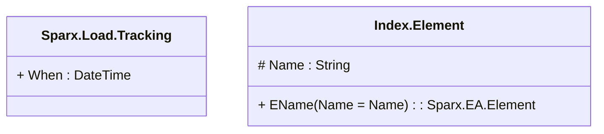

# sparx

---

## Aspect Sparx.Load.Tracking
when was the item loaded

||Name|Type|*|@|=|
|-|-|-|-|-|
|+|When|DateTime||||

---

## Entity Index.Element
Index of <b>Element</b> by name - existence of this entity adds the index

||Name|Type|*|@|=|
|-|-|-|-|-|
|#|Name|String||||
||EName|Sparx.EA.Element|||Name = Name|

