# readme

```mermaid
classDiagram
    class Edge2 {
        # From  : Node
        # To  : Node
        # TypeName  : String
        + Name  : String
    }
    class Edge3 {
        # From  : Node
        # To  : Node
        # TypeName  : String
        + Name  : String
    }
    class Edge4 {
        # From  : Node
        # To  : Node
        # TypeName  : String
        + Name  : String
    }
    class Edge5 {
        # From  : Node
        # To  : Node
        # TypeName  : String
        + Name  : String
    }
    class Edge6 {
        # From  : Node
        # To  : Node
        # TypeName  : String
        + Name  : String
    }
    class Graph.Route {
        # Name  : String
        + Rules  : HashSet~Graph.Rule~
    }
    Graph.Route *-- Graph.Rule
    class Graph.Rule {
        # FromType  : String
        # ToType  : String
        # EdgeType  : String
    }
    class ERP.PathMessage {
        # Node  : Node
        # Route  : Graph.Route
        # Length  : Int32
        # Targets  : HashSet~String~
        + Edges  : HashSet~Graph.HiperEdge~
    }
    ERP.PathMessage *-- Graph.Route
    ERP.PathMessage *-- String
    ERP.PathMessage *-- Graph.HiperEdge
    class ERP.Location.Address {
        # Id  : Int32
        + Deleted  = false
        + Street  : String
        + Town  : String
        + City  : String
        + County  : String
        + Country  : ERP.Location.Country
        + PostalCode  : String
        + Valid  = (((Country == null) || (PostalCode == null)) ? false : true)
    }
    ERP.Location.Address --> ERP.Location.Country
    class ERP.Location.Country {
        # Id  : Int16
        + Deleted  = false
        + Name  : String
        + ShippingCharge  : Decimal
        + Valid  = ((Name == null) ? false : true)
    }
    class ERP.Location.Store {
        # Id  : Int32
        + Deleted  = false
        + Street  : String
        + Town  : String
        + City  : String
        + County  : String
        + Country  : ERP.Location.Country
        + PostalCode  : String
        + Valid  = (((Country == null) || (PostalCode == null)) ? false : true)
        + Name  : String
        + StoreSales (Store = this) : ERP.Sales.Order
    }
    ERP.Location.Store --> ERP.Location.Country
    class ERP.Finance.Tarriff {
        # From  : ERP.Location.Country
        # To  : ERP.Location.Country
        + Deleted  = false
        + Tax  : ERP.Finance.Tax
        + Valid  = ((((From == null) || (To == null)) || (Tax == null)) ? false : true)
    }
    ERP.Finance.Tarriff --> ERP.Location.Country
    ERP.Finance.Tarriff --> ERP.Location.Country
    ERP.Finance.Tarriff --> ERP.Finance.Tax
    class ERP.Finance.Tax {
        # Id  : Int16
        + Deleted  = false
        + Name  : String
        + Rate  : Decimal
        + Valid  = (((Name == null) || (Rate == null)) ? false : true)
    }
    class ERP.Finance.Shipping {
        # From  : ERP.Location.Country
        # To  : ERP.Location.Country
        + Deleted  = false
        + Fee  : Decimal
        + Valid  = ((((From == null) || (To == null)) || (Fee == null)) ? false : true)
    }
    ERP.Finance.Shipping --> ERP.Location.Country
    ERP.Finance.Shipping --> ERP.Location.Country
    class ERP.Products.Product {
        # Id  : Int32
        + Deleted  = false
        + Name  : String
        + Tax  : ERP.Finance.Tax
        + Supplier  : ERP.Client.Customer
        + Shipping  : Decimal
        + Valid  = (((((Name == null) || (Tax == null)) || (Supplier == null)) || (Shipping == null)) ? false : true)
        + Price () : ERP.Products.Price
        + Rate () = Tax?.Rate
    }
    ERP.Products.Product --> ERP.Finance.Tax
    ERP.Products.Product --> ERP.Client.Customer
    ERP.Products.Product o-- ERP.Products.Price
    class ERP.Products.Price {
        # owner  : ERP.Products.Product
        + Deleted  = false
        + Name  : String
        + Sell  : Decimal
        + Buy  : Decimal
        + Valid  = ((((Name == null) || (Sell == null)) || (Buy == null)) ? false : true)
    }
    class ERP.Client.Customer {
        # Id  : Int32
        + Deleted  = false
        + Name  : String
        + BillTo  : ERP.Location.Address
        + ShipTo  : ERP.Location.Address
        + Valid  = ((((((Name == null) || (BillTo == null)) || (BillTo?.Valid == false)) || (ShipTo == null)) || (ShipTo?.Valid == false)) ? false : true)
        + CustomerOrders (Customer = this) : ERP.Sales.Order
    }
    ERP.Client.Customer --> ERP.Location.Address
    ERP.Client.Customer --> ERP.Location.Address
    ERP.Client.Customer ..|> Edge2
    class ERP.Sales.Salesperson {
        # Id  : Int16
        + Name  : String
        + CommissionRate  = 0.0m
        + Valid  = ((Name == null) ? false : true)
        + Sales (Salesperson = this) : ERP.Sales.Order
    }
    class ERP.Sales.OrderLine {
        # LineNumber  : Int16
        + Product  : ERP.Products.Product
        + Units  : Decimal
        + Valid  = (((Product == null) || (Units == null)) ? false : true)
        + Price () = (Product?.Price?.Sell * Units)
        + Cost () = ((Product?.Price?.Buy * Units) + Product?.Shipping)
        + Shipping () = Product?.Shipping
        + Tax () = (Product?.Rate * Units)
    }
    ERP.Sales.OrderLine --> ERP.Products.Product
    class ERP.Sales.Order {
        # OrderNumber  : Int32
        + Deleted  = false
        + Customer  : ERP.Client.Customer
        + Store  : ERP.Location.Store
        + Salesperson  : ERP.Sales.Salesperson
        + Lines  : HashSet~ERP.Sales.OrderLine~
        + Valid  = (((((((Customer == null) || (changed(Customer) == true)) || (Store == null)) || (_changeStore == true)) || (count(Lines.LineNumber) == 0)) || (_changeLines == true)) ? false : true)
        + Invoiced () = ((Invoice == null) ? true : false)
        + _changeStore () = (((changed(Store) == true) && (Invoiced == true)) ? true : false)
        + _changeLines () = (((changedLines(this) == true) && (Invoiced == true)) ? true : false)
        + Tariff (From = Store?.Country, To = Customer?.BillTo?.Country) : ERP.Finance.Tarriff
        + Shipping (From = Store?.Country, To = Customer?.ShipTo?.Country) : ERP.Finance.Shipping
        + Total () = sum(Lines.Price)
        + ShippingCost () = ((Shipping == null) ? sum(Lines.Shipping) : (sum(Lines.Shipping) + max(Shipping.Fee)))
        + SalesTax () = sum(Lines.Tax)
        + TariffTax () = ((Tariff == null) ? 0.0m : (max(Tariff.Tax.Rate) * Total))
        + Bill () = (((Total + ShippingCost) + SalesTax) + TariffTax)
        + Cost () = sum(Lines.Cost)
        + Commission () = ((Salesperson == null) ? 0.0m : (Profit * Salesperson?.CommissionRate))
        + Profit () = ((0.0m + Total) - Cost)
        + Invoice () : ERP.Sales.Invoice
    }
    ERP.Sales.Order --> ERP.Client.Customer
    ERP.Sales.Order --> ERP.Location.Store
    ERP.Sales.Order --> ERP.Sales.Salesperson
    ERP.Sales.Order *-- ERP.Sales.OrderLine
    ERP.Sales.Order o-- ERP.Sales.Invoice
    ERP.Sales.Order ..|> Edge2
    ERP.Sales.Order ..|> Edge3
    ERP.Sales.Order ..|> Edge4
    ERP.Sales.Order ..|> Edge5
    ERP.Sales.Order ..|> Edge6
    class ERP.Sales.Invoice {
        # owner  : ERP.Sales.Order
        + TaxDate  : DateTime
        + Total  : Decimal
        + ShippingCost  : Decimal
        + SalesTax  : Decimal
        + TariffTax  : Decimal
        + Cost  : Decimal
        + Profit  : Decimal
        + Commission  : Decimal
        + Bill () = ((((0.0m + Total) + ShippingCost) + SalesTax) + TariffTax)
    }
    ERP.Sales.Invoice ..|> Edge2
```

---

## View Edge2

||Name|Type|*|@|=|
|-|-|-|-|-|-|
|#|From|Node||||
|#|To|Node||||
|#|TypeName|String||||
|+|Name|String||||

---

## View Edge3

||Name|Type|*|@|=|
|-|-|-|-|-|-|
|#|From|Node||||
|#|To|Node||||
|#|TypeName|String||||
|+|Name|String||||

---

## View Edge4

||Name|Type|*|@|=|
|-|-|-|-|-|-|
|#|From|Node||||
|#|To|Node||||
|#|TypeName|String||||
|+|Name|String||||

---

## View Edge5

||Name|Type|*|@|=|
|-|-|-|-|-|-|
|#|From|Node||||
|#|To|Node||||
|#|TypeName|String||||
|+|Name|String||||

---

## View Edge6

||Name|Type|*|@|=|
|-|-|-|-|-|-|
|#|From|Node||||
|#|To|Node||||
|#|TypeName|String||||
|+|Name|String||||

---

## Value Graph.Route
Route across a graph of edge/node to form an HiperEdge

||Name|Type|*|@|=|
|-|-|-|-|-|-|
|#|Name|String||||
|+|Rules|HashSet<Graph.Rule>||||

---

## Value Graph.Rule
A rule for a route that matched as a type of Edge to a HiperEdge, e.g. { Name = 'relation', Rules = [{FromType = 'Person', ToType = 'Person', EdgeType = 'Mother'}]}

||Name|Type|*|@|=|
|-|-|-|-|-|-|
|#|FromType|String||||
|#|ToType|String||||
|#|EdgeType|String||||

---

## Message ERP.PathMessage
Remote execution of path requests

||Name|Type|*|@|=|
|-|-|-|-|-|-|
|#|Node|Node||||
|#|Route|Graph.Route||||
|#|Length|Int32||||
|#|Targets|HashSet<String>||||
|+|Edges|HashSet<Graph.HiperEdge>||||

---

## EntityImpl ERP.Location.Address

||Name|Type|*|@|=|
|-|-|-|-|-|-|
|#|Id|Int32||||
||Deleted|Some(Boolean)|Flag for read horizon filter to hide when true||false|
|+|Street|String||||
|+|Town|String||||
|+|City|String||||
|+|County|String||||
|+|Country|ERP.Location.Country||||
|+|PostalCode|String||||
||Valid|Some(Boolean)|||(((Country == null) \|\| (PostalCode == null)) ? false : true)|

---

## EntityImpl ERP.Location.Country

||Name|Type|*|@|=|
|-|-|-|-|-|-|
|#|Id|Int16||||
||Deleted|Some(Boolean)|Flag for read horizon filter to hide when true||false|
|+|Name|String||||
|+|ShippingCharge|Decimal||||
||Valid|Some(Boolean)|||((Name == null) ? false : true)|

---

## EntityImpl ERP.Location.Store

||Name|Type|*|@|=|
|-|-|-|-|-|-|
|#|Id|Int32||||
||Deleted|Some(Boolean)|Flag for read horizon filter to hide when true||false|
|+|Street|String||||
|+|Town|String||||
|+|City|String||||
|+|County|String||||
|+|Country|ERP.Location.Country||||
|+|PostalCode|String||||
||Valid|Some(Boolean)|||(((Country == null) \|\| (PostalCode == null)) ? false : true)|
|+|Name|String||||
||StoreSales|ERP.Sales.Order|||Store = this|

---

## EntityImpl ERP.Finance.Tarriff

||Name|Type|*|@|=|
|-|-|-|-|-|-|
|#|From|ERP.Location.Country||||
|#|To|ERP.Location.Country||||
||Deleted|Some(Boolean)|Flag for read horizon filter to hide when true||false|
|+|Tax|ERP.Finance.Tax||||
||Valid|Some(Boolean)|||((((From == null) \|\| (To == null)) \|\| (Tax == null)) ? false : true)|

---

## EntityImpl ERP.Finance.Tax

||Name|Type|*|@|=|
|-|-|-|-|-|-|
|#|Id|Int16||||
||Deleted|Some(Boolean)|Flag for read horizon filter to hide when true||false|
|+|Name|String||||
|+|Rate|Decimal||||
||Valid|Some(Boolean)|||(((Name == null) \|\| (Rate == null)) ? false : true)|

---

## EntityImpl ERP.Finance.Shipping

||Name|Type|*|@|=|
|-|-|-|-|-|-|
|#|From|ERP.Location.Country||||
|#|To|ERP.Location.Country||||
||Deleted|Some(Boolean)|Flag for read horizon filter to hide when true||false|
|+|Fee|Decimal||||
||Valid|Some(Boolean)|||((((From == null) \|\| (To == null)) \|\| (Fee == null)) ? false : true)|

---

## EntityImpl ERP.Products.Product

||Name|Type|*|@|=|
|-|-|-|-|-|-|
|#|Id|Int32||||
||Deleted|Some(Boolean)|Flag for read horizon filter to hide when true||false|
|+|Name|String||||
|+|Tax|ERP.Finance.Tax||||
|+|Supplier|ERP.Client.Customer||||
|+|Shipping|Decimal||||
||Valid|Some(Boolean)|||(((((Name == null) \|\| (Tax == null)) \|\| (Supplier == null)) \|\| (Shipping == null)) ? false : true)|
|+|Price|ERP.Products.Price||||
||Rate|Some(Decimal)|||Tax?.Rate|

---

## AspectImpl ERP.Products.Price

||Name|Type|*|@|=|
|-|-|-|-|-|-|
|#|owner|ERP.Products.Product||||
||Deleted|Some(Boolean)|Flag for read horizon filter to hide when true||false|
|+|Name|String||||
|+|Sell|Decimal||||
|+|Buy|Decimal||||
||Valid|Some(Boolean)|||((((Name == null) \|\| (Sell == null)) \|\| (Buy == null)) ? false : true)|

---

## EntityImpl ERP.Client.Customer

||Name|Type|*|@|=|
|-|-|-|-|-|-|
|#|Id|Int32||||
||Deleted|Some(Boolean)|Flag for read horizon filter to hide when true||false|
|+|Name|String||||
|+|BillTo|ERP.Location.Address||||
|+|ShipTo|ERP.Location.Address||||
||Valid|Some(Boolean)|||((((((Name == null) \|\| (BillTo == null)) \|\| (BillTo?.Valid == false)) \|\| (ShipTo == null)) \|\| (ShipTo?.Valid == false)) ? false : true)|
||CustomerOrders|ERP.Sales.Order|||Customer = this|

---

## EntityImpl ERP.Sales.Salesperson

||Name|Type|*|@|=|
|-|-|-|-|-|-|
|#|Id|Int16||||
|+|Name|String||||
||CommissionRate|Some(Decimal)|||0.0m|
||Valid|Some(Boolean)|||((Name == null) ? false : true)|
||Sales|ERP.Sales.Order|||Salesperson = this|

---

## Value ERP.Sales.OrderLine

||Name|Type|*|@|=|
|-|-|-|-|-|-|
|#|LineNumber|Int16||||
|+|Product|ERP.Products.Product||||
|+|Units|Decimal||||
||Valid|Some(Boolean)|||(((Product == null) \|\| (Units == null)) ? false : true)|
||Price|Some(Decimal)|||(Product?.Price?.Sell * Units)|
||Cost|Some(Decimal)|||((Product?.Price?.Buy * Units) + Product?.Shipping)|
||Shipping|Some(Decimal)|||Product?.Shipping|
||Tax|Some(Decimal)|||(Product?.Rate * Units)|

---

## EntityImpl ERP.Sales.Order
    An order placed by a customer for delivery    <remarks>the store and customer can not be changed once it has been invoiced </remarks>

||Name|Type|*|@|=|
|-|-|-|-|-|-|
|#|OrderNumber|Int32||||
||Deleted|Some(Boolean)|Flag for read horizon filter to hide when true||false|
|+|Customer|ERP.Client.Customer||||
|+|Store|ERP.Location.Store||||
|+|Salesperson|ERP.Sales.Salesperson||||
|+|Lines|HashSet<ERP.Sales.OrderLine>|all the order lines included in the order|||
||Valid|Some(Boolean)|||(((((((Customer == null) \|\| (changed(Customer) == true)) \|\| (Store == null)) \|\| (_changeStore == true)) \|\| (count(Lines.LineNumber) == 0)) \|\| (_changeLines == true)) ? false : true)|
||Invoiced|Some(Boolean)|||((Invoice == null) ? true : false)|
||_changeStore|Some(Boolean)|||(((changed(Store) == true) && (Invoiced == true)) ? true : false)|
||_changeLines|Some(Boolean)|||(((changedLines(this) == true) && (Invoiced == true)) ? true : false)|
||Tariff|ERP.Finance.Tarriff|optional tarriff for this order - ommision implies tarriff free trade||From = Store?.Country, To = Customer?.BillTo?.Country|
||Shipping|ERP.Finance.Shipping|optional internnational shipping sharges ||From = Store?.Country, To = Customer?.ShipTo?.Country|
||Total|Some(Decimal)|total value of the order for all lines||sum(Lines.Price)|
||ShippingCost|Some(Decimal)|Shipping cost can only be calculated once we know if the order is international||((Shipping == null) ? sum(Lines.Shipping) : (sum(Lines.Shipping) + max(Shipping.Fee)))|
||SalesTax|Some(Decimal)|||sum(Lines.Tax)|
||TariffTax|Some(Decimal)|||((Tariff == null) ? 0.0m : (max(Tariff.Tax.Rate) * Total))|
||Bill|Some(Decimal)|Bill price sent to the customer||(((Total + ShippingCost) + SalesTax) + TariffTax)|
||Cost|Some(Decimal)|The cost of sourcing the products for the order||sum(Lines.Cost)|
||Commission|Some(Decimal)|||((Salesperson == null) ? 0.0m : (Profit * Salesperson?.CommissionRate))|
||Profit|Some(Decimal)|Gross profit from order, less costs and Commission||((0.0m + Total) - Cost)|
|+|Invoice|ERP.Sales.Invoice|the optional invoice aspect with coists and tax frozen |||

---

## AspectImpl ERP.Sales.Invoice
    An order placed by a customer for delivery    <remarks>the store and customer can not be changed once it has been invoiced </remarks>

||Name|Type|*|@|=|
|-|-|-|-|-|-|
|#|owner|ERP.Sales.Order||||
|+|TaxDate|DateTime||||
|+|Total|Decimal||||
|+|ShippingCost|Decimal||||
|+|SalesTax|Decimal||||
|+|TariffTax|Decimal||||
|+|Cost|Decimal||||
|+|Profit|Decimal||||
|+|Commission|Decimal||||
||Bill|Some(Decimal)|||((((0.0m + Total) + ShippingCost) + SalesTax) + TariffTax)|

