# readme

```mermaid
classDiagram
    class Edge2 {
        # From  : Node
        # To  : Node
        # TypeName  : String
        + Name  : String
    }
    Edge2 ..|> Edge
    class Hiperspace.VectorSpace {
        # owner  : Any
        + Vector  : Hiperspace.Vector
    }
    class Graph.Route {
        # Name  : String
        + Rules  : HashSet~Graph.Rule~
    }
    class Graph.Rule {
        # FromType  : String
        # ToType  : String
        # EdgeType  : String
    }
    class Graph.HiperEdge {
        # From  : Node
        # To  : Node
        # TypeName  : String
        + Name  : String
        + Edge  : Edge
        + Source  : Graph.HiperEdge
        + Width  = 1
        + Length  = 1
    }
    class Location.PathMessage {
        # Node  : Node
        # Route  : Graph.Route
        # Length  : Int32
        # Targets  : HashSet~String~
        + Edges  : HashSet~Graph.HiperEdge~
    }
    class Location.Country {
        # Code  : String
        + VectorSpace () : Location.CountryVectorSpace
        + AirPorts (Country = this) : Location.Airport
    }
    Location.Country ..|> Node
    class Location.Airport {
        # Country  : Location.Country
        # Code  : String
        + VectorSpace () : Location.AirportVectorSpace
    }
    Location.Airport ..|> Node
    Location.Airport ..|> Edge
    Location.Airport ..|> VectorNode
    class Location.AirportVectorSpace {
        # owner  : Location.Airport
        + Vector  : Hiperspace.Vector
    }
    class Location.CountryVectorSpace {
        # owner  : Location.Country
        + Vector  : Hiperspace.Vector
    }
```

---

## View Edge2

||Name|Type|*|@|=|
|-|-|-|-|-|-|
|#|From|Node||||
|#|To|Node||||
|#|TypeName|String||||
|+|Name|String||||

---

## View Hiperspace.VectorSpace
 Aspect used to search for similar entities

||Name|Type|*|@|=|
|-|-|-|-|-|-|
|#|owner|Any|owner of the segment/aspect as an object|||
|+|Vector|Hiperspace.Vector||||

---

## Value Graph.Route
Route across a graph of edge/node to form an HiperEdge

||Name|Type|*|@|=|
|-|-|-|-|-|-|
|#|Name|String||||
|+|Rules|HashSet<Graph.Rule>||||

---

## Value Graph.Rule
A rule for a route that matched as a type of Edge to a HiperEdge, e.g. { Name = 'relation', Rules = [{FromType = 'Person', ToType = 'Person', EdgeType = 'Mother'}]}

||Name|Type|*|@|=|
|-|-|-|-|-|-|
|#|FromType|String||||
|#|ToType|String||||
|#|EdgeType|String||||

---

## View Graph.HiperEdge
Path from one Node to another Node over a number of routes

||Name|Type|*|@|=|
|-|-|-|-|-|-|
|#|From|Node||||
|#|To|Node||||
|#|TypeName|String||||
|+|Name|String||||
|+|Edge|Edge|The Edge that provides the end of this Path|||
|+|Source|Graph.HiperEdge|The shortest source Path that this path extends|||
||Width|Some(Int32)|The number of distict paths between the Nodes||1|
||Length|Some(Int32)|The shortest number of Edges in the Path||1|

---

## Message Location.PathMessage
Remote execution of path requests

||Name|Type|*|@|=|
|-|-|-|-|-|-|
|#|Node|Node||||
|#|Route|Graph.Route||||
|#|Length|Int32||||
|#|Targets|HashSet<String>||||
|+|Edges|HashSet<Graph.HiperEdge>||||

---

## EntityImpl Location.Country
National Country

||Name|Type|*|@|=|
|-|-|-|-|-|-|
|#|Code|String||||
|+|VectorSpace|Location.CountryVectorSpace||||
||AirPorts|Location.Airport|||Country = this|

---

## EntityImpl Location.Airport
Airport within a country

||Name|Type|*|@|=|
|-|-|-|-|-|-|
|#|Country|Location.Country||||
|#|Code|String||||
|+|VectorSpace|Location.AirportVectorSpace||||

---

## AspectImpl Location.AirportVectorSpace
Airport within a country

||Name|Type|*|@|=|
|-|-|-|-|-|-|
|#|owner|Location.Airport||||
|+|Vector|Hiperspace.Vector||||

---

## AspectImpl Location.CountryVectorSpace
National Country

||Name|Type|*|@|=|
|-|-|-|-|-|-|
|#|owner|Location.Country||||
|+|Vector|Hiperspace.Vector||||

