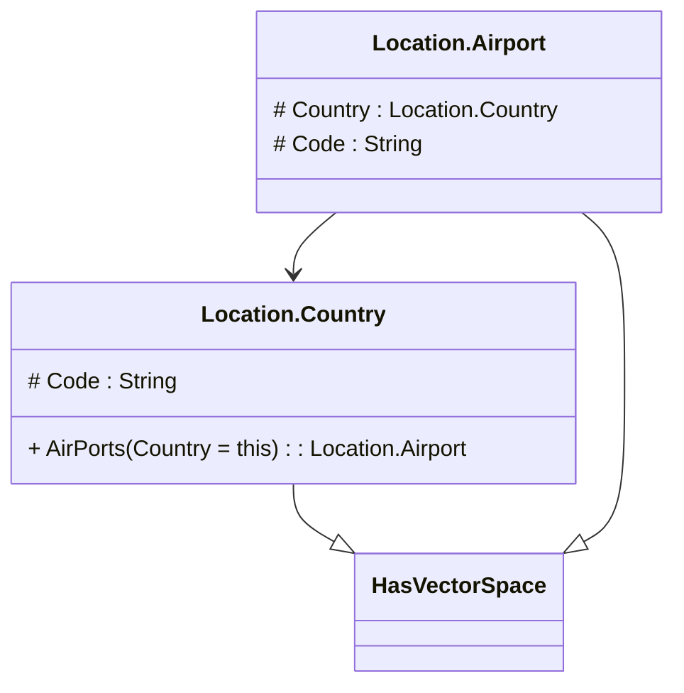

# readme

---

## Entity Location.Country
National Country

||Name|Type|*|@|=|
|-|-|-|-|-|-|
|#|Code|String||||
||AirPorts|Location.Airport|||Country = this|

---

## Entity Location.Airport
Airport within a country

||Name|Type|*|@|=|
|-|-|-|-|-|-|
|#|Country|Location.Country||||
|#|Code|String||||

