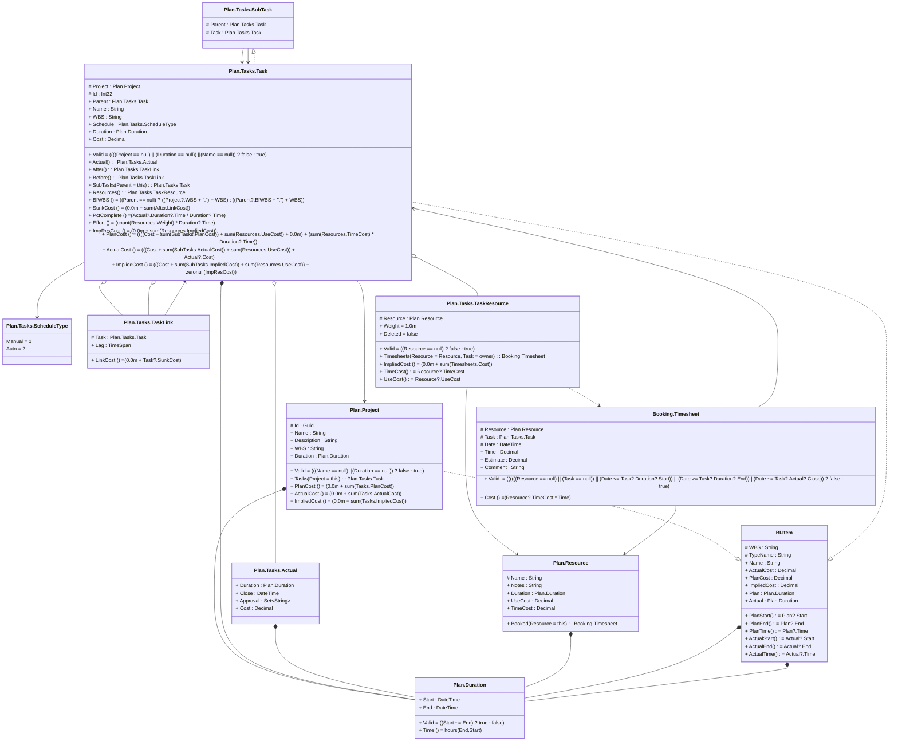

# readme

---

## Value Plan.Duration

||Name|Type|*|@|=|
|-|-|-|-|-|
|+|Start|DateTime||||
|+|End|DateTime||||
||Valid||||((Start <= End) ? true : false)|
||Time||||hours(End,Start)|

---

## Entity Plan.Project
What is a project, exactly? We talk a lot about specific facets of project management, but it’s sometimes valuable to start at the root and dig into the basics.To fully understand high-level project management concepts, it’s important to know the simple answers. When you can call on this knowledge, more complicated concepts are easier to master. Whether you’re the project manager or a stakeholder, give your next project definition with these project management tips in mind.<b>Project Definition</b>A project is a set of tasks that must be completed within a defined timeline to accomplish a specific set of goals. These tasks are completed by a group of people known as the project team, which is led by a project manager, who oversees the planning, scheduling, tracking and successful completion of projects.Besides the project team, projects require resources such as labor, materials and equipment. Organizations and individualsmanage projects with a wide range of objectives. These can take many forms, from constructing a building to planning an event and even completing a certain duty. Retailers, for example, may pursue projects that improve the way they track order fulfillment. Construction teams complete projects any time they plan and build something—and so on!Project management software gives you the tools to manage all the parts of a project so it is delivered on time and within budget. ProjectManager is award-winning project management software with features to plan, manage and track your project in real time. Organize tasks on our robust Gantt, link all four types of task dependencies to avoid costly delays and save your project plan by setting a baseline. This allows you to track your actual progress against your planned progress to help you stay on track. Get started with ProjectManager today for free.

||Name|Type|*|@|=|
|-|-|-|-|-|
|#|Id|Guid||||
|+|Name|String||||
|+|Description|String||||
|+|WBS|String||||
|+|Duration|Plan.Duration||||
||Valid||||(((Name == null) \|\| (Duration == null)) ? false : true)|
||Tasks|Plan.Tasks.Task|||Project = this|
||PlanCost||||(0.0m + sum(Tasks.PlanCost))|
||ActualCost||||(0.0m + sum(Tasks.ActualCost))|
||ImpliedCost||||(0.0m + sum(Tasks.ImpliedCost))|

---

## View Plan.Tasks.SubTask
SubTask enables the entity Task to export more than one Edge

||Name|Type|*|@|=|
|-|-|-|-|-|
|#|Parent|Plan.Tasks.Task||||
|#|Task|Plan.Tasks.Task||||

---

## Entity Plan.Tasks.Task
While the word “task” might bring about feelings of despair related to chores or undesirable actions, this is usually related more so to the way you have to manage your time than the task itthis.In this article, we’ll do a deep dive into tasks, show you the best ways to break down larger projects into them, while covering efficient approaches to manage and distribute tasks.

||Name|Type|*|@|=|
|-|-|-|-|-|
|#|Project|Plan.Project||||
|#|Id|Int32||||
|+|Parent|Plan.Tasks.Task||||
|+|Name|String||||
|+|WBS|String||||
|+|Schedule|Plan.Tasks.ScheduleType||||
|+|Duration|Plan.Duration||||
|+|Cost|Decimal||||
||Valid||||((((Project == null) \|\| (Duration == null)) \|\| (Name == null)) ? false : true)|
|+|Actual|Plan.Tasks.Actual||||
|+|After|Plan.Tasks.TaskLink||||
|+|Before|Plan.Tasks.TaskLink||||
||SubTasks|Plan.Tasks.Task|||Parent = this|
|+|Resources|Plan.Tasks.TaskResource||||
||BIWBS||||((Parent == null) ? ((Project?.WBS + ".") + WBS) : ((Parent?.BIWBS + ".") + WBS))|
||SunkCost||Cost of prior tasks that can not be recovered|CubeMeasure(Aggregate?.Sum)|(0.0m + sum(After.LinkCost))|
||PctComplete||||(Actual?.Duration?.Time / Duration?.Time)|
||Effort|||CubeMeasure(Aggregate?.Sum)|(count(Resources.Weight) * Duration?.Time)|
||ImpResCost||||(0.0m + sum(Resources.ImpliedCost))|
||PlanCost|||CubeMeasure(Aggregate?.Sum)|((((Cost + sum(SubTasks.PlanCost)) + sum(Resources.UseCost)) + 0.0m) + (sum(Resources.TimeCost) * Duration?.Time))|
||ActualCost|||CubeMeasure(Aggregate?.Sum)|(((Cost + sum(SubTasks.ActualCost)) + sum(Resources.UseCost)) + Actual?.Cost)|
||ImpliedCost|||CubeMeasure(Aggregate?.Sum)|(((Cost + sum(SubTasks.ImpliedCost)) + sum(Resources.UseCost)) + zeronull(ImpResCost))|

---

## Aspect Plan.Tasks.Actual

||Name|Type|*|@|=|
|-|-|-|-|-|
|+|Duration|Plan.Duration||||
|+|Close|DateTime||||
|+|Approval|Set<String>|set of the controllers th  at have approved this update|||
|+|Cost|Decimal||||

---

## Segment Plan.Tasks.TaskLink

||Name|Type|*|@|=|
|-|-|-|-|-|
|#|Task|Plan.Tasks.Task||||
|+|Lag|TimeSpan||||
||LinkCost||||(0.0m + Task?.SunkCost)|

---

## Enum Plan.Tasks.ScheduleType

||Name|Type|*|@|=|
|-|-|-|-|-|
||Manual|Int32|||1|
||Auto|Int32|||2|

---

## Segment Plan.Tasks.TaskResource
Resources used by the task

||Name|Type|*|@|=|
|-|-|-|-|-|
|#|Resource|Plan.Resource||||
||Weight||||1.0m|
||Deleted||||false|
||Valid||||((Resource == null) ? false : true)|
||Timesheets|Booking.Timesheet|||Resource = Resource, Task = owner|
||ImpliedCost||Implied Cost||(0.0m + sum(Timesheets.Cost))|
||TimeCost||Time cost is an aggregate because the Resource reference is not infered to be a single||Resource?.TimeCost|
||UseCost||Use cost is an aggregate because the Resource reference is not infered to be a single||Resource?.UseCost|

---

## Entity Plan.Resource
Resource planning is the process of determining how a business will allocate resources in a project, such as assigning tasks to individuals based on their skills and availability. It helps balance demand and capacity across projects, allowing you to keep tight timelines and manage stakeholder expectations.

||Name|Type|*|@|=|
|-|-|-|-|-|
|#|Name|String||||
|+|Notes|String|Description of the resource|||
|+|Duration|Plan.Duration|Dates the resource is available|||
|+|UseCost|Decimal|Cost each time the resource is used|||
|+|TimeCost|Decimal|Cost per hour of resource usage|||
||Booked|Booking.Timesheet|||Resource = this|

---

## View BI.Item

||Name|Type|*|@|=|
|-|-|-|-|-|
|#|WBS|String||||
|#|TypeName|String||||
|+|Name|String||||
|+|ActualCost|Decimal||||
|+|PlanCost|Decimal||||
|+|ImpliedCost|Decimal||||
|+|Plan|Plan.Duration||||
|+|Actual|Plan.Duration||||
||PlanStart||||Plan?.Start|
||PlanEnd||||Plan?.End|
||PlanTime||||Plan?.Time|
||ActualStart||||Actual?.Start|
||ActualEnd||||Actual?.End|
||ActualTime||||Actual?.Time|

---

## Entity Booking.Timesheet
Time booking by resources against 

||Name|Type|*|@|=|
|-|-|-|-|-|
|#|Resource|Plan.Resource||||
|#|Task|Plan.Tasks.Task||||
|#|Date|DateTime||||
|+|Time|Decimal||||
|+|Estimate|Decimal|Estimated time to comple  te this task|||
|+|Comment|String||||
||Valid||||((((((Resource == null) \|\| (Task == null)) \|\| (Date <= Task?.Duration?.Start)) \|\| (Date >= Task?.Duration?.End)) \|\| (Date <= Task?.Actual?.Close)) ? false : true)|
||Cost||||(Resource?.TimeCost * Time)|

