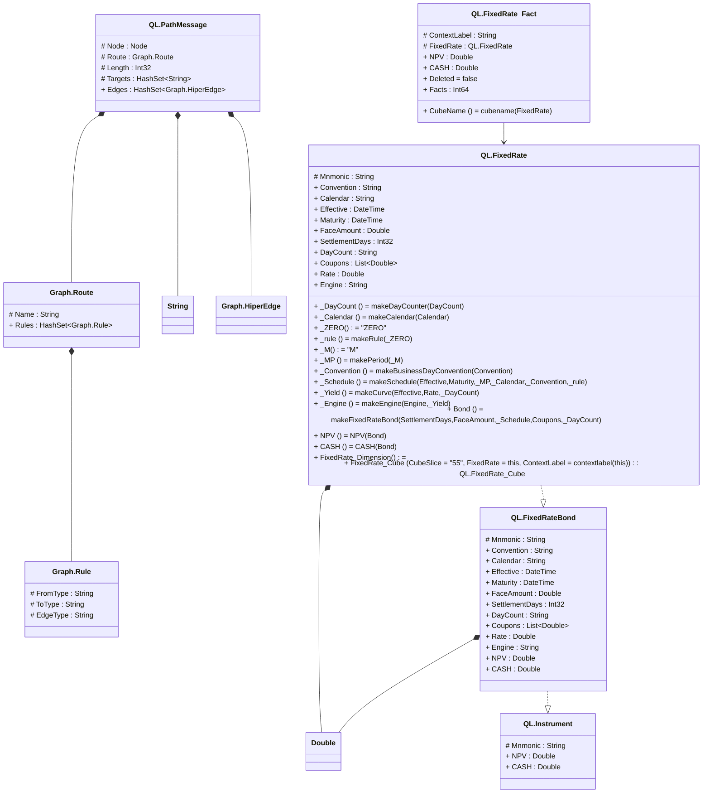

# readme

---

## Value Graph.Route
Route across a graph of edge/node to form an HiperEdge

||Name|Type|*|@|=|
|-|-|-|-|-|
|#|Name|String||||
|+|Rules|HashSet<Graph.Rule>||||

---

## Value Graph.Rule
A rule for a route that matched as a type of Edge to a HiperEdge, e.g. { Name = 'relation', Rules = [{FromType = 'Person', ToType = 'Person', EdgeType = 'Mother'}]}

||Name|Type|*|@|=|
|-|-|-|-|-|
|#|FromType|String||||
|#|ToType|String||||
|#|EdgeType|String||||

---

## Message QL.PathMessage
Remote execution of path requests

||Name|Type|*|@|=|
|-|-|-|-|-|
|#|Node|Node||||
|#|Route|Graph.Route||||
|#|Length|Int32||||
|#|Targets|HashSet<String>||||
|+|Edges|HashSet<Graph.HiperEdge>||||

---

## View QL.FixedRateBond
Calcualtion view for a fixed rate bond

||Name|Type|*|@|=|
|-|-|-|-|-|
|#|Mnmonic|String||||
|+|Convention|String||||
|+|Calendar|String||||
|+|Effective|DateTime||||
|+|Maturity|DateTime||||
|+|FaceAmount|Double||||
|+|SettlementDays|Int32||||
|+|DayCount|String||||
|+|Coupons|List<Double>||||
|+|Rate|Double||||
|+|Engine|String||||
|+|NPV|Double||||
|+|CASH|Double||||

---

## View QL.Instrument
Base view that all Instrument types can be converted to

||Name|Type|*|@|=|
|-|-|-|-|-|
|#|Mnmonic|String||||
|+|NPV|Double||||
|+|CASH|Double||||

---

## EntityImpl QL.FixedRate
A Fixed rate bond stored in hiperspace

||Name|Type|*|@|=|
|-|-|-|-|-|
|#|Mnmonic|String||||
|+|Convention|String||||
|+|Calendar|String||||
|+|Effective|DateTime||||
|+|Maturity|DateTime||||
|+|FaceAmount|Double||||
|+|SettlementDays|Int32||||
|+|DayCount|String||||
|+|Coupons|List<Double>||||
|+|Rate|Double||||
|+|Engine|String||||
||_DayCount|Some(QLNet.DayCounter)|||makeDayCounter(DayCount)|
||_Calendar|Some(QLNet.Calendar)|||makeCalendar(Calendar)|
||_ZERO|Some(String)|||"ZERO"|
||_rule|Some(QLNet.DateGeneration.Rule)|||makeRule(_ZERO)|
||_M|Some(String)|||"M"|
||_MP|Some(QLNet.Period)|||makePeriod(_M)|
||_Convention|Some(QLNet.BusinessDayConvention)|||makeBusinessDayConvention(Convention)|
||_Schedule|Some(QLNet.Schedule)|||makeSchedule(Effective,Maturity,_MP,_Calendar,_Convention,_rule)|
||_Yield|Some(QLNet.Handle<QLNet.YieldTermStructure>)|||makeCurve(Effective,Rate,_DayCount)|
||_Engine|Some(QLNet.IPricingEngine)|||makeEngine(Engine,_Yield)|
||Bond|Some(QLNet.FixedRateBond)||Once()|makeFixedRateBond(SettlementDays,FaceAmount,_Schedule,Coupons,_DayCount)|
||NPV|Some(Double)||CubeMeasure(Aggregate?.Sum)|NPV(Bond)|
||CASH|Some(Double)||CubeMeasure(Aggregate?.Sum)|CASH(Bond)|
||FixedRate_Dimension|Some(QL.FixedRate)||||
||FixedRate_Cube|QL.FixedRate_Cube|Reference to the dimension|CubeFactReference()|CubeSlice = "55", FixedRate = this, ContextLabel = contextlabel(this)|

---

## EntityImpl QL.FixedRate_Fact
A Fixed rate bond stored in hiperspace

||Name|Type|*|@|=|
|-|-|-|-|-|
|#|ContextLabel|String||||
|#|FixedRate|QL.FixedRate|A Fixed rate bond stored in hiperspace|CubeDimensionReference()||
|+|NPV|Double||CubeMeasure(Aggregate?.Sum)||
|+|CASH|Double||CubeMeasure(Aggregate?.Sum)||
||Deleted|Some(Boolean)|The cube fact has been deleted||false|
|+|Facts|Int64|Indicate that the Cube Slice is a Fact|||
||CubeName|Some(String)|||cubename(FixedRate)|

