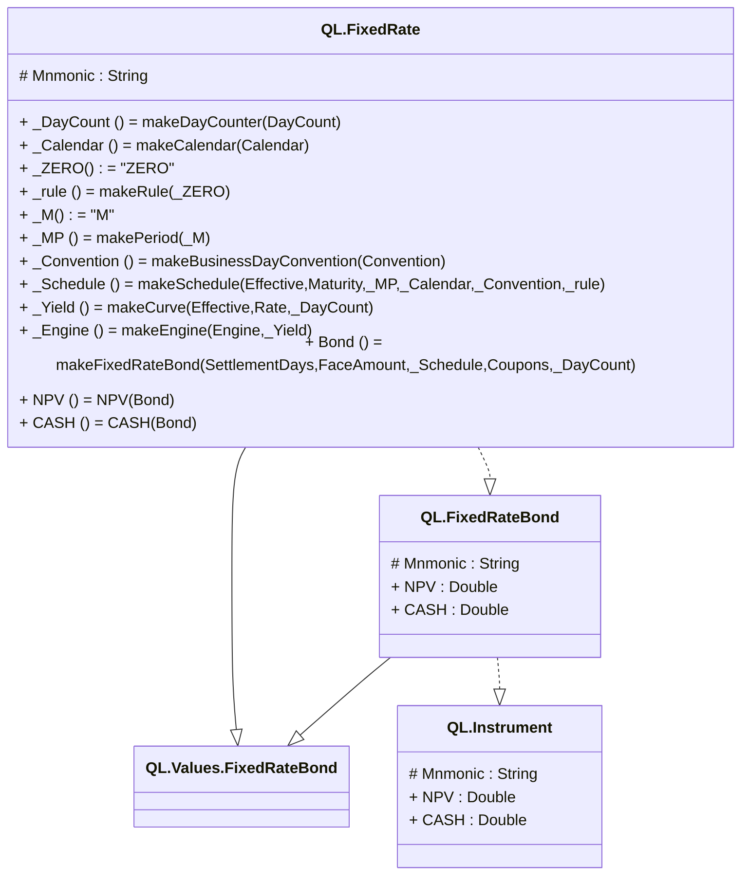

# readme

---

## Type QL.Values.FixedRateBond
values for FixedRateBond

||Name|Type|*|@|=|
|-|-|-|-|-|
|+|Convention|String||||
|+|Calendar|String||||
|+|Effective|DateTime||||
|+|Maturity|DateTime||||
|+|FaceAmount|Double||||
|+|SettlementDays|Int32||||
|+|DayCount|String||||
|+|Coupons|List<Double>||||
|+|Rate|Double||||
|+|Engine|String||||

---

## View QL.FixedRateBond
Calcualtion view for a fixed rate bond

||Name|Type|*|@|=|
|-|-|-|-|-|
|#|Mnmonic|String||||
|+|NPV|Double||||
|+|CASH|Double||||

---

## View QL.Instrument
Base view that all Instrument types can be converted to

||Name|Type|*|@|=|
|-|-|-|-|-|
|#|Mnmonic|String||||
|+|NPV|Double||||
|+|CASH|Double||||

---

## Entity QL.FixedRate
A Fixed rate bond stored in hiperspace

||Name|Type|*|@|=|
|-|-|-|-|-|
|#|Mnmonic|String||||
||_DayCount||||makeDayCounter(DayCount)|
||_Calendar||||makeCalendar(Calendar)|
||_ZERO||||"ZERO"|
||_rule||||makeRule(_ZERO)|
||_M||||"M"|
||_MP||||makePeriod(_M)|
||_Convention||||makeBusinessDayConvention(Convention)|
||_Schedule||||makeSchedule(Effective,Maturity,_MP,_Calendar,_Convention,_rule)|
||_Yield||||makeCurve(Effective,Rate,_DayCount)|
||_Engine||||makeEngine(Engine,_Yield)|
||Bond|||Once()|makeFixedRateBond(SettlementDays,FaceAmount,_Schedule,Coupons,_DayCount)|
||NPV|||CubeMeasure(Aggregate?.Sum)|NPV(Bond)|
||CASH|||CubeMeasure(Aggregate?.Sum)|CASH(Bond)|

