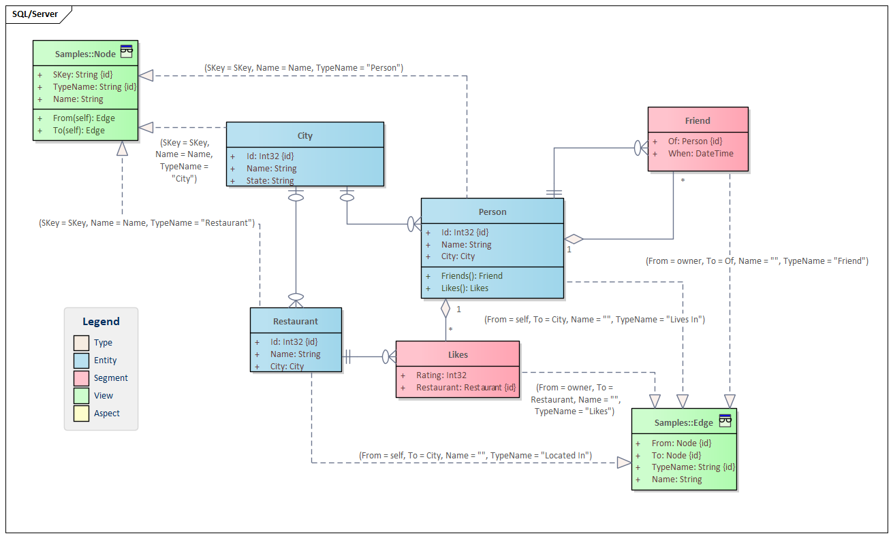

# Hiperspace Graph
## Porting of SQL/Server Graph Sample 

Microsoft have added Graph support to their database product [SQL/Server 2017](https://learn.microsoft.com/en-us/sql/relational-databases/graphs/sql-graph-sample?view=sql-server-ver16) and Provided examples of using it with a normal relational database.

Our view is that graph is best presented as a view of a normal data structure, a separate database is not needed when the data can be presented as a graph without duplication.  Implementing the SQL Server samples with Hiperspace shows the advantages of a relational-first view.

SQL/Server identifies *Node* tables with `AS NODE` constraint. HiLang *Node* is a `view` provided by an {*Entity*, *Segment*, *Aspect*} 

SQL/Server does not constrain the type of `Node` that can be connected with an `Edge` (*Restaurant* can be a friend of a *Person* and a *Person* can live in a *Restaurant*). HiLang *Fried* is is a view projection as `Edge`.



|Name |SQL Server type | HiLang type | Note |
|--|--|--|--|
|Person | table | entity|
|Restaurant | table | entity|
|City | table | entity|
| Likes | Edge | segment |
|Friend| Edge | segment |
| Lives in | Edge | |derived from City value |
| Located in | Edge || derived from City value |

 ```
 entity City = Node (SKey = SKey, Name = Name, TypeName = "City") ( Id : Int32) {Name : String, State : String };
entity Person 
	= Node (SKey = SKey, Name = Name, TypeName = "Person"), 
	  Edge (From = self, To = City, Name = "", TypeName = "Lives In") 
	( Id : Int32) { Name : String, City : City } [ Friends : Friend, Likes : Likes ]; 
entity Restaurant 
	= Node (SKey = SKey, Name = Name, TypeName = "Restaurant"),
	  Edge (From = self, To = City, Name = "", TypeName = "Located In") 
	  ( Id : Int32) {Name : String, City : City };
segment Friend 
	= Edge (From = owner, To = Of, Name = "", TypeName = "Friend")
	(Of : Person) {When : DateTime};
segment Likes = Edge (From = owner, To = Restaurant, Name = "", TypeName = "Likes") (Restaurant : Restaurant) { Rating : Int32};

 ```

 ## Data load

 ```
 INSERT INTO likes
    VALUES ((SELECT $node_id FROM Person WHERE ID = 1), (SELECT $node_id FROM Restaurant WHERE ID = 1), 9)
         , ((SELECT $node_id FROM Person WHERE ID = 2), (SELECT $node_id FROM Restaurant WHERE ID = 2), 9)
         , ((SELECT $node_id FROM Person WHERE ID = 3), (SELECT $node_id FROM Restaurant WHERE ID = 3), 9)
         , ((SELECT $node_id FROM Person WHERE ID = 4), (SELECT $node_id FROM Restaurant WHERE ID = 3), 9)
         , ((SELECT $node_id FROM Person WHERE ID = 5), (SELECT $node_id FROM Restaurant WHERE ID = 3), 9);
```
is eqivilent to. **Note** Hiperpace does not join to *Person* and *Restaurant* since `Likes` is a segment of `Persaon`
```
    var likes = new List<(Person.KeyType p, Restaurant.KeyType r, int n)>()
    {
        (new Person.KeyType {Id = 1}, new Restaurant.KeyType { Id = 1}, 9),
        (new Person.KeyType {Id = 2}, new Restaurant.KeyType { Id = 2}, 9),
        (new Person.KeyType {Id = 3}, new Restaurant.KeyType { Id = 3}, 9),
        (new Person.KeyType {Id = 4}, new Restaurant.KeyType { Id = 3}, 9),
        (new Person.KeyType {Id = 5}, new Restaurant.KeyType { Id = 3}, 9),
    };
```

## Query
Find people who like a restaurant in the same city they live in
```
SELECT Person.name
FROM Person, likes, Restaurant, livesIn, City, locatedIn
WHERE MATCH (Person-(likes)->Restaurant-(locatedIn)->City 
AND Person-(livesIn)->City);
```
is equivilent to
```
dom.Edges
.Where(e => e.TypeName == "Likes")
.ToArray()
.Select(e => (e.From?.Value?.Object as Person, e.To?.Value?.Object as Restaurant))
.Where(p => p.Item1?.City == p.Item2?.City)
.Select(p => p.Item1)
```
*For Hiperspace we could either cast the `Edge` to {Person, Restaurant} or retrieved properties* 

Find friends-of-friends-of-friends, excluding those cases where the relationship "loops back".
For example, Alice is a friend of John; John is a friend of Mary; and Mary in turn is a friend of Alice.
This causes a "loop" back to Alice. In many cases, it is necessary to explicitly check for such loops and exclude the results.
```
SELECT CONCAT(Person.name, '->', Person2.name, '->', Person3.name, '->', Person4.name)
FROM Person, friendOf, Person as Person2, friendOf as friendOffriend, Person as Person3, friendOf as friendOffriendOfFriend, Person as Person4
WHERE MATCH (Person-(friendOf)->Person2-(friendOffriend)->Person3-(friendOffriendOfFriend)->Person4)
AND Person2.name != Person.name
AND Person3.name != Person2.name
AND Person4.name != Person3.name
AND Person.name != Person4.name;
```
is equivilent to
```
    Func<Edge, string> fname = e => e.From?.Value?.Name ?? "";
    var edges = dom.Edges.Where(e => e.TypeName == "Friend").ToArray();
    foreach (var line in 
        (from p in edges
            join p2 in edges on p.To equals p2.From
            join p3 in edges on p2.To equals p3.From
            join p4 in edges on p3.To equals p4.From
            where p2.From != p.From
            && p3.From != p2.From
            && p4.From != p3.From
            && p.From != p4.From
            select $"\t{fname(p)}->{fname(p2)}->{fname(p3)}->{fname(p4)}"
        ))
        _output.WriteLine(line);
```
|output|
|-|
|Jacob->Mary->Alice->John|
|Julie->Jacob->Mary->Alice|

## Recursive search
```
    foreach (var p in dom.Nodes)
        foreach (var path in Paths(p) ?? ImmutableList<ImmutableList<Node>>.Empty)
        {
            var sb = new StringBuilder();
            foreach (var point in path ?? ImmutableList<Node>.Empty)
                sb.Append($"->{point.Name}");
            _output.WriteLine($"\t{sb.ToString().Substring(2)}");
        }

```
|output| note|
|-|-|
|John->Mary->Alice|excluded when joining 4 nodes|
|Mary->Alice->John|excluded when joining 4 nodes|
|Alice->John->Mary|excluded when joining 4 nodes|
|Jacob->Mary->Alice->John|
|Julie->Jacob->Mary->Alice->**John** |5th path omitted in join|

These examples use C#, but would be a more direct representation with F#.
Hiperspace treats the entire graph as if it was in memory