# SocialMedia.mmd

```mermaid
classDiagram
    class Hiperspace.VectorSpace {
        # owner  : Any
        + Vector  : Hiperspace.Vector
    }
    Hiperspace.VectorSpace *-- Hiperspace.Vector
    class Graph.Route {
        # Name  : String
        + Rules  : HashSet~Graph.Rule~
    }
    Graph.Route *-- Graph.Rule
    class Graph.Rule {
        # FromType  : String
        # ToType  : String
        # EdgeType  : String
    }
    class Social.Media.Location {
        # owner  : Any
        + Deleted  : Boolean
        + Latitude  : Double
        + Longitude  : Double
    }
    class Social.Media.Person {
        # Id  : Guid
        + FirstName  : String
        + LastName  : String
        + Gender  : String
        + Birthday  : DateTime
        + Email  : HashSet~String~
        + Speaks  : HashSet~String~
        + Deleted  = false
        + CreatedDate  : DateTime
        + BrowserUsed  : String
        + LocationIP  : String
        + Interest () : Social.Media.Interest
        + Follows () : Social.Media.Follows
        + Friends () : Social.Media.Friend
        + StudyAt () : Social.Media.AtUniversity
        + WorkAt () : Social.Media.AtCompany
        + Posts (Creator = this) : Social.Media.Post
        + Name () = ((FirstName + " ") + LastName)
        + TypeName () = "Person"
        + ByFirstName (FirstName = FirstName) : Social.Media.Person
        + ByLastName (LastName = LastName) : Social.Media.Person
        + Location () : Social.Media.PersonLocation
        + VectorSpace () : Social.Media.PersonVectorSpace
    }
    Social.Media.Person *-- String
    Social.Media.Person *-- String
    Social.Media.Person o-- Social.Media.Interest
    Social.Media.Person o-- Social.Media.Follows
    Social.Media.Person o-- Social.Media.Friend
    Social.Media.Person o-- Social.Media.AtUniversity
    Social.Media.Person o-- Social.Media.AtCompany
    Social.Media.Person o-- Social.Media.PersonLocation
    Social.Media.Person o-- Social.Media.PersonVectorSpace
    class Social.Media.Follows {
        # owner  : Social.Media.Person
        # Person  : Social.Media.Person
        + Deleted  = false
        + Name () = Person?.Name
    }
    Social.Media.Follows --> Social.Media.Person
    class Social.Media.Friend {
        # owner  : Social.Media.Person
        # Person  : Social.Media.Person
        + Deleted  = false
        + Name () = Person?.Name
        + Distance () = distance(owner,Person)
    }
    Social.Media.Friend --> Social.Media.Person
    class Social.Media.Interest {
        # owner  : Social.Media.Person
        # Tag  : Social.Media.Tag
    }
    Social.Media.Interest --> Social.Media.Tag
    class Social.Media.Tag {
        # Name  : String
        + Class  : Social.Media.TagClass
        + TypeName () = "Tag"
    }
    Social.Media.Tag --> Social.Media.TagClass
    class Social.Media.TagClass {
        # Name  : String
        + IsSubClassOf  : Social.Media.TagClass
        + SubClassses (IsSubClassOf = this) : Social.Media.TagClass
        + TypeName () = "TagClass"
    }
    class Social.Media.Forum {
        # Id  : Guid
        + Deleted  = false
        + Title  : String
        + CreationDate  : DateTime
        + Moderator  : Social.Media.Person
        + TypeName () = "Forum"
        + Name () = Title
    }
    Social.Media.Forum --> Social.Media.Person
    class Social.Media.HasTag {
        # owner  : Social.Media.Post
        # Tag  : Social.Media.Tag
    }
    Social.Media.HasTag --> Social.Media.Tag
    class Social.Media.Post {
        # Id  : Guid
        + CreatedDate  : DateTime
        + BrowserUsed  : String
        + LocationIP  : String
        + LocatedIn  : Social.Media.Country
        + Deleted  = false
        + Creator  : Social.Media.Person
        + Forum  : Social.Media.Forum
        + Content  : String
        + Language  : String
        + Image  : String
        + VectorSpace () : Social.Media.PostVectorSpace
        + Location () : Social.Media.PostLocation
        + HasTag () : Social.Media.HasTag
        + Replies () : Social.Media.Comment
        + Name () = Content
        + TypeName () = "Post"
    }
    Social.Media.Post --> Social.Media.Country
    Social.Media.Post --> Social.Media.Person
    Social.Media.Post --> Social.Media.Forum
    Social.Media.Post o-- Social.Media.PostVectorSpace
    Social.Media.Post o-- Social.Media.PostLocation
    Social.Media.Post o-- Social.Media.HasTag
    Social.Media.Post o-- Social.Media.Comment
    class Social.Media.Comment {
        # owner  : Social.Media.Post
        # Creator  : Social.Media.Person
        + CreatedDate  : DateTime
        + BrowserUsed  : String
        + LocationIP  : String
        + LocatedIn  : Social.Media.Country
        + Deleted  = false
        + Content  : String
        + VectorSpace () : Social.Media.PostReplieVectorSpace
        + Location () : Social.Media.PostReplieLocation
    }
    Social.Media.Comment --> Social.Media.Person
    Social.Media.Comment --> Social.Media.Country
    Social.Media.Comment o-- Social.Media.PostReplieVectorSpace
    Social.Media.Comment o-- Social.Media.PostReplieLocation
    class Social.Media.Country {
        # Name  : String
        + Continent  : Social.Media.Continent
        + Cities (Country = this) : Social.Media.City
        + TypeName () = "Country"
    }
    Social.Media.Country --> Social.Media.Continent
    class Social.Media.City {
        # Name  : String
        + Country  : Social.Media.Country
        + TypeName () = "City"
    }
    Social.Media.City --> Social.Media.Country
    class Social.Media.Continent {
        # Name  : String
        + TypeName () = "Continent"
    }
    class Social.Media.Company {
        # Name  : String
        + Location  : Social.Media.City
        + TypeName () = "Company"
    }
    Social.Media.Company --> Social.Media.City
    class Social.Media.University {
        # Name  : String
        + Location  : Social.Media.City
        + TypeName () = "University"
    }
    Social.Media.University --> Social.Media.City
    class Social.Media.AtCompany {
        # owner  : Social.Media.Person
        # Value  : Social.Media.Company
        + FromDate  : DateTime
        + ToDate  : DateTime
    }
    Social.Media.AtCompany --> Social.Media.Company
    class Social.Media.AtUniversity {
        # owner  : Social.Media.Person
        # Value  : Social.Media.University
        + FromDate  : DateTime
        + ToDate  : DateTime
    }
    Social.Media.AtUniversity --> Social.Media.University
    class Social.Media.PostReplieLocation {
        # owner  : Social.Media.Comment
        + Deleted  = false
        + Latitude  : Double
        + Longitude  : Double
    }
    Social.Media.PostReplieLocation ..|> Social.Media.Location
    class Social.Media.PostReplieVectorSpace {
        # owner  : Social.Media.Comment
        + Vector  : Hiperspace.Vector
    }
    Social.Media.PostReplieVectorSpace *-- Hiperspace.Vector
    Social.Media.PostReplieVectorSpace ..|> Hiperspace.VectorSpace
    class Social.Media.PostLocation {
        # owner  : Social.Media.Post
        + Deleted  = false
        + Latitude  : Double
        + Longitude  : Double
    }
    Social.Media.PostLocation ..|> Social.Media.Location
    class Social.Media.PostVectorSpace {
        # owner  : Social.Media.Post
        + Vector  : Hiperspace.Vector
    }
    Social.Media.PostVectorSpace *-- Hiperspace.Vector
    Social.Media.PostVectorSpace ..|> Hiperspace.VectorSpace
    class Social.Media.PersonVectorSpace {
        # owner  : Social.Media.Person
        + Vector  : Hiperspace.Vector
    }
    Social.Media.PersonVectorSpace *-- Hiperspace.Vector
    Social.Media.PersonVectorSpace ..|> Hiperspace.VectorSpace
    class Social.Media.PersonLocation {
        # owner  : Social.Media.Person
        + Deleted  = false
        + Latitude  : Double
        + Longitude  : Double
    }
    Social.Media.PersonLocation ..|> Social.Media.Location
    class SocialMedia.PathMessage {
        # Node  : Node
        # Route  : Graph.Route
        # Length  : Int32
        # Targets  : HashSet~String~
        + Edges  : HashSet~Graph.HiperEdge~
    }
    SocialMedia.PathMessage *-- Graph.Route
    SocialMedia.PathMessage *-- String
    SocialMedia.PathMessage *-- Graph.HiperEdge
```

---

## View Hiperspace.VectorSpace
 Aspect used to search for similar entities

||Name|Type|*|@|=|
|-|-|-|-|-|-|
|#|owner|Any|owner of the segment/aspect as an object|||
|+|Vector|Hiperspace.Vector||||

---

## Value Graph.Route
Route across a graph of edge/node to form an HiperEdge

||Name|Type|*|@|=|
|-|-|-|-|-|-|
|#|Name|String||||
|+|Rules|HashSet<Graph.Rule>||||

---

## Value Graph.Rule
A rule for a route that matched as a type of Edge to a HiperEdge, e.g. { Name = 'relation', Rules = [{FromType = 'Person', ToType = 'Person', EdgeType = 'Mother'}]}

||Name|Type|*|@|=|
|-|-|-|-|-|-|
|#|FromType|String||||
|#|ToType|String||||
|#|EdgeType|String||||

---

## View Social.Media.Location

||Name|Type|*|@|=|
|-|-|-|-|-|-|
|#|owner|Any|owner of the segment/aspect as an object|||
|+|Deleted|Boolean|Flag for read horizon filter to hide when true|||
|+|Latitude|Double||||
|+|Longitude|Double||||

---

## EntityImpl Social.Media.Person

||Name|Type|*|@|=|
|-|-|-|-|-|-|
|#|Id|Guid||||
|+|FirstName|String||||
|+|LastName|String||||
|+|Gender|String||||
|+|Birthday|DateTime||||
|+|Email|HashSet<String>||||
|+|Speaks|HashSet<String>||||
||Deleted|Some(Boolean)|Flag for read horizon filter to hide when true||false|
|+|CreatedDate|DateTime||||
|+|BrowserUsed|String||||
|+|LocationIP|String||||
|+|Interest|Social.Media.Interest||||
|+|Follows|Social.Media.Follows||||
|+|Friends|Social.Media.Friend||||
|+|StudyAt|Social.Media.AtUniversity||||
|+|WorkAt|Social.Media.AtCompany||||
||Posts|Social.Media.Post|||Creator = this|
||Name|Some(String)|||((FirstName + " ") + LastName)|
||TypeName|Some(String)|||"Person"|
||ByFirstName|Social.Media.Person|Q1 index||FirstName = FirstName|
||ByLastName|Social.Media.Person|Q1 index||LastName = LastName|
|+|Location|Social.Media.PersonLocation||||
|+|VectorSpace|Social.Media.PersonVectorSpace||||

---

## SegmentImpl Social.Media.Follows

||Name|Type|*|@|=|
|-|-|-|-|-|-|
|#|owner|Social.Media.Person||||
|#|Person|Social.Media.Person||||
||Deleted|Some(Boolean)|Flag for read horizon filter to hide when true||false|
||Name|Some(String)|||Person?.Name|

---

## SegmentImpl Social.Media.Friend

||Name|Type|*|@|=|
|-|-|-|-|-|-|
|#|owner|Social.Media.Person||||
|#|Person|Social.Media.Person||||
||Deleted|Some(Boolean)|Flag for read horizon filter to hide when true||false|
||Name|Some(String)|||Person?.Name|
||Distance|Some(Double)|||distance(owner,Person)|

---

## SegmentImpl Social.Media.Interest

||Name|Type|*|@|=|
|-|-|-|-|-|-|
|#|owner|Social.Media.Person||||
|#|Tag|Social.Media.Tag||||

---

## EntityImpl Social.Media.Tag

||Name|Type|*|@|=|
|-|-|-|-|-|-|
|#|Name|String||||
|+|Class|Social.Media.TagClass||||
||TypeName|Some(String)|||"Tag"|

---

## EntityImpl Social.Media.TagClass

||Name|Type|*|@|=|
|-|-|-|-|-|-|
|#|Name|String||||
|+|IsSubClassOf|Social.Media.TagClass||||
||SubClassses|Social.Media.TagClass|||IsSubClassOf = this|
||TypeName|Some(String)|||"TagClass"|

---

## EntityImpl Social.Media.Forum

||Name|Type|*|@|=|
|-|-|-|-|-|-|
|#|Id|Guid||||
||Deleted|Some(Boolean)|Flag for read horizon filter to hide when true||false|
|+|Title|String||||
|+|CreationDate|DateTime||||
|+|Moderator|Social.Media.Person||||
||TypeName|Some(String)|||"Forum"|
||Name|Some(String)|||Title|

---

## SegmentImpl Social.Media.HasTag

||Name|Type|*|@|=|
|-|-|-|-|-|-|
|#|owner|Social.Media.Post||||
|#|Tag|Social.Media.Tag||||

---

## EntityImpl Social.Media.Post

||Name|Type|*|@|=|
|-|-|-|-|-|-|
|#|Id|Guid||||
|+|CreatedDate|DateTime||||
|+|BrowserUsed|String||||
|+|LocationIP|String||||
|+|LocatedIn|Social.Media.Country||||
||Deleted|Some(Boolean)|Flag for read horizon filter to hide when true||false|
|+|Creator|Social.Media.Person||||
|+|Forum|Social.Media.Forum||||
|+|Content|String||||
|+|Language|String||||
|+|Image|String||||
|+|VectorSpace|Social.Media.PostVectorSpace||||
|+|Location|Social.Media.PostLocation||||
|+|HasTag|Social.Media.HasTag||||
|+|Replies|Social.Media.Comment||||
||Name|Some(String)|||Content|
||TypeName|Some(String)|||"Post"|

---

## SegmentImpl Social.Media.Comment

||Name|Type|*|@|=|
|-|-|-|-|-|-|
|#|owner|Social.Media.Post||||
|#|Creator|Social.Media.Person||||
|+|CreatedDate|DateTime||||
|+|BrowserUsed|String||||
|+|LocationIP|String||||
|+|LocatedIn|Social.Media.Country||||
||Deleted|Some(Boolean)|Flag for read horizon filter to hide when true||false|
|+|Content|String||||
|+|VectorSpace|Social.Media.PostReplieVectorSpace||||
|+|Location|Social.Media.PostReplieLocation||||

---

## EntityImpl Social.Media.Country

||Name|Type|*|@|=|
|-|-|-|-|-|-|
|#|Name|String||||
|+|Continent|Social.Media.Continent||||
||Cities|Social.Media.City|||Country = this|
||TypeName|Some(String)|||"Country"|

---

## EntityImpl Social.Media.City

||Name|Type|*|@|=|
|-|-|-|-|-|-|
|#|Name|String||||
|+|Country|Social.Media.Country||||
||TypeName|Some(String)|||"City"|

---

## EntityImpl Social.Media.Continent

||Name|Type|*|@|=|
|-|-|-|-|-|-|
|#|Name|String||||
||TypeName|Some(String)|||"Continent"|

---

## EntityImpl Social.Media.Company

||Name|Type|*|@|=|
|-|-|-|-|-|-|
|#|Name|String||||
|+|Location|Social.Media.City||||
||TypeName|Some(String)|||"Company"|

---

## EntityImpl Social.Media.University

||Name|Type|*|@|=|
|-|-|-|-|-|-|
|#|Name|String||||
|+|Location|Social.Media.City||||
||TypeName|Some(String)|||"University"|

---

## SegmentImpl Social.Media.AtCompany

||Name|Type|*|@|=|
|-|-|-|-|-|-|
|#|owner|Social.Media.Person||||
|#|Value|Social.Media.Company||||
|+|FromDate|DateTime||||
|+|ToDate|DateTime||||

---

## SegmentImpl Social.Media.AtUniversity

||Name|Type|*|@|=|
|-|-|-|-|-|-|
|#|owner|Social.Media.Person||||
|#|Value|Social.Media.University||||
|+|FromDate|DateTime||||
|+|ToDate|DateTime||||

---

## AspectImpl Social.Media.PostReplieLocation

||Name|Type|*|@|=|
|-|-|-|-|-|-|
|#|owner|Social.Media.Comment||||
||Deleted|Some(Boolean)|Flag for read horizon filter to hide when true||false|
|+|Latitude|Double||||
|+|Longitude|Double||||

---

## AspectImpl Social.Media.PostReplieVectorSpace

||Name|Type|*|@|=|
|-|-|-|-|-|-|
|#|owner|Social.Media.Comment||||
|+|Vector|Hiperspace.Vector||||

---

## AspectImpl Social.Media.PostLocation

||Name|Type|*|@|=|
|-|-|-|-|-|-|
|#|owner|Social.Media.Post||||
||Deleted|Some(Boolean)|Flag for read horizon filter to hide when true||false|
|+|Latitude|Double||||
|+|Longitude|Double||||

---

## AspectImpl Social.Media.PostVectorSpace

||Name|Type|*|@|=|
|-|-|-|-|-|-|
|#|owner|Social.Media.Post||||
|+|Vector|Hiperspace.Vector||||

---

## AspectImpl Social.Media.PersonVectorSpace

||Name|Type|*|@|=|
|-|-|-|-|-|-|
|#|owner|Social.Media.Person||||
|+|Vector|Hiperspace.Vector||||

---

## AspectImpl Social.Media.PersonLocation

||Name|Type|*|@|=|
|-|-|-|-|-|-|
|#|owner|Social.Media.Person||||
||Deleted|Some(Boolean)|Flag for read horizon filter to hide when true||false|
|+|Latitude|Double||||
|+|Longitude|Double||||

---

## Message SocialMedia.PathMessage
Remote execution of path requests

||Name|Type|*|@|=|
|-|-|-|-|-|-|
|#|Node|Node||||
|#|Route|Graph.Route||||
|#|Length|Int32||||
|#|Targets|HashSet<String>||||
|+|Edges|HashSet<Graph.HiperEdge>||||

