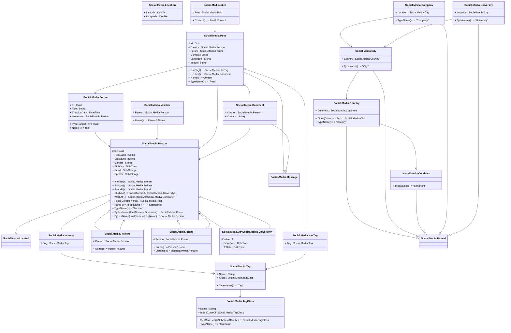

# SocialMedia.mmd

---

## Aspect Social.Media.Location

||Name|Type|*|@|=|
|-|-|-|-|-|
|+|Latitude|Double||||
|+|Longitude|Double||||

---

## Type Social.Media.Located

||Name|Type|*|@|=|
|-|-|-|-|-|
|+|CreatedDate|DateTime||||
|+|BrowserUsed|String||||
|+|LocationIP|String||||
|+|Location|Social.Media.Location||||

---

## Entity Social.Media.Person

||Name|Type|*|@|=|
|-|-|-|-|-|
|#|Id|Guid||||
|+|FirstName|String||||
|+|LastName|String||||
|+|Gender|String||||
|+|Birthday|DateTime||||
|+|Email|Set<String>||||
|+|Speaks|Set<String>||||
|+|Interest|Social.Media.Interest||||
|+|Follows|Social.Media.Follows||||
|+|Friends|Social.Media.Friend||||
|+|StudyAt|Social.Media.At<Social.Media.University>||||
|+|WorkAt|Social.Media.At<Social.Media.Company>||||
||Posts|Social.Media.Post|||Creator = this|
||Name||||((FirstName + " ") + LastName)|
||TypeName||||"Person"|
||ByFirstName|Social.Media.Person|Q1 index||FirstName = FirstName|
||ByLastName|Social.Media.Person|Q1 index||LastName = LastName|

---

## Segment Social.Media.Follows

||Name|Type|*|@|=|
|-|-|-|-|-|
|#|Person|Social.Media.Person||||
||Name||||Person?.Name|

---

## Segment Social.Media.Friend

||Name|Type|*|@|=|
|-|-|-|-|-|
|#|Person|Social.Media.Person||||
||Name||||Person?.Name|
||Distance||||distance(owner,Person)|

---

## Segment Social.Media.Likes

||Name|Type|*|@|=|
|-|-|-|-|-|
|#|Post|Social.Media.Post||||
||Content||||Post?.Content|

---

## Segment Social.Media.Interest

||Name|Type|*|@|=|
|-|-|-|-|-|
|#|Tag|Social.Media.Tag||||

---

## Entity Social.Media.Tag

||Name|Type|*|@|=|
|-|-|-|-|-|
|#|Name|String||||
|+|Class|Social.Media.TagClass||||
||TypeName||||"Tag"|

---

## Entity Social.Media.TagClass

||Name|Type|*|@|=|
|-|-|-|-|-|
|#|Name|String||||
|+|IsSubClassOf|Social.Media.TagClass||||
||SubClassses|Social.Media.TagClass|||IsSubClassOf = this|
||TypeName||||"TagClass"|

---

## Entity Social.Media.Forum

||Name|Type|*|@|=|
|-|-|-|-|-|
|#|Id|Guid||||
|+|Title|String||||
|+|CreationDate|DateTime||||
|+|Moderator|Social.Media.Person||||
||TypeName||||"Forum"|
||Name||||Title|

---

## Segment Social.Media.Member

||Name|Type|*|@|=|
|-|-|-|-|-|
|#|Person|Social.Media.Person||||
||Name||||Person?.Name|

---

## Segment Social.Media.HasTag

||Name|Type|*|@|=|
|-|-|-|-|-|
|#|Tag|Social.Media.Tag||||

---

## Type Social.Media.Message

||Name|Type|*|@|=|
|-|-|-|-|-|
|+|LocatedIn|Social.Media.Country||||

---

## Entity Social.Media.Post

||Name|Type|*|@|=|
|-|-|-|-|-|
|#|Id|Guid||||
|+|Creator|Social.Media.Person||||
|+|Forum|Social.Media.Forum||||
|+|Content|String||||
|+|Language|String||||
|+|Image|String||||
|+|HasTag|Social.Media.HasTag||||
|+|Replies|Social.Media.Comment||||
||Name||||Content|
||TypeName||||"Post"|

---

## Segment Social.Media.Comment

||Name|Type|*|@|=|
|-|-|-|-|-|
|#|Creator|Social.Media.Person||||
|+|Content|String||||

---

## Type Social.Media.Named

||Name|Type|*|@|=|
|-|-|-|-|-|
|#|Name|String||||

---

## Entity Social.Media.Country

||Name|Type|*|@|=|
|-|-|-|-|-|
|+|Continent|Social.Media.Continent||||
||Cities|Social.Media.City|||Country = this|
||TypeName||||"Country"|

---

## Entity Social.Media.City

||Name|Type|*|@|=|
|-|-|-|-|-|
|+|Country|Social.Media.Country||||
||TypeName||||"City"|

---

## Entity Social.Media.Continent

||Name|Type|*|@|=|
|-|-|-|-|-|
||TypeName||||"Continent"|

---

## Entity Social.Media.Company

||Name|Type|*|@|=|
|-|-|-|-|-|
|+|Location|Social.Media.City||||
||TypeName||||"Company"|

---

## Entity Social.Media.University

||Name|Type|*|@|=|
|-|-|-|-|-|
|+|Location|Social.Media.City||||
||TypeName||||"University"|

---

## Segment Social.Media.At<T>

||Name|Type|*|@|=|
|-|-|-|-|-|
|#|Value|T||||
|+|FromDate|DateTime||||
|+|ToDate|DateTime||||

