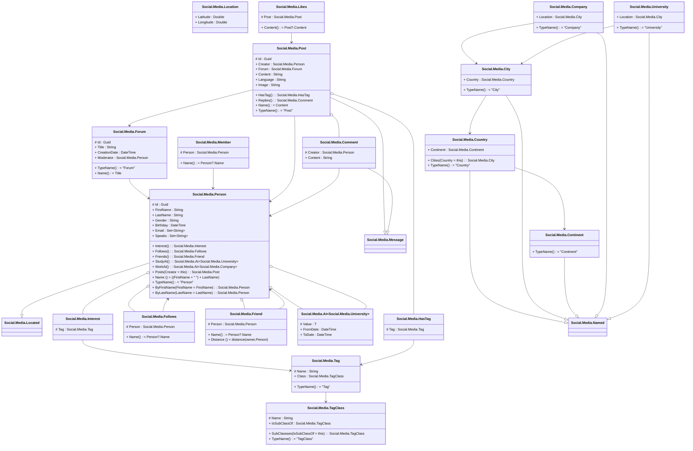

# Graph performance test 
[sample problem ](https://homepages.cwi.nl/~boncz/snb-challenge/graph_benchmarking_edbt_summer_school_2015-part1.pdf)

## Logical

```mermaid

classDiagram

    class Social.Media.Location {


        + Latitude  : Double
        + Longitude  : Double

    }


 

    class Social.Media.Person {

        # Id  : Guid

        + FirstName  : String
        + LastName  : String
        + Gender  : String
        + Birthday  : DateTime
        + Email  : Set~String~
        + Speaks  : Set~String~

        + Interest () : Social.Media.Interest
        + Follows () : Social.Media.Follows
        + Friends () : Social.Media.Friend
        + StudyAt () : Social.Media.At~Social.Media.University~
        + WorkAt () : Social.Media.At~Social.Media.Company~
        + Posts (Creator = this) : Social.Media.Post
        + Name () = ((FirstName + " ") + LastName)
        + TypeName () = "Person"
        + ByFirstName (FirstName = FirstName) : Social.Media.Person
        + ByLastName (LastName = LastName) : Social.Media.Person
    }


    Social.Media.Person --|> Social.Media.Located


    Social.Media.Person o-- Social.Media.Interest
    Social.Media.Person o-- Social.Media.Follows
    Social.Media.Person o-- Social.Media.Friend
    Social.Media.Person o-- Social.Media.At~Social.Media.University~
    Social.Media.Person o-- Social.Media.At~Social.Media.Company~

 

    class Social.Media.Follows {

        # Person  : Social.Media.Person


        + Name () = Person?.Name
    }


    Social.Media.Follows --> Social.Media.Person


 

    class Social.Media.Friend {

        # Person  : Social.Media.Person


        + Name () = Person?.Name
        + Distance () = distance(owner,Person)
    }


    Social.Media.Friend --> Social.Media.Person


 

    class Social.Media.Likes {

        # Post  : Social.Media.Post


        + Content () = Post?.Content
    }


    Social.Media.Likes --> Social.Media.Post


 

    class Social.Media.Interest {

        # Tag  : Social.Media.Tag


    }


    Social.Media.Interest --> Social.Media.Tag


 

    class Social.Media.Tag {

        # Name  : String

        + Class  : Social.Media.TagClass

        + TypeName () = "Tag"
    }


    Social.Media.Tag --> Social.Media.TagClass


 

    class Social.Media.TagClass {

        # Name  : String

        + IsSubClassOf  : Social.Media.TagClass

        + SubClassses (IsSubClassOf = this) : Social.Media.TagClass
        + TypeName () = "TagClass"
    }


 

    class Social.Media.Forum {

        # Id  : Guid

        + Title  : String
        + CreationDate  : DateTime
        + Moderator  : Social.Media.Person

        + TypeName () = "Forum"
        + Name () = Title
    }


    Social.Media.Forum --> Social.Media.Person


 

    class Social.Media.Member {

        # Person  : Social.Media.Person


        + Name () = Person?.Name
    }


    Social.Media.Member --> Social.Media.Person


 

    class Social.Media.HasTag {

        # Tag  : Social.Media.Tag


    }


    Social.Media.HasTag --> Social.Media.Tag


 

    class Social.Media.Post {

        # Id  : Guid

        + Creator  : Social.Media.Person
        + Forum  : Social.Media.Forum
        + Content  : String
        + Language  : String
        + Image  : String

        + HasTag () : Social.Media.HasTag
        + Replies () : Social.Media.Comment
        + Name () = Content
        + TypeName () = "Post"
    }


    Social.Media.Post --|> Social.Media.Message

    Social.Media.Post --> Social.Media.Person
    Social.Media.Post --> Social.Media.Forum
    Social.Media.Post o-- Social.Media.HasTag
    Social.Media.Post o-- Social.Media.Comment

 

    class Social.Media.Comment {

        # Creator  : Social.Media.Person

        + Content  : String

    }


    Social.Media.Comment --|> Social.Media.Message
    Social.Media.Comment --> Social.Media.Person


 

    class Social.Media.Country {


        + Continent  : Social.Media.Continent

        + Cities (Country = this) : Social.Media.City
        + TypeName () = "Country"
    }


    Social.Media.Country --|> Social.Media.Named

    Social.Media.Country --> Social.Media.Continent


 

    class Social.Media.City {


        + Country  : Social.Media.Country

        + TypeName () = "City"
    }


    Social.Media.City --|> Social.Media.Named

    Social.Media.City --> Social.Media.Country


 

    class Social.Media.Continent {


        + TypeName () = "Continent"
    }


    Social.Media.Continent --|> Social.Media.Named


 

    class Social.Media.Company {


        + Location  : Social.Media.City

        + TypeName () = "Company"
    }


    Social.Media.Company --|> Social.Media.Named

    Social.Media.Company --> Social.Media.City


 

    class Social.Media.University {


        + Location  : Social.Media.City

        + TypeName () = "University"
    }


    Social.Media.University --|> Social.Media.Named

    Social.Media.University --> Social.Media.City


 

    class Social.Media.At~T~ {

        # Value  : T

        + FromDate  : DateTime
        + ToDate  : DateTime

    }


 

```

## physical

```mermaid

classDiagram

    class HashSet~Graph.Rule~ {

        # FromType  : String
        # ToType  : String
        # EdgeType  : String


    }


 

    class Hiperspace.VectorSpace {

        # owner  : Any

        + Vector  : Hiperspace.Vector

    }


    Hiperspace.VectorSpace *-- Hiperspace.Vector


 

    class Graph.Route {

        # Name  : String

        + Rules  : HashSet~Graph.Rule~

    }


    Graph.Route *-- Graph.Rule


 

    class Graph.Rule {

        # FromType  : String
        # ToType  : String
        # EdgeType  : String


    }


 

    class Social.Media.Location {

        # owner  : Any

        + Deleted  : Boolean
        + Latitude  : Double
        + Longitude  : Double

    }


 

    class Social.Media.Person {

        # Id  : Guid

        + FirstName  : String
        + LastName  : String
        + Gender  : String
        + Birthday  : DateTime
        + Email  : HashSet~String~
        + Speaks  : HashSet~String~
        + Deleted  = false
        + CreatedDate  : DateTime
        + BrowserUsed  : String
        + LocationIP  : String

        + Interest () : Social.Media.Interest
        + Follows () : Social.Media.Follows
        + Friends () : Social.Media.Friend
        + StudyAt () : Social.Media.AtUniversity
        + WorkAt () : Social.Media.AtCompany
        + Posts (Creator = this) : Social.Media.Post
        + Name () = ((FirstName + " ") + LastName)
        + TypeName () = "Person"
        + ByFirstName (FirstName = FirstName) : Social.Media.Person
        + ByLastName (LastName = LastName) : Social.Media.Person
        + Location () : Social.Media.PersonLocation
        + VectorSpace () : Social.Media.PersonVectorSpace
    }


    Social.Media.Person *-- String
    Social.Media.Person *-- String
    Social.Media.Person o-- Social.Media.Interest
    Social.Media.Person o-- Social.Media.Follows
    Social.Media.Person o-- Social.Media.Friend
    Social.Media.Person o-- Social.Media.AtUniversity
    Social.Media.Person o-- Social.Media.AtCompany
    Social.Media.Person o-- Social.Media.PersonLocation
    Social.Media.Person o-- Social.Media.PersonVectorSpace

 

    class Social.Media.Follows {

        # owner  : Social.Media.Person
        # Person  : Social.Media.Person

        + Deleted  = false

        + Name () = Person?.Name
    }


    Social.Media.Follows --> Social.Media.Person


 

    class Social.Media.Friend {

        # owner  : Social.Media.Person
        # Person  : Social.Media.Person

        + Deleted  = false

        + Name () = Person?.Name
        + Distance () = distance(owner,Person)
    }


    Social.Media.Friend --> Social.Media.Person


 

    class Social.Media.Interest {

        # owner  : Social.Media.Person
        # Tag  : Social.Media.Tag


    }


    Social.Media.Interest --> Social.Media.Tag


 

    class Social.Media.Tag {

        # Name  : String

        + Class  : Social.Media.TagClass

        + TypeName () = "Tag"
    }


    Social.Media.Tag --> Social.Media.TagClass


 

    class Social.Media.TagClass {

        # Name  : String

        + IsSubClassOf  : Social.Media.TagClass

        + SubClassses (IsSubClassOf = this) : Social.Media.TagClass
        + TypeName () = "TagClass"
    }


 

    class Social.Media.Forum {

        # Id  : Guid

        + Deleted  = false
        + Title  : String
        + CreationDate  : DateTime
        + Moderator  : Social.Media.Person

        + TypeName () = "Forum"
        + Name () = Title
    }


    Social.Media.Forum --> Social.Media.Person


 

    class Social.Media.HasTag {

        # owner  : Social.Media.Post
        # Tag  : Social.Media.Tag


    }


    Social.Media.HasTag --> Social.Media.Tag


 

    class Social.Media.Post {

        # Id  : Guid

        + CreatedDate  : DateTime
        + BrowserUsed  : String
        + LocationIP  : String
        + LocatedIn  : Social.Media.Country
        + Deleted  = false
        + Creator  : Social.Media.Person
        + Forum  : Social.Media.Forum
        + Content  : String
        + Language  : String
        + Image  : String

        + VectorSpace () : Social.Media.PostVectorSpace
        + Location () : Social.Media.PostLocation
        + HasTag () : Social.Media.HasTag
        + Replies () : Social.Media.Comment
        + Name () = Content
        + TypeName () = "Post"
    }


    Social.Media.Post --> Social.Media.Country
    Social.Media.Post --> Social.Media.Person
    Social.Media.Post --> Social.Media.Forum
    Social.Media.Post o-- Social.Media.PostVectorSpace
    Social.Media.Post o-- Social.Media.PostLocation
    Social.Media.Post o-- Social.Media.HasTag
    Social.Media.Post o-- Social.Media.Comment

 

    class Social.Media.Comment {

        # owner  : Social.Media.Post
        # Creator  : Social.Media.Person

        + CreatedDate  : DateTime
        + BrowserUsed  : String
        + LocationIP  : String
        + LocatedIn  : Social.Media.Country
        + Deleted  = false
        + Content  : String

        + VectorSpace () : Social.Media.PostReplieVectorSpace
        + Location () : Social.Media.PostReplieLocation
    }


    Social.Media.Comment --> Social.Media.Person
    Social.Media.Comment --> Social.Media.Country
    Social.Media.Comment o-- Social.Media.PostReplieVectorSpace
    Social.Media.Comment o-- Social.Media.PostReplieLocation

 

    class Social.Media.Country {

        # Name  : String

        + Continent  : Social.Media.Continent

        + Cities (Country = this) : Social.Media.City
        + TypeName () = "Country"
    }


    Social.Media.Country --> Social.Media.Continent


 

    class Social.Media.City {

        # Name  : String

        + Country  : Social.Media.Country

        + TypeName () = "City"
    }


    Social.Media.City --> Social.Media.Country


 

    class Social.Media.Continent {

        # Name  : String


        + TypeName () = "Continent"
    }


 

    class Social.Media.Company {

        # Name  : String

        + Location  : Social.Media.City

        + TypeName () = "Company"
    }


    Social.Media.Company --> Social.Media.City


 

    class Social.Media.University {

        # Name  : String

        + Location  : Social.Media.City

        + TypeName () = "University"
    }


    Social.Media.University --> Social.Media.City


 

    class Social.Media.AtCompany {

        # owner  : Social.Media.Person
        # Value  : Social.Media.Company

        + FromDate  : DateTime
        + ToDate  : DateTime

    }


    Social.Media.AtCompany --> Social.Media.Company


 

    class Social.Media.AtUniversity {

        # owner  : Social.Media.Person
        # Value  : Social.Media.University

        + FromDate  : DateTime
        + ToDate  : DateTime

    }


    Social.Media.AtUniversity --> Social.Media.University


 

    class Social.Media.PostReplieLocation {

        # owner  : Social.Media.Comment

        + Deleted  = false
        + Latitude  : Double
        + Longitude  : Double

    }


    Social.Media.PostReplieLocation ..|> Social.Media.Location
 

    class Social.Media.PostReplieVectorSpace {

        # owner  : Social.Media.Comment

        + Vector  : Hiperspace.Vector

    }


    Social.Media.PostReplieVectorSpace *-- Hiperspace.Vector


    Social.Media.PostReplieVectorSpace ..|> Hiperspace.VectorSpace
 

    class Social.Media.PostLocation {

        # owner  : Social.Media.Post

        + Deleted  = false
        + Latitude  : Double
        + Longitude  : Double

    }


    Social.Media.PostLocation ..|> Social.Media.Location
 

    class Social.Media.PostVectorSpace {

        # owner  : Social.Media.Post

        + Vector  : Hiperspace.Vector

    }


    Social.Media.PostVectorSpace *-- Hiperspace.Vector


    Social.Media.PostVectorSpace ..|> Hiperspace.VectorSpace
 

    class Social.Media.PersonVectorSpace {

        # owner  : Social.Media.Person

        + Vector  : Hiperspace.Vector

    }


    Social.Media.PersonVectorSpace *-- Hiperspace.Vector


    Social.Media.PersonVectorSpace ..|> Hiperspace.VectorSpace
 

    class Social.Media.PersonLocation {

        # owner  : Social.Media.Person

        + Deleted  = false
        + Latitude  : Double
        + Longitude  : Double

    }


    Social.Media.PersonLocation ..|> Social.Media.Location
 

```