# readme

```mermaid
classDiagram
    class Togaf.Edges {
        # From  : Node
        # To  : Node
        # FromTypeName  : String
        # ToTypeName  : String
        + Name  : String
    }
    class Togaf.GoalRef {
        + Value  : Togaf.Business.Goal
    }
    Togaf.GoalRef --> Togaf.Business.Goal
    class Togaf.Has.WorkPackage {
        + StrategicEdges () = StrategicEdge(this)
        + Goals () = Goals(StrategicEdges)
    }
    Togaf.Has.WorkPackage --|> Togaf.Base
    class Togaf.Organization {
        + Parent  : Togaf.Organization
        + Children (Parent = this) : Togaf.Organization
        + Motivates (MotivatedBy = this) : Togaf.Business.Driver
        + Contains (In = this) : Togaf.Business.Actor
        + Functions (For = this) : Togaf.Business.Function
        + Uses (By = this) : Togaf.Business.Capability
        + Produces (By = this) : Togaf.Business.Product
        + Governs (OwnedBy = this) : Togaf.Service
        + SameName (Name = Name) : Togaf.Organization
    }
    Togaf.Organization --|> Togaf.Base
    Togaf.Organization ..|> Togaf.Edges
    class Togaf.Business.Driver {
        + MotivatedBy  : Togaf.Organization
        + Creates (By = this) : Togaf.Business.Goal
        + SameName (Name = Name) : Togaf.Business.Driver
    }
    Togaf.Business.Driver --|> Togaf.General.Base
    Togaf.Business.Driver --> Togaf.Organization
    Togaf.Business.Driver ..|> Togaf.Edges
    class Togaf.Business.Actor {
        + In  : Togaf.Organization
        + Performs () : Togaf.Has.Activity
        + Involved (Involves = this) : Togaf.Business.ValueStream
        + SameName (Name = Name) : Togaf.Business.Actor
    }
    Togaf.Business.Actor --|> Togaf.General.Base
    Togaf.Business.Actor --> Togaf.Organization
    Togaf.Business.Actor o-- Togaf.Has.Activity
    Togaf.Business.Actor ..|> Togaf.Edges
    class Togaf.Business.Function {
        + For  : Togaf.Organization
        + Parent  : Togaf.Business.Function
        + Delivers  : Togaf.Business.Capability
        + Children (Parent = this) : Togaf.Business.Function
        + Orchestrates (Decomposes = this) : Togaf.Business.Process
        + Involves (Involves = this) : Togaf.Business.CourseOfAction
        + SameName (Name = Name) : Togaf.Business.Function
    }
    Togaf.Business.Function --|> Togaf.General.Base
    Togaf.Business.Function --> Togaf.Organization
    Togaf.Business.Function --> Togaf.Business.Capability
    Togaf.Business.Function ..|> Togaf.Edges
    class Togaf.Business.Capability {
        + By  : Togaf.Organization
        + Parent  : Togaf.Business.Capability
        + Children (Parent = this) : Togaf.Business.Capability
        + Operated (Operates = this) : Togaf.Business.Process
        + Delivered (Delivers = this) : Togaf.Business.Function
        + EnabledBy (Enables = this) : Togaf.Business.ValueStream
        + Related (Enables = this) : Togaf.Business.CourseOfAction
        + SameName (Name = Name) : Togaf.Business.Capability
    }
    Togaf.Business.Capability --|> Togaf.General.Base
    Togaf.Business.Capability --> Togaf.Organization
    Togaf.Business.Capability ..|> Togaf.Edges
    class Togaf.Business.Product {
        + By  : Togaf.Organization
        + Parent  : Togaf.Business.Product
        + Children (Parent = this) : Togaf.Business.Product
        + ProvidedBy (Provides = this) : Togaf.Business.Process
        + SameName (Name = Name) : Togaf.Business.Product
    }
    Togaf.Business.Product --|> Togaf.General.Base
    Togaf.Business.Product --> Togaf.Organization
    Togaf.Business.Product ..|> Togaf.Edges
    class Togaf.Business.Goal {
        + By  : Togaf.Business.Driver
        + RealizedBy (For = this) : Togaf.Business.Objective
        + Follows (Leads = this) : Togaf.Business.CourseOfAction
        + SameName (Name = Name) : Togaf.Business.Goal
    }
    Togaf.Business.Goal --|> Togaf.General.Base
    Togaf.Business.Goal --> Togaf.Business.Driver
    Togaf.Business.Goal ..|> Togaf.Edges
    class Togaf.Business.Objective {
        + For  : Togaf.Business.Goal
        + Measured (For = this) : Togaf.Business.Measure
        + SameName (Name = Name) : Togaf.Business.Objective
    }
    Togaf.Business.Objective --|> Togaf.General.Base
    Togaf.Business.Objective --> Togaf.Business.Goal
    Togaf.Business.Objective ..|> Togaf.Edges
    class Togaf.Business.Measure {
        + For  : Togaf.Business.Objective
        + Unit  : String
        + Tracks  : Togaf.Service
        + Observation () : Togaf.History.Measure
        + SameName (Name = Name) : Togaf.Business.Measure
    }
    Togaf.Business.Measure --|> Togaf.General.Base
    Togaf.Business.Measure --> Togaf.Business.Objective
    Togaf.Business.Measure --> Togaf.Service
    Togaf.Business.Measure o-- Togaf.History.Measure
    Togaf.Business.Measure ..|> Togaf.Edges
    class Togaf.History.Measure {
        # At  : DateTime
        + Value  : Decimal
    }
    class Togaf.Business.ActivityType {
        Task = 1
        Decision = 2
        Event = 3
    }
    class Togaf.Business.Activity {
        + By  : Togaf.Business.Actor
        + Type  : Togaf.Business.ActivityType
        + After  : Togaf.Business.Activity
        + Part  : Togaf.Business.Process
        + Event  : Togaf.Business.Event
        + Uses  : Togaf.Service
        + Before (After = this) : Togaf.Business.Activity
        + Originates (Originator = this) : Togaf.Data.Entity
        + SameName (Name = Name) : Togaf.Business.Activity
    }
    Togaf.Business.Activity --|> Togaf.General.Base
    Togaf.Business.Activity --> Togaf.Business.Actor
    Togaf.Business.Activity --> Togaf.Business.ActivityType
    Togaf.Business.Activity --> Togaf.Business.Process
    Togaf.Business.Activity --> Togaf.Business.Event
    Togaf.Business.Activity --> Togaf.Service
    Togaf.Business.Activity ..|> Togaf.Edges
    class Togaf.Has.Activity {
        + Comment  : String
    }
    Togaf.Has.Activity --|> Many~Togaf.Business.Activity~
    Togaf.Has.Activity ..|> Togaf.Edges
    class Togaf.Business.EventType {
        Start = 1
        End = 2
        Intermediate = 3
    }
    class Togaf.Business.Event {
        + Type  : Togaf.Business.EventType
        + Trigger  : Togaf.Service
        + Activities (Event = this) : Togaf.Business.Activity
        + SameName (Name = Name) : Togaf.Business.Event
    }
    Togaf.Business.Event --|> Togaf.General.Base
    Togaf.Business.Event --> Togaf.Business.EventType
    Togaf.Business.Event --> Togaf.Service
    Togaf.Business.Event ..|> Togaf.Edges
    class Togaf.Business.Process {
        + Decomposes  : Togaf.Business.Function
        + Starts  : Togaf.Business.Activity
        + Operates  : Togaf.Business.Capability
        + Provides  : Togaf.Business.Product
        + Governed  : Togaf.Business.Control
        + Realizes  : Togaf.Business.ValueStream
        + Steps (Part = this) : Togaf.Business.Activity
        + SameName (Name = Name) : Togaf.Business.Process
    }
    Togaf.Business.Process --|> Togaf.General.Base
    Togaf.Business.Process --> Togaf.Business.Function
    Togaf.Business.Process --> Togaf.Business.Activity
    Togaf.Business.Process --> Togaf.Business.Capability
    Togaf.Business.Process --> Togaf.Business.Product
    Togaf.Business.Process --> Togaf.Business.Control
    Togaf.Business.Process --> Togaf.Business.ValueStream
    Togaf.Business.Process ..|> Togaf.Edges
    class Togaf.Business.Control {
        + URL  : String
        + PartOf  : Togaf.Business.Control
        + Includes (PartOf = this) : Togaf.Business.Control
        + Governs (Governed = this) : Togaf.Business.Process
        + SameName (Name = Name) : Togaf.Business.Control
    }
    Togaf.Business.Control --|> Togaf.General.Base
    Togaf.Business.Control ..|> Togaf.Edges
    class Togaf.Business.ValueStream {
        + URL  : String
        + Parent  : Togaf.Business.ValueStream
        + Enables  : Togaf.Business.Capability
        + Involves  : Togaf.Business.Actor
        + Children (Parent = this) : Togaf.Business.ValueStream
        + RealizedBy (Realizes = this) : Togaf.Business.Process
        + SameName (Name = Name) : Togaf.Business.ValueStream
    }
    Togaf.Business.ValueStream --|> Togaf.General.Base
    Togaf.Business.ValueStream --> Togaf.Business.Capability
    Togaf.Business.ValueStream --> Togaf.Business.Actor
    Togaf.Business.ValueStream ..|> Togaf.Edges
    class Togaf.Business.CourseOfAction {
        + URL  : String
        + Enables  : Togaf.Business.Capability
        + Leads  : Togaf.Business.Goal
        + Involves  : Togaf.Business.Function
        + SameName (Name = Name) : Togaf.Business.CourseOfAction
    }
    Togaf.Business.CourseOfAction --|> Togaf.General.Base
    Togaf.Business.CourseOfAction --> Togaf.Business.Capability
    Togaf.Business.CourseOfAction --> Togaf.Business.Goal
    Togaf.Business.CourseOfAction --> Togaf.Business.Function
    Togaf.Business.CourseOfAction ..|> Togaf.Edges
    class Togaf.Service {
        + OwnedBy  : Togaf.Organization
        + Measures (Tracks = this) : Togaf.Business.Measure
        + Triggers (Trigger = this) : Togaf.Business.Event
        + UsedBy (Uses = this) : Togaf.Business.Activity
        + Provides (Provider = this) : Togaf.Data.Entity
        + ProvidedBy (Realizes = this) : Togaf.Application.System
        + SameName (Name = Name) : Togaf.Service
    }
    Togaf.Service --|> Togaf.General.Base
    Togaf.Service --> Togaf.Organization
    Togaf.Service ..|> Togaf.Edges
    class Togaf.Data.Entity {
        + Originator  : Togaf.Business.Activity
        + Provider  : Togaf.Service
        + Logical (Encapsulate = this) : Togaf.Data.Logical
        + DataUsage (Entity = this) : Togaf.Data.Usage
        + SameName (Name = Name) : Togaf.Data.Entity
    }
    Togaf.Data.Entity --|> Togaf.General.Base
    Togaf.Data.Entity --> Togaf.Business.Activity
    Togaf.Data.Entity --> Togaf.Service
    Togaf.Data.Entity ..|> Togaf.Edges
    class Togaf.Data.Usage {
        # Entity  : Togaf.Data.Entity
        # System  : Togaf.Application.System
        + Comment  : String
        + SameName (Name = Name) : Togaf.Data.Usage
    }
    Togaf.Data.Usage --|> Togaf.Base
    Togaf.Data.Usage --> Togaf.Data.Entity
    Togaf.Data.Usage --> Togaf.Application.System
    Togaf.Data.Usage ..|> Togaf.Edges
    class Togaf.Data.Logical {
        + Encapsulate  : Togaf.Data.Entity
        + Component  : Togaf.Application.Component
        + Instantiate (Instantiate = this) : Togaf.Data.Physical
        + SameName (Name = Name) : Togaf.Data.Logical
    }
    Togaf.Data.Logical --|> Togaf.General.Base
    Togaf.Data.Logical --> Togaf.Data.Entity
    Togaf.Data.Logical --> Togaf.Application.Component
    Togaf.Data.Logical ..|> Togaf.Edges
    class Togaf.Data.Physical {
        + Instantiate  : Togaf.Data.Logical
        + Deployed  : Togaf.Application.Deployed
        + SameName (Name = Name) : Togaf.Data.Physical
    }
    Togaf.Data.Physical --|> Togaf.General.Base
    Togaf.Data.Physical --> Togaf.Data.Logical
    Togaf.Data.Physical --> Togaf.Application.Deployed
    Togaf.Data.Physical ..|> Togaf.Edges
    class Togaf.Application.System {
        + Realizes  : Togaf.Service
        + Platform  : Togaf.Technology.Platform
        + SystemUsage (System = this) : Togaf.Data.Usage
        + ImplementedBy (Implements = this) : Togaf.Application.Component
        + SameName (Name = Name) : Togaf.Application.System
    }
    Togaf.Application.System --|> Togaf.General.Base
    Togaf.Application.System --> Togaf.Service
    Togaf.Application.System --> Togaf.Technology.Platform
    Togaf.Application.System ..|> Togaf.Edges
    class Togaf.Application.Component {
        + Implements  : Togaf.Application.System
        + Host  : Togaf.Technology.Host
        + ComponentUsage (Component = this) : Togaf.Data.Logical
        + DeployedBy (Deployes = this) : Togaf.Application.Deployed
        + SameName (Name = Name) : Togaf.Application.Component
    }
    Togaf.Application.Component --|> Togaf.General.Base
    Togaf.Application.Component --> Togaf.Application.System
    Togaf.Application.Component --> Togaf.Technology.Host
    Togaf.Application.Component ..|> Togaf.Edges
    class Togaf.Application.Deployed {
        + Deployes  : Togaf.Application.Component
        + Host  : Togaf.Technology.Instance
        + Usage (Deployed = this) : Togaf.Data.Physical
        + SameName (Name = Name) : Togaf.Application.Deployed
    }
    Togaf.Application.Deployed --|> Togaf.General.Base
    Togaf.Application.Deployed --> Togaf.Application.Component
    Togaf.Application.Deployed --> Togaf.Technology.Instance
    Togaf.Application.Deployed ..|> Togaf.Edges
    class Togaf.Technology.Platform {
        + Serves  : Togaf.Service
        + Hosts (Platform = this) : Togaf.Application.System
        + Defines (Platform = this) : Togaf.Technology.Host
        + SameName (Name = Name) : Togaf.Technology.Platform
    }
    Togaf.Technology.Platform --|> Togaf.General.Base
    Togaf.Technology.Platform --> Togaf.Service
    Togaf.Technology.Platform ..|> Togaf.Edges
    class Togaf.Technology.Host {
        + Platform  : Togaf.Technology.Platform
        + Hosts (Host = this) : Togaf.Application.Component
        + Instances (Host = this) : Togaf.Technology.Instance
    }
    Togaf.Technology.Host --|> Togaf.General.Base
    Togaf.Technology.Host --> Togaf.Technology.Platform
    Togaf.Technology.Host ..|> Togaf.Edges
    class Togaf.Technology.Instance {
        + Host  : Togaf.Technology.Host
        + Hosts (Host = this) : Togaf.Application.Deployed
        + SameName (Name = Name) : Togaf.Technology.Instance
    }
    Togaf.Technology.Instance --|> Togaf.General.Base
    Togaf.Technology.Instance --> Togaf.Technology.Host
    Togaf.Technology.Instance ..|> Togaf.Edges
    class Togaf.Complexity {
        # Organization  : Togaf.Organization
        # Function  : Togaf.Business.Function
        # Capability  : Togaf.Business.Capability
        # Product  : Togaf.Business.Product
        # Event  : Togaf.Business.Event
        # Process  : Togaf.Business.Process
        # Service  : Togaf.Service
        # System  : Togaf.Application.System
        # Platform  : Togaf.Technology.Platform
        # Host  : Togaf.Technology.Host
        + E  : Decimal
        + N  : Decimal
        + P  : Decimal
        + M () = ((E - N) + (2 * P))
    }
    Togaf.Complexity --> Togaf.Organization
    Togaf.Complexity --> Togaf.Business.Function
    Togaf.Complexity --> Togaf.Business.Capability
    Togaf.Complexity --> Togaf.Business.Product
    Togaf.Complexity --> Togaf.Business.Event
    Togaf.Complexity --> Togaf.Business.Process
    Togaf.Complexity --> Togaf.Service
    Togaf.Complexity --> Togaf.Application.System
    Togaf.Complexity --> Togaf.Technology.Platform
    Togaf.Complexity --> Togaf.Technology.Host
```

---

## View Togaf.Edges
Bidirectional Edge, implemented with two Togaf.Edges

||Name|Type|*|@|=|
|-|-|-|-|-|
|#|From|Node||||
|#|To|Node||||
|#|FromTypeName|String||||
|#|ToTypeName|String||||
|+|Name|String||||

---

## Type Togaf.Base

||Name|Type|*|@|=|
|-|-|-|-|-|
|#|Id|Guid||||
|+|Name|String||||
|+|Description|String||||
||Deleted||||false|
||ValidBase||||(((Id == null) \|\| (Name == null)) ? false : true)|

---

## Value Togaf.GoalRef

||Name|Type|*|@|=|
|-|-|-|-|-|
|+|Value|Togaf.Business.Goal||||

---

## Segment Togaf.Has.WorkPackage

||Name|Type|*|@|=|
|-|-|-|-|-|
||StrategicEdges||All Togaf.Edges that can be projected as Transitative Togaf.Edges to a Business Goal|Once()|StrategicEdge(this)|
||Goals||||Goals(StrategicEdges)|

---

## Type Togaf.General.Base

||Name|Type|*|@|=|
|-|-|-|-|-|
|+|Principle|Togaf.Has.Principle||||
|+|Constraint|Togaf.Has.Constraint||||
|+|Assumption|Togaf.Has.Assumption||||
|+|Requirement|Togaf.Has.Requirement||||
|+|Location|Togaf.Has.Location||||
|+|Gap|Togaf.Has.Gap||||
|+|WorkPackage|Togaf.Has.WorkPackage||||

---

## Entity Togaf.Organization

||Name|Type|*|@|=|
|-|-|-|-|-|
|+|Parent|Togaf.Organization||AlternateIndex()||
||Children|Togaf.Organization|||Parent = this|
||Motivates|Togaf.Business.Driver|||MotivatedBy = this|
||Contains|Togaf.Business.Actor|||In = this|
||Functions|Togaf.Business.Function|||For = this|
||Uses|Togaf.Business.Capability|||By = this|
||Produces|Togaf.Business.Product|||By = this|
||Governs|Togaf.Service|||OwnedBy = this|
||SameName|Togaf.Organization|||Name = Name|

---

## Entity Togaf.Business.Driver

||Name|Type|*|@|=|
|-|-|-|-|-|
|+|MotivatedBy|Togaf.Organization||AlternateIndex()||
||Creates|Togaf.Business.Goal|||By = this|
||SameName|Togaf.Business.Driver|||Name = Name|

---

## Entity Togaf.Business.Actor

||Name|Type|*|@|=|
|-|-|-|-|-|
|+|In|Togaf.Organization||AlternateIndex()||
|+|Performs|Togaf.Has.Activity||||
||Involved|Togaf.Business.ValueStream|||Involves = this|
||SameName|Togaf.Business.Actor|||Name = Name|

---

## Entity Togaf.Business.Function

||Name|Type|*|@|=|
|-|-|-|-|-|
|+|For|Togaf.Organization||AlternateIndex()||
|+|Parent|Togaf.Business.Function||||
|+|Delivers|Togaf.Business.Capability||||
||Children|Togaf.Business.Function|||Parent = this|
||Orchestrates|Togaf.Business.Process|||Decomposes = this|
||Involves|Togaf.Business.CourseOfAction|||Involves = this|
||SameName|Togaf.Business.Function|||Name = Name|

---

## Entity Togaf.Business.Capability

||Name|Type|*|@|=|
|-|-|-|-|-|
|+|By|Togaf.Organization||||
|+|Parent|Togaf.Business.Capability||||
||Children|Togaf.Business.Capability|||Parent = this|
||Operated|Togaf.Business.Process|||Operates = this|
||Delivered|Togaf.Business.Function|||Delivers = this|
||EnabledBy|Togaf.Business.ValueStream|||Enables = this|
||Related|Togaf.Business.CourseOfAction|||Enables = this|
||SameName|Togaf.Business.Capability|||Name = Name|

---

## Entity Togaf.Business.Product

||Name|Type|*|@|=|
|-|-|-|-|-|
|+|By|Togaf.Organization||||
|+|Parent|Togaf.Business.Product||||
||Children|Togaf.Business.Product|||Parent = this|
||ProvidedBy|Togaf.Business.Process|||Provides = this|
||SameName|Togaf.Business.Product|||Name = Name|

---

## Entity Togaf.Business.Goal

||Name|Type|*|@|=|
|-|-|-|-|-|
|+|By|Togaf.Business.Driver||||
||RealizedBy|Togaf.Business.Objective|||For = this|
||Follows|Togaf.Business.CourseOfAction|||Leads = this|
||SameName|Togaf.Business.Goal|||Name = Name|

---

## Entity Togaf.Business.Objective

||Name|Type|*|@|=|
|-|-|-|-|-|
|+|For|Togaf.Business.Goal||||
||Measured|Togaf.Business.Measure|||For = this|
||SameName|Togaf.Business.Objective|||Name = Name|

---

## Entity Togaf.Business.Measure

||Name|Type|*|@|=|
|-|-|-|-|-|
|+|For|Togaf.Business.Objective||||
|+|Unit|String||||
|+|Tracks|Togaf.Service||||
|+|Observation|Togaf.History.Measure||||
||SameName|Togaf.Business.Measure|||Name = Name|

---

## Segment Togaf.History.Measure

||Name|Type|*|@|=|
|-|-|-|-|-|
|#|At|DateTime||||
|+|Value|Decimal||AlternateIndex(2216)||

---

## Enum Togaf.Business.ActivityType

||Name|Type|*|@|=|
|-|-|-|-|-|
||Task|Int32|||1|
||Decision|Int32|||2|
||Event|Int32|||3|

---

## Entity Togaf.Business.Activity

||Name|Type|*|@|=|
|-|-|-|-|-|
|+|By|Togaf.Business.Actor||||
|+|Type|Togaf.Business.ActivityType||||
|+|After|Togaf.Business.Activity||||
|+|Part|Togaf.Business.Process||||
|+|Event|Togaf.Business.Event||||
|+|Uses|Togaf.Service||||
||Before|Togaf.Business.Activity|||After = this|
||Originates|Togaf.Data.Entity|||Originator = this|
||SameName|Togaf.Business.Activity|||Name = Name|

---

## Segment Togaf.Has.Activity

||Name|Type|*|@|=|
|-|-|-|-|-|
|+|Comment|String||||

---

## Enum Togaf.Business.EventType

||Name|Type|*|@|=|
|-|-|-|-|-|
||Start|Int32|||1|
||End|Int32|||2|
||Intermediate|Int32|||3|

---

## Entity Togaf.Business.Event

||Name|Type|*|@|=|
|-|-|-|-|-|
|+|Type|Togaf.Business.EventType||||
|+|Trigger|Togaf.Service||||
||Activities|Togaf.Business.Activity|||Event = this|
||SameName|Togaf.Business.Event|||Name = Name|

---

## Entity Togaf.Business.Process

||Name|Type|*|@|=|
|-|-|-|-|-|
|+|Decomposes|Togaf.Business.Function||||
|+|Starts|Togaf.Business.Activity||||
|+|Operates|Togaf.Business.Capability||||
|+|Provides|Togaf.Business.Product||||
|+|Governed|Togaf.Business.Control||||
|+|Realizes|Togaf.Business.ValueStream||||
||Steps|Togaf.Business.Activity|||Part = this|
||SameName|Togaf.Business.Process|||Name = Name|

---

## Entity Togaf.Business.Control

||Name|Type|*|@|=|
|-|-|-|-|-|
|+|URL|String||||
|+|PartOf|Togaf.Business.Control||||
||Includes|Togaf.Business.Control|||PartOf = this|
||Governs|Togaf.Business.Process|||Governed = this|
||SameName|Togaf.Business.Control|||Name = Name|

---

## Entity Togaf.Business.ValueStream

||Name|Type|*|@|=|
|-|-|-|-|-|
|+|URL|String||||
|+|Parent|Togaf.Business.ValueStream||||
|+|Enables|Togaf.Business.Capability||||
|+|Involves|Togaf.Business.Actor||||
||Children|Togaf.Business.ValueStream|||Parent = this|
||RealizedBy|Togaf.Business.Process|||Realizes = this|
||SameName|Togaf.Business.ValueStream|||Name = Name|

---

## Entity Togaf.Business.CourseOfAction

||Name|Type|*|@|=|
|-|-|-|-|-|
|+|URL|String||||
|+|Enables|Togaf.Business.Capability||||
|+|Leads|Togaf.Business.Goal||||
|+|Involves|Togaf.Business.Function||||
||SameName|Togaf.Business.CourseOfAction|||Name = Name|

---

## Entity Togaf.Service

||Name|Type|*|@|=|
|-|-|-|-|-|
|+|OwnedBy|Togaf.Organization||||
||Measures|Togaf.Business.Measure|||Tracks = this|
||Triggers|Togaf.Business.Event|||Trigger = this|
||UsedBy|Togaf.Business.Activity|||Uses = this|
||Provides|Togaf.Data.Entity|||Provider = this|
||ProvidedBy|Togaf.Application.System|||Realizes = this|
||SameName|Togaf.Service|||Name = Name|

---

## Entity Togaf.Data.Entity

||Name|Type|*|@|=|
|-|-|-|-|-|
|+|Originator|Togaf.Business.Activity||||
|+|Provider|Togaf.Service||||
||Logical|Togaf.Data.Logical|||Encapsulate = this|
||DataUsage|Togaf.Data.Usage|||Entity = this|
||SameName|Togaf.Data.Entity|||Name = Name|

---

## Entity Togaf.Data.Usage

||Name|Type|*|@|=|
|-|-|-|-|-|
|#|Entity|Togaf.Data.Entity||||
|#|System|Togaf.Application.System||||
|+|Comment|String||||
||SameName|Togaf.Data.Usage|||Name = Name|

---

## Entity Togaf.Data.Logical

||Name|Type|*|@|=|
|-|-|-|-|-|
|+|Encapsulate|Togaf.Data.Entity||||
|+|Component|Togaf.Application.Component||||
||Instantiate|Togaf.Data.Physical|||Instantiate = this|
||SameName|Togaf.Data.Logical|||Name = Name|

---

## Entity Togaf.Data.Physical

||Name|Type|*|@|=|
|-|-|-|-|-|
|+|Instantiate|Togaf.Data.Logical||||
|+|Deployed|Togaf.Application.Deployed||||
||SameName|Togaf.Data.Physical|||Name = Name|

---

## Entity Togaf.Application.System

||Name|Type|*|@|=|
|-|-|-|-|-|
|+|Realizes|Togaf.Service||||
|+|Platform|Togaf.Technology.Platform||||
||SystemUsage|Togaf.Data.Usage|||System = this|
||ImplementedBy|Togaf.Application.Component|||Implements = this|
||SameName|Togaf.Application.System|||Name = Name|

---

## Entity Togaf.Application.Component

||Name|Type|*|@|=|
|-|-|-|-|-|
|+|Implements|Togaf.Application.System||||
|+|Host|Togaf.Technology.Host||||
||ComponentUsage|Togaf.Data.Logical|||Component = this|
||DeployedBy|Togaf.Application.Deployed|||Deployes = this|
||SameName|Togaf.Application.Component|||Name = Name|

---

## Entity Togaf.Application.Deployed

||Name|Type|*|@|=|
|-|-|-|-|-|
|+|Deployes|Togaf.Application.Component||||
|+|Host|Togaf.Technology.Instance||||
||Usage|Togaf.Data.Physical|||Deployed = this|
||SameName|Togaf.Application.Deployed|||Name = Name|

---

## Entity Togaf.Technology.Platform

||Name|Type|*|@|=|
|-|-|-|-|-|
|+|Serves|Togaf.Service||||
||Hosts|Togaf.Application.System|||Platform = this|
||Defines|Togaf.Technology.Host|||Platform = this|
||SameName|Togaf.Technology.Platform|||Name = Name|

---

## Entity Togaf.Technology.Host

||Name|Type|*|@|=|
|-|-|-|-|-|
|+|Platform|Togaf.Technology.Platform||||
||Hosts|Togaf.Application.Component|||Host = this|
||Instances|Togaf.Technology.Instance|||Host = this|

---

## Entity Togaf.Technology.Instance

||Name|Type|*|@|=|
|-|-|-|-|-|
|+|Host|Togaf.Technology.Host||||
||Hosts|Togaf.Application.Deployed|||Host = this|
||SameName|Togaf.Technology.Instance|||Name = Name|

---

## Type Togaf.Financial.Allocation

||Name|Type|*|@|=|
|-|-|-|-|-|
|#|Organization|Togaf.Organization||||
|#|Function|Togaf.Business.Function||||
|#|Capability|Togaf.Business.Capability||||
|#|Product|Togaf.Business.Product||||
|#|Event|Togaf.Business.Event||||
|#|Process|Togaf.Business.Process||||
|#|Service|Togaf.Service||||
|#|System|Togaf.Application.System||||
|#|Platform|Togaf.Technology.Platform||||
|#|Host|Togaf.Technology.Host||||
|+|RevX|Decimal||CubeMeasure(Aggregate?.Sum)||
|+|CapX|Decimal||CubeMeasure(Aggregate?.Sum)||
|+|OpeX|Decimal||CubeMeasure(Aggregate?.Sum)||
|+|Hours|Int64||CubeMeasure(Aggregate?.Sum)||

---

## Entity Togaf.Complexity

||Name|Type|*|@|=|
|-|-|-|-|-|
|#|Organization|Togaf.Organization||||
|#|Function|Togaf.Business.Function||||
|#|Capability|Togaf.Business.Capability||||
|#|Product|Togaf.Business.Product||||
|#|Event|Togaf.Business.Event||||
|#|Process|Togaf.Business.Process||||
|#|Service|Togaf.Service||||
|#|System|Togaf.Application.System||||
|#|Platform|Togaf.Technology.Platform||||
|#|Host|Togaf.Technology.Host||||
|+|E|Decimal||CubeMeasure(Aggregate?.Sum)||
|+|N|Decimal||CubeMeasure(Aggregate?.Sum)||
|+|P|Decimal||CubeMeasure(Aggregate?.Sum)||
||M|||CubeExtent()|((E - N) + (2 * P))|

