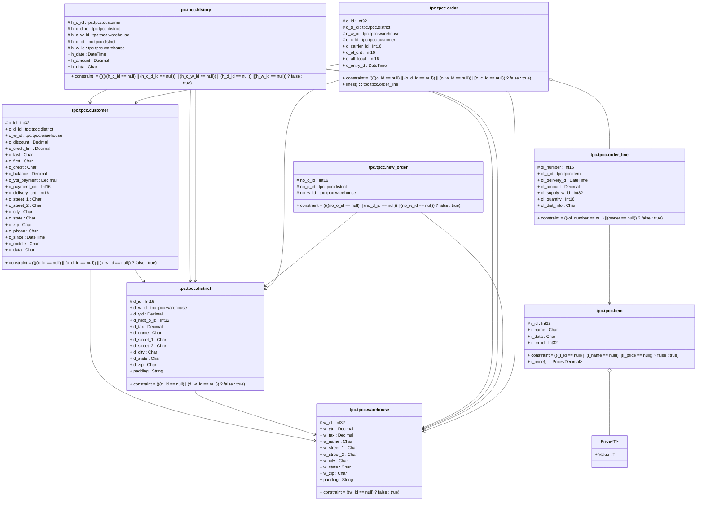

# readme

---

## Entity tpc.tpcc.customer

||Name|Type|*|@|=|
|-|-|-|-|-|
|#|c_id|Int32||||
|+|c_d_id|tpc.tpcc.district||||
|+|c_w_id|tpc.tpcc.warehouse||||
|+|c_discount|Decimal||||
|+|c_credit_lim|Decimal||||
|+|c_last|Char||||
|+|c_first|Char||||
|+|c_credit|Char||||
|+|c_balance|Decimal||||
|+|c_ytd_payment|Decimal||||
|+|c_payment_cnt|Int16||||
|+|c_delivery_cnt|Int16||||
|+|c_street_1|Char||||
|+|c_street_2|Char||||
|+|c_city|Char||||
|+|c_state|Char||||
|+|c_zip|Char||||
|+|c_phone|Char||||
|+|c_since|DateTime||||
|+|c_middle|Char||||
|+|c_data|Char||||
||constraint||||((((c_id == null) \|\| (c_d_id == null)) \|\| (c_w_id == null)) ? false : true)|

---

## Entity tpc.tpcc.district

||Name|Type|*|@|=|
|-|-|-|-|-|
|#|d_id|Int16||||
|+|d_w_id|tpc.tpcc.warehouse||||
|+|d_ytd|Decimal||||
|+|d_next_o_id|Int32||||
|+|d_tax|Decimal||||
|+|d_name|Char||||
|+|d_street_1|Char||||
|+|d_street_2|Char||||
|+|d_city|Char||||
|+|d_state|Char||||
|+|d_zip|Char||||
|+|padding|String||||
||constraint||||(((d_id == null) \|\| (d_w_id == null)) ? false : true)|

---

## Entity tpc.tpcc.history

||Name|Type|*|@|=|
|-|-|-|-|-|
|#|h_c_id|tpc.tpcc.customer||||
|#|h_c_d_id|tpc.tpcc.district||||
|#|h_c_w_id|tpc.tpcc.warehouse||||
|#|h_d_id|tpc.tpcc.district||||
|#|h_w_id|tpc.tpcc.warehouse||||
|+|h_date|DateTime||||
|+|h_amount|Decimal||||
|+|h_data|Char||||
||constraint||||((((((h_c_id == null) \|\| (h_c_d_id == null)) \|\| (h_c_w_id == null)) \|\| (h_d_id == null)) \|\| (h_w_id == null)) ? false : true)|

---

## Aspect Price<T>
	Prices are temporial, and could be updated 

||Name|Type|*|@|=|
|-|-|-|-|-|
|+|Value|T||||

---

## Entity tpc.tpcc.item

||Name|Type|*|@|=|
|-|-|-|-|-|
|#|i_id|Int32||||
|+|i_name|Char||||
|+|i_data|Char||||
|+|i_im_id|Int32||||
||constraint||||((((i_id == null) \|\| (i_name == null)) \|\| (i_price == null)) ? false : true)|
|+|i_price|Price<Decimal>||||

---

## Entity tpc.tpcc.new_order

||Name|Type|*|@|=|
|-|-|-|-|-|
|#|no_o_id|Int16||||
|#|no_d_id|tpc.tpcc.district||||
|#|no_w_id|tpc.tpcc.warehouse||||
||constraint||||((((no_o_id == null) \|\| (no_d_id == null)) \|\| (no_w_id == null)) ? false : true)|

---

## Segment tpc.tpcc.order_line

||Name|Type|*|@|=|
|-|-|-|-|-|
|#|ol_number|Int16||||
|+|ol_i_id|tpc.tpcc.item||||
|+|ol_delivery_d|DateTime||||
|+|ol_amount|Decimal||||
|+|ol_supply_w_id|Int32||||
|+|ol_quantity|Int16||||
|+|ol_dist_info|Char||||
||constraint||||(((ol_number == null) \|\| (owner == null)) ? false : true)|

---

## Entity tpc.tpcc.order

||Name|Type|*|@|=|
|-|-|-|-|-|
|#|o_id|Int32||||
|#|o_d_id|tpc.tpcc.district||||
|#|o_w_id|tpc.tpcc.warehouse||||
|#|o_c_id|tpc.tpcc.customer||||
|+|o_carrier_id|Int16||||
|+|o_ol_cnt|Int16||||
|+|o_all_local|Int16||||
|+|o_entry_d|DateTime||||
||constraint||||(((((o_id == null) \|\| (o_d_id == null)) \|\| (o_w_id == null)) \|\| (o_c_id == null)) ? false : true)|
|+|lines|tpc.tpcc.order_line||||

---

## Entity tpc.tpcc.warehouse

||Name|Type|*|@|=|
|-|-|-|-|-|
|#|w_id|Int32||||
|+|w_ytd|Decimal||||
|+|w_tax|Decimal||||
|+|w_name|Char||||
|+|w_street_1|Char||||
|+|w_street_2|Char||||
|+|w_city|Char||||
|+|w_state|Char||||
|+|w_zip|Char||||
|+|padding|String||||
||constraint||||((w_id == null) ? false : true)|

