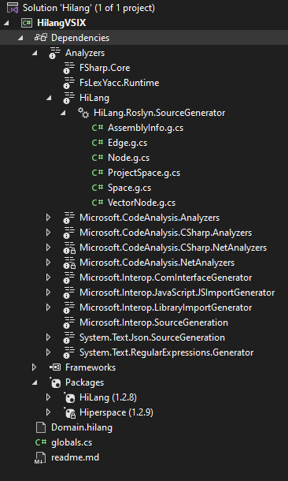
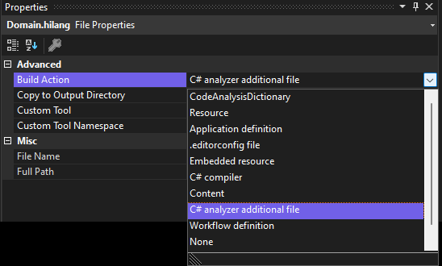



# HiLang language project

Language for [statements](https://www.cepheis.com/hiperspace/hilang-statement). Source for [Hiperspace](https://github.com/channell/Hiperspace)

### Files

* [Domain](Domain.hilang) definition
* [global](globals.cs) using statements

## Generation

Generated source can be found under Project Dependencies / Analyzers / HiLang / HiLang.Roslyn.SourcewGenerator




## Properties for HiLang files
HiLang files must have the extenion `.hilang` and marked as a C# analyzer additional file


or set directly in the project `.sln` file as 
```
  <ItemGroup>
    <AdditionalFiles Include="Domain.hilang" />
  </ItemGroup>
```
